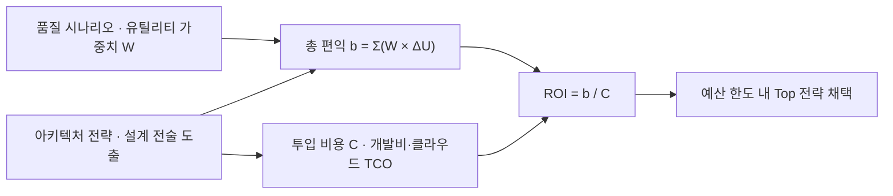

> **로드맵 경로**: 소프트웨어공학 > 소프트웨어 아키텍처 및 구현 > 아키텍처 평가 > CBAM(Cost Benefit Analysis Method)

---

## 30초 인출

- 본질: **CBAM(Cost Benefit Analysis Method)**은 ATAM이 도출한 아키텍처 전략의 투입 비용 대비 비즈니스 편익을 정량화해 ROI 기준 투자 우선순위를 결정하는 SEI 경제성 평가 기법
- 메커니즘: 유틸리티 증분(ΔU)×가중치(W)로 총 편익(b)을 산출하고, 투입 비용(C)으로 나눠 ROI = b/C를 계산
- 판정 기준: 전략별 ROI 순위를 정렬해 가용 예산 한도 내 최상위 전략을 채택하며, ATAM(위험 식별)→CBAM(우선순위)→FinOps(TCO 최적화)로 연계

핵심 용어

- **CBAM(Cost Benefit Analysis Method)**: 아키텍처 전략들의 투입 비용 대비 비즈니스 효용을 정량화하여 ROI 기준 최적 대안을 도출하는 SEI 평가 기법
- **유틸리티 함수(Utility Function)**: 품질 속성 달성 수준(응답 시간, 가용성 등)에 대해 이해관계자가 느끼는 주관적 만족도를 0~100 점수로 환산한 값
- **품질 속성 시나리오(Quality Attribute Scenario)**: 자극(Stimulus), 환경, 응답, 응답 척도(Response Measure)로 구성된 아키텍처 요구사항 구체화 도구
- **투자수익률(ROI: Return on Investment)**: 아키텍처 전략 적용에 따른 총 유틸리티 편익($b_i$)을 투입 비용($C_i$)으로 나눈 경제성 평가 지표
- **FinOps(Cloud Financial Operations)**: 클라우드 인프라 아키텍처 변경에 따른 실시간 비용과 비즈니스 가치를 추적·최적화하는 재무 거버넌스

---

## 1교시 예상문제 (10점)

> CBAM(Cost Benefit Analysis Method)의 정의와 목적, 핵심 구조와 작동 원리를 설명하시오. (예상)

---

## 1교시 10점 답안

- **CBAM(Cost Benefit Analysis Method)**은 SEI에서 제정한 소프트웨어 아키텍처 평가 모델로, ATAM을 통해 도출된 아키텍처 전략들의 비용(Cost) 대비 비즈니스 편익(Benefit)을 유틸리티(Utility) 기반으로 정량화하여 투자수익률(ROI)에 따라 최적의 전략을 선정하는 경제적 의사결정 기법이다.
- 품질 속성 시나리오의 유틸리티 증분($\Delta U$)과 중요도 가중치($W$)를 곱해 총 편익($b$)을 구하고, 이를 투입 비용($C$)으로 나누어 $\text{ROI} = b / C$를 산출한다. 기술적 위험을 분석하는 **ATAM**과 경제적 우선순위를 결정하는 **CBAM**을 연계하여 가치 중심의 아키텍처 거버넌스를 구축한다.
---

### 핵심 관계

---

## 2~4교시 예상문제 (25점)

> "소프트웨어 아키텍처 평가 기법 중 ATAM의 한계를 보완하기 위해 제안된 CBAM(Cost Benefit Analysis Method)의 개념과 필요성을 설명하고, 핵심 메커니즘인 유틸리티 함수와 ROI 산출 수식, 6단계 수행 절차 및 클라우드 FinOps와 연계된 아키텍처 거버넌스를 제시하시오."

---

> (25점, 예상)

---

## 2~4교시 25점 답안

### Ⅰ. 아키텍처의 경제적 가치 평가, CBAM의 개요

#### 1. CBAM의 정의
- 카네기 멜론 대학 SEI에서 제정한 **소프트웨어 아키텍처 경제성 평가 모델**로, ATAM을 통해 도출된 아키텍처 전략(Architectural Strategies)들에 대해 **투입 비용(Cost) 대비 비즈니스 편익(Benefit)을 유틸리티(Utility) 기반으로 정량화하여 투자수익률(ROI)에 따라 최적의 투자 우선순위를 결정하는 기법**.

#### 2. 핵심 도입 필요성
- **ATAM의 경제적 한계 극복**: ATAM은 기술적 트레이드오프(민감점, 절충점)는 식별하지만, "한정된 예산 내에서 어떤 아키텍처 전략을 먼저 구현해야 하는가"라는 질문에 답하지 못함.
- **공학과 비즈니스의 언어 통합**: 엔지니어의 기술 용어(지연시간 50ms 단축 등)를 경영진이 이해할 수 있는 재무적 투자수익률(ROI) 지표로 환산.
---

### Ⅱ. CBAM 핵심 메커니즘 및 수행 절차

#### 1. CBAM 의사결정 프레임워크 구조도

#### 2. CBAM 핵심 산출 수식 체계
1. **아키텍처 전략 $S_i$의 총 편익 ($b_i$)**:
   $$b_i = \sum_j \left( W_j \times (U_{ij} - U_{current, j}) \right)$$
   - $W_j$: 시나리오 $j$의 비즈니스 중요도 가중치.
   - $U_{ij} - U_{current, j}$: 전략 $S_i$ 적용 시 개선되는 유틸리티 증분 ($\Delta U$).
2. **투자수익률 (ROI)**:
   $$\text{ROI}_i = \frac{b_i}{C_i} \quad (C_i: \text{전략 } S_i \text{ 도입에 드는 총비용})$$

#### 3. CBAM 6단계 표준 수행 절차

| 단계 | 단계명 | 핵심 활동 및 주요 산출물 |
|---|---|---|
| **1단계** | 시나리오 정리 (Collate Scenarios) | ATAM에서 도출된 품질 시나리오를 수집하고 핵심 비즈니스 목표와 정렬 |
| **2단계** | 시나리오 정제 (Refine Scenarios) | 최악, 현재, 기대, 최선의 4가지 품질 수준(Response Measure) 정의 |
| **3단계** | 유틸리티 우선순위화 | 이해관계자들이 각 품질 수준에 0~100 점수의 유틸리티를 부여하여 효용 곡선 도출 |
| **4단계** | 아키텍처 전략 도출 및 매핑 | 각 시나리오 목표를 달성할 구체적 설계 전술(Tactics) 및 전략 매핑 |
| **5단계** | 비용 및 편익 산정 | 각 전략 구현 비용($C$)과 유틸리티 증가에 따른 총 편익($b$) 계산 |
| **6단계** | ROI 계산 및 전략 확정 | 전략별 ROI 순위를 정렬하고 가용 예산 한도 내에서 최종 채택 전략 확정 |
---

### Ⅲ. 주요 아키텍처 평가 모델(SAAM, ATAM, CBAM) 비교

| 비교 항목 | SAAM | ATAM | CBAM |
|---|---|---|---|
| **제정 기관 / 연도** | SEI (1994) | SEI (2000) | SEI (2003) |
| **주요 목적** | 아키텍처 수정용이성(Modifiability) 중심 평가 | 비기능 품질 속성 간의 **기술적 상충(트레이드오프) 분석** | 아키텍처 전략의 **경제적 비용-편익(ROI) 분석** |
| **평가 관점** | 기능 및 변경 영향도 | 품질 속성 상호작용 (민감점, 절충점) | **비즈니스 재무 가치, 투입 비용, 예산 최적화** |
| **핵심 산출물** | 시나리오별 변경 영향도 매트릭스 | 리스크 테마, 위험/비위험 요소 목록 | **아키텍처 전략별 ROI 순위표 및 투자 로드맵** |
---

### Ⅳ. CBAM 운용 시 발생 위험 및 대응 전략

| 위험 | 대책 | 효과 |
|---|---|---|
| **부서 간 정치적 이해관계로 주관적 유틸리티 점수 왜곡 발생** | 델파이(Delphi) 기법 및 다기준 의사결정(AHP)을 결합하여 유틸리티 가중치 객관화 | 이해관계자 합의 확보 및 정치적 갈등 차단 |
| **과도한 고스펙 인프라 투자로 인한 오버엔지니어링 및 예산 낭비** | CBAM의 한계 효용 체감 곡선을 분석하여 비용 대비 편익이 꺾이는 적정 스펙 채택 | 불필요한 인프라 도입 비용 절감 |
| **아키텍처 도입 비용 산정 오류로 사업 중반 예산 초과 발생** | 기능점수(FP) 및 COCOMO II 기반의 소프트웨어 비용 추정과 클라우드 TCO 산정 모델 연계 | 비용 산정 오차 통제 |
| **현실과 동떨어진 PoC 없는 이론적 유틸리티 기대치 산출** | 핵심 아키텍처 전술에 대한 프로토타입 PoC 실측 성능 데이터를 CBAM에 직접 반영 | 아키텍처 도입 실패 리스크 격리 |
---

### Ⅴ. 기술사적 제언: ATAM-CBAM-FinOps 3단계 가치 주도 아키텍처 거버넌스

### 학습자 통찰 메모 — 답안 밖

- `[핵심 통찰]`: 소프트웨어 아키텍처는 기술적 최적화만으로 결정되지 않는다. "100ms를 10ms로 줄이는 데 10억이 든다면 투자할 가치가 있는가?"에 답해야 한다. ATAM이 기술적 트레이드오프(민감점·절충점)를 도출하는 도구라면, CBAM은 여기에 비용(Cost)과 유틸리티 만족도(Benefit)를 대입해 비즈니스 ROI를 뽑아내는 재무 도구다. 클라우드 시대에는 이 비용 인자가 FinOps(클라우드 재무 관리)와 결합되어 지속적 가치 주도 거버넌스로 완성된다.
- `나라면`: 총 편익 공식 $b_i = \sum (W_j \times \Delta U_{ij})$과 $ROI = b_i / C_i$ 수식을 박스로 제시하고, SAAM(수정용이성) vs ATAM(기술 트레이드오프) vs CBAM(경제적 ROI)의 3자 비교표를 완성한 뒤, 3단락에서 ATAM(위험 식별)→CBAM(ROI 우선순위)→FinOps(실시간 TCO 최적화)의 3단계 파이프라인을 제언하겠다.

### 실전 답안용 기술사적 제언
- **판정 기준**: 아키텍처 대안별 총 유틸리티 증분 대비 투입 비용($\text{ROI} = b_i / C_i$), 품질 속성 한계 효용 체감 시점, 프로젝트 가용 재무 예산 한도를 기준으로 채택 여부를 판정함.
- **대응 방안**: 1단계 ATAM을 통해 구조적 기술 위험 및 상충점을 도출하고, 2단계 CBAM을 통해 전략별 ROI 순위를 산출하여 예산 범위 내 최상위 전략을 채택하며, 클라우드 환경 배포 후 FinOps와 연계하여 TCO를 지속 최적화함.
- **검증 체계**: 유틸리티 곡선 왜곡 방지를 위한 AHP(계층화 분석법) 가중치 합의 및 핵심 아키텍처 전술(캐싱, 비동기화)에 대한 사전 PoC 실측 성능 데이터를 검증 기준으로 활용함.
- **기대 효과**: 오버엔지니어링으로 인한 불필요한 인프라 예산 낭비를 절감하고, 비즈니스 효용이 가장 높은 핵심 아키텍처에 투자를 집중하여 프로젝트 성공률을 극대화함.
---

## 출제 이력 및 기출 분석

- **정보관리기술사**: 89회, 108회, 120회, 128회 (소프트웨어 아키텍처 평가 기법, CBAM의 개념과 6단계 절차, ATAM과 CBAM의 비교)
- **컴퓨터시스템응용기술사**: 100회, 114회 (아키텍처 트레이드오프 분석, 유틸리티 트리, ROI 기반 설계 전략)
- **출제 경향성**: ATAM과의 관계를 서두에 명확히 밝히고, 총 편익($b_i$)과 ROI 수식을 정확히 제시하며, 6단계 표준 절차 및 최근 클라우드 환경의 FinOps(비용 최적화)와 결합된 실무 거버넌스를 제시할 때 최고 점수가 부여됨.
---

## 실전 작성 팁 & 감점 방지

- **수식 기호의 명확성**: 총 편익 $b_i = \sum (W_j \times \Delta U_{ij})$ 및 $\text{ROI} = b_i / C_i$ 공식을 반드시 박스로 감싸 가독성을 높일 것.
- **6단계 절차 누락 방지**: 시나리오 정리 $\rightarrow$ 시나리오 정제 $\rightarrow$ 유틸리티 우선순위 $\rightarrow$ 전략 도출 $\rightarrow$ 비용/편익 산정 $\rightarrow$ ROI 선정의 순서를 지킬 것.
- **ATAM과의 파이프라인 도해**: 3단락에서 ATAM(위험식별) $\rightarrow$ CBAM(ROI우선순위)의 연계 흐름도를 제시할 것.
---

## 연결 토픽

- [소프트웨어 아키텍처](./056_software_architecture.md) : 품질 속성을 달성하기 위한 기본 구조 설계
- [아키텍처 스타일](./057_architecture_style.md) : 패턴별 품질 속성 트레이드오프 분석
- [소프트웨어 개발비용 산정](./027_sw_cost_estimation.md) : CBAM의 투입 비용($C$)을 정량화하는 기능점수(FP) 및 COCOMO 모델
