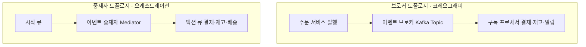

> **로드맵 경로**: 소프트웨어공학 > 분산 시스템 및 아키텍처 > 비동기 메시징 > EDA와 2대 토폴로지(브로커·중재자)

---

## 30초 인출

- 본질: **EDA(Event-Driven Architecture)**는 상태 변화(이벤트)를 비동기로 발행·구독하여 서비스 간 시공간적 결합도를 끊고 확장성을 극대화하는 분산 아키텍처
- 메커니즘: 중앙 중재자가 워크플로우와 보상 트랜잭션을 지휘하는 중재자 토폴로지(오케스트레이션) vs 브로커를 통해 자율 연쇄 반응하는 브로커 토폴로지(코레오그래피)
- 판정 기준: 코어 주문·결제 등 보상이 필요한 다단계 트랜잭션은 중재자(Saga), 알림·통계 등 부가 처리는 브로커(Kafka) + 트랜잭셔널 아웃박스

핵심 용어

- **이벤트 기반 아키텍처(EDA: Event-Driven Architecture)**: 이벤트의 생성, 감지, 소비를 중심으로 컴포넌트 간 비동기 결합을 실현하는 분산 아키텍처
- **중재자 토폴로지(Mediator Topology)**: 중앙의 이벤트 중재자(Mediator)가 다단계 비즈니스 절차와 보상 트랜잭션을 지휘하는 오케스트레이션 모델
- **브로커 토폴로지(Broker Topology)**: 중앙 제어자 없이 메시지 브로커를 통해 컴포넌트들이 이벤트를 자율적으로 릴레이 소비하는 코레오그래피 모델
- **사가 패턴(Saga Pattern)**: 분산 환경에서 2PC 대신 로컬 트랜잭션과 보상 트랜잭션(Compensating Transaction)을 연쇄 실행하는 패턴
- **트랜잭셔널 아웃박스(Transactional Outbox)**: DB 상태 변경과 이벤트 발행을 단일 로컬 트랜잭션으로 묶어 CDC(Debezium)로 발행하는 원자성 보장 기법

---

## 1교시 예상문제 (10점)

> EDA(이벤트 기반 아키텍처)와 2대 토폴로지(브로커·중재자)의 정의와 목적, 핵심 구조와 작동 원리를 설명하시오. (예상)

---

## 1교시 10점 답안

### Ⅰ. 개요

| 구분 | 핵심 |
|---|---|
| 정의 | 이벤트를 비동기로 발행·구독해 서비스가 처리하는 분산 아키텍처 |
| 목적 | 생산자와 소비자의 직접 의존을 줄이고 독립적인 이벤트 처리를 지원 |

### Ⅱ. 토폴로지

| 구분 | 제어 방식 |
|---|---|
| 중재자 | 중앙 중재자가 워크플로우를 지휘하는 오케스트레이션 |
| 브로커 | 소비자가 이벤트에 자율 반응하는 코레오그래피 |

제언: 업무 흐름 가시성과 서비스 간 독립성 요구에 따라 토폴로지 선택
---

### 핵심 관계

---

## 2~4교시 예상문제 (25점)

> 이벤트 기반 아키텍처의 목적과 브로커·중재자 토폴로지의 구조를 비교하고, 이벤트 전달의 신뢰성과 처리 일관성을 확보하는 방안을 제시하시오. (예상)

---

## 2~4교시 25점 답안

## Ⅰ. 이벤트 중심 비동기 아키텍처

| 구분 | 핵심 |
|---|---|
| 정의 | 이벤트를 비동기로 발행·구독해 서비스가 처리하는 분산 아키텍처 |
| 목적 | 생산자와 소비자의 직접 의존을 줄이고 독립적인 이벤트 처리를 지원 |

생산자는 발생한 사실을 이벤트로 전달하고, 구독자는 관심 있는 이벤트를 소비해 후속 처리.
---

### Ⅱ. EDA 2대 토폴로지 아키텍처 및 메커니즘

#### 1. 2대 토폴로지(중재자 vs 브로커) 구조 비교도

#### 2. 토폴로지별 핵심 구성요소 분석

| 토폴로지 | 핵심 구성요소 | 역할 및 동작 원리 |
|---|---|---|
| **중재자 토폴로지(Mediator)** | **시작 큐 (Initiator Queue)** | 최초의 비즈니스 요청 이벤트를 수신하여 버퍼링 |
| | **이벤트 중재자 (Mediator)** | 전체 비즈니스 워크플로우 상태를 유지하며 순차/병렬 액션 지휘 |
| | **액션 큐 (Action Queue)** | 중재자가 개별 도메인 프로세서에 구체적 작업을 전달하는 큐 |
| | **이벤트 프로세서 (Processor)** | 액션 큐의 작업을 수행하고 결과를 다시 중재자에게 회신 |
| **브로커 토폴로지(Broker)** | **이벤트 브로커 (Broker)** | 대량 이벤트를 고속으로 수집·버퍼링·분배하는 분산 엔진 (Kafka, RabbitMQ) |
| | **이벤트 프로세서 (Processor)** | 브로커의 특정 토픽을 구독하여 처리 후, 후속 이벤트를 스스로 재발행 |
---

### Ⅲ. 브로커 vs 중재자 토폴로지 상세 비교

| 비교 항목 | 브로커 토폴로지 (Broker Topology) | 중재자 토폴로지 (Mediator Topology) |
|---|---|---|
| **제어 메커니즘** | **코레오그래피 (Choreography, 탈중앙 자율)** | **오케스트레이션 (Orchestration, 중앙 집중)** |
| **중앙 제어점** | 없음 (각 컴포넌트가 자율 연쇄 반응) | 있음 (이벤트 중재자가 워크플로우 총괄 통제) |
| **결합도 및 확장성** | **결합도 극소, 수평 확장성(Scale-out) 극대** | 중재자 의존성 존재, 확장 시 중재자 관리 필요 |
| **비즈니스 가시성** | 낮음 (전체 진행 상태를 한눈에 파악 불가) | **매우 높음 (중재자에서 트랜잭션 진행 상태 모니터링 가능)** |
| **에러 및 보상 트랜잭션** | 어려움 (분산된 컴포넌트 간 역방향 이벤트 릴레이) | **용이함 (중재자가 실패 감지 즉시 역순 보상 트랜잭션 지휘)** |
| **적합한 적용 도메인** | 클릭스트림 분석, IoT 데이터 파이프라인, 단순 푸시 알림 | **주문-결제-정산, 대출 심사 등 복잡한 다단계 트랜잭션** |
---

### Ⅳ. 이벤트 기반 아키텍처 운용 시 발생 위험 및 대응 전략

| 위험 | 대책 | 효과 |
|---|---|---|
| **배송 실패 시 결제 취소 누락으로 분산 트랜잭션 데이터 파탄** | 복합 트랜잭션 구간을 오케스트레이션(Saga Orchestrator) 중재자 구조로 전환 | 분산 트랜잭션 실패 시 자동 보상 롤백 보장 |
| **중재자 서버 다운으로 전사 주문 접수 마비 (단일 장애점 SPOF)** | 중재자는 무상태(Stateless) 엔진으로 경량화하고 워크플로우 상태는 외부 분산 DB에 영속화 | SPOF 제거 및 고가용성 확보 |
| **네트워크 재전송으로 인한 동일 결제 이벤트 중복 소비 및 이중 결제** | 이벤트 고유 UUID 기반 멱등성(Idempotency) 검증 테이블 구축 및 처리 전 조회 | 중복 결제 및 중복 차감 사고 차단 |
| **DB 저장 성공 후 브로커 장애로 이벤트 발행 유실 (원자성 분절)** | RDBMS 로컬 트랜잭션에 이벤트 로그를 함께 기록하는 트랜잭셔널 아웃박스 및 Debezium CDC 연동 | 이벤트 유실 방지 및 데이터 정합성 보장 |
---

### Ⅴ. 적용 제언

| 한계 | 해결 방안 |
|---|---|
| 비동기 이벤트 처리에서 흐름과 재처리 상태를 추적하기 어려운 문제 | 이벤트 식별자와 상관관계를 기록하고 중복 수신에 안전한 처리·재처리 기준을 명시 |

## 연결 토픽

- [마이크로서비스 아키텍처(MSA)](./035_msa.md) : 비동기 통신을 위해 EDA를 채택하는 분산 서비스 구조
- [상태 다이어그램](./073_state_diagram.md) : 이벤트 발생에 따른 객체의 상태 전이를 모델링하는 도구
- [API 게이트웨이](./075_api_gateway.md) : 외부 클라이언트 요청을 접수하여 내부 이벤트로 변환하는 인그레스 관문
