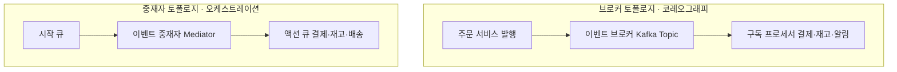

> **로드맵 경로**: 소프트웨어공학 > 분산 시스템 및 아키텍처 > 비동기 메시징 > EDA와 2대 토폴로지(브로커·중재자)
---

## 30초 인출

- 본질: **EDA(Event-Driven Architecture)**는 상태 변화(이벤트)를 비동기로 발행·구독하여 서비스 간 시공간적 결합도를 끊고 확장성을 극대화하는 분산 아키텍처
- 메커니즘: 중앙 중재자가 워크플로우와 보상 트랜잭션을 지휘하는 중재자 토폴로지(오케스트레이션) vs 브로커를 통해 자율 연쇄 반응하는 브로커 토폴로지(코레오그래피)
- 판정 기준: 코어 주문·결제 등 보상이 필요한 다단계 트랜잭션은 중재자(Saga), 알림·통계 등 부가 처리는 브로커(Kafka) + 트랜잭셔널 아웃박스

핵심 용어

- **이벤트 기반 아키텍처(EDA: Event-Driven Architecture)**: 이벤트의 생성, 감지, 소비를 중심으로 컴포넌트 간 비동기 결합을 실현하는 분산 아키텍처
- **중재자 토폴로지(Mediator Topology)**: 중앙의 이벤트 중재자(Mediator)가 다단계 비즈니스 절차와 보상 트랜잭션을 지휘하는 오케스트레이션 모델
- **브로커 토폴로지(Broker Topology)**: 중앙 제어자 없이 메시지 브로커를 통해 컴포넌트들이 이벤트를 자율적으로 릴레이 소비하는 코레오그래피 모델
- **사가 패턴(Saga Pattern)**: 분산 환경에서 2PC 대신 로컬 트랜잭션과 보상 트랜잭션(Compensating Transaction)을 연쇄 실행하는 패턴
- **트랜잭셔널 아웃박스(Transactional Outbox)**: DB 상태 변경과 이벤트 발행을 단일 로컬 트랜잭션으로 묶어 CDC(Debezium)로 발행하는 원자성 보장 기법

---

## 1교시 예상문제 (10점)

> EDA(이벤트 기반 아키텍처)와 2대 토폴로지(브로커·중재자)의 정의와 목적, 핵심 구조와 작동 원리를 설명하시오. (예상)
---

## 1교시 10점 답안

- **EDA(Event-Driven Architecture)**는 시스템 내외부의 상태 변화(이벤트)를 감지하여 비동기로 발행·구독하는 분산 아키텍처로, 동기식 REST의 결합도와 계단식 장애를 극복한다.
- 중앙 지휘자가 다단계 워크플로우와 보상 트랜잭션을 통제하는 **중재자 토폴로지(오케스트레이션)**와, 중앙 제어자 없이 메시지 브로커를 통해 컴포넌트들이 자율 연쇄 반응하는 **브로커 토폴로지(코레오그래피)**로 나뉜다. 실무에서는 코어 결제는 중재자로, 후속 통보는 브로커로 구성하는 하이브리드 전략과 이벤트 유실을 차단하는 **트랜잭셔널 아웃박스(Transactional Outbox)** 패턴이 필수적이다.
---

### 핵심 관계

---

## 2~4교시 예상문제 (25점)

> "마이크로서비스 환경에서 비동기 연계를 위한 이벤트 기반 아키텍처(EDA)의 개념과 등장 배경을 설명하고, 2대 핵심 토폴로지(중재자 vs 브로커)의 구조 및 특성 비교와 이벤트 유실 및 중복 방지를 위한 실무 아키텍처 전략을 제시하시오."
---

> (25점, 예상)
---

## 2~4교시 25점 답안

### Ⅰ. 비동기 분산 결합의 패러다임, EDA의 개요

#### 1. EDA의 정의
- 시스템 내외부에서 발생하는 **상태의 변화(이벤트)를 감지하여 비동기적으로 메시지를 발행(Publish)하고, 이를 관심 있는 여러 구독자(Subscriber)에게 전달하여 자율적으로 처리하도록 구성하는 비동기 분산 아키텍처 스타일**.

#### 2. 대두 배경
- **동기식 REST 통신의 블로킹 및 연쇄 장애**: 서비스 간 동기 호출(HTTP)이 꼬리를 물면서 한 서비스의 지연이 전체 시스템의 스레드 고갈 및 계단식 장애(Cascading Failure)를 유발.
- **시공간적 결합도(Coupling) 해소**: 생산자와 소비자가 서로의 IP, 가용 여부, 처리 속도를 몰라도 메시지 브로커를 통해 독립적으로 수평 확장(Scale-out) 가능.
---

### Ⅱ. EDA 2대 토폴로지 아키텍처 및 메커니즘

#### 1. 2대 토폴로지(중재자 vs 브로커) 구조 비교도

#### 2. 토폴로지별 핵심 구성요소 분석

| 토폴로지 | 핵심 구성요소 | 역할 및 동작 원리 |
|---|---|---|
| **중재자 토폴로지(Mediator)** | **시작 큐 (Initiator Queue)** | 최초의 비즈니스 요청 이벤트를 수신하여 버퍼링 |
| | **이벤트 중재자 (Mediator)** | 전체 비즈니스 워크플로우 상태를 유지하며 순차/병렬 액션 지휘 |
| | **액션 큐 (Action Queue)** | 중재자가 개별 도메인 프로세서에 구체적 작업을 전달하는 큐 |
| | **이벤트 프로세서 (Processor)** | 액션 큐의 작업을 수행하고 결과를 다시 중재자에게 회신 |
| **브로커 토폴로지(Broker)** | **이벤트 브로커 (Broker)** | 대량 이벤트를 고속으로 수집·버퍼링·분배하는 분산 엔진 (Kafka, RabbitMQ) |
| | **이벤트 프로세서 (Processor)** | 브로커의 특정 토픽을 구독하여 처리 후, 후속 이벤트를 스스로 재발행 |
---

### Ⅲ. 브로커 vs 중재자 토폴로지 상세 비교

| 비교 항목 | 브로커 토폴로지 (Broker Topology) | 중재자 토폴로지 (Mediator Topology) |
|---|---|---|
| **제어 메커니즘** | **코레오그래피 (Choreography, 탈중앙 자율)** | **오케스트레이션 (Orchestration, 중앙 집중)** |
| **중앙 제어점** | 없음 (각 컴포넌트가 자율 연쇄 반응) | 있음 (이벤트 중재자가 워크플로우 총괄 통제) |
| **결합도 및 확장성** | **결합도 극소, 수평 확장성(Scale-out) 극대** | 중재자 의존성 존재, 확장 시 중재자 관리 필요 |
| **비즈니스 가시성** | 낮음 (전체 진행 상태를 한눈에 파악 불가) | **매우 높음 (중재자에서 트랜잭션 진행 상태 모니터링 가능)** |
| **에러 및 보상 트랜잭션** | 어려움 (분산된 컴포넌트 간 역방향 이벤트 릴레이) | **용이함 (중재자가 실패 감지 즉시 역순 보상 트랜잭션 지휘)** |
| **적합한 적용 도메인** | 클릭스트림 분석, IoT 데이터 파이프라인, 단순 푸시 알림 | **주문-결제-정산, 대출 심사 등 복잡한 다단계 트랜잭션** |
---

### Ⅳ. 이벤트 기반 아키텍처 운용 시 발생 위험 및 대응 전략

| 위험 | 대책 | 효과 |
|---|---|---|
| **배송 실패 시 결제 취소 누락으로 분산 트랜잭션 데이터 파탄** | 복합 트랜잭션 구간을 오케스트레이션(Saga Orchestrator) 중재자 구조로 전환 | 분산 트랜잭션 실패 시 자동 보상 롤백 보장 |
| **중재자 서버 다운으로 전사 주문 접수 마비 (단일 장애점 SPOF)** | 중재자는 무상태(Stateless) 엔진으로 경량화하고 워크플로우 상태는 외부 분산 DB에 영속화 | SPOF 제거 및 고가용성 확보 |
| **네트워크 재전송으로 인한 동일 결제 이벤트 중복 소비 및 이중 결제** | 이벤트 고유 UUID 기반 멱등성(Idempotency) 검증 테이블 구축 및 처리 전 조회 | 중복 결제 및 중복 차감 사고 차단 |
| **DB 저장 성공 후 브로커 장애로 이벤트 발행 유실 (원자성 분절)** | RDBMS 로컬 트랜잭션에 이벤트 로그를 함께 기록하는 트랜잭셔널 아웃박스 및 Debezium CDC 연동 | 이벤트 유실 방지 및 데이터 정합성 보장 |
---

### Ⅴ. 기술사적 제언: 하이브리드 토폴로지 및 트랜잭셔널 아웃박스 거버넌스

### 학습자 통찰 메모 — 답안 밖

- `[핵심 통찰]`: EDA는 단순히 메시지 큐를 넣는 것이 아니라 서비스 간 '시공간적 결합'을 끊어내는 패러다임이다. 브로커(코레오그래피)는 자율 연쇄 반응으로 성능과 확장성이 압도적이지만 장애 시 보상 트랜잭션이 어렵고, 중재자(오케스트레이션)는 상태를 쥔 지휘자 덕에 보상이 쉽지만 병목이 될 수 있다. 실무는 '코어 주문·결제는 중재자(Saga)' + '부가 알림·통계는 브로커(Kafka)'의 하이브리드 조합이 정답이며, DB 저장과 이벤트 발행의 분절을 막는 트랜잭셔널 아웃박스 패턴이 필수다.
- `나라면`: 1단락 또는 2단락에서 중재자(오케스트레이션) vs 브로커(코레오그래피)의 구조도를 대조 도해하고, 3단락에서 하이브리드 토폴로지(코어=중재자, 부가=브로커)와 DB-브로커 이원화 정합성을 해결하는 트랜잭셔널 아웃박스(Outbox + CDC Debezium)를 핵심 차별화로 제시하겠다.

### 실전 답안용 기술사적 제언
- **판정 기준**: 비즈니스 프로세스의 복잡도(다단계 보상 트랜잭션 필요 여부), 처리량 요구치(초당 수만 건 스트리밍 여부), 트랜잭션 가시성 요구 수준을 기준으로 중재자 vs 브로커 토폴로지를 선별 판정함.
- **대응 방안**: 결제·주문 등 코어 도메인은 중재자(Saga Orchestrator)를 채택하여 즉각적인 보상 롤백을 통제하고, 부가 서비스(알림, 통계, 마일리지)는 Kafka 브로커 토폴로지로 자율 연쇄 분기하는 하이브리드 거버넌스를 구축함.
- **검증 체계**: DB 상태 변경과 메시지 발행의 원자성을 보장하기 위해 트랜잭셔널 아웃박스(Transactional Outbox) 및 Debezium CDC 파이프라인을 의무화하고, 컨슈머 멱등성 검증 테이블을 구축함.
- **기대 효과**: 서비스 간 동기 호출 블로킹 및 계단식 장애를 근절하고, 분산 환경에서의 이벤트 유실을 방지하며 궁극적 일관성(Eventual Consistency)을 보장함.
---

## 출제 이력 및 기출 분석

- **정보관리기술사**: 90회, 105회, 116회, 127회 (이벤트 기반 아키텍처의 개념, 브로커 및 중재자 토폴로지 비교, Saga 패턴 연계)
- **컴퓨터시스템응용기술사**: 102회, 118회 (비동기 메시징 시스템, Kafka 기반 스트리밍 아키텍처, 멱등성 및 분산 정합성 보장)
- **출제 경향성**: 브로커와 중재자의 개념을 오케스트레이션과 코레오그래피라는 분산 트랜잭션 용어로 명확히 대비하고, 분산 환경의 최대 난제인 보상 트랜잭션 및 트랜잭셔널 아웃박스 패턴을 3단락 차별화로 제시할 때 최고 득점으로 연결됨.
---

## 실전 작성 팁 & 감점 방지

- **2대 토폴로지 영문 표기 및 도해**: Broker(코레오그래피)와 Mediator(오케스트레이션)의 큐 및 컴포넌트 구조를 도식으로 명확히 표현할 것.
- **분산 트랜잭션 용어 구사**: 보상 트랜잭션(Compensating Transaction), 사가(Saga), 멱등성(Idempotency)의 전문 키워드를 적재적소에 배치할 것.
- **아웃박스 패턴 도해**: 4단락 또는 5단락에서 DB 커밋과 브로커 발행의 원자성을 보장하는 Outbox + CDC 구조를 제시할 것.
---

## 연결 토픽

- [마이크로서비스 아키텍처(MSA)](./035_msa.md) : 비동기 통신을 위해 EDA를 채택하는 분산 서비스 구조
- [상태 다이어그램](./073_state_diagram.md) : 이벤트 발생에 따른 객체의 상태 전이를 모델링하는 도구
- [API 게이트웨이](./075_api_gateway.md) : 외부 클라이언트 요청을 접수하여 내부 이벤트로 변환하는 인그레스 관문
