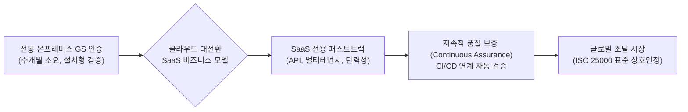

> **소프트웨어공학 > 품질 관리 및 표준 > 소프트웨어 품질인증 및 GS 인증**

---

## 1. 큰 그림 및 30초 인출 공식

```
               [ 소프트웨어 품질인증 3대 축 체계 ]
  ┌────────────────────────────────────────────────────────┐
  │ 1. 제품 품질인증 (Product)    : GS 인증 (ISO/IEC 25023)│
  │ 2. 프로세스 품질인증 (Process) : SP 인증, CMMI         │
  │ 3. 보안성 인증 (Security)     : CC 인증 (ISO/IEC 15408)│
  └────────────────────────────────────────────────────────┘
```

> **30초 인출 공식 (키워드 체인)**:  
> **소프트웨어진흥법 제20조** ➔ **ISO/IEC 25023 (8대 품질특성)** ➔ **TTA/KTL 실환경 시험** ➔ **1등급·2등급** ➔ **공공 우선구매·수의계약·분리발주**

- **본질**: **GS(Good Software) 인증**은 공인 시험기관(TTA/KTL)이 실제 운영 환경에서 완제품 SW를 구동하여 결함을 전수 검증하고, 공공기관이 믿고 도입하도록 **우선구매·수의계약·분리발주 자격을 부여하는 국가 품질 보증 제도**
- **메커니즘**: ISO/IEC 25023 8대 품질특성 및 매뉴얼 일치성 블랙박스 시험 ➔ 결함 보완(결함 0건) ➔ 1등급·2등급 인증서 발급 ➔ 나라장터 등록 및 우선구매 연계
- **산출물**: GS 시험성적서 · GS 인증서(1등급/2등급) · 조달청 나라장터 3자 단가계약 자격 증명서

---

## 2. 핵심 용어 정리

| 용어 | 영문 표기 | 핵심 정의 및 설명 |
|---|---|---|
| **GS 인증** | Good Software | 소프트웨어진흥법 제20조에 근거하여 국산 상용 SW의 완성도와 품질을 평가·보증하는 국가 공인 인증제도 |
| **ISO/IEC 25023** | SQuaRE Product Quality | 제품 품질 평가를 위한 8대 특성(기능적합성, 성능, 호환성, 사용성, 신뢰성, 보안성, 유지보수성, 이식성) 표준 |
| **ISO/IEC 25051** | COTS SW Requirements | 상용 완제품 패키지 소프트웨어(COTS)의 사용자 매뉴얼 및 제품 설명서 정합성 평가 기준 |
| **SP 인증** | Software Process | 소프트웨어진흥법 제21조에 근거하여 개발 조직의 프로젝트 관리 및 개발 프로세스 성숙도를 평가하는 제도 |
| **CC 인증** | Common Criteria | ISO/IEC 15408 기반 국가·공공기관 납품용 정보보호 제품의 보안 기능 및 신뢰성을 평가하는 제도 |
| **공공 우선구매** | Priority Purchasing | 중소기업제품 구매촉진 및 판로지원법에 따라 공공기관이 GS 인증 획득 제품을 우선 의무 구매하는 법적 혜택 |
| **제3자 단가계약** | Third-party Unit Price | 조달청 종합쇼핑몰(나라장터)에 사전 등록되어 공공기관이 수의계약 형태로 편리하게 구매 가능한 방식 |
| **SW 분리발주** | Split Ordering | SI 종합 구축 사업 시 일정 규모 이상의 상용 SW를 원도급 구축 사업과 분리하여 직접 발주·구매하는 제도 |
| **1등급 / 2등급** | Level 1 / Level 2 | 1등급(국제표준 전수 시험 및 결함 0건 요건, 모든 법적 혜택), 2등급(주요 핵심 기능 선별 시험, 수수료 경감) |
| **SaaS 인증 패스트트랙** | SaaS Fast-track | 클라우드 환경에서 지속 배포되는 SaaS 특성을 반영하여 멀티테넌시, API, 복원력을 신속 검증하는 개편 체계 |

---

## 3. 25점형 답안 프레임워크

### Ⅰ. 소프트웨어 품질인증 체계 및 GS 인증의 개요

#### 1. 소프트웨어 품질인증의 정의 및 3대 축
- **정의**: 공인 제3자 시험기관이 표준 규격에 따라 소프트웨어 제품의 기능성, 공정 성숙도, 보안성을 객관적으로 시험·평가하여 품질 적합성을 공적으로 증명하는 법적 제도.
- **품질인증 3대 축**:
  1. **제품 품질 (Product)**: 완제품 소프트웨어 자체의 품질 특성 시험 (**GS 인증**, ISO/IEC 25023).
  2. **프로세스 품질 (Process)**: 소프트웨어 개발 조직의 공정 관리 성숙도 심사 (**SP 인증**, CMMI).
  3. **보안 품질 (Security)**: 정보보호제품의 안전성 및 보안 메커니즘 검증 (**CC 인증**, ISO/IEC 15408).

```
   [제품 품질 : GS 인증]         [공정 품질 : SP 인증]        [보안 품질 : CC 인증]
 ┌──────────────────────┐      ┌──────────────────────┐      ┌──────────────────────┐
 │ ISO/IEC 25023 (8특성) │      │ SW 진흥법 제21조     │      │ ISO/IEC 15408 (ST/EAL)│
 │ 실환경 블랙박스 시험 │      │ 개발/관리 공정 심사  │      │ 취약점 분석 및 보안성│
 └──────────────────────┘      └──────────────────────┘      └──────────────────────┘
            └─────────────────────────────┼─────────────────────────────┘
                                          ▼
                       [신뢰성 높은 국가 IT 소프트웨어 생태계 구축]
```

#### 2. GS 인증의 법적 근거 및 도입 목적
- **법적 근거**: 소프트웨어진흥법 제20조(소프트웨어 품질인증).
- **도입 목적**: 국산 상용 SW의 품질 경쟁력 제고, 공공 조달 시장 진입 지원 및 SI 종속 완화.

---

### Ⅱ. GS 인증 평가 메커니즘 및 8대 품질 특성

#### 1. GS 인증 평가 프로세스 및 체계도
```
+-------------------------------------------------------------------------+
|               GS (Good Software) 인증 체계 및 평가 메커니즘             |
+-------------------------------------------------------------------------+
| [ 법적 근거 : 소프트웨어진흥법 제20조 (소프트웨어 품질인증) ]           |
|                                                                         |
| [ 공인 시험기관 (TTA / KTL) : ISO/IEC 25023 기반 블랙박스 실환경 시험 ]|
|  ├─ 1. 기능적합성  2. 성능효율성  3. 호환성      4. 사용성              |
|  └─ 5. 신뢰성      6. 보안성      7. 유지보수성  8. 이식성              |
|  + 제품설명서 / 사용자매뉴얼 내용과의 일치성(일반요구사항) 전수 검증    |
|                                │                                        |
|                                v (품질 기준 충족 시)                    |
| [ GS 인증서 발급 ] ──▶ 1등급 (전수 시험) / 2등급 (주요 기능 시험)       |
|                                │                                        |
|                                v (법적 제도적 혜택)                     |
| * 공공기관 우선구매 대상 지정 (중소기업 판로지원법 제12조)              |
| * 조달청 우수조달물품 등록 및 나라장터 3자 단가계약 자격 부여           |
| * 공공 소프트웨어 사업 상용SW 분리발주 대상 선정                        |
+-------------------------------------------------------------------------+
```

#### 2. ISO/IEC 25023 기반 8대 품질 특성 및 세부 기준
| 품질 특성 | 영문 명칭 | 세부 평가 항목 및 검증 기준 |
|---|---|---|
| **기능 적합성** | Functional Suitability | 기능 완전성, 기능 정확성, 기능 적절성 (매뉴얼 기재 기능의 100% 정상 작동) |
| **성능 효율성** | Performance Efficiency | 시간 반응성(응답시간, 트랜잭션 처리량), 자원 활용성(CPU·메모리 누수 여부) |
| **호환성** | Compatibility | 공존성(타 SW 동시 구동 시 충돌 여부), 상호운용성(표준 프로토콜 연계) |
| **사용성** | Usability | 적절성 인식성, 학습 용이성, 운영 용이성, 사용자 오류 방지 및 접근성 |
| **신뢰성** | Reliability | 성숙도, 무결함성, 결함 허용성(장애 자동 복구), 가용성(연속 가동 안정성) |
| **보안성** | Security | 기밀성(데이터 암호화), 무결성, 부인방지, 책임추적성, 권한 인증 체계 |
| **유지보수성** | Maintainability | 모듈성, 재사용성, 결함 분석성, 변경 용이성, 시험 가능성 |
| **이식성** | Portability | 환경 적응성, 설치/제거 용이성, 대체 용이성 (이종 OS·DB·브라우저 지원) |

---

### Ⅲ. 소프트웨어 품질인증 유형 비교 (GS vs SP vs CC)

| 비교 항목 | GS 인증 (Good Software) | SP 인증 (Software Process) | CC 인증 (Common Criteria) |
|---|---|---|---|
| **평가 대상** | **소프트웨어 완제품 (Product)** | **개발 조직의 프로세스 (Process)** | **정보보호/보안 제품 (Security)** |
| **적용 표준** | ISO/IEC 25023, ISO/IEC 25051 | NIPA SP 인증 기준 고시 | ISO/IEC 15408 (공통평가기준) |
| **주관/시험기관**| 과기정통부 (TTA, KTL) | NIPA (정보통신산업진흥원) | 국가정보원 / KISA 및 공인시험기관 |
| **평가 방식** | 실제 소프트웨어 구동 블랙박스 시험 | 프로세스 산출물 문서 심사 및 현장 실사 | 보안목표명세서(ST) 기반 취약점 분석 |
| **주요 혜택** | 공공 우선구매, 조달청 제3자 단가계약 | 공공 SW 사업 제안 시 기술 가산점 | 국가·공공기관 보안 제품 도입 필수 기준 |
| **유효 기간** | 원칙적 영구 (메이저 변경 시 재인증) | 3년 (만료 전 갱신 심사) | 3년~5년 (등급별 만료 규정) |

---

### Ⅳ. GS 인증 취득 및 실무 적용 시 3대 위험 및 대응 전략

| 위험 | 대책 | 효과 |
|---|---|---|
| **매뉴얼-UI 명칭 불일치로 인한 시험 탈락** | 문서-코드 추적성 매트릭스 구축 및 E2E UI 텍스트 자동 검증 파이프라인 연계 | 문서 정합성 결함 0건 달성 및 재시험 비용 방어 |
| **동시 다중 접속 시 응답 지연 기준 미달** | 사전 k6/JMeter 기반 모의 부하 테스트베드 구축 및 쿼리/커넥션 풀 최적화 | GS 인증 성능평가 기준(응답 2초 이내) 100% 충족 |
| **인증 버전과 공공 납품 배포 버전 불일치** | CI/CD 파이프라인에 시맨틱 버저닝 및 변경인증 대상 판정 자동화 게이트 적용 | 공공 납품 컴플라이언스 위반 리스크 원천 차단 |

---

### Ⅴ. 기술사적 제언: SaaS 시대의 GS 인증 혁신 방향

#### 1. 클라우드 네이티브 SaaS 품질인증 패스트트랙 아키텍처


#### 2. 기술사적 실무 제언
- **클라우드 SaaS 전용 신속 인증 트랙 도입**:
  - 주 단위로 기능이 지속 배포되는 SaaS 환경에 온프레미스형 3개월 검증 방식을 강요하면 혁신이 정체됨.
  - **멀티테넌트 데이터 격리성, 오픈 API 규격 준수성, 오토스케일링 탄력성**을 집중 평가하는 경량화 SaaS 인증 트랙을 적극 도입해야 함.
- **공공 소프트웨어 분리발주 제도와의 실질적 연계 강화**:
  - GS 인증을 획득한 우수 상용 SW가 대형 SI 사업에 헐값 하도급으로 흡수되지 않도록, 예산 편성 단계부터 분리발주 적용률을 의무화하여 건전한 상용 SW 라이선스 생태계를 육성해야 함.

---

## 4. 1교시 10점형 대비 핵심 요약

```text
- 법적 근거: 소프트웨어진흥법 제20조 (주관: 과기정통부, 시험기관: TTA, KTL)
- 평가 기준: ISO/IEC 25023 (8대 품질특성: 기능, 성능, 호환, 사용, 신뢰, 보안, 유지보수, 이식)
- 등급 체계: 1등급 (전수 시험 및 종합 보증), 2등급 (주요 핵심 기능 선별 검증)
- 핵심 혜택: 공공기관 우선구매 대상 지정, 조달청 우수제품 등록, 3자 단가계약, 상용SW 분리발주 대상
```

---

## 5. 기출 분석 및 출제 경향

| 회차 및 교시 | 문제 유형 | 핵심 출제 포인트 |
|---|---|---|
| **제114회 1교시** | 단답형 | GS 인증 제도와 주요 법적 혜택(우선구매, 분리발주) 기술 |
| **제121회 2교시** | 서술형 | ISO/IEC 25023 기반의 소프트웨어 품질 특성 및 GS 인증 평가 절차 |
| **제128회 1교시** | 단답형 | SW 품질인증 3대 축(GS, SP, CC)의 비교 및 상호 관계 |
| **제133회 3교시** | 서술형 | 클라우드 SaaS 환경 확산에 따른 GS 인증 제도 개편 방향 및 분리발주 활성화 방안 |

---

## 6. 실전 시험 팁

- **도입부 3대 축 도식화**: 답안 시작 시 GS(제품), SP(프로세스), CC(보안)를 3대 축으로 매트릭스 도식화하면 채점관에게 종합적인 소프트웨어 품질 거버넌스 시각을 즉시 어필할 수 있음.
- **법적 혜택 4가지 암기**: '우선구매', '수의계약(3자 단가)', '분리발주', '기술가산점' 4대 법적 혜택 키워드를 반드시 명시할 것.
- **최신 이슈 언급**: 전통 패키지 SW 중심에서 'SaaS형 GS 인증', '변경인증 수수료 완화', '시험기간 단축' 등 정책적 최신 동향을 Ⅲ단락 또는 결론에 한 줄 추가하면 고득점 직결.

---

## 7. 연관 토픽 맵

- **선행 토픽**: ISO/IEC 25000 (SQuaRE 체계), 소프트웨어 테스트 원칙
- **유사/비교 토픽**: SP 인증, CMMI, CC 인증 (ISO/IEC 15408)
- **후속/연계 토픽**: 상용 소프트웨어 분리발주 제도, 클라우드 보안인증(CSAP), SaaS 아키텍처
