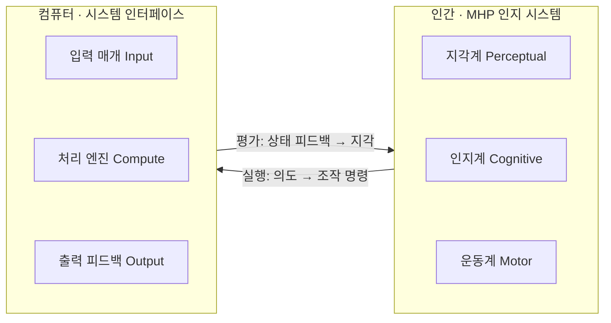

> **소프트웨어공학 > 요구분석 및 UI/UX > HCI(Human Computer Interaction)**
---

## 1. 30초 인출

- **본질**: **HCI(Human Computer Interaction)**는 컴퓨터에 인간이 억지로 적응하지 않고, 인간의 인지적·신체적 한계(MHP/GOMS)에 맞춰 시스템이 **실수 없이 쉽고 편하게 작동하도록 설계하는 사용자 중심 공학**
- **메커니즘**: 지각(100ms)·인지(70ms)·운동(70ms) 사이클 분석 ➔ 어포던스 및 직관적 멘탈 모델 설계 ➔ 상호작용 피드백 루프 최적화 (CLI ➔ GUI ➔ NUI ➔ OUI)
- **산출물**: GOMS/KLM 작업 예측 모델 · 인터페이스 디자인 시스템 · KWCAG 2.2 웹 접근성 검증 리포트

핵심 용어

- **HCI(Human-Computer Interaction)**: 인간과 컴퓨터 간의 상호작용 효율성과 사용자 경험을 극대화하기 위한 설계·평가 공학
- **MHP(Model Human Processor)**: 인간의 인지 과정을 지각(Perceptual), 인지(Cognitive), 운동(Motor) 3대 프로세서로 모델링한 인지공학 이론
- **GOMS 모델(Goals, Operators, Methods, Selection Rules)**: 사용자의 작업 수행 절차를 목표, 기본 동작, 방법, 선택 규칙으로 분해하여 수행 시간을 정량 예측하는 모델
- **KLM(Keystroke-Level Model)**: GOMS의 간소화 버전으로 키 입력, 마우스 이동 등 단위 동작 시간을 합산하여 작업 소요 시간을 측정하는 기법
- **어포던스(Affordance)**: 시스템 객체의 형태나 시각적 단서만으로 사용자가 직관적으로 조작 방법을 인지할 수 있는 행동 유도성
- **멘탈 모델(Mental Model)**: 사용자가 시스템의 작동 원리와 구조에 대해 머릿속에 형성하는 내적 인지 모형
- **NUI(Natural User Interface)**: 음성, 터치, 제스처, 시선 등 인간 본연의 신체 행동을 그대로 입력 매개체로 활용하는 인터페이스
- **OUI(Organic User Interface)**: 형상 변형 스크린, 생체 신호, 유기적 디스플레이 기반의 신체 밀착형 차세대 인터페이스
- **KWCAG 2.2(Korea Web Content Accessibility Guidelines)**: 시각, 청각, 지체 장애인 및 고령자가 웹 콘텐츠를 차별 없이 이용할 수 있도록 규정한 한국형 웹 접근성 표준
- **에이전틱 UX(Agentic UX)**: 사용자의 명시적 조작 없이도 자연어 의도(Intent)를 해석하여 AI 에이전트가 하부 작업을 자율 실행하는 인터페이스

---

## 1교시 예상문제 (10점)

> HCI(Human Computer Interaction / Interface)의 정의와 목적, 핵심 메커니즘을 설명하시오. (예상)
---

## 1교시 10점 답안

- **정의**: 인간과 컴퓨터 간의 상호작용 최적화를 위한 다학제적(인지심리, 전산, 디자인) 공학
- **3대 목표**: 유용성(Utility - 목적 달성), 사용성(Usability - 효율/용이성), 감성(Affect - 심미/만족)
- **인지 모델**: MHP (지각·인지·운동 시스템), GOMS (목표, 연산자, 방법, 선택규칙)
- **인터페이스 진화**: 1세대 CLI ➔ 2세대 GUI(WIMP) ➔ 3세대 NUI(음성/터치) ➔ 4세대 OUI/BCI
---

### 핵심 관계

---

## 2~4교시 예상문제 (25점)

> HCI(Human Computer Interaction / Interface)의 개념과 목적을 설명하고, 핵심 메커니즘과 주요 구성요소, 적용 절차와 실무 대응 방안을 서술하시오. (25점, 예상)
---

## 2~4교시 25점 답안

### Ⅰ. HCI(Human Computer Interaction)의 개요

#### 1. HCI의 정의 및 필요성
- **정의**: 인간(Human)과 컴퓨터(Computer) 간의 상호작용(Interaction)을 최적화하기 위해 인지심리학, 컴퓨터과학, 인간공학, 디자인을 융합하여 유용성(Utility), 사용성(Usability), 감성(Affect)을 극대화하는 공학 학문.
- **필요성**:
  - **휴먼 에러(Human Error) 방지**: 복잡한 미션 크리티컬 시스템(원전, 의료, 금융)에서 인지 과부하로 인한 조작 실수 원천 차단.
  - **인지 부하 최소화 및 학습 곡선 단축**: 직관적 멘탈 모델과 메타포를 제공하여 사용자 온보딩 비용 절감.
  - **디지털 포용성(Digital Inclusion) 보장**: 취약계층의 정보 접근 장벽을 제거하는 보편적 설계(Universal Design) 실현.

#### 2. HCI 3대 핵심 품질 목표
1. **유용성 (Utility)**: 사용자가 원하는 목표 과업을 실제로 달성할 수 있는 적합한 기능 제공.
2. **사용성 (Usability)**: 최소한의 노력과 인지 부하로 쉽고 빠르고 오류 없이 목표를 수행하는 효율성.
3. **감성 만족도 (Affect/Experience)**: 시스템을 이용하는 과정에서 느끼는 시각적·심리적 심미성과 총체적 사용자 경험(UX).
---

### Ⅱ. HCI 인지 분석 모델 및 인터랙션 구조

#### 1. MHP(Model Human Processor) 인지 사이클 및 피드백 모델

- **Norman 2대 인지 간극**: 실행의 간극(조작법 혼선 방지)과 평가의 간극(즉각 반응 피드백)을 어포던스와 메타포로 극소화함.

#### 2. GOMS 인지 작업 예측 모델 4대 구성요소
- **Goals (목표)**: 사용자가 시스템을 통해 성취하려는 최종 목적 (예: 장바구니 품목 결제).
- **Operators (동작)**: 목표 달성을 위한 최소 단위 물리적/인지적 기본 조작 (키보드 입력, 마우스 클릭).
- **Methods (방법)**: 특정 목표를 완수하기 위해 조직화된 연산자들의 순차적 실행 경로.
- **Selection Rules (선택 규칙)**: 동일한 목표를 달성하는 여러 방법이 존재할 때 상황에 맞게 최적의 방법을 결정하는 규칙.
---

### Ⅲ. 사용자 인터페이스(UI) 발전 단계 비교 (CLI vs GUI vs NUI vs OUI)

| 세대 | 인터페이스 유형 | 주 입력 매개체 | 핵심 장점 | 주요 단점 및 한계 | 대표 사례 |
|---|---|---|---|---|---|
| **1세대** | **CLI(Command Line)** | 키보드 (텍스트 명령) | 시스템 자원 소모 극소, 고급 스크립트 고속 자동화 | 높은 학습 장벽, 비전문가 접근 원천 불가 | 리눅스 Bash, 도스 |
| **2세대** | **GUI(Graphical User Interface)** | 마우스, 키보드 (WIMP) | 시각적 메타포 기반 직관성, 오류 복구 용이 | 화면 공간 제약, 물리적 입력 장치 필수 | Windows, macOS |
| **3세대** | **NUI(Natural User Interface)** | 터치, 음성, 제스처, 시선 | 별도 도구 없이 자연스러운 신체 본능 조작 | 주변 소음·조명 민감, 의도 모호성(Ambiguity) | 스마트폰 터치, Siri |
| **4세대** | **OUI/BCI(Organic/Brain-Computer)** | 뇌파(EEG), 변형 디스플레이 | 물리적 경계 제거, 신체-컴퓨터 일체화 인터랙션 | 기술 미성숙, 고비용, 프라이버시 및 윤리 이슈 | 롤러블 디스플레이, 뉴럴링크 |
---

### Ⅳ. HCI 설계 및 적용 시 3대 위험 및 대응 전략

| 위험 | 대책 | 효과 |
|---|---|---|
| **키오스크 딥 뎁스 UI로 인한 고령층 조작 포기** | 시니어 전용 간편 모드(3단계 결제, 고대비 대형 폰트) 및 AI 음성 보조 탑재 | 주문 완수율 제고 및 조작 시간 단축 |
| **금융 거래 중 확인 팝업 피로로 인한 오송금** | 중요 트랜잭션 전 계좌명 대조 강제화 및 취소(Undo) 완충 타임아웃 제공 | 인지 부하에 따른 휴먼 에러 사고 차단 |
| **스크린 리더 미지원으로 인한 웹 접근성 법적 분쟁** | KWCAG 2.2 기반 자동화 정적 린터(Axe-core)를 CI/CD 파이프라인에 필수 게이트로 구성 | 웹 접근성 인증 마크 획득 및 법적 분쟁 위험 차단 |
---

### Ⅴ. 결론: 생성형 AI 시대 Agentic UX로의 패러다임 전환

### 학습자 통찰 메모 — 답안 밖

- `[핵심 통찰]`: 과거의 HCI가 "컴퓨터의 복잡한 기계어를 인간의 인지 체계에 맞추어 시각화(WIMP)해 주는 번역기"였다면, 생성형 AI와 멀티모달 시대의 HCI는 "명시적 조작(Action)을 생략하고 사용자의 모호한 의도(Intent)를 스스로 완성하는 자율 대리인(Agentic Interface)"으로 진화하고 있다. 따라서 전통적 MHP/GOMS 모델로 기본기를 입증한 후, 에이전틱 인터페이스의 AI 환각·오작동을 제어하는 '인간 개입(Human-in-the-Loop)' 안전 메커니즘을 결론에서 제시해야 차별점이 생긴다.
- `나라면`: 1단락에서 유용성·사용성·감성의 3대 축과 인지 과부하 방지 필요성을 제시하고, 2단락에서 MHP 인지 사이클과 Norman의 2대 간극(실행·평가), CLI~OUI 세대 발전을 비교한 뒤, 3단락에서 자연어 의도 기반 Agentic UX 아키텍처와 KWCAG 2.2 거버넌스를 제언하겠다.

### 실전 답안용 기술사적 제언

- **판정 기준**: 사용자가 세부 메뉴를 직접 찾아 클릭해야 하는 단계 수(Click Depth)가 3단계를 초과하거나 인지 부하 지표(NASA-TLX)가 임계치를 초과하는지 여부를 기준으로 UI 개선 우선순위를 판정해야 함.
- **대응 방안**: 메뉴 중심 탐색을 탈피하여 멀티모달(음성+터치+시선) 기반의 **자연어 의도(Intent) 인터페이스**를 전면 도입하고, 고령층 및 장애인을 위한 **KWCAG 2.2 배리어 프리 디자인 토큰**을 컴포넌트 라이브러리에 내재화해야 함.
- **검증 체계**: 사용자 여정(User Journey) 전 구간에 대해 정량적 GOMS/KLM 예측과 시선 추적(Eye-tracking) 실증을 병행하고, **프론트엔드 CI/CD 빌드 파이프라인에 Axe-core 기반 접근성 정적 분석 게이트**를 강제해야 함.
- **기대 효과**: 복합 업무 시스템의 조작 완료 시간을 단축하고, 휴먼 에러로 인한 오작동을 차단하며, ESG 사회적 포용성 지표를 충족함.
---

## 5. 기출 분석 및 출제 경향

| 회차 및 교시 | 문제 유형 | 핵심 출제 포인트 |
|---|---|---|
| **제112회 1교시** | 단답형 | HCI의 개념 및 3대 품질 요소(유용성, 사용성, 감성) 설명 |
| **제121회 2교시** | 서술형 | 사용자 인터페이스의 세대별 발전 단계(CLI, GUI, NUI, OUI) 비교 분석 |
| **제126회 1교시** | 단답형 | MHP(Model Human Processor) 모델과 GOMS 기법의 개념 |
| **제132회 3교시** | 서술형 | 생성형 AI 및 대화형 멀티모달 환경에서의 Agentic UX 설계 원칙과 접근성 대응 방안 |
---

## 6. 실전 시험 팁

- **MHP 사이클 수치 표기**: 지각(Perceptual, ~100ms), 인지(Cognitive, ~70ms), 운동(Motor, ~70ms)의 대략적 처리 시간을 도식에 병기하면 공학적 정량성을 입증할 수 있음.
- **WIMP 키워드 필수**: GUI를 설명할 때는 반드시 Window, Icon, Menu, Pointer의 약자인 WIMP 메타포를 언급할 것.
- **ESG/접근성 연계 결론**: 결론부에서 장애인차별금지법 및 KWCAG 2.2 표준을 언급하며 기업의 ESG 사회적 책임 및 배리어 프리 인터페이스 구현을 강조하면 차별화 성공.
---

## 7. 연관 토픽 맵

- **선행 토픽**: 소프트웨어 요구공학, 사용자 중심 설계(UCD)
- **유사/비교 토픽**: 사용성 테스트(Usability Testing), 정보구조(IA), 디자인 씽킹
- **후속/연계 토픽**: 멀티모달 AI, Agentic UX, 웹 접근성(KWCAG 2.2)
