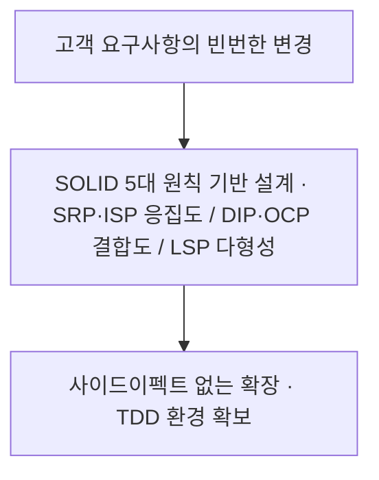
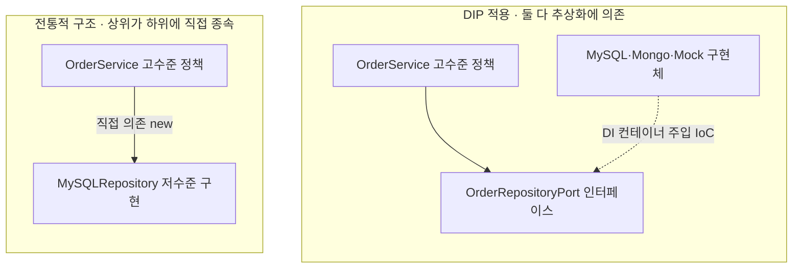

> **소프트웨어공학 > 객체지향 및 아키텍처 설계 > 객체지향 설계원칙 SOLID**

---

## 1. 30초 인출

- **본질**: **SOLID**는 변경 요구사항이 발생했을 때 **기존의 검증된 코드를 뜯어고치지 않고(OCP), 새로운 코드만 안전하게 덧붙여 확장할 수 있게 만드는 객체지향 5대 설계 원칙**
- **메커니즘**: 단일 책임 분리(SRP) ➔ 인터페이스 맞춤 분할(ISP) ➔ 다형성 치환(LSP) ➔ 고수준 코어 중심 의존 역전(DIP) ➔ 사이드이펙트 없는 무중단 확장(OCP)
- **산출물**: 고응집·저결합 클래스 다이어그램 · 클린/헥사고날 아키텍처 포트 규격 · Mock 테스트 가능한 단위 코드베이스

핵심 용어

- **SRP(Single Responsibility Principle)**: 하나의 클래스는 오직 하나의 단일 책임(하나의 액터 및 변경 사유)만 가져야 한다는 원칙
- **OCP(Open-Closed Principle)**: 소프트웨어 개체는 확장에 대해서는 열려 있어야 하고, 수정에 대해서는 닫혀 있어야 한다는 원칙
- **LSP(Liskov Substitution Principle)**: 하위 클래스는 상위 클래스의 책임을 온전히 수행할 수 있어야 하며 대체 가능해야 한다는 원칙
- **ISP(Interface Segregation Principle)**: 클라이언트는 자신이 사용하지 않는 메서드에 의존하지 않도록 인터페이스를 작게 분리해야 한다는 원칙
- **DIP(Dependency Inversion Principle)**: 고수준 모듈은 저수준 모듈에 의존해서는 안 되며, 둘 다 추상화(인터페이스)에 의존해야 한다는 원칙
- **의존성 주입(DI: Dependency Injection)**: 객체가 직접 의존 대상을 생성하지 않고 외부(컨테이너)로부터 주입받아 결합도를 낮추는 기법
- **제어의 역전(IoC: Inversion of Control)**: 프로그램의 제어 흐름 주도권이 개발자 코드에서 프레임워크나 런타임 컨테이너로 넘어가는 현상
- **계약에 의한 설계(DbC: Design by Contract)**: 사전조건 약화 금지, 사후조건 강화 보장 등 상하위 클래스 간의 계약 무결성을 명시하는 기법
- **코드 스멜(Code Smell)**: 가독성 저하, 중복, 강결합 등 잠재적 버그와 유지보수 비용을 증가시키는 나쁜 코드 징후
- **헥사고날 아키텍처(Hexagonal Architecture)**: DIP 원리를 시스템 아키텍처로 확장하여 도메인 코어와 외부 인프라를 포트와 어댑터로 격리하는 구조

---

## 1교시 예상문제 (10점)

> 객체지향 설계원칙 SOLID(DIP 포함)의 정의와 목적, 핵심 메커니즘을 설명하시오. (예상)

---

## 1교시 10점 답안

### Ⅰ. SOLID 원칙의 개요

| 구분 | 핵심 |
|---|---|
| 정의 | 변경과 확장에 대응하기 위한 객체지향 설계의 다섯 원칙 |
| 목적 | 변경 영향과 모듈 간 결합을 줄여 유지보수와 테스트를 쉽게 하는 것 |

### Ⅱ. 다섯 원칙의 핵심 내용
- **S (단일 책임)**: 한 클래스는 단 하나의 변경 이유(단일 액터)만 가짐
- **O (개방-폐쇄)**: 기능 확장은 열고(Open), 기존 코드 수정은 닫음(Closed)
- **L (리스코프 치환)**: 하위 클래스는 상위 클래스의 계약을 만족하며 완벽히 대체 가능해야 함
- **I (인터페이스 분리)**: 클라이언트 특화형으로 인터페이스를 잘게 분할하여 불필요한 의존 배제
- **D (의존관계 역전)**: 고수준 모듈이 저수준 모듈에 의존하지 않고, 둘 다 추상화에 의존함
---

#### 핵심 관계

제언: 변경 원인과 의존 경계를 고려한 SOLID 원칙의 선택 적용

---

## 2~4교시 예상문제 (25점)

> 객체지향 설계원칙 SOLID(DIP 포함)의 개념과 목적을 설명하고, 핵심 메커니즘과 주요 구성요소, 적용 절차와 실무 대응 방안을 서술하시오. (25점, 예상)

---

## 2~4교시 25점 답안

### Ⅰ. 객체지향 설계원칙 SOLID의 개요

| 구분 | 핵심 |
|---|---|
| 정의 | 변경과 확장에 대응하기 위한 객체지향 설계의 다섯 원칙 |
| 목적 | 변경 영향과 모듈 간 결합을 줄여 유지보수와 테스트를 쉽게 하는 것 |

#### 1. SOLID 원칙의 정의 및 지향점
- **지향점**:
  - **응집도 극대화**: 단일 목적 중심의 모듈 구성(SRP, ISP).
  - **결합도 최소화**: 구체 구현 대신 추상화된 규격 중심 결합(DIP, OCP).
  - **신뢰성 보장**: 다형성 활용 시 런타임 계약 무결성 유지(LSP).

---

### Ⅱ. SOLID 5대 핵심 원칙 상세 분석

#### 1. 5대 원칙 매핑 및 코드 스멜 비교
| 원칙 | 핵심 메커니즘 | 위반 시 발생하는 코드 스멜 (Smell) | 공학적 해결 방안 |
|---|---|---|---|
| **SRP** (단일 책임) | 한 클래스는 하나의 변경 이유(단일 액터)만 책임짐 | 거대 만능 객체(God Object), 엉뚱한 로직 수정에 따른 연쇄 결함 | 클래스 역할 분리, 파사드(Facade) 도입 |
| **OCP** (개방-폐쇄) | 기능 확장은 다형성으로 열고, 기존 코드는 폐쇄 | 신규 기능 추가 시 기존 `if-else`/`switch` 조건문 대량 수정 | 인터페이스 추출, 전략(Strategy) 패턴 적용 |
| **LSP** (리스코프 치환) | 서브타입은 언제나 슈퍼타입으로 완전히 치환 가능 | `instanceof` 타입 분기 남발, 하위 클래스에서 상위 예외 던짐 | 상속 대신 합성(Composition) 사용, 인터페이스 분리 |
| **ISP** (인터페이스 분리) | 클라이언트는 미사용 메서드에 강제 의존하지 않음 | 빈 껍데기 메서드 구현(`throw UnsupportedException`), 인터페이스 비대화 | 역할 인터페이스(Role Interface)로 잘게 분할 |
| **DIP** (의존관계 역전) | 고수준 정책이 저수준 기술 구현체에 종속되지 않음 | 비즈니스 로직 내부 `new DBRepository()` 강결합 | 인터페이스 소유권 역전, 생성자 DI 주입 |
---

### Ⅲ. 의존관계 역전 원칙(DIP) 심층 분석

#### 1. 전통적 의존 vs DIP 의존 구조 비교

#### 2. DIP 구현 핵심 메커니즘
- **인터페이스 소유권의 역전**: `OrderRepository` 인터페이스는 인프라 패키지가 아닌, 비즈니스 도메인 패키지에 함께 위치하여 비즈니스 계층이 인터페이스의 형태를 주도함.
- **제어의 역전(IoC) 및 의존성 주입(DI)**: 런타임에 프레임워크 컨테이너(Spring 등)가 구현체를 외부에서 주입함으로써 비즈니스 코드는 순수 POJO 상태를 유지하며 단위 테스트(Mocking)가 완벽히 가능해짐.
---

### Ⅳ. SOLID 적용 시 3대 위험 및 대응 전략

| 위험 | 대책 | 효과 |
|---|---|---|
| **원칙의 맹목적 적용으로 인한 클래스 및 인터페이스 폭증** | YAGNI 원칙 병행 및 도메인 복잡도에 따라 빈번한 변경 영역에 선별 적용 | 불필요한 추상화 오버헤드 방지 및 코드 탐색성 유지 |
| **상속 오용으로 인한 LSP 파괴 및 런타임 예외 발생** | '상속보다는 합성(Composition over Inheritance)' 설계 지침 표준화 | 다형성 계약 준수 및 런타임 다운캐스팅 결함 차단 |
| **하위 구현체 변경 시 비즈니스 레이어 오염** | 헥사고날 포트-어댑터 패턴 및 생성자 기반 DI 아키텍처 강제 | 인프라 변경 시 도메인 코드 보존 |
---

### Ⅴ. 적용 제언

| 문제 | 해결 방안 |
|---|---|
| 모든 SOLID 원칙을 기계적으로 적용해 불필요한 추상화가 늘어날 위험 | 변경 원인과 의존 경계를 먼저 확인하고 비용 대비 효과가 있는 원칙을 선택 적용 |

## 연결 토픽

- **선행 토픽**: 객체지향 패러다임(OOP), 디자인 패턴(GoF)
- **유사/비교 토픽**: GRASP 패턴, 코드 리팩토링, 코드 스멜
- **후속/연계 토픽**: IoC/DI, 헥사고날 아키텍처, 클린 아키텍처, 마이크로서비스 아키텍처(MSA)
