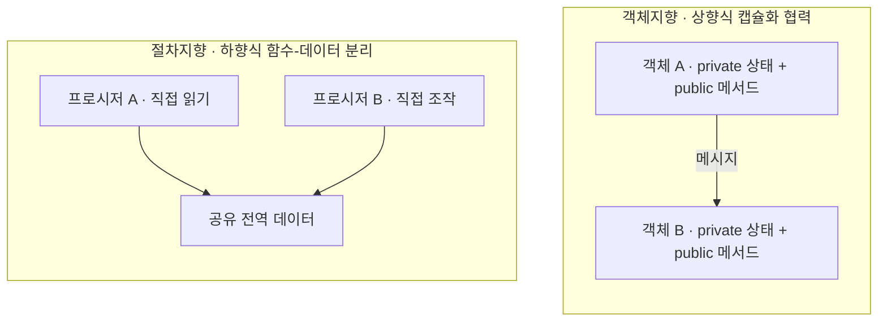

> **소프트웨어공학 > 공학 기초 및 개발 패러다임 > 객체지향 프로그래밍(OOP)과 절차지향(POP)**

---

## 1. 30초 인출

- **본질**: **객체지향(OOP)**은 데이터 구조 하나 바꿨다고 전역 함수가 연쇄 파탄 나는 절차지향(POP)의 한계를 끝내기 위해, **데이터와 행위를 객체 내부에 묶어 숨기고(캡슐화) 독립된 부품처럼 조립·협력하게 만든 패러다임**
- **메커니즘**: 현실 개체 모델링 ➔ 캡슐화(정보은닉) ➔ 상속 및 다형성(오버라이딩) ➔ 객체 간 자율적 메시지 교환(협력 네트워크)
- **산출물**: 도메인 엔티티 모델 · 다형성 인터페이스 규격서 · 고재사용 객체 컴포넌트 라이브러리

핵심 용어

- **절차지향(POP: Procedure-Oriented Programming)**: 문제를 하향식(Top-down)으로 분해하여 데이터와 순차적인 프로시저(함수)로 구현하는 패러다임
- **객체지향(OOP: Object-Oriented Programming)**: 현실 세계의 개체를 상태와 행위를 가진 자율적 객체(Object)로 모델링하고 메시지 교환으로 협력하는 패러다임
- **캡슐화(Encapsulation)**: 데이터(속성)와 이를 다루는 연산(메서드)을 하나로 묶고 외부로부터 세부 구현을 감추는 정보은닉 메커니즘
- **상속성(Inheritance)**: 상위 클래스의 속성과 행위를 하위 클래스가 물려받아 코드 중복을 제거하고 계층 구조를 형성하는 특성
- **다형성(Polymorphism)**: 동일한 메시지 호출 인터페이스에 대해 각 하위 구체 객체가 서로 다른 고유한 방식으로 동작하는 특성
- **추상화(Abstraction)**: 복잡한 실체에서 핵심적인 공통 개념과 인터페이스만을 추출하여 단순화하는 모델링 기법
- **메시지 패싱(Message Passing)**: 객체 간에 직접 상태를 조작하지 않고 메서드 호출 형태로 협력을 요청하고 응답받는 통신 방식
- **정보은닉(Information Hiding)**: 객체 내부의 세부 구현이나 자료구조를 private으로 숨겨 외부의 부주의한 접근과 변경을 원천 차단하는 원리
- **결합도와 응집도(Coupling & Cohesion)**: 모듈 간 상호 의존성(결합도, 낮을수록 우수)과 모듈 내부 구성요소의 단일 목적 집중도(응집도, 높을수록 우수)
- **멀티패러다임(Multi-paradigm)**: 시스템의 거시적 구조는 OOP로 잡고 세부 비즈니스 가공은 함수형 프로그래밍(FP) 불변성을 결합하는 현대 기법

---

## 3. 25점형 답안 프레임워크

### Ⅰ. 프로그래밍 패러다임 발전과 POP/OOP의 개요

#### 1. 패러다임 발전 배경
- **무구조 프로그래밍의 한계**: GOTO문 남발로 인한 스파게티 코드 양산 및 소프트웨어 위기 직면.
- **절차지향(POP)의 등장**: 뵘-야코피니(Böhm-Jacopini) 구조화 정리(순차, 선택, 반복)와 함수 모듈화로 1차 위기 극복.
- **객체지향(OOP)으로의 진화**: 비즈니스 규모 팽창에 따라 데이터와 로직의 분리로 인한 전역 상태 오염 및 유지보수 파탄을 해결하기 위해 상태와 행위를 일체화한 자율적 객체 모델링으로 발전.

---

### Ⅱ. OOP 4대 핵심 특성 및 협력 메커니즘

#### 1. OOP 4대 핵심 특성
| 특성 | 핵심 개념 및 구현 메커니즘 | 공학적 효과 |
|---|---|---|
| **캡슐화 (Encapsulation)** | 데이터(필드)와 행위(메서드)를 클래스로 결합하고 접근 제어자(`private`, `protected`)로 외부 직접 접근 차단 | 정보은닉 실현, 데이터 무결성 보장, 변경 영향 국소화 |
| **추상화 (Abstraction)** | 불필요한 구현 세부를 배제하고 본질적인 공통 기능과 인터페이스(`interface`, `abstract`)만 정의 | 인지 과부하 감소, 유연하고 일관된 설계 규격 제공 |
| **상속성 (Inheritance)** | 부모 클래스의 속성과 메서드를 자식 클래스가 확장하여 재사용(`extends`) | 코드 재사용성 극대화 (현대 공학은 합성 원칙 권장) |
| **다형성 (Polymorphism)** | 동일한 시그니처 메서드 호출에 대해 실제 런타임 인스턴스에 따라 다르게 실행(오버라이딩, 오버로딩) | 조건문(`if-else`/`switch`) 분기 제거, OCP 달성 |

#### 2. 객체 간 협력 메커니즘
- **자율적 객체(Autonomous Object)**: 객체는 스스로 상태를 관리하고 책임을 수행하며, 외부 객체는 무엇(What)을 할지만 요청할 뿐 어떻게(How) 하는지는 관여하지 않음 (Tell, Don't Ask 원칙).

---

### Ⅲ. 절차지향(POP) vs 객체지향(OOP) 심층 비교

| 비교 항목 | 절차지향 프로그래밍 (POP) | 객체지향 프로그래밍 (OOP) |
|---|---|---|
| **설계 철학** | 기능(동사) 중심, 프로시저 순차 흐름 | 개체(명사) 중심, 자율적 객체 간의 메시지 협력 |
| **분석/설계 방향** | **하향식 (Top-Down)** | **상향식 (Bottom-Up)** |
| **데이터-로직 관계**| 데이터와 함수가 상호 독립 (공유 데이터) | 데이터와 행위가 객체 내부에 **캡슐화** |
| **유지보수성/확장성**| 데이터 구조 변경 시 전역 함수 연쇄 수정 | 캡슐화 및 다형성 인터페이스로 **확장성 우수** |
| **실행 성능** | **초고속 (메모리 직접 제어, 오버헤드 부재)** | 동적 바인딩(vtable), 객체 참조로 미세 오버헤드 |
| **대표 언어** | C, Pascal, Fortran | Java, C++, C#, Python, Kotlin |
| **최적 적용 도메인**| OS 커널, 디바이스 드라이버, 실시간 임베디드 | 엔터프라이즈 비즈니스 시스템, 클라우드 SaaS |

---

### Ⅳ. 패러다임 실무 적용 시 3대 위험 및 대응 전략

| 위험 | 대책 | 효과 |
|---|---|---|
| **공유 데이터 구조체 변경에 따른 C 레거시 시스템 연쇄 오류** | 불투명 포인터(Opaque Pointer) 기법 도입으로 인터페이스 함수 경유 강제화 | 절차적 C 코드 간 결합도 제거 |
| **다형성 미적용으로 인한 방대한 분기문(switch) 수정 장애** | 인터페이스 추출 및 팩토리/전략 패턴 기반 다형적 객체 위임 리팩토링 | 분기문 복잡도 제거 및 신규 기능 무중단 확장 |
| **Getter/Setter 남발로 인한 빈약한 도메인 모델(Anemic Model)** | 비즈니스 검증 로직을 도메인 엔티티 내부로 캡슐화('Tell, Don't Ask' 원칙) | 도메인 불변식 파괴 결함 원천 차단 |

---

### Ⅴ. 결론: 현대 소프트웨어의 멀티패러다임(OOP+FP+POP) 수렴

### 학습자 통찰 메모 — 답안 밖

- `[핵심 통찰]`: POP와 OOP는 어느 한쪽이 우월하여 도태되는 관계가 아니라, 소프트웨어 스택의 '레이어'와 '도메인 특성'에 따른 최적화 선택지이다. 초고속 네트워크 패킷 파싱, 하드웨어 레지스터 제어, OS 커널에서는 메모리 레이아웃을 직접 다루는 절차지향(POP)과 데이터 지향(DOD)이 여전히 압도적 성능을 내고, 비즈니스 룰이 복잡한 엔터프라이즈 영역에서는 OOP의 캡슐화와 DDD가 생존의 열쇠다. 현대 실무의 진정한 기술사는 OOP로 거시적 도메인 모델을 구축하고, 세부 데이터 변환은 함수형(FP) 불변성으로 처리하는 멀티패러다임 조화 능력을 갖추어야 한다.
- `나라면`: 1단락에서 소프트웨어 위기 극복 과정에서의 OOP 태동 배경을 제시하고, 2단락에서 4대 특성과 Tell, Don't Ask 협력 메커니즘 및 POP vs OOP 비교표를 제시한 뒤, 3단락에서 아키텍처는 OOP/DDD, 세부 처리는 FP, 초저지연 엔진은 POP으로 조화시키는 멀티패러다임을 제언하겠다.

### 실전 답안용 기술사적 제언

- **판정 기준**: 시스템의 병목이 '하드웨어 메모리 대역폭/초저지연 연산'에 있는지, 아니면 '복잡한 비즈니스 룰의 잦은 변경과 유지보수성'에 있는지 여부를 기준으로 주 패러다임을 판정해야 함.
- **대응 방안**: 엔터프라이즈 레이어에서는 **풍부한 도메인 모델(Rich Domain Model)과 Tell, Don't Ask 원칙을 적용한 순수 OOP/DDD**를 채택하고, 멀티스레드 동시성 영역에는 **부수효과를 차단하는 함수형(FP) 불변 스트림 파이프라인**을 적극 결합해야 함.
- **검증 체계**: 단위 테스트 단계에서 객체의 불변식(Invariants) 파괴 여부와 Getter 남발로 인한 정보은닉 훼손을 정적 분석 도구(SonarQube) 룰셋으로 상시 검증해야 함.
- **기대 효과**: 엔터프라이즈 도메인의 요구사항 변경 비용을 절감하고, 동시성 다중 스레드 환경에서의 데이터 레이스 컨디션 버그를 배제함.

---

## 4. 1교시 10점형 대비 핵심 요약

- **POP**: 순차적 함수 실행 중심, 하향식 설계, 데이터-함수 분리, 하드웨어 친화적 고속 성능
- **OOP**: 자율적 객체 간 메시지 협력, 상향식 설계, 데이터-행위 캡슐화, 높은 재사용성 및 유지보수성
- **4대 특성**: 캡슐화(정보은닉), 상속성(재사용), 다형성(유연성/OCP), 추상화(복잡도 경감)
- **현대적 동향**: 도메인은 OOP(DDD), 세부 처리는 FP(불변성), 코어 엔진은 POP(고속 메모리) 결합

---

## 5. 기출 분석 및 출제 경향

| 회차 및 교시 | 문제 유형 | 핵심 출제 포인트 |
|---|---|---|
| **제115회 1교시** | 단답형 | 객체지향 프로그래밍(OOP)의 4대 특성과 개념 |
| **제125회 4교시** | 서술형 | 절차지향(POP)과 객체지향(OOP)의 설계 철학, 장단점 및 도메인별 적용 전략 비교 |
| **제129회 1교시** | 단답형 | 객체지향의 다형성(Polymorphism) 구현 메커니즘 및 장점 |
| **제133회 2교시** | 서술형 | 대규모 동시성 환경에서의 OOP와 함수형 프로그래밍(FP)의 상호보완적 융합 아키텍처 |

---

## 6. 실전 시험 팁

- **구조 비교도 명확화**: 답안 1단락 또는 2단락에 공유 전역 데이터를 둘러싼 POP 함수 구조와 캡슐화된 OOP 객체 간 메시지 패싱 구조를 명확히 대조하여 그릴 것.
- **Tell, Don't Ask 명시**: 단순 Getter/Setter를 쓰는 것은 진정한 OOP가 아니며, 상태를 직접 묻지 않고 행위를 위임하는 원칙을 언급하면 실무 내공이 돋보임.
- **멀티패러다임 제언**: 결론부에서 POP, OOP, FP를 이분법적으로 보지 않고 시스템 레이어별로 조화시키는 현대 공학 관점을 서술할 것.

---

## 7. 연관 토픽 맵

- **선행 토픽**: 소프트웨어 위기, 구조적 프로그래밍
- **유사/비교 토픽**: 함수형 프로그래밍(FP), 반응형 프로그래밍(Reactive), 데이터 지향 설계(DOD)
- **후속/연계 토픽**: SOLID 원칙, 디자인 패턴(GoF), 도메인 주도 설계(DDD)
