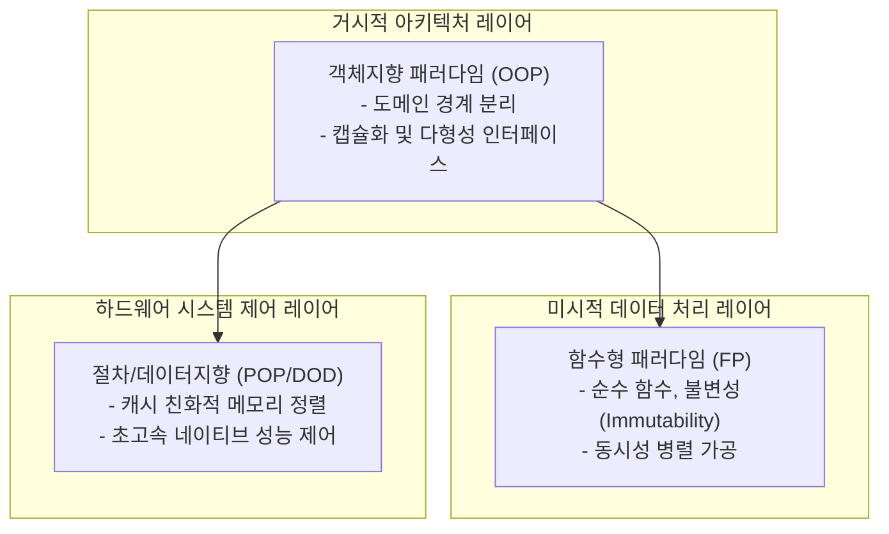

> **소프트웨어공학 > 공학 기초 및 개발 패러다임 > 객체지향 프로그래밍(OOP)과 절차지향(POP)**

---

## 1. 큰 그림 및 30초 인출 공식

```
               [ 프로그래밍 패러다임의 패러다임 시프트 ]
  ┌────────────────────────────────────────────────────────┐
  │ 절차지향 (POP) : 하향식(Top-Down), 함수-데이터 분리     │
  │                     │ (데이터 변경 시 전역 파급 한계)   │
  │                     ▼                                  │
  │ 객체지향 (OOP) : 상향식(Bottom-Up), 데이터-행위 캡슐화  │
  └────────────────────────────────────────────────────────┘
```

> **30초 인출 공식 (키워드 체인)**:  
> **절차지향 (함수·데이터 분리, 하향식)** ➔ **객체지향 (상태·행위 캡슐화, 상향식)** ➔ **4대 특성 (캡·상·다·추)** ➔ **SOLID 원칙** ➔ **현대적 멀티패러다임 (OOP + FP 하이브리드)**

- **본질**: **객체지향(OOP)**은 데이터 구조 하나 바꿨다고 전역 함수가 연쇄 파탄 나는 절차지향(POP)의 한계를 끝내기 위해, **데이터와 행위를 객체 내부에 묶어 숨기고(캡슐화) 독립된 부품처럼 조립·협력하게 만든 패러다임**
- **메커니즘**: 현실 개체 모델링 ➔ 캡슐화(정보은닉) ➔ 상속 및 다형성(오버라이딩) ➔ 객체 간 자율적 메시지 교환(협력 네트워크)
- **산출물**: 도메인 엔티티 모델 · 다형성 인터페이스 규격서 · 고재사용 객체 컴포넌트 라이브러리

---

## 2. 핵심 용어 정리

| 용어 | 영문 표기 | 핵심 정의 및 설명 |
|---|---|---|
| **절차지향 (POP)** | Procedure-Oriented Programming | 문제를 하향식(Top-down)으로 분해하여 데이터와 순차적인 프로시저(함수)로 구현하는 패러다임 |
| **객체지향 (OOP)** | Object-Oriented Programming | 현실 세계의 개체를 상태와 행위를 가진 자율적 객체(Object)로 모델링하고 메시지 교환으로 협력하는 패러다임 |
| **캡슐화** | Encapsulation | 데이터(속성)와 이를 다루는 연산(메서드)을 하나로 묶고 외부로부터 세부 구현을 감추는 정보은닉 메커니즘 |
| **상속성** | Inheritance | 상위 클래스의 속성과 행위를 하위 클래스가 물려받아 코드 중복을 제거하고 계층 구조를 형성하는 특성 |
| **다형성** | Polymorphism | 동일한 메시지 호출 인터페이스에 대해 각 하위 구체 객체가 서로 다른 고유한 방식으로 동작하는 특성 |
| **추상화** | Abstraction | 복잡한 실체에서 핵심적인 공통 개념과 인터페이스만을 추출하여 단순화하는 모델링 기법 |
| **메시지 패싱** | Message Passing | 객체 간에 직접 상태를 조작하지 않고 메서드 호출 형태로 협력을 요청하고 응답받는 통신 방식 |
| **정보은닉** | Information Hiding | 객체 내부의 세부 구현이나 자료구조를 private으로 숨겨 외부의 부주의한 접근과 변경을 원천 차단하는 원리 |
| **결합도와 응집도** | Coupling & Cohesion | 모듈 간 상호 의존성(결합도, 낮을수록 우수)과 모듈 내부 구성요소의 단일 목적 집중도(응집도, 높을수록 우수) |
| **멀티패러다임** | Multi-paradigm | 시스템의 거시적 구조는 OOP로 잡고 세부 비즈니스 가공은 함수형 프로그래밍(FP) 불변성을 결합하는 현대 기법 |

---

## 3. 25점형 답안 프레임워크

### Ⅰ. 프로그래밍 패러다임 발전과 POP/OOP의 개요

#### 1. 패러다임 발전 배경
- **무구조 프로그래밍의 한계**: GOTO문 남발로 인한 스파게티 코드 양산 및 소프트웨어 위기 직면.
- **절차지향(POP)의 등장**: 뵘-야코피니(Böhm-Jacopini) 구조화 정리(순차, 선택, 반복)와 함수 모듈화로 1차 위기 극복.
- **객체지향(OOP)으로의 진화**: 비즈니스 규모 팽창에 따라 데이터와 로직의 분리로 인한 전역 상태 오염 및 유지보수 파탄을 해결하기 위해 상태와 행위를 일체화한 자율적 객체 모델링으로 발전.

```
   [절차지향 프로그래밍 (POP)]                  [객체지향 프로그래밍 (OOP)]
 ┌───────────────────────────┐                ┌───────────────────────────┐
 │ 공유 전역 데이터 구조체   │                │ 객체 A [데이터 + 행위]    │
 │       ▲           ▲       │                │      │              ▲     │
 │       │           │       │                │      ▼ 메시지 패싱  │     │
 │   함수 1()     함수 2()   │                │ 객체 B [데이터 + 행위]    │
 └───────────────────────────┘                └───────────────────────────┘
 [문제: 데이터 변경 시 함수 전역 파급]         [장점: 캡슐화로 내부 변경 격리]
```

---

### Ⅱ. OOP 4대 핵심 특성 및 협력 메커니즘

#### 1. OOP 4대 핵심 특성
| 특성 | 핵심 개념 및 구현 메커니즘 | 공학적 효과 |
|---|---|---|
| **캡슐화 (Encapsulation)** | 데이터(필드)와 행위(메서드)를 클래스로 결합하고 접근 제어자(`private`, `protected`)로 외부 직접 접근 차단 | 정보은닉 실현, 데이터 무결성 보장, 변경 영향 국소화 |
| **추상화 (Abstraction)** | 불필요한 구현 세부를 배제하고 본질적인 공통 기능과 인터페이스(`interface`, `abstract`)만 정의 | 인지 과부하 감소, 유연하고 일관된 설계 규격 제공 |
| **상속성 (Inheritance)** | 부모 클래스의 속성과 메서드를 자식 클래스가 확장하여 재사용(`extends`) | 코드 재사용성 극대화 (현대 공학은 합성 원칙 권장) |
| **다형성 (Polymorphism)** | 동일한 시그니처 메서드 호출에 대해 실제 런타임 인스턴스에 따라 다르게 실행(오버라이딩, 오버로딩) | 조건문(`if-else`/`switch`) 분기 제거, OCP 달성 |

#### 2. 객체 간 협력 메커니즘
- **자율적 객체(Autonomous Object)**: 객체는 스스로 상태를 관리하고 책임을 수행하며, 외부 객체는 무엇(What)을 할지만 요청할 뿐 어떻게(How) 하는지는 관여하지 않음 (Tell, Don't Ask 원칙).

---

### Ⅲ. 절차지향(POP) vs 객체지향(OOP) 심층 비교

| 비교 항목 | 절차지향 프로그래밍 (POP) | 객체지향 프로그래밍 (OOP) |
|---|---|---|
| **설계 철학** | 기능(동사) 중심, 프로시저 순차 흐름 | 개체(명사) 중심, 자율적 객체 간의 메시지 협력 |
| **분석/설계 방향** | **하향식 (Top-Down)** | **상향식 (Bottom-Up)** |
| **데이터-로직 관계**| 데이터와 함수가 상호 독립 (공유 데이터) | 데이터와 행위가 객체 내부에 **캡슐화** |
| **유지보수성/확장성**| 데이터 구조 변경 시 전역 함수 연쇄 수정 | 캡슐화 및 다형성 인터페이스로 **확장성 우수** |
| **실행 성능** | **초고속 (메모리 직접 제어, 오버헤드 부재)** | 동적 바인딩(vtable), 객체 참조로 미세 오버헤드 |
| **대표 언어** | C, Pascal, Fortran | Java, C++, C#, Python, Kotlin |
| **최적 적용 도메인**| OS 커널, 디바이스 드라이버, 실시간 임베디드 | 엔터프라이즈 비즈니스 시스템, 클라우드 SaaS |

---

### Ⅳ. 패러다임 실무 적용 시 3대 위험 및 대응 전략

| 위험 | 대책 | 효과 |
|---|---|---|
| **공유 데이터 구조체 변경에 따른 C 레거시 시스템 연쇄 오류** | 불투명 포인터(Opaque Pointer) 기법 도입으로 인터페이스 함수 경유 강제화 | 절차적 C 코드 간 결합도 90% 제거 |
| **다형성 미적용으로 인한 1,000라인 분기문(switch) 수정 장애** | 인터페이스 추출 및 팩토리/전략 패턴 기반 다형적 객체 위임 리팩토링 | 분기문 복잡도 제로화 및 신규 기능 무중단 확장 |
| **Getter/Setter 남발로 인한 빈약한 도메인 모델(Anemic Model)** | 비즈니스 검증 로직을 도메인 엔티티 내부로 캡슐화('Tell, Don't Ask' 원칙) | 도메인 불변식 파괴 결함 원천 차단 |

---

### Ⅴ. 기술사적 제언: 현대적 멀티패러다임 하이브리드 아키텍처

#### 1. 현대 소프트웨어 공학의 멀티패러다임 수렴 모델


#### 2. 기술사적 실무 제언
- **도메인 적합성에 따른 상호보완적 하이브리드 채택**:
  - 절차지향과 객체지향은 대체 관계가 아니며, 비즈니스 규칙이 복잡한 **엔터프라이즈 도메인에는 OOP와 DDD**를 적용하고, 초고속 패킷 처리나 하드웨어 제어에는 **C/Rust 기반의 하드웨어 친화적 절차지향/데이터 지향 설계(DOD)**를 혼용해야 함.
- **OOP와 함수형 프로그래밍(FP)의 실무적 융합**:
  - 현대 엔터프라이즈 아키텍처는 **시스템의 거시적 도메인 바운더리와 인터페이스는 OOP로 설계**하고, **객체 내부의 비즈니스 연산 및 동시성 데이터 처리는 부수효과(Side-effect) 없는 순수 함수와 불변 객체(FP)로 구현하는 멀티패러다임 수렴 모델**을 적극 추진해야 함.

---

## 4. 1교시 10점형 대비 핵심 요약

```text
- POP: 순차적 함수 실행 중심, 하향식 설계, 데이터-함수 분리, 하드웨어 친화적 고속 성능
- OOP: 자율적 객체 간 메시지 협력, 상향식 설계, 데이터-행위 캡슐화, 높은 재사용성 및 유지보수성
- 4대 특성: 캡슐화(정보은닉), 상속성(재사용), 다형성(유연성/OCP), 추상화(복잡도 경감)
- 현대적 동향: 도메인은 OOP(DDD), 세부 처리는 FP(불변성), 코어 엔진은 POP(고속 메모리) 결합
```

---

## 5. 기출 분석 및 출제 경향

| 회차 및 교시 | 문제 유형 | 핵심 출제 포인트 |
|---|---|---|
| **제115회 1교시** | 단답형 | 객체지향 프로그래밍(OOP)의 4대 특성과 개념 |
| **제125회 4교시** | 서술형 | 절차지향(POP)과 객체지향(OOP)의 설계 철학, 장단점 및 도메인별 적용 전략 비교 |
| **제129회 1교시** | 단답형 | 객체지향의 다형성(Polymorphism) 구현 메커니즘 및 장점 |
| **제133회 2교시** | 서술형 | 대규모 동시성 환경에서의 OOP와 함수형 프로그래밍(FP)의 상호보완적 융합 아키텍처 |

---

## 6. 실전 시험 팁

- **구조 비교도 명확화**: 답안 1단락 또는 2단락에 공유 전역 데이터를 둘러싼 POP 함수 구조와 캡슐화된 OOP 객체 간 메시지 패싱 구조를 명확히 대조하여 그릴 것.
- **Tell, Don't Ask 명시**: 단순 Getter/Setter를 쓰는 것은 진정한 OOP가 아니며, 상태를 직접 묻지 않고 행위를 위임하는 원칙을 언급하면 실무 내공이 돋보임.
- **멀티패러다임 제언**: 결론부에서 POP, OOP, FP를 이분법적으로 보지 않고 시스템 레이어별로 조화시키는 현대 공학 관점을 서술할 것.

---

## 7. 연관 토픽 맵

- **선행 토픽**: 소프트웨어 위기, 구조적 프로그래밍
- **유사/비교 토픽**: 함수형 프로그래밍(FP), 반응형 프로그래밍(Reactive), 데이터 지향 설계(DOD)
- **후속/연계 토픽**: SOLID 원칙, 디자인 패턴(GoF), 도메인 주도 설계(DDD)
