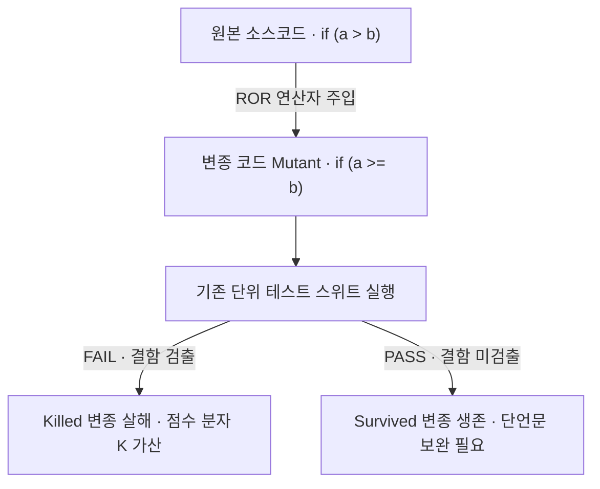

> **소프트웨어공학 > 테스트 및 검증 > 뮤테이션 테스트(Mutation Test)**

---

## 1. 30초 인출

- **본질**: **뮤테이션 테스트**는 코드 커버리지 100%라면서 정작 단언문(assert)이 엉성해 버그를 못 잡는 부실 테스트를 걸러내기 위해, **소스코드에 일부러 버그(돌연변이)를 심고 기존 테스트가 그 버그를 잡아내는지 검증하는 "테스트의 테스트" 기법**
- **메커니즘**: 소스코드에 돌연변이 연산자 주입(Mutant 생성) ➔ 기존 단위테스트 실행 ➔ 테스트 실패 시 변종 살해(Killed: 정상 검출) / 통과 시 변종 생존(Survived: 테스트 보강 필요) ➔ 뮤테이션 점수 산출
- **산출물**: 변종 결함 분석표 · 생존 변종(Survived) 단언문 보완 보고서 · PITest 뮤테이션 점수 리포트

핵심 용어

- **뮤테이션 테스트(Mutation Testing)**: 프로그램에 인위적 결함을 주입하여 테스트 스위트의 결함 검출 능력을 정량 평가하는 화이트박스 기법
- **뮤턴트(Mutant)**: 원본 프로그램에 구문 변형(연산자 변경, 문장 삭제 등)을 가하여 생성한 변종 프로그램
- **살해된 변종(Killed Mutant)**: 주입된 결함으로 인해 기존 테스트 케이스가 실패(Fail)하여 결함 검출에 성공한 변종
- **생존한 변종(Survived Mutant)**: 주입된 결함에도 불구하고 기존 테스트가 모두 성공(Pass)하여 테스트 보강이 필요한 변종
- **동등 변종(Equivalent Mutant)**: 구문은 변경되었으나 의미적으로 원본과 완전히 같아 어떤 테스트로도 살해할 수 없는 변종
- **유능한 프로그래머 가설(Competent Programmer Hypothesis)**: 개발자는 대부분 올바른 코드를 작성하며, 발생하는 버그는 사소한 구문 실수 수준이라는 전제
- **결합 효과 가설(Coupling Effect Hypothesis)**: 단순 결함들을 모두 잡아낼 수 있는 테스트는 복합 결함도 연쇄적으로 검출할 수 있다는 원리
- **뮤테이션 연산자(Mutation Operator)**: 원본 코드의 연산자, 피연산자, 제어문을 조작하여 변종을 생성하는 규칙(AOR, ROR, COR 등)
- **뮤테이션 점수(Mutation Score)**: 전체 유효 변종 중 살해된 변종의 비율을 나타내는 테스트 품질 정량 지표
- **PITest(PIT Mutation Testing)**: Java/JVM 환경에서 바이트코드 조작을 통해 고속으로 뮤테이션 테스팅을 수행하는 표준 도구

---

## 1교시 예상문제 (10점)

> 뮤테이션 테스트(Mutation Test)의 정의와 목적, 핵심 메커니즘을 설명하시오. (예상)

---

## 1교시 10점 답안

- **정의**: 프로그램에 인위적으로 작은 결함(Mutant)을 주입하여 테스트 스위트의 결함 검출 능력을 평가하는 기법
- **2대 가설**: 유능한 프로그래머 가설(버그는 사소한 오타 수준), 결합 효과 가설(단순 결함 검출 시 복합 결함도 검출)
- **핵심 용어**: Mutant(변종), Killed(살해 성공), Survived(생존-테스트 누락), Equivalent(동등 변종)
- **점수 공식**: Mutation Score = K / (M - E) * 100
- **대표 도구**: Java 환경의 PITest (바이트코드 기반 고속 수행)
---

### 핵심 관계

---

## 2~4교시 예상문제 (25점)

> 뮤테이션 테스트(Mutation Test)의 개념과 목적을 설명하고, 핵심 메커니즘과 주요 구성요소, 적용 절차와 실무 대응 방안을 서술하시오. (25점, 예상)

---

## 2~4교시 25점 답안

### Ⅰ. 뮤테이션 테스트의 개요

#### 1. 뮤테이션 테스트의 정의 및 필요성
- **정의**: 원본 소스코드에 인위적으로 작은 구문 오류(Mutant)를 주입하고, 기존 테스트 스위트가 이를 감지하여 실패(Killed)시키는지를 측정하여 테스트 스위트의 결함 검출 역량을 평가하는 기법 ("테스트를 테스트하기").
- **필요성**:
  - **코드 커버리지의 맹점 극복**: 구문 실행률만 높고 정작 기대값 단언문(Assertion)이 없거나 엉성한 '무늬만 테스트'를 전량 색출.
  - **살충제 패러독스(Pesticide Paradox) 타파**: 동일 테스트 반복 실행의 한계를 넘어 테스트 케이스의 사각지대(Blind Spot)를 정밀 타격.

#### 2. 뮤테이션 테스트 2대 기본 가설
1. **유능한 프로그래머 가설 (Competent Programmer Hypothesis)**:
   - 프로그래머는 정답에 매우 가까운 코드를 작성하며, 발생하는 오류는 단순 오타나 연산자 오용 등 미세한 차이에 불과함.
2. **결합 효과 가설 (Coupling Effect Hypothesis)**:
   - 미세한 단순 결함들을 엄격하게 잡아낼 수 있는 테스트 스위트는, 복합 결함도 연쇄적으로 검출할 수 있음.
---

### Ⅱ. 뮤테이션 테스트 프로세스 및 점수 산출

#### 1. 뮤테이션 테스트 수행 프로세스

#### 2. 뮤테이션 점수(Mutation Score) 산출 공식
$$\text{Mutation Score (\%)} = \frac{K}{M - E} \times 100$$
- $K$ (Killed Mutants): 테스트에 의해 감지되어 실패(살해)된 변종 수.
- $M$ (Total Mutants): 생성된 전체 변종 수.
- $E$ (Equivalent Mutants): 원본과 의미상 동일하여 어떤 테스트로도 살해할 수 없는 동등 변종 수.
---

### Ⅲ. 뮤테이션 연산자 및 동등 뮤턴트 분석

#### 1. 대표적 뮤테이션 연산자 (Mutation Operators)
| 연산자 유형 | 변조 메커니즘 | 원본 코드 예시 | 변종 코드 예시 |
|---|---|---|---|
| **AOR (산술 연산자 교체)** | 산술 연산 기호 교체 | `total = price + tax;` | `total = price - tax;` |
| **ROR (관계 연산자 교체)** | 대소 비교 조건 변경 | `if (count > MAX)` | `if (count >= MAX)` |
| **COR (논리 연산자 교체)** | 논리 결합 조건 변경 | `if (isValid && isReady)`| `if (isValid || isReady)` |
| **SDL (문장 삭제)** | 특정 핵심 실행문 제거 | `initSession();` | `/* deleted */` |
| **CRCR (반환값 교체)** | 메서드 반환값 강제 조작 | `return userRole;` | `return null;` |

#### 2. 동등 뮤턴트(Equivalent Mutant)의 난제 및 대응
- **난제**: 소스 구문은 바뀌었으나 실행 결과는 원본과 동일하여 원천적으로 테스트가 실패할 수 없는 변종 (예: 루프 종료 조건 `i < 10` ➔ `i != 10`). 점수 산출 시 분모를 왜곡함.
- **해결 방안**: AST(추상 구문 트리) 패턴 분석, 바이트코드 최적화 후 바이너리 동등성 비교, 사람이 직접 검토하여 분모($E$)에서 제외.
---

### Ⅳ. 뮤테이션 테스트 실무 적용 시 3대 위험 및 대응 전략

| 위험 | 대책 | 효과 |
|---|---|---|
| **수천 개 변종 전수 실행으로 인한 CI 빌드 시간 폭증 (수 시간 소요)** | Git Diff 기반 변경 코드 대상 증분 뮤테이션(Incremental) 및 바이트코드 레벨 테스트 적용 | 빌드 파이프라인 분석 시간 대폭 단축 |
| **동등 변종 과다 생성으로 인한 테스트 신뢰도 왜곡 및 공수 낭비** | 극단적 변종 필터링(Extreme Mutation) 및 변종 샘플링 기법 적용 | 무의미 변종 생성 감축 및 분석 공수 절감 |
| **형식적 통과를 위한 엉터리 단위 테스트 방치** | CI 빌드 게이트에 최소 뮤테이션 점수 기준 설정 및 단언문 품질 감리 | 단언문 누락 부실 테스트 전량 제거 및 경계값 결함 원천 차단 |
---

### Ⅴ. 결론: 양적 커버리지 한계를 돌파하는 스마트 뮤테이션 거버넌스

### 학습자 통찰 메모 — 답안 밖

- `[핵심 통찰]`: "테스트 라인 커버리지 100% 달성" 보고서는 현장에서 가장 흔한 품질 착시다. 함수를 호출만 해두고 `assert` 문을 한 줄도 적지 않아도 커버리지는 100%로 측정된다. 뮤테이션 테스트는 코드에 고의로 독극물(버그)을 풀어놓고 테스트가 경보를 울리는지 확인함으로써 테스트 슈트의 진짜 실력(결함 검출력)을 정량화하는 기법이다. 단, 무차별 변종 생성에 따른 CI 빌드 시간 지연을 해결하려면 Git Diff 기반 증분 뮤테이션과 미션 크리티컬 도메인 선별 적용을 함께 제시해야 한다.
- `나라면`: 1단락에서 커버리지 100%의 맹점과 2대 가설(유능한 프로그래머, 결합 효과)을 제시하고, 2단락에서 돌연변이 연산자 주입 및 Killed/Survived 판정 프로세스 도식과 점수 산출식(동등 변종 E 차감)을 제시한 뒤, 3단락에서 CI/CD 연계 증분(Incremental) 뮤테이션 아키텍처와 미션 크리티컬 도메인 품질 게이트를 제언하겠다.

### 실전 답안용 기술사적 제언

- **판정 기준**: 코드 커버리지가 높더라도 뮤테이션 점수가 사내 품질 게이트 기준에 미달하면, 단언문이 누락된 부실 테스트로 판정하고 PR 승인을 보류해야 함.
- **대응 방안**: 전체 코드베이스 전수 실행을 지양하고, **Git Diff를 통해 이번 커밋에서 변경된 클래스 및 메서드에 한해서만 바이트코드 조작 기반의 증분 뮤테이션(Incremental Mutation)**을 실행해야 함.
- **검증 체계**: PITest 도구를 빌드 파이프라인에 통합하여 Survived(생존) 변종 목록을 개발자에게 PR 코멘트로 자동 통보하고, 누락된 경계값 Assertions 보완을 강제해야 함.
- **기대 효과**: 형식적 테스트 코드를 전량 퇴출하여 실질 결함 검출력을 끌어올리고, 증분 실행으로 빌드 수행 시간을 제어하여 개발 민첩성을 유지함.
---

## 5. 기출 분석 및 출제 경향

| 회차 및 교시 | 문제 유형 | 핵심 출제 포인트 |
|---|---|---|
| **제116회 1교시** | 단답형 | 뮤테이션 테스트의 개념, 2대 가설 및 뮤테이션 점수 산출 공식 |
| **제122회 2교시** | 서술형 | 코드 커버리지의 한계점과 이를 극복하기 위한 뮤테이션 테스트 수행 절차 및 동등 뮤턴트 대응 방안 |
| **제128회 1교시** | 단답형 | 뮤테이션 연산자(AOR, ROR, COR)의 종류 및 결함 주입 예시 |
| **제132회 4교시** | 서술형 | CI/CD 파이프라인에서 빌드 오버헤드를 최소화하기 위한 증분 뮤테이션 테스팅 전략 |
---

## 6. 실전 시험 팁

- **수식 표기 시 분모의 동등 변종($E$) 강조**: 점수 산출식에서 단순히 $K/M$으로 쓰지 말고, 반드시 원본과 동등하여 살해 불가능한 $E$(Equivalent Mutants)를 차감한 $K / (M - E)$로 기재해야 감점을 방지함.
- **2대 가설 명시**: '유능한 프로그래머 가설'과 '결합 효과 가설'은 뮤테이션 테스팅의 이론적 존립 근거이므로 반드시 답안 1단락 또는 2단락에 박스 처리하여 작성할 것.
- **커버리지와의 대비**: 라인 커버리지 100%의 허구성을 꼬집으며 뮤테이션 테스팅의 필연적 도입 필요성을 논리적으로 전개할 것.
---

## 7. 연관 토픽 맵

- **선행 토픽**: 화이트박스 테스트, 코드 커버리지(구문, 분기, MC/DC)
- **유사/비교 토픽**: 결함 주입 테스팅(Fault Injection), 카오스 엔지니어링(Chaos Engineering)
- **후속/연계 토픽**: TDD(테스트 주도 개발), CI/CD 파이프라인 자동화, PITest
