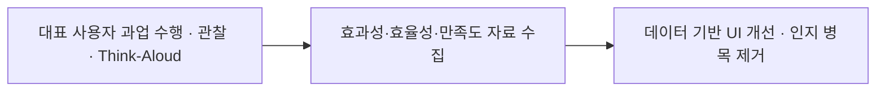
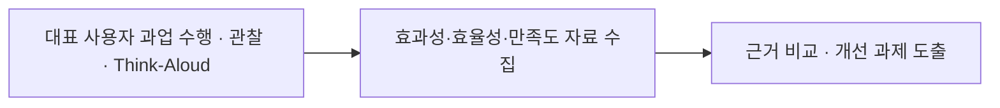
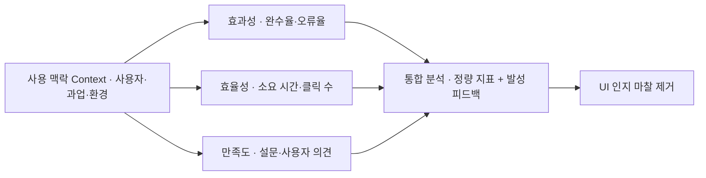

> **소프트웨어공학 > 요구분석 및 UI/UX > 사용성 평가 및 사용성 테스트(Usability Testing)**

---

## 1. 큰 그림 및 30초 인출 공식

- **본질**: **사용성 테스트(UT)**는 대표 사용자에게 과업 수행을 요청하고, 어려움과 오류를 관찰해 인터페이스 개선점을 찾는 평가 활동**
- **메커니즘**: 대표 과업 설정 ➔ 사용자의 수행과 오류 관찰 ➔ 효과성·효율성·만족도 자료 해석 ➔ 개선 과제 도출
- **산출물**: 과업 수행 기록 · 사용자 의견 · 사용성 개선 과제
---

## 2. 핵심 용어 정리

핵심 용어

- **사용성 테스트(Usability Testing, UT)**: 대표 사용자가 실제 제품이나 프로토타입으로 정해진 과업을 수행하게 하고 이를 관찰·기록하여 문제점을 찾는 기법
- **ISO 9241-11(Usability Definition Standard)**: 사용성을 효과성(Effectiveness), 효율성(Efficiency), 만족도(Satisfaction)의 3대 속성으로 정의한 국제표준
- **효과성(Effectiveness)**: 사용자가 명시된 목표 과업을 얼마나 정확하고 완전하게 달성했는지를 나타내는 척도(완수율, 오류율)
- **효율성(Efficiency)**: 목표를 달성하기 위해 투입된 자원(시간, 클릭 수, 인지적 노력) 대비 산출 성과를 나타내는 척도
- **만족도(Satisfaction)**: 시스템을 사용하는 과정 및 결과에 대해 사용자가 주관적으로 느끼는 편안함과 긍정적 수용 태도
- **발성 사고법(Think-Aloud Protocol)**: 사용자가 과업을 수행하면서 머릿속에 떠오르는 생각과 감정을 소리 내어 말하게 하여 무의식적 인지 과정을 파악하는 기법
- **닐슨 10대 휴리스틱(Nielsen's 10 Heuristics)**: UI/UX 전문가가 사용성 결함을 신속하게 사전 스크리닝하기 위해 준수해야 할 10가지 보편적 설계 원칙
- **SUS(System Usability Scale)**: 10개 문항으로 사용자의 주관적 사용성 평가를 수집하는 표준화 설문 도구; 점수는 비교 조건과 표본을 함께 해석
- **A/B 테스트(A/B Testing)**: 두 가지 이상의 인터페이스 시안을 실제 트래픽에 무작위 노출하여 정량적 전환율(CVR) 지표를 비교 검증하는 기법

---

## 1교시 예상문제 (10점)

> 사용성 평가 및 사용성 테스트(Usability Testing)의 정의와 목적, 핵심 메커니즘을 설명하시오. (예상)

---

## 1교시 10점 답안

### Ⅰ. 사용성 평가의 개요

| 구분 | 핵심 |
|---|---|
| 정의 | 특정 사용자가 특정 사용 맥락에서 목표를 효과적·효율적·만족스럽게 달성하는 정도를 평가하는 활동 |
| 목적 | 사용자의 과업 수행 장벽을 찾아 시스템을 개선하는 것 |

### Ⅱ. 평가 관점과 방법
- **3대 속성**: 효과성(과업 성공·오류), 효율성(시간·노력), 만족도(설문·사용자 의견)
- **주요 기법**: 전문가 휴리스틱(사전 스크리닝), 발성 사고법(Think-Aloud), 라이브 A/B 테스트
---

#### 핵심 관계

제언: 실제 사용 맥락을 반영한 목표 과업별 사용성 평가

---

## 2~4교시 예상문제 (25점)

> 사용성 평가 및 사용성 테스트(Usability Testing)의 개념과 목적을 설명하고, 핵심 메커니즘과 주요 구성요소, 적용 절차와 실무 대응 방안을 서술하시오. (25점, 예상)

---

## 2~4교시 25점 답안

### Ⅰ. 사용성 평가 및 사용성 테스트의 개요

| 구분 | 핵심 |
|---|---|
| 정의 | 특정 사용자가 특정 사용 맥락에서 목표를 효과적·효율적·만족스럽게 달성하는 정도를 평가하는 활동 |
| 목적 | 사용자의 과업 수행 장벽을 찾아 시스템을 개선하는 것 |

#### 1. 사용성 평가의 정의 및 필요성
- **필요성**:
  - **사용자 목표 달성 지원**: 복잡한 인터페이스의 사용 장벽과 개선 후보 식별.
  - **재작업 위험의 조기 발견**: 요구사항과 프로토타입 단계에서 대표 사용자 평가를 수행해 사용 장벽 조기 발견.
  - **근거 기반 의사결정**: 이해관계자 의견만으로 결론내리지 않고 과업 수행 자료와 사용자의 설명을 함께 검토.

---

### Ⅱ. ISO 9241-11 사용성 측정 체계 및 정량 지표

#### 1. 사용성 평가 3대 품질 속성 및 측정 프레임워크

#### 2. 핵심 측정 지표 상세
| 품질 속성 | 측정 지표 (Metrics) | 수집·해석 방법 |
|---|---|---|
| **효과성** | **과업 완료·오류** | 과업 성공 여부와 오류 유형·횟수를 사전에 정한 기준으로 기록 |
| **효율성** | **과업 소요 시간·노력** | 수행 시간과 사용자 행동을 과업·사용 맥락별 비교 |
| **만족도** | **SUS 등 자기보고 척도** | 설문 점수와 자유 응답을 표본·과업·비교 조건과 함께 해석 |
---

### Ⅲ. 사용성 평가 방법론 비교 (휴리스틱 vs 실험실 UT vs A/B 테스트)

| 비교 항목 | 휴리스틱 평가 (Heuristic) | 실험실 사용성 테스트 (UT) | A/B 테스트 (A/B Testing) |
|---|---|---|---|
| **평가 주체** | 사용성 원칙을 활용하는 평가자 | 실제 사용자 또는 대표 사용자 | 실서비스의 비교 조건에 배정된 사용자 |
| **수행 시점** | 기획, 와이어프레임 초기 단계 | 프로토타입, MVP 개발 단계 | 상용 서버 배포 후 운영 단계 |
| **핵심 기법** | 닐슨 10대 가이드라인 체크리스트 | **발성 사고법(Think-Aloud)**, 행동 관찰 | 무작위 트래픽 분할, 통계적 유의성 검정 |
| **수집 데이터**| 원칙별 사용성 문제와 근거 | 과업 성공·시간·오류 및 정성 피드백 | 사전 선정한 제품 목표 지표와 사용자 영향 |
| **비용 및 기간**| 평가자·화면 수에 따라 달라짐 | 과업·표본·진행 방식에 따라 달라짐 | 실험 설계·트래픽·통계 검정 요건에 따라 달라짐 |
---

### Ⅳ. 사용성 테스트 실무 적용 시 3대 위험 및 대응 전략

| 위험 | 대책 | 효과 |
|---|---|---|
| **주관적 취향 논쟁으로 인한 의사결정 파행** | 과업 성공·시간·오류와 사용자의 설명을 수집하고 개선 기준을 사전에 합의 | 개선안 비교의 근거 확보 |
| **대면 시험에서 관찰자 영향 가능성** | 관찰·원격·운영 자료 중 목적과 개인정보 통제에 맞는 방법을 선정하고 편향을 함께 해석 | 자료의 한계와 사용 맥락 명시 |
| **출시 직전 1회성 검사로 인한 재작업 비용 폭증** | 프로토타입 단계부터 대표 사용자의 과업 평가를 반복 수행 | 출시 전 중대 사용성 결함 조기 제거 |
---

### Ⅴ. 적용 제언

| 한계 | 해결 방안 |
|---|---|
| 평균 점수만으로 특정 사용자·과업의 사용 장벽을 놓칠 가능성 | 대표 사용 맥락별 과업 성공·시간·오류와 사용자 설명을 함께 분석 |

## 연결 토픽

- **선행 토픽**: 요구공학, HCI(Human Computer Interaction)
- **유사/비교 토픽**: 휴리스틱 평가(Heuristic), A/B 테스트, 고객 여정 지도(Customer Journey Map)
- **후속/연계 토픽**: 웹 접근성(KWCAG 2.2), 디자인 시스템, Lean UX, 제품 분석(Product Analytics)
