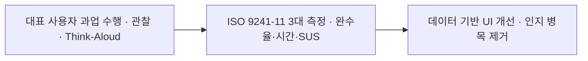
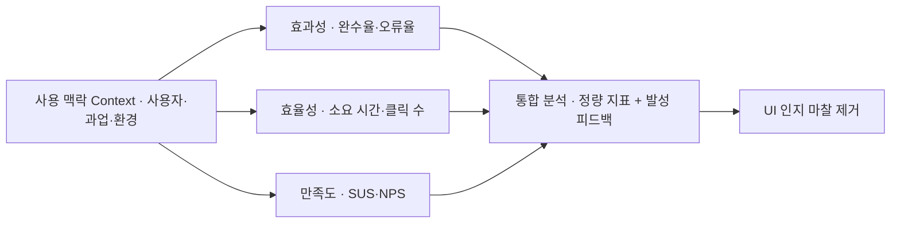

> **소프트웨어공학 > 요구분석 및 UI/UX > 사용성 평가 및 사용성 테스트(Usability Testing)**

---

## 1. 큰 그림 및 30초 인출 공식

- **본질**: **사용성 테스트(UT)**는 대표 사용자에게 과업 수행을 요청하고, 어려움과 오류를 관찰해 인터페이스 개선점을 찾는 평가 활동**
- **메커니즘**: 대표 과업 시나리오 부여 ➔ 사용자 발성 사고(Think-Aloud) 및 조작 행동 관찰 ➔ 효과성(완수율)·효율성(시간)·만족도(SUS) 정량 측정 ➔ 병목 UI 개선
- **산출물**: 과업 완수 소요시간/오류율 측정표 · SUS 설문 점수표 · UI 병목 구간 개선 백로그
---

## 2. 핵심 용어 정리

핵심 용어

- **사용성 테스트(Usability Testing, UT)**: 대표 사용자가 실제 제품이나 프로토타입으로 정해진 과업을 수행하게 하고 이를 관찰·기록하여 문제점을 찾는 기법
- **ISO 9241-11(Usability Definition Standard)**: 사용성을 효과성(Effectiveness), 효율성(Efficiency), 만족도(Satisfaction)의 3대 속성으로 정의한 국제표준
- **효과성(Effectiveness)**: 사용자가 명시된 목표 과업을 얼마나 정확하고 완전하게 달성했는지를 나타내는 척도(완수율, 오류율)
- **효율성(Efficiency)**: 목표를 달성하기 위해 투입된 자원(시간, 클릭 수, 인지적 노력) 대비 산출 성과를 나타내는 척도
- **만족도(Satisfaction)**: 시스템을 사용하는 과정 및 결과에 대해 사용자가 주관적으로 느끼는 편안함과 긍정적 수용 태도
- **발성 사고법(Think-Aloud Protocol)**: 사용자가 과업을 수행하면서 머릿속에 떠오르는 생각과 감정을 소리 내어 말하게 하여 무의식적 인지 과정을 파악하는 기법
- **닐슨 10대 휴리스틱(Nielsen's 10 Heuristics)**: UI/UX 전문가가 사용성 결함을 신속하게 사전 스크리닝하기 위해 준수해야 할 10가지 보편적 설계 원칙
- **SUS(System Usability Scale)**: 10개 문항의 리커트 척도 설문 조사를 통해 사용성을 0~100점 점수로 정량 환산하는 표준화 설문 도구
- **A/B 테스트(A/B Testing)**: 두 가지 이상의 인터페이스 시안을 실제 트래픽에 무작위 노출하여 정량적 전환율(CVR) 지표를 비교 검증하는 기법

---

## 1교시 예상문제 (10점)

> 사용성 평가 및 사용성 테스트(Usability Testing)의 정의와 목적, 핵심 메커니즘을 설명하시오. (예상)

---

## 1교시 10점 답안

### Ⅰ. 사용성 평가의 개요

| 구분 | 핵심 |
|---|---|
| 정의 | 특정 사용자가 특정 사용 맥락에서 목표를 효과적·효율적·만족스럽게 달성하는 정도를 평가하는 활동 |
| 목적 | 사용자의 과업 수행 장벽을 찾아 시스템을 개선하는 것 |

### Ⅱ. 평가 관점과 방법
- **3대 속성**: 효과성 (과업 성공률, 오류율), 효율성 (완수 시간, 클릭 수), 만족도 (SUS 점수, 편의성)
- **주요 기법**: 전문가 휴리스틱(사전 스크리닝), 발성 사고법(Think-Aloud), 라이브 A/B 테스트
---

#### 핵심 관계

제언: 실제 사용 맥락을 반영한 목표 과업별 사용성 평가

---

## 2~4교시 예상문제 (25점)

> 사용성 평가 및 사용성 테스트(Usability Testing)의 개념과 목적을 설명하고, 핵심 메커니즘과 주요 구성요소, 적용 절차와 실무 대응 방안을 서술하시오. (25점, 예상)

---

## 2~4교시 25점 답안

### Ⅰ. 사용성 평가 및 사용성 테스트의 개요

| 구분 | 핵심 |
|---|---|
| 정의 | 특정 사용자가 특정 사용 맥락에서 목표를 효과적·효율적·만족스럽게 달성하는 정도를 평가하는 활동 |
| 목적 | 사용자의 과업 수행 장벽을 찾아 시스템을 개선하는 것 |

#### 1. 사용성 평가의 정의 및 필요성
- **필요성**:
  - **사용자 이탈 방지 및 전환율(CVR) 제고**: 복잡한 인터페이스로 인한 인지적 마찰(Friction) 제거.
  - **재작업 비용의 조기 차단**: 요구사항과 프로토타입 단계에서 대표 사용자 평가를 수행해 사용 장벽 조기 발견.
  - **데이터 주도 의사결정**: 이해관계자 간의 주관적 취향 다툼을 배제하고 완수 시간과 SUS 실측 데이터로 UI 개편.

---

### Ⅱ. ISO 9241-11 사용성 측정 체계 및 정량 지표

#### 1. 사용성 평가 3대 품질 속성 및 측정 프레임워크

#### 2. 핵심 측정 지표 상세
| 품질 속성 | 측정 지표 (Metrics) | 계산 방식 및 측정 메커니즘 | 목표 기준치 예시 |
|---|---|---|---|
| **효과성** | **과업 완료율** (Completion Rate) | (성공 완료 사용자 수 / 전체 참가자 수) $\times$ 100 | 핵심 과업 높은 완수율 확보 |
| | **오류 발생률** (Error Rate) | 과업 수행 중 발생한 오동작, 클릭 미스, 재시도 횟수 | 과업당 오류 최소화 |
| **효율성** | **과업 소요 시간** (Time on Task) | 과업 시작부터 완료까지 실측된 초(sec) 단위 시간 | 기존 버전 대비 단축 |
| | **상대적 효율성** (Relative Efficiency) | 최적 이상적 경로 클릭 수 / 실제 사용자의 클릭 수 | 최적 경로와 근접 유지 |
| **만족도** | **SUS 척도 점수** (System Usability Scale) | 10개 문항의 5점 척도 설문 값을 0~100점으로 환산 | 68점 이상 (평균 대비 우수) |
| | **NPS 점수** (Net Promoter Score) | 추천 의향 10점 척도 (추천자 비율 - 비추천자 비율) | 양수(+) 이상 유지 |
---

### Ⅲ. 사용성 평가 방법론 비교 (휴리스틱 vs 실험실 UT vs A/B 테스트)

| 비교 항목 | 휴리스틱 평가 (Heuristic) | 실험실 사용성 테스트 (UT) | A/B 테스트 (A/B Testing) |
|---|---|---|---|
| **평가 주체** | **UI/UX 전문가 (3~5명)** | **실제 사용자 (목적에 맞는 표본 규모)** | **실서비스 접속 전 사용자 (대규모)** |
| **수행 시점** | 기획, 와이어프레임 초기 단계 | 프로토타입, MVP 개발 단계 | 상용 서버 배포 후 운영 단계 |
| **핵심 기법** | 닐슨 10대 가이드라인 체크리스트 | **발성 사고법(Think-Aloud)**, 행동 관찰 | 무작위 트래픽 분할, 통계적 유의성 검정 |
| **수집 데이터**| 전문가 관점의 잠재 결함 목록 | 과업 성공률, 완수 시간, 정성 피드백 | 클릭률(CTR), 전환율(CVR), 이탈률 |
| **비용 및 기간**| **매우 저렴, 1~2일 내 신속 완료** | 피험자 섭외 비용, 1~2주 소요 | 대규모 트래픽 확보 및 인프라 필요 |
---

### Ⅳ. 사용성 테스트 실무 적용 시 3대 위험 및 대응 전략

| 위험 | 대책 | 효과 |
|---|---|---|
| **주관적 취향 논쟁으로 인한 의사결정 파행** | ISO 9241-11 기반 정량 지표(완수율, 시간, SUS) 측정 프레임워크 의무화 | 개선안 우선순위 합의 기간 단축 |
| **대면 실험실 환경의 관찰자 의식 왜곡(호손 효과)** | 비동기 원격 UT 도구(Maze 등) 및 실제 프로덕션 히트맵 데이터 교차 분석 | 자연스러운 실사용 조작 행동 데이터 확보 |
| **출시 직전 1회성 검사로 인한 재작업 비용 폭증** | 프로토타입 단계부터 대표 사용자의 과업 평가를 반복 수행 | 출시 전 중대 사용성 결함 조기 제거 |
---

### Ⅴ. 적용 제언

| 문제 | 해결 방안 |
|---|---|
| 평균 점수만으로 특정 사용자·과업의 사용 장벽을 놓칠 가능성 | 대표 사용 맥락별 과업 성공·시간·오류와 사용자 설명을 함께 분석 |

## 연결 토픽

- **선행 토픽**: 요구공학, HCI(Human Computer Interaction)
- **유사/비교 토픽**: 휴리스틱 평가(Heuristic), A/B 테스트, 고객 여정 지도(Customer Journey Map)
- **후속/연계 토픽**: 웹 접근성(KWCAG 2.2), 디자인 시스템, Lean UX, 제품 분석(Product Analytics)
