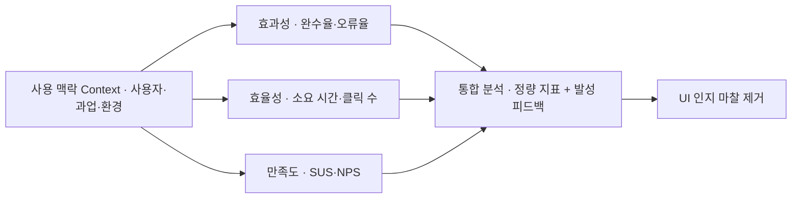

> **소프트웨어공학 > 요구분석 및 UI/UX > 사용성 평가 및 사용성 테스트(Usability Testing)**
---

## 1. 큰 그림 및 30초 인출 공식

- **본질**: **사용성 테스트(UT)**는 "내 눈엔 직관적인데 사용자는 왜 못 찾지?"라는 개발자·기획자의 주관적 착각을 깨기 위해, **실제 사용자 5명을 데려다 과업을 시켜보고 어디서 헤매고 이탈하는지를 객관적으로 관찰·측정하는 UX 검증 활동**
- **메커니즘**: 대표 과업 시나리오 부여 ➔ 사용자 발성 사고(Think-Aloud) 및 조작 행동 관찰 ➔ 효과성(완수율)·효율성(시간)·만족도(SUS) 정량 측정 ➔ 병목 UI 개선
- **산출물**: 과업 완수 소요시간/오류율 측정표 · SUS 설문 점수표 · UI 병목 구간 개선 백로그
---

## 2. 핵심 용어 정리

핵심 용어

- **사용성 테스트(Usability Testing, UT)**: 대표 사용자가 실제 제품이나 프로토타입으로 정해진 과업을 수행하게 하고 이를 관찰·기록하여 문제점을 찾는 기법
- **ISO 9241-11(Usability Definition Standard)**: 사용성을 효과성(Effectiveness), 효율성(Efficiency), 만족도(Satisfaction)의 3대 속성으로 정의한 국제표준
- **효과성(Effectiveness)**: 사용자가 명시된 목표 과업을 얼마나 정확하고 완전하게 달성했는지를 나타내는 척도(완수율, 오류율)
- **효율성(Efficiency)**: 목표를 달성하기 위해 투입된 자원(시간, 클릭 수, 인지적 노력) 대비 산출 성과를 나타내는 척도
- **만족도(Satisfaction)**: 시스템을 사용하는 과정 및 결과에 대해 사용자가 주관적으로 느끼는 편안함과 긍정적 수용 태도
- **발성 사고법(Think-Aloud Protocol)**: 사용자가 과업을 수행하면서 머릿속에 떠오르는 생각과 감정을 소리 내어 말하게 하여 무의식적 인지 과정을 파악하는 기법
- **닐슨 10대 휴리스틱(Nielsen's 10 Heuristics)**: UI/UX 전문가가 사용성 결함을 신속하게 사전 스크리닝하기 위해 준수해야 할 10가지 보편적 설계 원칙
- **SUS(System Usability Scale)**: 10개 문항의 리커트 척도 설문 조사를 통해 사용성을 0~100점 점수로 정량 환산하는 표준화 설문 도구
- **A/B 테스트(A/B Testing)**: 두 가지 이상의 인터페이스 시안을 실제 트래픽에 무작위 노출하여 정량적 전환율(CVR) 지표를 비교 검증하는 기법
- **닐슨 5명 법칙(Nielsen's Rule of 5)**: 단 5명의 대표 사용자만으로 전체 사용성 문제의 약 85%를 조기에 발견할 수 있다는 비용효율성 경험 법칙

---

## 1교시 예상문제 (10점)

> 사용성 평가 및 사용성 테스트(Usability Testing)의 정의와 목적, 핵심 메커니즘을 설명하시오. (예상)
---

## 1교시 10점 답안

- **정의**: 특정 맥락에서 목표 과업의 효과성, 효율성, 만족도를 측정·개선하는 활동 (ISO 9241-11)
- **3대 속성**: 효과성 (과업 성공률, 오류율), 효율성 (완수 시간, 클릭 수), 만족도 (SUS 점수, 편의성)
- **닐슨 5명 법칙**: 5명의 테스트만으로 사용성 결함의 약 85%를 조기 발견 가능
- **주요 기법**: 전문가 휴리스틱(사전 스크리닝), 발성 사고법(Think-Aloud), 라이브 A/B 테스트
---

### 핵심 관계

---

## 2~4교시 예상문제 (25점)

> 사용성 평가 및 사용성 테스트(Usability Testing)의 개념과 목적을 설명하고, 핵심 메커니즘과 주요 구성요소, 적용 절차와 실무 대응 방안을 서술하시오. (25점, 예상)
---

## 2~4교시 25점 답안

### Ⅰ. 사용성 평가 및 사용성 테스트의 개요

#### 1. 사용성 평가의 정의 및 필요성
- **정의**: 특정 사용자가 특정 사용 환경에서 시스템을 이용하여 정해진 목표를 얼마나 효과적, 효율적, 만족스럽게 달성할 수 있는지를 과학적으로 측정·개선하는 공학적 평가 체계(ISO 9241-11).
- **필요성**:
  - **사용자 이탈 방지 및 전환율(CVR) 제고**: 복잡한 인터페이스로 인한 인지적 마찰(Friction) 제거.
  - **재작업 비용의 조기 차단**: 요구사항 및 프로토타입 단계에서 5명 피험자 테스트로 결함의 85% 사전 식별.
  - **데이터 주도 의사결정**: 이해관계자 간의 주관적 취향 다툼을 배제하고 완수 시간과 SUS 실측 데이터로 UI 개편.

---

### Ⅱ. ISO 9241-11 사용성 측정 체계 및 정량 지표

#### 1. 사용성 평가 3대 품질 속성 및 측정 프레임워크

#### 2. 핵심 측정 지표 상세
| 품질 속성 | 측정 지표 (Metrics) | 계산 방식 및 측정 메커니즘 | 목표 기준치 예시 |
|---|---|---|---|
| **효과성** | **과업 완료율** (Completion Rate) | (성공 완료 사용자 수 / 전체 참가자 수) $\times$ 100 | 핵심 과업 높은 완수율 확보 |
| | **오류 발생률** (Error Rate) | 과업 수행 중 발생한 오동작, 클릭 미스, 재시도 횟수 | 과업당 오류 최소화 |
| **효율성** | **과업 소요 시간** (Time on Task) | 과업 시작부터 완료까지 실측된 초(sec) 단위 시간 | 기존 버전 대비 단축 |
| | **상대적 효율성** (Relative Efficiency) | 최적 이상적 경로 클릭 수 / 실제 사용자의 클릭 수 | 최적 경로와 근접 유지 |
| **만족도** | **SUS 척도 점수** (System Usability Scale) | 10개 문항의 5점 척도 설문 값을 0~100점으로 환산 | 68점 이상 (평균 대비 우수) |
| | **NPS 점수** (Net Promoter Score) | 추천 의향 10점 척도 (추천자 비율 - 비추천자 비율) | 양수(+) 이상 유지 |
---

### Ⅲ. 사용성 평가 방법론 비교 (휴리스틱 vs 실험실 UT vs A/B 테스트)

| 비교 항목 | 휴리스틱 평가 (Heuristic) | 실험실 사용성 테스트 (UT) | A/B 테스트 (A/B Testing) |
|---|---|---|---|
| **평가 주체** | **UI/UX 전문가 (3~5명)** | **실제 엔드 유저 (5명 내외)** | **실서비스 접속 전 사용자 (대규모)** |
| **수행 시점** | 기획, 와이어프레임 초기 단계 | 프로토타입, MVP 개발 단계 | 상용 서버 배포 후 운영 단계 |
| **핵심 기법** | 닐슨 10대 가이드라인 체크리스트 | **발성 사고법(Think-Aloud)**, 행동 관찰 | 무작위 트래픽 분할, 통계적 유의성 검정 |
| **수집 데이터**| 전문가 관점의 잠재 결함 목록 | 과업 성공률, 완수 시간, 정성 피드백 | 클릭률(CTR), 전환율(CVR), 이탈률 |
| **비용 및 기간**| **매우 저렴, 1~2일 내 신속 완료** | 피험자 섭외 비용, 1~2주 소요 | 대규모 트래픽 확보 및 인프라 필요 |
---

### Ⅳ. 사용성 테스트 실무 적용 시 3대 위험 및 대응 전략

| 위험 | 대책 | 효과 |
|---|---|---|
| **주관적 취향 논쟁으로 인한 의사결정 파행** | ISO 9241-11 기반 정량 지표(완수율, 시간, SUS) 측정 프레임워크 의무화 | 개선안 우선순위 합의 기간 단축 |
| **대면 실험실 환경의 관찰자 의식 왜곡(호손 효과)** | 비동기 원격 UT 도구(Maze 등) 및 실제 프로덕션 히트맵 데이터 교차 분석 | 자연스러운 실사용 조작 행동 데이터 확보 |
| **출시 직전 1회성 검사로 인한 재작업 비용 폭증** | Figma 프로토타입 기반 스프린트별 5명 마이크로 UT 정례화 | 출시 전 중대 사용성 결함 조기 제거 |
---

### Ⅴ. 결론: Lean UX와 데이터 주도 지속적 사용성 엔지니어링

### 학습자 통찰 메모 — 답안 밖

- `[핵심 통찰]`: 소프트웨어 엔지니어링에서 기능적 버그는 단위 테스트와 정적 분석으로 통제할 수 있지만, "사용자가 화면을 보고 무엇을 눌러야 할지 몰라 이탈하는 사용성 결함"은 오직 사람을 통해서만 발견된다. 과거의 사용성 평가는 거대 실험실과 수개월의 리서치를 요구하는 무거운 관료주의로 전락했으나, 현대의 사용성 공학은 "Figma 프로토타입 5명 마이크로 UT ➔ 출시 후 A/B 테스트 ➔ 프로덕트 분석"으로 이어지는 Lean UX 루프를 탄다. 답안에서는 ISO 9241-11의 3대 정량 척도를 정확히 명시하고, HiPPO(최고 직급자의 주관적 취향)를 배제하는 데이터 주도 의사결정 체계를 결론에서 제언해야 한다.
- `나라면`: 1단락에서 ISO 9241-11 기반 사용성 정의와 인지 마찰 제거 필요성을 제시하고, 2단락에서 3대 속성과 측정 지표 상세, 휴리스틱 vs UT vs A/B 테스트 비교표를 제시한 뒤, 3단락에서 닐슨 5명 법칙 기반의 Lean UX 파이프라인과 프로덕션 A/B 테스트 연계 거버넌스를 제언하겠다.

### 실전 답안용 기술사적 제언

- **판정 기준**: 신규 기능 릴리스 전, 대표 과업 성공률 또는 SUS 점수가 사내 출시 게이트 기준에 미달하면 프로덕션 배포를 중단하고 인터페이스 재설계를 결정해야 함.
- **대응 방안**: 스프린트마다 거대한 테스트베드를 꾸리는 대신, **Figma 프로토타입 단계에서 5명의 대표 사용자를 대상으로 짧은 단위의 마이크로 발성사고(Think-Aloud) UT**를 일상화해야 함.
- **검증 체계**: 배포 이후에는 무작위 트래픽 분할 기반의 **A/B 테스트와 히트맵/세션 리플레이 분석 도구**를 파이프라인에 연동하여 통계적 유의성을 지속 검증해야 함.
- **기대 효과**: UI 개편에 따른 개발 재작업 비용을 절감하고, 사용자 이탈률을 개선하여 서비스 전환율(CVR) 극대화를 달성함.
---

## 5. 기출 분석 및 출제 경향

| 회차 및 교시 | 문제 유형 | 핵심 출제 포인트 |
|---|---|---|
| **제114회 1교시** | 단답형 | 사용성 평가의 3대 속성(효과성, 효율성, 만족도) 및 측정 지표 |
| **제121회 4교시** | 서술형 | 소프트웨어 사용성 테스트(Usability Testing)의 절차 및 휴리스틱 평가와의 비교 분석 |
| **제126회 1교시** | 단답형 | 닐슨의 10대 휴리스틱 원칙과 사용성 테스트에서의 역할 |
| **제132회 2교시** | 서술형 | 애자일 개발 환경에서 Lean UX 및 지속적 사용성 엔지니어링 실천 방안 |
---

## 6. 실전 시험 팁

- **ISO 9241-11 3대 지표 수식 도해**: 답안 2단락에 효과성(성공률), 효율성(완수시간), 만족도(SUS)를 3열 매트릭스로 깔끔하게 도식화할 것.
- **Think-Aloud 키워드 명시**: 사용자 테스트의 핵심 정성 관찰 기법인 '발성 사고법(사용자가 속마음을 말하며 조작)'을 반드시 언급해야 전문성이 부각됨.
- **닐슨 5명 법칙 공식 기재**: $1 - (1-L)^n$ (여기서 $L$은 한 명의 사용자가 발견하는 문제 비율 약 31%) 공식을 가볍게 병기하면 이론적 깊이를 입증할 수 있음.
---

## 7. 연관 토픽 맵

- **선행 토픽**: 요구공학, HCI(Human Computer Interaction)
- **유사/비교 토픽**: 휴리스틱 평가(Heuristic), A/B 테스트, 고객 여정 지도(Customer Journey Map)
- **후속/연계 토픽**: 웹 접근성(KWCAG 2.2), 디자인 시스템, Lean UX, 제품 분석(Product Analytics)
