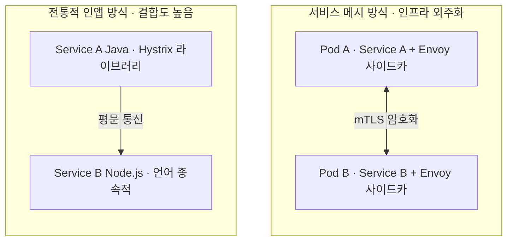
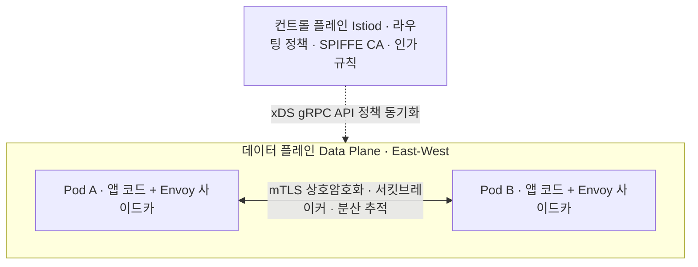

> **소프트웨어공학 > 분산 시스템 및 아키텍처 > 마이크로서비스 및 통신 > 서비스 메시(Service Mesh)**

---

## 1. 큰 그림 및 30초 인출 공식

- **본질**: 마이크로서비스 아키텍처(MSA)에서 서비스 간 내부 통신(East-West)의 보안(mTLS)·라우팅·서킷브레이커·관측성을 **비즈니스 코드 수정 없이 파드 옆 프록시(사이드카) 인프라가 대행하도록 분리한 전용 통신망 계층**
- **메커니즘**: 컨트롤 플레인(Istiod)에서 xDS 정책 주입 ➔ 데이터 플레인(Envoy)이 iptables로 인/아웃바운드 패킷 가로채기 ➔ 서비스 간 mTLS 상호 인증 암호화 및 분산 추적
- **산출물**: Istio 트래픽 라우팅 명세서(VirtualService/DestinationRule) · SPIFFE ID 기반 mTLS 인증서 · Kiali 트래픽 토폴로지 대시보드
---

## 2. 핵심 용어 정리

핵심 용어

- **서비스 메시(Service Mesh)**: 마이크로서비스 간의 통신(East-West)을 안전하고 신뢰성 있게 관리하는 인프라 소프트웨어 계층
- **사이드카 패턴(Sidecar Pattern)**: 애플리케이션 컨테이너 변경 없이 동일 파드(Pod) 내에 별도 프록시 컨테이너를 배치하여 통신을 위임하는 구조
- **데이터 플레인(Data Plane)**: 실제 서비스 간 네트워크 패킷을 가로채고, 라우팅, mTLS 암호화, 메트릭 수집을 수행하는 고성능 프록시 영역(Envoy)
- **컨트롤 플레인(Control Plane)**: 라우팅 규칙, 보안 정책, 인증서 발급 설정을 중앙에서 관리하고 데이터 플레인에 주입하는 제어 영역(Istiod)
- **Envoy Proxy**: C++ 기반 고성능 L4/L7 프록시로, 서비스 메시의 데이터 플레인 표준 엔진
- **xDS 프로토콜(Discovery Service)**: 컨트롤 플레인이 Envoy 프록시에 엔드포인트(EDS), 클러스터(CDS), 라우팅(RDS)을 실시간 주입하는 gRPC API
- **mTLS(Mutual TLS)**: 클라이언트와 서버가 서로의 인증서를 양방향 검증하고 통신 패킷을 암호화하는 제로 트러스트 보안 프로토콜
- **SPIFFE / SPIRE(Secure Production Identity)**: 동적 컨테이너 환경에서 각 서비스에 고유한 소프트웨어 신원(Identity)을 발급·검증하는 표준 규격
- **앰비언트 메시(Ambient Mesh)**: 파드마다 사이드카를 띄우지 않고 노드 레벨 공유 프록시(ztunnel)로 분리해 메모리 오버헤드를 줄인 차세대 메시
- **eBPF(Extended Berkeley Packet Filter)**: 리눅스 커널 공간에서 샌드박스 프로그램을 실행하여 iptables 오버헤드 없이 소켓 레벨 고속 패킷 바이패스를 구현하는 기술

---

## 1교시 예상문제 (10점)

> 서비스 메시(Service Mesh)의 정의와 목적, 핵심 메커니즘을 설명하시오. (예상)

---

## 1교시 10점 답안

- **정의**: MSA 환경에서 비즈니스 코드 수정 없이 서비스 간 통신(East-West)의 보안·라우팅·관측성을 전담하는 인프라 계층
- **2대 플레인**: 컨트롤 플레인(Istiod - xDS 정책 배포), 데이터 플레인(Envoy - 사이드카 패킷 포워딩)
- **핵심 기능**: mTLS 상호 인증(제로 트러스트), 트래픽 카나리 배포, 서킷브레이커, 분산 추적(W3C TraceContext)
- **차세대 진화**: 사이드카 메모리 한계를 극복한 Istio Ambient Mesh(ztunnel) 및 Cilium eBPF 커널 바이패스
---

### 핵심 관계

---

## 2~4교시 예상문제 (25점)

> 서비스 메시(Service Mesh)의 개념과 목적을 설명하고, 핵심 메커니즘과 주요 구성요소, 적용 절차와 실무 대응 방안을 서술하시오. (25점, 예상)

---

## 2~4교시 25점 답안

### Ⅰ. 서비스 메시의 개요 및 등장 배경

#### 1. 서비스 메시의 정의 및 등장 배경
- **정의**: MSA 환경에서 다국어(Polyglot) 마이크로서비스 간의 내부 통신(East-West)을 안전하고 신뢰성 있게 제어하기 위해, 비즈니스 로직과 분리되어 인프라 수준에서 트래픽 관리, 보안(mTLS), 관측성을 제공하는 전용 인프라 계층.
- **등장 배경**:
  - **인앱 라이브러리(Spring Cloud 등)의 한계**: 서비스마다 타임아웃, 서킷브레이커, 인증 코드를 중복 삽입해야 하며, Java 외 타 언어(Node, Go, Python) 지원 불가.
  - **내부망 제로 트러스트 보안 요구**: 사설망 내부라 할지라도 평문(HTTP) 통신을 전면 금지하고 상호 인증(mTLS)을 강제해야 하는 보안 규제 준수.

---

### Ⅱ. 서비스 메시 2대 플레인 아키텍처 및 핵심 메커니즘

#### 1. Istio 기반 서비스 메시 아키텍처 구조도

#### 2. 2대 플레인 핵심 역할 및 기술 매핑
| 플레인 구분 | 핵심 컴포넌트 | 주요 역할 및 동작 메커니즘 | 핵심 프로토콜/기술 |
|---|---|---|---|
| **컨트롤 플레인 (Control Plane)** | **Istiod** (Pilot, Citadel 통합) | 트래픽 라우팅 규칙 생성 및 배포, SPIFFE ID 발급, TLS 인증서 수명주기 관리 | xDS gRPC API, k8s CRD |
| **데이터 플레인 (Data Plane)** | **Envoy Proxy** (Pod 내 사이드카) | iptables로 패킷 자동 가로채기, mTLS 핸드셰이크, 로드밸런싱, 서킷브레이커, 메트릭 전송 | C++ 엔진, L4/L7 프록시 |
---

### Ⅲ. 서비스 메시 vs API Gateway vs 인앱 라이브러리 심층 비교

| 비교 항목 | 서비스 메시 (Service Mesh) | API Gateway | 인앱 라이브러리 (Spring Cloud) |
|---|---|---|---|
| **주요 트래픽 방향**| **East-West (내부 서비스 간 통신)** | **North-South (외부 클라이언트 유입)**| East-West (내부 서비스 간 통신) |
| **배치 아키텍처** | 각 파드(Pod) 내부 사이드카 프록시 | 시스템 최외곽 경계선(DMZ) | 각 서비스 애플리케이션 코드 내부 임베딩 |
| **언어 독립성** | **완전 독립 (Polyglot 지원)** | 완전 독립 (HTTP/gRPC/REST) | **종속적 (Java/JVM 생태계 국한)** |
| **핵심 담당 기능** | **mTLS 상호암호화, 서비스 간 서킷브레이크** | **인증/인가, API 과금, 유량제어(Rate Limit)**| 클라이언트 로드밸런싱, 장애 격리 |
| **리소스 오버헤드**| 파드마다 프록시 실행 (메모리 소모 큼) | 중앙 집중식 운영 (자원 효율적) | 별도 프로세스 없음 (가장 가벼움) |
---

### Ⅳ. 서비스 메시 실무 적용 시 3대 위험 및 대응 전략

| 위험 | 대책 | 효과 |
|---|---|---|
| **사이드카 수천 개 기동으로 워커 노드 메모리 고갈 (OOMKilled)** | 사이드카리스(Sidecar-less) 아키텍처인 Istio Ambient Mesh 도입 (노드당 공유 ztunnel) | 프록시 메모리 점유율 대폭 절감 및 노드 집약도 개선 |
| **내부망 침해 시 평문 패킷 스니핑으로 민감 데이터 유출** | STRICT 모드 mTLS 강제 적용 및 SPIFFE 기반 서비스 단위 인가 정책(AuthorizationPolicy) 구성 | 서비스 간 통신 도청 및 위변조 리스크 차단 |
| **사이드카 경유 및 iptables 중복 복사로 인한 통신 지연 폭증** | eBPF(Cilium) 기반 소켓 레벨 커널 바이패스 적용 및 불필요 L7 검사 L4 다운그레이드 | 네트워크 홉 지연(Latency) 단축 및 처리량 극대화 |
---

### Ⅴ. 결론: 사이드카리스(Ambient Mesh)와 eBPF 기반 차세대 진화

### 학습자 통찰 메모 — 답안 밖

- `[핵심 통찰]`: 서비스 메시는 마이크로서비스 내부 통신(East-West)의 보안과 관측성을 비즈니스 코드에서 떼어내 인프라로 외주화한 기술이다. 그러나 파드마다 Envoy 프록시를 1:1로 띄우는 사이드카 방식은 파드가 수천 개로 늘어날 때 극심한 메모리 낭비와 iptables 패킷 홉 지연을 야기한다. 이에 따라 현대 클라우드 네이티브 아키텍처는 "노드 단위로 L4 mTLS를 전담하는 ztunnel과 선별적 L7 Waypoint 프록시로 분리하는 Istio Ambient Mesh"와 "리눅스 커널 공간에서 패킷을 직접 고속 라우팅하는 Cilium eBPF"의 결합으로 재편되고 있다. 답안에서는 1세대 인앱 ➔ 2세대 사이드카 ➔ 3세대 앰비언트/eBPF의 진화 계보를 명확히 짚어주어야 한다.
- `나라면`: 1단락에서 North-South(API Gateway) vs East-West(Service Mesh)의 역할 분담과 인앱 라이브러리 한계 극복 배경을 제시하고, 2단락에서 컨트롤 플레인(Istiod, xDS)과 데이터 플레인(Envoy)의 2대 플레인 구조 및 사이드카 mTLS 패킷 흐름을 도식화한 뒤, 3단락에서 차세대 Ambient Mesh(사이드카리스)와 eBPF 커널 바이패스 아키텍처를 제언하겠다.

### 실전 답안용 기술사적 제언

- **판정 기준**: 클러스터 내 파드 수가 대규모로 확장되어 사이드카 프록시의 메모리 점유가 노드 자원을 압박하는 경우, 전통적 사이드카 구조에서 앰비언트 메시로의 전환을 판정해야 함.
- **대응 방안**: 전송 레벨(L4 mTLS, 접근 제어)은 노드당 1대 가동되는 경량 **ztunnel**에 위임하고, 정밀 L7 트래픽 제어(카나리 배포, 장애 주입)가 요구되는 핵심 서비스에만 **Waypoint 프록시**를 선택적으로 배치해야 함.
- **검증 체계**: Kiali 토폴로지 대시보드와 Jaeger 분산 추적 시스템을 연동하여 서비스 간 홉 지연(Latency p99)과 mTLS STRICT 암호화 적용률을 실시간 감시해야 함.
- **기대 효과**: 사이드카 인프라 메모리 소모량을 절감하고, 네트워크 홉 지연을 단축하면서도 제로 트러스트(Zero Trust) 내부망 보안을 달성함.
---

## 5. 기출 분석 및 출제 경향

| 회차 및 교시 | 문제 유형 | 핵심 출제 포인트 |
|---|---|---|
| **제121회 1교시** | 단답형 | 사이드카(Sidecar) 패턴의 개념 및 서비스 메시에서의 역할 |
| **제127회 1교시** | 단답형 | 서비스 메시(Service Mesh)의 정의, 필요성 및 데이터/컨트롤 플레인 구조 |
| **제130회 3교시** | 서술형 | API Gateway와 서비스 메시의 기능 및 트래픽 방향(North-South vs East-West) 비교 분석 |
| **제134회 2교시** | 서술형 | 대규모 클라우드 네이티브 환경에서 사이드카 오버헤드 극복을 위한 Ambient Mesh 및 eBPF 아키텍처 |
---

## 6. 실전 시험 팁

- **North-South vs East-West 대조 도해**: 답안 도입부나 비교표에 외부 유입 트래픽(North-South)은 API Gateway가, 내부 서비스 간 트래픽(East-West)은 Service Mesh가 담당함을 도식화하면 만점 획득.
- **xDS 프로토콜 키워드 명시**: 컨트롤 플레인과 데이터 플레인 간 통신 규격인 Envoy xDS(LDS, RDS, CDS, EDS)를 언급하면 아키텍처 이해도의 깊이가 돋보임.
- **Ambient Mesh와 eBPF 결론 제시**: 최신 기술사인 만큼 전통 사이드카의 메모리 한계를 지적하고 3세대 앰비언트 메시와 eBPF로 나아가는 방향성을 제시할 것.
---

## 7. 연관 토픽 맵

- **선행 토픽**: 마이크로서비스 아키텍처(MSA), 컨테이너 가상화, 쿠버네티스(K8s)
- **유사/비교 토픽**: API Gateway, Spring Cloud(Netflix OSS), Service Mesh vs Message Broker
- **후속/연계 토픽**: 제로 트러스트(Zero Trust), eBPF(Cilium), 오픈텔레메트리(OpenTelemetry), 분산 추적
