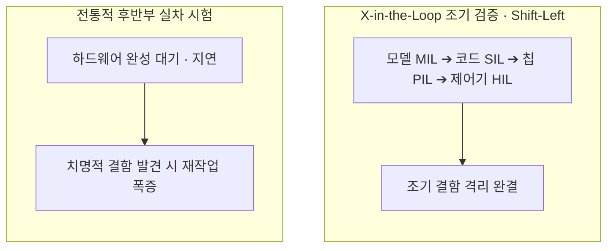
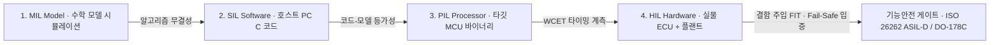

> **소프트웨어공학 > 임베디드 및 실시간 시스템 > 임베디드 소프트웨어 테스트 및 X-in-the-Loop**
---

## 1. 큰 그림 및 30초 인출 공식

- **본질**: **X-in-the-Loop**는 고가의 물리 장비 제작이나 위험한 실차 시험 전에, **모델(MIL) ➔ 소스코드(SIL) ➔ 타깃 칩(PIL) ➔ 실물 제어기(HIL)로 단계를 밟아가며 가상화 환경에서 실시간 제어 로직과 안전성을 조기에 입증하는 검증 체계**
- **메커니즘**: 수학 모델 검증 ➔ 자동 코드 생성 ➔ 타깃 프로세서 교차 검증 ➔ 실시간 가상 플랜트 연계 결함 주입 시험(FIT) ➔ 최악 실행 시간(WCET) 및 기능안전 달성
- **산출물**: X-in-the-Loop 단계별 테스트 결과서 · MC/DC 커버리지 보고서 · 결함 주입 시험(FIT) 증적서
---

## 2. 핵심 용어 정리

핵심 용어

- **X-in-the-Loop (XiL)**: 모델부터 실물 하드웨어까지 단계별로 대상을 가상화 루프에 결합하여 임베디드 SW를 검증하는 체계
- **MIL(Model-in-the-Loop)**: 제어 알고리즘의 수학적 모델(Simulink 등)을 시뮬레이션 환경에서 검증하는 초기 단계
- **SIL(Software-in-the-Loop)**: 모델로부터 자동 생성된 C/C++ 소스코드를 호스트 PC(x86) 환경에서 컴파일하여 기능 로직을 검증하는 단계
- **PIL(Processor-in-the-Loop)**: 실제 타깃 마이크로컨트롤러(MCU/DSP) 또는 시뮬레이터 상에서 크로스 컴파일된 바이너리를 구동하여 검증하는 단계
- **HIL(Hardware-in-the-Loop)**: 실제 완성된 제어기(ECU)와 실시간 물리 플랜트 시뮬레이터를 전기 신호로 연결하여 시스템 레벨을 검증하는 단계
- **FIT(Fault Injection Testing)**: 단선, 단락, CAN 버스 에러 등 극한의 위험 상황을 인위적으로 주입하여 제어기의 페일세이프(Fail-Safe)를 검증하는 기법
- **WCET(Worst-Case Execution Time)**: 특정 태스크가 최악의 시스템 부하 상황에서 소요할 수 있는 최대 실행 시간으로, 실시간 데드라인 준수의 핵심 지표
- **MC/DC(Modified Condition/Decision Coverage)**: 복합 조건문에서 각 개별 조건이 다른 조건에 독립적으로 전체 결정에 영향을 미침을 입증하는 최고 수준의 커버리지
- **MISRA-C Guidelines**: 임베디드 안전 필수 소프트웨어에서 런타임 오류와 미정의 동작을 방지하기 위해 규정한 C 언어 안전 코딩 표준
- **vECU(Virtual ECU)**: 클라우드 환경에서 물리 하드웨어 없이 대규모 병렬 테스트를 수행하기 위해 ECU 펌웨어를 가상화 컨테이너로 추상화한 기술

---

## 1교시 예상문제 (10점)

> 임베디드 소프트웨어 테스트 및 X-in-the-Loop(MIL·SIL·PIL·HIL)의 정의와 목적, 핵심 메커니즘을 설명하시오. (예상)
---

## 1교시 10점 답안

- **정의**: 모델 시뮬레이션부터 실물 제어기 단계까지 가상화 환경과 결합하여 실시간 제어 로직과 안전성을 조기 검증하는 기법
- **4대 체계**: MIL (수학 모델), SIL (호스트 C 코드), PIL (타깃 MCU/WCET), HIL (실물 ECU + 가상 플랜트)
- **결함 주입(FIT)**: 단선, 단락, CAN 버스 에러 등 극한 고장을 인위적으로 주입하여 Fail-Safe 검증
- **최신 동향**: 물리 HIL 병목 해소를 위한 클라우드 vECU(Virtual ECU) 기반 대규모 병렬 CI/CD 파이프라인
---

### 핵심 관계

---

## 2~4교시 예상문제 (25점)

> 임베디드 소프트웨어 테스트 및 X-in-the-Loop(MIL·SIL·PIL·HIL)의 개념과 목적을 설명하고, 핵심 메커니즘과 주요 구성요소, 적용 절차와 실무 대응 방안을 서술하시오. (25점, 예상)
---

## 2~4교시 25점 답안

### Ⅰ. 임베디드 소프트웨어 테스트의 개요

#### 1. 임베디드 소프트웨어 테스트의 특수성 및 필요성
- **정의**: 하드웨어 제약성(메모리, 인터럽트)과 엄격한 실시간성(Real-Time Deadline)을 만족해야 하는 제어용 소프트웨어를 물리 환경과 가상화 모델을 결합하여 검증하는 전문 공학 활동.
- **특수성**:
  - **시간의 기능화**: 올바른 연산이라도 5ms 데드라인을 1ms라도 초과하면 치명적 결함(Hard Real-Time 결함).
  - **물리적 시험 위험성**: 고전압 배터리 폭발, 차량 급가속 등 실물 시험 시 인명·자산 파괴 위험 상존.
  - **하드웨어 가용성 병목**: 실물 제어기가 개발 후반부에 완성되므로 조기 테스트가 원천적으로 지연됨.

---

### Ⅱ. X-in-the-Loop 4대 검증 아키텍처 및 메커니즘

#### 1. X-in-the-Loop 단계별 아키텍처 흐름도

#### 2. X-in-the-Loop 4대 체계 상세 비교
| 단계 | 검증 대상 환경 | 주요 검증 목적 | 대표 도구 및 기술 |
|---|---|---|---|
| **MIL (Model)** | 순수 수학적 알고리즘 모델 (PC) | 제어 이론 및 수학적 알고리즘 무결성 검증 | MATLAB, Simulink, Stateflow |
| **SIL (Software)** | 호스트 PC 상의 컴파일된 C/C++ 코드 | 자동 생성 코드의 기능 로직 및 MISRA-C 정적 규칙 검증 | Visual Studio, QAC, Polyspace |
| **PIL (Processor)** | 실제 타깃 프로세서 / 타깃 에뮬레이터 | 프로세서 특성(엔디언, 레지스터, 부동소수점 오차, WCET) 검증 | Lauterbach TRACE32, QEMU |
| **HIL (Hardware)** | **실물 제어기(ECU) + 가상 물리 플랜트** | 실시간 전기 신호(A/D 변환, CAN 통신) 및 극한 결함 검증 | dSPACE, NI HIL Simulator, Vector CANoe |
---

### Ⅲ. 결함 주입 시험(FIT)과 기능안전 표준 연계

#### 1. 결함 주입 시험(Fault Injection Testing, FIT) 메커니즘
- **개념**: 물리 환경에서 재현하기 극도로 위험하거나 불가능한 고장 상황을 인위적으로 주입하여 제어기의 페일세이프(Fail-Safe) 및 페일오퍼레이셔널(Fail-Operational) 동작을 검증하는 기법.
- **3대 결함 주입 유형**:
  1. **전기적 결함 (Electrical)**: 센서 하네스 단선(Open), 전원/접지 쇼트(Short to Power/GND), 과전압 인가.
  2. **통신 결함 (Network)**: CAN/이더넷 버스 메시지 손실, 비트 플립(Bit Flip), CRC 체크섬 에러, 버스 플러딩.
  3. **소프트웨어 결함 (SW Logic)**: 공유 메모리 오염, 데드록 유발, 워치독 타이머 고의 무응답.

#### 2. 기능안전 표준과의 연계성
- **ISO 26262 (차량 기능안전)**: ASIL-D 등급의 경우 단위 시험 단계에서 MC/DC 100% 달성 및 시스템 단계 HIL 결함 주입 시험(FIT) 증적 제출을 필수로 요구함.
- **DO-178C (항공 소프트웨어)**: 최상위 DAL-A 등급 충족을 위해 타깃 프로세서 상에서의 PIL/HIL 시험 및 하드웨어 연동 무결성 입증을 의무화함.
---

### Ⅳ. 임베디드 테스트 실무 적용 시 3대 위험 및 대응 전략

| 위험 | 대책 | 효과 |
|---|---|---|
| **통신 인터럽트 폭증으로 제어 주기 데드라인 초과** | 우선순위 상속(Priority Inheritance) 프로토콜 적용 및 하드웨어 타이머 기반 WCET 계측 | 모터 제어 주기(5ms) 준수 및 지터 제거 |
| **고가 HIL 장비 부족으로 테스트 병목 발생** | 클라우드 기반 가상 ECU(vECU) 병렬 테스트 파이프라인 구축 | 테스트 환경 대기 시간 감축 및 리그레션 테스트 자동화 |
| **배터리 과충전 시험 중 화재 위험 노출** | HIL 시뮬레이터 기반 가상 전압 오동작 신호 주입(FIT) 검증 | 물리적 화재 위험 전면 격리 및 차단 메커니즘 입증 |
---

### Ⅴ. 결론: SDV 시대의 가상 ECU(vECU) 및 클라우드 XiL 전환

### 학습자 통찰 메모 — 답안 밖

- `[핵심 통찰]`: 임베디드 소프트웨어 테스트의 역사는 "물리 하드웨어의 위험과 제약으로부터 소프트웨어를 해방시키는 가상화의 역사"다. 고가의 HIL 시뮬레이터 장비는 엔지니어가 줄을 서서 기다려야 하는 병목이었고, 하드웨어가 다 만들어진 프로젝트 말기에야 테스트를 시작할 수 있어 결함 발견 시 재설계 비용이 천문학적으로 치솟았다. 현대 SDV(소프트웨어 정의 차량) 시대는 물리 하드웨어 없이 펌웨어를 컨테이너로 추상화한 vECU(Virtual ECU)를 도입하고, 수천 대의 가상 제어기를 클라우드에서 병렬 구동하는 클라우드 XiL 체계로 전환되고 있다.
- `나라면`: 1단락에서 임베디드 SW의 실시간성(Time-as-Function) 제약과 물리 시험 위험성 극복 필요성을 제시하고, 2단락에서 MIL ➔ SIL ➔ PIL ➔ HIL 4단계 아키텍처와 상세 비교표, FIT 메커니즘을 도해한 뒤, 3단락에서 물리 HIL 병목을 돌파하는 클라우드 네이티브 vECU 파이프라인과 ISO 26262 ASIL-D 증적 자동화를 제언하겠다.

### 실전 답안용 기술사적 제언

- **판정 기준**: 물리적 제어기 납품 전, SIL 단계의 MISRA-C 정적 위반 제거 및 PIL 단계의 실시간 태스크 마진 확보 여부를 기준으로 HIL 진입을 판정해야 함.
- **대응 방안**: 고가 HIL 장비에 대한 의존도를 줄이기 위해, **AUTOSAR 기반 펌웨어를 도커 컨테이너로 패키징한 가상 ECU(vECU)** 체계를 구축하고 클라우드에서 다수 시나리오를 병렬 검증해야 함.
- **검증 체계**: 단위 테스트 단계부터 Simulink 모델 커버리지와 MC/DC 100%를 자동 계측하고, HIL 시험베드에 **자동화 결함 주입(FIT) 스크립트 엔진을 결합하여 회귀 시험을 무인화**해야 함.
- **기대 효과**: 제어기 개발 리드타임을 단축하고, 물리적 폭발·화재 사고 리스크를 원천 제거하며, ISO 26262 ASIL-D 기능안전 인증 획득을 앞당김.
---

## 5. 기출 분석 및 출제 경향

| 회차 및 교시 | 문제 유형 | 핵심 출제 포인트 |
|---|---|---|
| **제115회 1교시** | 단답형 | 임베디드 시스템에서 HIL(Hardware-in-the-Loop)의 개념 및 필요성 |
| **제123회 2교시** | 서술형 | X-in-the-Loop(MIL, SIL, PIL, HIL)의 각 단계별 검증 대상 및 차이점 비교 |
| **제128회 3교시** | 서술형 | 결함 주입 시험(FIT)의 메커니즘과 ISO 26262 기능안전 달성을 위한 적용 방안 |
| **제133회 4교시** | 서술형 | SDV(소프트웨어 정의 차량) 환경에서의 vECU 기반 가상화 검증 및 클라우드 CI/CD 전략 |
---

## 6. 실전 시험 팁

- **단계별 도식화 필수**: MIL, SIL, PIL, HIL 4단계를 반드시 직렬 파이프라인으로 그리고, 각 단계별 검증 대상(모델, C코드, 타깃 칩, 실물 ECU)을 명확히 대조할 것.
- **WCET와 MC/DC 키워드**: 임베디드 특수성을 강조하기 위해 최악 실행 시간(WCET) 계측과 기능안전 최고 수준의 MC/DC 100%를 답안에 배치할 것.
- **vECU 최신 트렌드 결론**: 물리 HIL 장비 부족 문제를 지적하며 클라우드 기반 가상 ECU(vECU) 병렬 검증으로 나아가는 방향성을 제시하면 차별화 성공.
---

## 7. 연관 토픽 맵

- **선행 토픽**: 화이트박스 테스팅, 코드 커버리지(MC/DC), 실시간 운영체제(RTOS)
- **유사/비교 토픽**: 결함 주입 테스팅(FIT), 카오스 엔지니어링, 모델 기반 설계(MBD)
- **후속/연계 토픽**: ISO 26262(차량 기능안전), DO-178C, AUTOSAR, SDV(Software Defined Vehicle)
