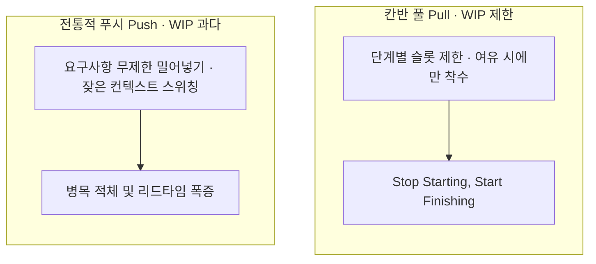
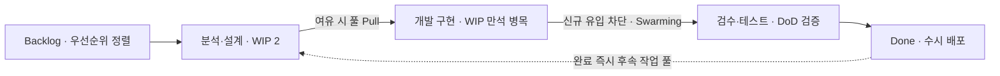

> **소프트웨어공학 > 프로젝트 관리 및 애자일 > 칸반(Kanban)**

---

## 1. 큰 그림 및 30초 인출 공식

- **본질**: **칸반(Kanban)**은 작업 단계를 시각화하고 각 공정별 동시 진행 작업 수(WIP)를 엄격히 제한하여, 멀티태스킹 낭비를 제거하고 티켓의 착수부터 완료(Lead Time)까지를 가장 빠르게 만드는 **린(Lean) 기반 지속 흐름 관리 기법**
- **메커니즘**: 백로그 ➔ 개발 ➔ 테스트 ➔ 배포 흐름에서 칼럼별 최대 허용 개수(WIP Limit) 설정 ➔ 병목 발생 시 신규 착수 차단(Stop Starting) 및 전원 완료 협업(Start Finishing / Swarming) ➔ 완결 즉시 풀(Pull)
- **산출물**: 물리/디지털 칸반 보드 · 누적 흐름 다이어그램(CFD) · 사이클 타임 분포도 · 완료의 정의(DoD) 정책

---

## 2. 핵심 용어 정리

핵심 용어

- **칸반(Kanban)**: 작업 흐름을 보드에 시각화하고 진행 중 작업(WIP)을 제한하여 생산성을 극대화하는 린 애자일 프레임워크
- **WIP 제한(Work In Progress Limit)**: 특정 작업 단계(칼럼)에서 동시에 진행할 수 있는 최대 작업 티켓 수의 강제 상한선
- **리틀의 법칙(Little's Law)**: 대기행렬 이론에 기반하여 시스템 내 평균 재공 작업(WIP)은 처리율(Throughput)과 리드 타임(Lead Time)의 곱과 같다는 원리
- **리드 타임(Lead Time)**: 고객 또는 기획자가 요구사항 티켓을 백로그에 등록한 시점부터 최종 사용자에게 배포 완료되기까지의 총 경과 시간
- **사이클 타임(Cycle Time)**: 개발자가 해당 티켓을 실제로 '진행 중(In Progress)'으로 옮겨 개발을 시작한 순간부터 완료까지 소요된 순수 작업 시간
- **풀(Pull) 방식(Pull System)**: 앞 단계에서 작업을 밀어내지(Push) 않고, 후속 공정의 WIP 슬롯에 여유가 생겼을 때만 작업을 스스로 당겨오는 방식
- **CFD(Cumulative Flow Diagram)**: 시간에 따른 각 공정 단계별 티켓 누적 수를 영역 차트로 표시하여 작업 정체와 병목 구간을 시각화하는 도구
- **스워밍(Swarming)**: 특정 단계의 카드가 WIP 상한에 걸려 병목이 발생했을 때, 팀 전체가 신규 착수를 멈추고 해당 병목 해소에 집중하는 협업 행위
- **완료의 정의(Definition of Done, DoD)**: 카드를 다음 단계로 이동시키기 위해 충족해야 하는 단위 테스트, 코드 리뷰, 통합 검증 등의 명시적 기준
- **스크럼반(Scrumban)**: 스크럼의 스프린트 계획 및 비즈니스 우선순위화와 칸반의 WIP 제한 및 지속적 흐름 방식을 융합한 하이브리드 체계

---

## 3. 25점형 답안 프레임워크

### Ⅰ. 칸반(Kanban)의 개요 및 등장 배경

#### 1. 칸반의 정의 및 대두 배경
- **정의**: 소프트웨어 개발의 전체 가치 흐름(Value Stream)을 시각화하고 공정별 진행 중 작업(WIP) 상한선을 강제하여 리드 타임을 최소화하는 지속 흐름 중심의 애자일 프레임워크.
- **등장 배경**:
  - **스프린트 타임박스의 유연성 한계**: 주 단위로 고정된 스크럼 스프린트는 일상적인 운영 장애 핫픽스나 긴급 배포 티켓을 실시간으로 수용하기 어려움.
  - **멀티태스킹으로 인한 납기 파탄**: 동시에 너무 많은 일(WIP 과다)을 벌려놓아 컨텍스트 스위칭 비용이 급증하고 어떤 작업도 제때 끝나지 않는 현상 극복.

---

### Ⅱ. 칸반 보드 구조 및 리틀의 법칙 메커니즘

#### 1. 칸반 보드 WIP Limit 및 흐름 제어 아키텍처

#### 2. 리틀의 법칙(Little's Law)의 수학적 공학 원리
- **공식**:
  $$\text{WIP} = \text{Throughput} \times \text{Lead Time} \quad \Longleftrightarrow \quad \text{Lead Time} = \frac{\text{WIP}}{\text{Throughput}}$$
- **공학적 시사점**:
  - 소프트웨어 팀의 개발 속도(Throughput)는 단기간에 2배로 증가시키기 어려움(브룩스의 법칙).
  - 그러나 **시스템 내에서 동시에 손대고 있는 진행 중 작업(WIP)의 개수를 제한하면, 리드 타임은 수학적으로 비례하여 단축**됨.

---

### Ⅲ. 칸반(Kanban) vs 스크럼(Scrum) 심층 비교

| 비교 항목 | 칸반 (Kanban) | 스크럼 (Scrum) |
|---|---|---|
| **반복 주기** | **주기 없음 (지속적 흐름, Continuous Flow)** | **고정 타임박스 (1~4주 스프린트)** |
| **작업 인도 방식** | 기능 완료 즉시 수시 배포 (On-Demand) | 스프린트 종료 시점 일괄 데모 및 릴리스 |
| **역할 정의** | 별도 역할 규정 없음 (기존 팀 구조 유지) | 스크럼 마스터, 제품 책임자(PO), 개발팀 |
| **주요 통제 메커니즘**| **WIP (진행 중 작업) 상한선 제한** | **스프린트 타임박스 및 계획된 백로그** |
| **신규 요구 수용** | WIP 슬롯에 여유가 생기면 언제든 즉시 풀(Pull) | 스프린트 진행 도중 신규 요구 원칙적 변경 금지 |
| **주요 측정 지표** | 사이클 타임, 리드 타임, CFD 누적 흐름도 | 스프린트 속도(Velocity), 번다운 차트(Burndown) |
| **적합한 도메인** | **운영 유지보수, 핫픽스 대응, 지속 배포 DevOps** | **신규 제품 개발, 목표 범위가 명확한 프로젝트** |

---

### Ⅳ. 칸반 실무 적용 시 3대 위험 및 대응 전략

| 위험 | 대책 | 효과 |
|---|---|---|
| **WIP 제한 미준수로 멀티태스킹 병목 및 납기 지연** | 개발자 1인당 WIP 1개 강제 상한선 설정 및 'Start Finishing' 원칙 적용 | 티켓 평균 사이클 타임 단축 |
| **검수 칼럼 적체로 개발된 코드가 배포 대기** | 검수 칼럼 WIP 초과 시 신규 개발 착수 차단 및 전원 검수 협업(Swarming) | 검수 대기 시간 감축 및 릴리스 병목 해소 |
| **WIP 상한 없는 형식적 칸반 보드 운영** | 칸반 도구(Jira 등)에 칼럼별 Max WIP 하드 리밋 설정 및 초과 시 경고 발령 | 작업 정체 해소 및 실제 납기 예측도 향상 |

---

### Ⅴ. 결론: 스크럼반(Scrumban)과 VSM 기반 엔터프라이즈 지속 흐름 거버넌스

### 학습자 통찰 메모 — 답안 밖

- `[핵심 통찰]`: 칸반의 정수는 단순히 포스트잇을 벽에 붙여놓는 '시각화'에 있지 않다. 칸반의 진짜 힘은 "동시에 진행하는 일의 양(WIP)을 강제로 제한하여, 병목이 생겼을 때 팀 전체가 하던 일을 멈추고 그 병목을 함께 치우게 만드는 강제 협업 메커니즘(Swarming)"에 있다. 현대 실무에서는 순수 스크럼이나 순수 칸반 하나만을 고집하지 않는다. 장기적인 기능 개발과 아키텍처 로드맵은 스크럼의 스프린트로 계획하되, 스프린트 내부의 세부 티켓 실행과 수시로 터지는 운영 핫픽스는 칸반의 WIP 제한과 풀(Pull) 시스템을 접목한 '스크럼반(Scrumban)'으로 운영하는 것이 표준 하이브리드 거버넌스다.
- `나라면`: 1단락에서 고정 타임박스(스크럼) 한계를 돌파하는 린 기반 칸반의 개념과 대두 배경을 제시하고, 2단락에서 칸반 보드 4대 원칙, WIP Limit 및 풀(Pull) 시스템, 리틀의 법칙(Lead Time = WIP/Throughput)을 제시한 뒤, 3단락에서 칸반 vs 스크럼 비교표와 신규 개발(스크럼)과 운영(칸반)을 결합한 스크럼반(Scrumban)과 VSM 거버넌스를 제언하겠다.

### 실전 답안용 기술사적 제언

- **판정 기준**: 엔지니어 1인당 진행 중 티켓 수가 설정한 WIP 상한을 초과하거나 누적 흐름도(CFD) 상의 특정 공정 밴드 폭이 우상향으로 벌어지는 경우, 즉각 WIP 초과 경보를 발령해야 함.
- **대응 방안**: 신규 작업 착수를 엄격히 금지하고(Stop Starting), 모든 개발자가 해당 병목 공정의 티켓을 함께 검토하고 해결하는 **스워밍(Swarming) 협업 룰**을 가동해야 함.
- **검증 체계**: 주간 단위로 CFD(누적 흐름 다이어그램) 밴드 두께와 몬테카를로 시뮬레이션 기반 리드 타임 백분위수를 분석하여 공정별 적정 WIP Limit를 동적으로 재보정해야 함.
- **기대 효과**: 컨텍스트 스위칭에 따른 생산성 누수를 회수하고, 티켓 평균 리드 타임을 단축하여 고객 요구사항에 대한 수시 배포(On-Demand) 체계를 확립함.

---

## 4. 1교시 10점형 대비 핵심 요약

- **정의**: 업무 흐름을 시각화하고 진행 중 작업(WIP)을 제한하여 지속적인 가치 흐름을 창출하는 린 애자일 기법
- **4대 원칙**: 흐름 시각화, 진행 중 작업(WIP) 제한, 흐름 관리 및 측정(CFD), 프로세스 정책 명시화(DoD)
- **리틀의 법칙**: Lead Time = WIP / Throughput (WIP를 줄이면 리드 타임이 직접 단축됨)
- **스크럼반(Scrumban)**: 신규 개발의 스크럼 계획과 운영성 핫픽스의 칸반 풀 방식을 결합한 하이브리드 체계

---

## 5. 기출 분석 및 출제 경향

| 회차 및 교시 | 문제 유형 | 핵심 출제 포인트 |
|---|---|---|
| **제113회 1교시** | 단답형 | 칸반(Kanban)의 개념 및 진행 중 작업 제한(WIP Limit)의 공학적 의미 |
| **제120회 2교시** | 서술형 | 칸반과 스크럼의 비교 분석 및 리틀의 법칙(Little's Law) 기반 리드 타임 단축 전략 |
| **제126회 1교시** | 단답형 | 누적 흐름 다이어그램(CFD)의 해석 방법 및 병목 식별 기법 |
| **제131회 4교시** | 서술형 | 대규모 엔터프라이즈 환경에서 스크럼반(Scrumban) 하이브리드 거버넌스 도입 방안 |

---

## 6. 실전 시험 팁

- **리틀의 법칙 수식 필수 기재**: $\text{Lead Time} = \frac{\text{WIP}}{\text{Throughput}}$ 수식을 박스 처리하여 쓰고, 개발 인력 충원 없이 WIP 상한선 축소만으로 납기를 단축할 수 있는 공학적 메커니즘을 명쾌하게 기술할 것.
- **Stop Starting, Start Finishing 명언 인용**: 칸반의 핵심 행동 강령인 "새로운 일을 시작하는 것을 멈추고, 하던 일을 끝마치는 데 집중하라"는 문구를 인용하면 실무적 깊이가 드러남.
- **스크럼반(Scrumban) 결론 제시**: 스크럼과 칸반을 양자택일의 문제가 아닌 상호보완적 하이브리드로 결합하는 실무적 해법을 결론에 배치할 것.

---

## 7. 연관 토픽 맵

- **선행 토픽**: 애자일 방법론, 린 소프트웨어 개발(Lean Software Development)
- **유사/비교 토픽**: 스크럼(Scrum), 익스트림 프로그래밍(XP), 가치 스트림 매핑(VSM)
- **후속/연계 토픽**: 스크럼반(Scrumban), 지속적 배포(CD), DORA 지표, DevOps

