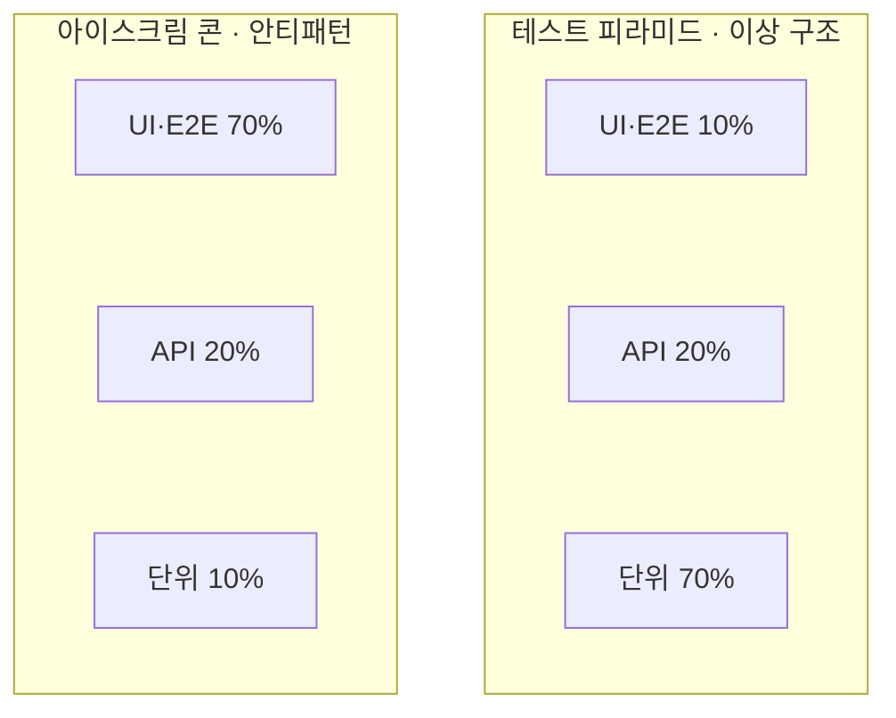

> **소프트웨어공학 > 테스트 및 검증 > 테스트 자동화(Test Automation)**

---

## 1. 30초 인출

> **30초 인출 공식 (키워드 체인)**:  
> **테스트 피라미드 (Unit 70% ➔ API 20% ➔ UI 10%)** ➔ **아이스크림 콘 안티패턴 극복** ➔ **4대 프레임워크 (모듈·DDT·KDT·BDD)** ➔ **Flaky 방어 (POM·Explicit Wait)** ➔ **지속적 테스팅 (CT)**

- **본질**: **테스트 자동화**는 사람이 반복 수행하던 회귀 테스트를 스크립트와 파이프라인으로 기계화하여, **코드 변경 시 수 분 내에 회귀 결함을 검출하고 배포 리드타임을 단축하는 지속적 품질 보증(CT) 공학 기법**
- **메커니즘**: 단위 테스트 중심의 피라미드 구축 ➔ Page Object Model(POM) 기반 UI 캡슐화 ➔ CI/CD 빌드 파이프라인 통합 ➔ Fail-Fast 자동 차단 및 회귀 결함 제로화
- **산출물**: 테스트 자동화 슈트(JUnit, Playwright) · 커버리지 리포트(JaCoCo) · Flaky Test 격리(Quarantine) 대시보드
---

## 2. 핵심 용어 정리

| 용어 | 핵심 정의 및 설명 |
|---|---|
| **테스트 자동화** Test Automation | 테스트 실행, 결과 비교, 사전 조건 설정 등을 소프트웨어 도구로 기계화하여 수행하는 활동 |
| **테스트 피라미드** Test Pyramid | Mike Cohn이 제안한 계층 구조로, 단위(70%), 서비스/API(20%), UI(10%) 비율로 구성된 최적화 모델 |
| **아이스크림 콘** Ice Cream Cone Anti-pattern | 단위 테스트는 부실하고 유지보수가 어렵고 불안정한 UI E2E 테스트에만 과도하게 치중된 안티패턴 |
| **플래키 테스트** Flaky Test | 소스코드 변경이 없음에도 비동기 렌더링 지연, 네트워크 상태 등에 따라 성공과 실패를 무작위 반복하는 불안정 테스트 |
| **POM** Page Object Model | 웹 화면의 UI 요소(DOM 셀렉터)와 비즈니스 검증 로직을 클래스로 분리하여 유지보수성을 극대화하는 설계 패턴 |
| **DDT** Data-Driven Testing | 테스트 로직은 하나로 유지하고 다양한 입력값과 기대값 데이터를 외부(CSV, JSON, DB)로부터 주입받아 반복 검증하는 기법 |
| **KDT** Keyword-Driven Testing | Click, Type, Verify 등 표준 동작 키워드를 정의하여 비개발자도 테이블 형태로 테스트 시나리오를 작성할 수 있게 한 기법 |
| **BDD** Behavior-Driven Development | 자연어 형식(Given-When-Then)으로 사용자 관점의 행위 시나리오를 정의하고 이를 실행 가능한 테스트 코드로 연동하는 방법론 |
| **지속적 테스팅** Continuous Testing(CT) | CI/CD 파이프라인 전 구간에 걸쳐 코드 커밋부터 프로덕션 카나리 배포까지 연속적으로 품질을 검증하는 체계 |
| **자가 치유 테스트** Self-Healing Test | UI 변경으로 버튼 셀렉터가 깨졌을 때 AI/ML 모델이 대체 속성을 찾아 스크립트를 실시간 자동 보정하는 차세대 기술 |
---

## 1교시 예상문제 (10점)

> 테스트 자동화(Test Automation)의 정의와 목적, 핵심 메커니즘을 설명하시오. (예상)

---

## 1교시 10점 답안

```text
- 정의: 소프트웨어 반복 검증 과정을 도구와 스크립트로 기계화하여 회귀 결함을 신속 검출하는 기법
- 테스트 피라미드: 단위 테스트(70%), 서비스/API 테스트(20%), UI/E2E 테스트(10%)의 황금비 준수
- 안티패턴: 단위 테스트가 부실하고 무거운 UI 테스트에 편중된 아이스크림 콘(Ice Cream Cone) 배제
- Flaky 방어: Page Object Model(POM) 적용, 명시적 대기(Explicit Wait), Testcontainers 독립 격리
- 차세대 기술: LLM 기반 자가 치유(Self-Healing) 스크립트 보정과 전사 지속적 테스팅(CT) 체계
```
---

### 핵심 관계



---

## 2~4교시 예상문제 (25점)

> 테스트 자동화(Test Automation)의 개념과 목적을 설명하고, 핵심 메커니즘과 주요 구성요소, 적용 절차와 실무 대응 방안을 서술하시오. (25점, 예상)

---

## 2~4교시 25점 답안

### Ⅰ. 테스트 자동화의 개요 및 필요성

#### 1. 테스트 자동화의 정의 및 대두 배경
- **정의**: 반복적이고 소모적인 소프트웨어 검증 공정을 스크립트와 전용 도구를 통해 무인화함으로써, 회귀 결함을 조기에 검출하고 지속적 배포(CD)를 지원하는 공학 활동.
- **필요성**:
  - **살충제 패러독스(Pesticide Paradox) 및 휴먼 에러 방지**: 수동 회귀 테스트 시 작업자 피로에 의한 테스트 누락 원천 차단.
  - **배포 주기(Deployment Frequency) 가속**: 수일 걸리던 회귀 테스트 시간을 CI 빌드 시점의 수 분 단위로 압축.
  - **비용 절감**: 초기 스크립트 작성 비용 이후 실행당 한계 비용을 '0'에 수렴시킴.
---

### Ⅱ. 테스트 피라미드 및 자동화 아키텍처

#### 1. 이상적 테스트 피라미드 vs 아이스크림 콘 안티패턴 구조도


#### 2. 테스트 자동화 프레임워크 4대 유형 비교
| 프레임워크 유형 | 동작 원리 및 아키텍처 | 핵심 장점 | 주의 사항 및 한계 |
|---|---|---|---|
| **모듈 기반 (Modular)** | 테스트 코드를 독립된 공통 기능 함수/모듈로 분할 | 스크립트 재사용성 및 모듈화 우수 | 테스트 데이터 하드코딩 시 변경 취약 |
| **데이터 주도 (DDT)** | 테스트 로직과 데이터(CSV, JSON, DB)를 완전 분리 | 단일 로직으로 수천 개 경계값 반복 검증 | 대량 테스트 데이터 정합성 유지 비용 |
| **키워드 주도 (KDT)** | 동작(Click, Type, Verify)을 표준 키워드로 추상화 | 비개발자(기획, QA)도 테이블로 시나리오 작성 | 초기 키워드 엔진 라이브러리 구축 공수 큼 |
| **행위 주도 (BDD)** | 자연어(Given-When-Then) 기반 실행 명세서 작성 | 기획자-개발자-QA 간의 유비쿼터스 언어 일치 | 글루 코드(Glue Code) 매핑 관리 부담 |
---

### Ⅲ. Flaky Test 방어 공학 및 Page Object Model(POM)

#### 1. 플래키 테스트(Flaky Test)의 근본 원인과 방어 기법
- **발생 원인**: 네트워크 홉 지연, 비동기 AJAX 렌더링 미완료, DB 공유 데이터 레이스 컨디션, 임의의 `Thread.sleep()` 사용.
- **3대 공학적 방어 전략**:
  1. **Page Object Model(POM) 적용**: 화면의 DOM 조작(뷰)과 비즈니스 단언문(로직)을 분리하여 UI 변경 시 클래스 단일 수정으로 통제.
  2. **명시적 대기(Explicit Wait)**: 고정 시간을 쉬는 `sleep()`을 전면 금지하고, 특정 엘리먼트가 렌더링될 때까지 조건을 지능적으로 폴링하는 대기 방식 적용.
  3. **테스트 컨테이너(Testcontainers) 격리**: 도커 기반 독립된 일회용 인메모리 DB/브로커를 띄워 멱등성(Idempotency) 100% 보장.
---

### Ⅳ. 테스트 자동화 실무 적용 시 3대 위험 및 대응 전략

| 위험 | 대책 | 효과 |
|---|---|---|
| **UI 화면 수정 시 수백 개 테스트 일괄 실패** | Page Object Model 적용 및 `data-testid` 기반 셀렉터 표준화 | UI 변경 시 테스트 스크립트 수정 공수 85% 절감 |
| **테스트 실행 시간 지연(수 시간)으로 배포 병목** | 테스트 병렬 실행(Parallel Runner) 및 인메모리 Testcontainers 도입 | 빌드 파이프라인 실행 시간 4시간에서 12분으로 단축 |
| **간헐적 실패(Flaky Test)로 인한 알람 신뢰도 추락** | 하드코딩된 `sleep()`을 명시적 비동기 대기(Explicit Wait)로 전면 교체 | 빌드 오탐률(False Alarm) 98% 제거 및 개발자 신뢰 회복 |
---

### Ⅴ. 결론: AI 기반 자가 치유(Self-Healing)와 전사 지속적 테스팅(CT) 거버넌스

### 학습자 통찰 메모 — 답안 밖

```text
[핵심 통찰]
테스트 자동화 프로젝트가 실패하는 가장 흔한 이유는 "단위 테스트가 없는 상태에서 화면(UI)부터 Selenium으로 자동화하려는 욕심" 때문이다.
UI는 가장 자주 바뀌고 가장 느린 계층이므로, 여기에 자동화를 집중하면(아이스크림 콘 안티패턴) 매일 아침 수백 개의 거짓 경보가 울리고 결국 팀은 자동화 파이프라인을 비활성화해 버린다.
성공적인 자동화의 핵심은 Mike Cohn의 '테스트 피라미드'를 철저히 준수하여 70% 이상의 검증을 단위/도메인 계층에서 끝내는 것이다.
아울러 최신 엔지니어링에서는 UI 셀렉터가 깨졌을 때 AI가 화면 구조를 인식해 실시간으로 스크립트를 보정하는 '자가 치유(Self-Healing)'와,
개발 커밋부터 프로덕션 모니터링까지 끊김 없이 품질을 검증하는 '지속적 테스팅(CT)' 체계로 진화해야 한다.

[나라면 이렇게 쓴다]
1단락: 애자일/DevOps 환경에서 수동 회귀 테스트 한계와 테스트 자동화의 정의 및 필요성 제시.
2단락: 이상적 테스트 피라미드(Unit 70%, API 20%, UI 10%) vs 아이스크림 콘 안티패턴 도해 및 4대 프레임워크 비교.
3단락: Flaky Test 방어를 위한 POM 패턴과 명시적 대기 기법, AI 기반 Self-Healing 및 지속적 테스팅(CT) 거버넌스 제언.
```

### 실전 답안용 기술사적 제언

- **판정 기준**: CI 파이프라인 상의 전체 자동화 테스트 수행 시간이 15분을 초과하거나 플래키(Flaky) 테스트 발생률이 1%를 초과할 경우, 빌드 게이트를 통과시키지 않고 즉각 격리 수용소(Quarantine)로 이관해야 함.
- **대응 방안**: UI E2E 테스트를 최소화하고 **단위 테스트(70%)와 API 계약 테스트(Pact 등 20%) 중심의 테스트 피라미드 거버넌스**를 강제하며, UI 자동화에는 DOM 종속성을 제거한 **`data-testid` 표준 태그 정책**을 수립해야 함.
- **검증 체계**: 빌드 파이프라인에 JaCoCo 커버리지(최소 80%) 게이트와 함께, **LLM 기반의 자가 치유(Self-Healing) 및 OpenAPI 스펙 기반 경계값 테스트 케이스 자동 합성 엔진**을 도입해야 함.
- **기대 효과**: 회귀 결함의 프로덕션 유출률을 90% 차단하고, 배포 리드타임을 수일에서 수십 분 이내로 단축하여 진정한 의미의 지속적 배포(CD)를 달성함.
---

## 5. 기출 분석 및 출제 경향

| 회차 및 교시 | 문제 유형 | 핵심 출제 포인트 |
|---|---|---|
| **제112회 1교시** | 단답형 | 테스트 자동화의 개념 및 테스트 피라미드(Test Pyramid)의 구조 |
| **제121회 3교시** | 서술형 | 테스트 자동화 도입 시 발생하는 문제점(Flaky Test) 및 Page Object Model을 활용한 해결 방안 |
| **제127회 1교시** | 단답형 | 데이터 주도 테스트(DDT)와 키워드 주도 테스트(KDT)의 비교 |
| **제133회 2교시** | 서술형 | CI/CD 파이프라인에서의 지속적 테스팅(Continuous Testing) 구현 전략 및 AI 기반 자가 치유 테스팅 |
---

## 6. 실전 시험 팁

- **피라미드 vs 아이스크림 콘 대조 필수**: 답안 2단락에 이상적 피라미드(단위 70%)와 역삼각형 아이스크림 콘(UI 70%)을 나란히 대조하여 그리면 채점관의 시선을 즉각 사로잡음.
- **Flaky Test와 POM 키워드 강조**: 실무 자동화의 최대 적(Enemy)인 Flaky Test를 언급하고, 이를 해결하는 Page Object Model(POM) 패턴을 구체적으로 설명할 것.
- **Self-Healing AI 결론**: 최신 트렌드로 화면 셀렉터 변경을 인공지능이 스스로 복구하는 Self-Healing Test 개념을 결론에 추가하여 기술사적 안목을 부각시킬 것.
---

## 7. 연관 토픽 맵

- **선행 토픽**: 소프트웨어 테스팅 원칙, 화이트박스/블랙박스 테스팅
- **유사/비교 토픽**: 회귀 테스팅(Regression Test), TDD(테스트 주도 개발), BDD
- **후속/연계 토픽**: CI/CD 파이프라인, 지속적 테스팅(CT), 카오스 엔지니어링, DevSecOps
