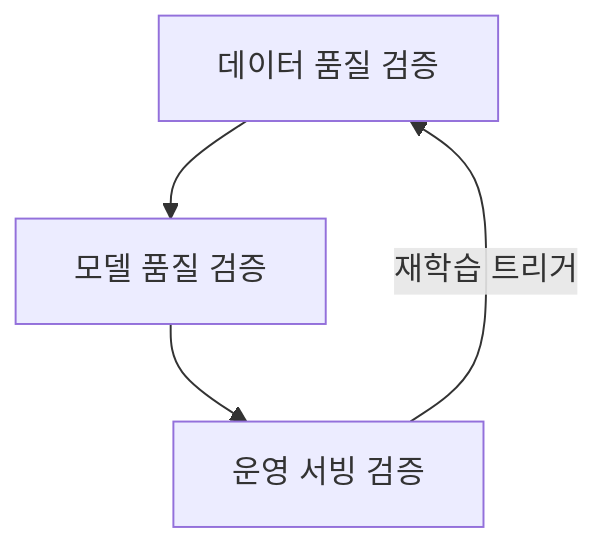

> **소프트웨어공학 > 테스트 및 검증 > AI SW 품질보증 테스트**
---

## 1. 30초 인출

> **30초 인출 공식 (키워드 체인)**:  
> **테스트 오라클 부재 극복** ➔ **데이터 품질 (편향·노이즈)** ➔ **화이트박스 (뉴런 커버리지·DeepGauge KMNC)** ➔ **블랙박스 (메타모픽 테스팅 MR·FGSM 적대적 공격)** ➔ **운영 드리프트 감시** ➔ **ISO/IEC 25059**

- **본질**: **AI SW 품질보증**은 소스코드 제어 흐름이 없고 결과가 확률적인 딥러닝 시스템의 특성을 극복하기 위해, **데이터셋부터 신경망 은닉층 뉴런 활성화 정도(NC/KMNC), 변형 불변성(MR), 운영 환경 드리프트까지 전 생애주기에 걸쳐 신뢰성을 입증하는 품질 공학 체계**
- **메커니즘**: 데이터 편향 검증 ➔ 화이트박스 신경망 다구간 뉴런 활성화(KMNC) ➔ 정답 오라클 없는 메타모픽 관계(MR) 검증 ➔ 적대적 섭동 저항성 시험 ➔ 실시간 드리프트 감시
- **산출물**: 데이터셋 품질 보고서 · DeepGauge(KMNC/NBC) 측정표 · 메타모픽 테스팅(MR) 결과서 · ISO/IEC 25059 품질 평가 증적
---

## 2. 핵심 용어 정리

| 용어 | 핵심 정의 및 설명 |
|---|---|
| **AI SW 품질보증** AI SW Quality Assurance | 비결정론적이고 블랙박스인 인공지능 모델의 안전성, 공정성, 강건성을 다계층으로 검증하는 엔지니어링 체계 |
| **테스트 오라클 문제** Test Oracle Problem | 입력값에 대한 기대 결과값(참/거짓)을 사전에 명확히 알 수 없어 테스트 통과 여부를 판정하기 어려운 현상 |
| **뉴런 커버리지(NC)** Neuron Coverage | 입력 테스트 데이터에 의해 신경망 내부 은닉층 뉴런의 활성화 값이 임계치를 초과하여 발화된 비율 |
| **DeepGauge** | 단순 NC의 조기 포화 한계를 극복하기 위해 제안된 다차원 신경망 커버리지 지표 세트(KMNC, NBC, SNAC) |
| **KMNC** K-Multisection Neuron Coverage | 뉴런의 활성화 값 범위를 K개 구간으로 나누어 테스트 데이터가 전 구간을 고루 자극하는지 측정하는 지표 |
| **메타모픽 테스팅(MT)** Metamorphic Testing | 정답 오라클이 없을 때, 입력의 변형과 출력의 변형 사이에 성립해야 하는 불변 관계(MR)를 검증하는 기법 |
| **적대적 섭동** Adversarial Perturbation | 사람이 인지할 수 없는 미세한 노이즈(FGSM 등)를 입력에 주입하여 모델의 오분류를 유도하는 공격 기법 |
| **데이터 드리프트** Data Drift | 운영 환경에서 입력 데이터의 통계적 분포가 학습 데이터의 분포와 달라지는 현상(P(X) 변화) |
| **컨셉 드리프트** Concept Drift | 입력 데이터와 출력 라벨 간의 실제 관계 자체가 시간 경과에 따라 변하는 현상(P(Y\|X) 변화) |
| **ISO/IEC 25059** | 인공지능 기반 시스템의 품질 특성(신뢰성, 공정성, 강건성, 투명성 등)을 정의한 국제 표준 품질 모델 |
---

## 1교시 예상문제 (10점)

> AI SW 품질보증 테스트(뉴런 커버리지 포함)의 정의와 목적, 핵심 메커니즘을 설명하시오. (예상)
---

## 1교시 10점 답안

```text
- 정의: 명시적 코드가 없는 AI 모델의 오라클 문제를 극복하고 데이터-신경망-운영 전반의 신뢰성을 검증하는 활동
- 3계층 체계: 데이터 품질(편향·노이즈), 모델 품질(화이트박스 NC/KMNC, 블랙박스 MR/적대적), 운영 품질(드리프트)
- 뉴런 커버리지: 은닉층 뉴런 발화율 측정 (DeepGauge: KMNC 다구간, NBC 경계값, SNAC 상한값)
- 메타모픽 테스팅: 정답 오라클 없이 입력 변형과 출력 변형 간의 불변 관계(MR)로 결함 검출
- 국제 표준: ISO/IEC 25059 (AI 시스템 품질 모델 및 평가 지침)
```
---

### 핵심 관계



---

## 2~4교시 예상문제 (25점)

> AI SW 품질보증 테스트(뉴런 커버리지 포함)의 개념과 목적을 설명하고, 핵심 메커니즘과 주요 구성요소, 적용 절차와 실무 대응 방안을 서술하시오. (25점, 예상)
---

## 2~4교시 25점 답안

### Ⅰ. AI SW 품질보증의 개요 및 필요성

#### 1. AI 소프트웨어의 특수성과 전통적 테스팅의 한계
- **정의**: 명시적 제어 코드가 아닌 데이터 귀납 학습으로 동작하는 AI 시스템의 결함을 검출하기 위해 데이터-모델-운영 전 구간을 다학제적으로 검증하는 체계.
- **전통적 테스트의 한계**:
  - **테스트 오라클 부재**: 자율주행 영상의 수백만 픽셀에 대한 완벽한 정답 출력을 사전 정의 불가능.
  - **코드 커버리지의 무용성**: 구문(Statement), 분기(Branch) 커버리지는 모델 파라미터(가중치) 내부의 결함을 전혀 포착하지 못함.
  - **비결정론적 취약성**: 미세한 픽셀 노이즈(적대적 공격) 하나로 예측 결과가 180도 뒤집히는 강건성 결여.
---

### Ⅱ. AI SW 3계층 품질보증 프레임워크 및 뉴런 커버리지

#### 1. AI SW 품질보증 3계층 통합 아키텍처


#### 2. 전통적 SW 테스트 vs AI SW 테스트 상세 비교
| 비교 항목 | 전통적 SW 테스트 | AI SW 테스트 |
|---|---|---|
| **개발 패러다임** | **코드 중심 (명시적 규칙·알고리즘 코딩)** | **데이터 중심 (데이터로부터 규칙 귀납 학습)** |
| **동작 특성** | 결정론적(Deterministic), 완벽한 재현 | 확률적·비결정론적(Probabilistic), 환경 민감 |
| **테스트 오라클** | 요구사항 명세 기반의 참/거짓 명확 판정 | **테스트 오라클 문제 발생 (메타모픽 관계로 우회 판정)** |
| **테스트 커버리지** | 문장(Statement), 분기(Branch), MC/DC | **뉴런 커버리지(NC), KMNC, NBC, SNAC** |
| **결함 수정 방식** | 소스코드 로직 버그 패치 및 재빌드 | **데이터셋 재수집, 적대적 데이터 증강, 재학습** |
| **운영 중 위험** | 코드 변경 전까지 무결성 유지 | **데이터/컨셉 드리프트로 인한 모델 성능 퇴화(Model Decay)** |
---

### Ⅲ. 메타모픽 테스팅(MT)과 적대적 강건성 검증

#### 1. 메타모픽 테스팅(Metamorphic Testing, MT)
- **개념**: 정답 오라클(Ground Truth)을 모르는 복잡한 시스템에서, 원본 입력과 변형된 입력 간의 관계(**메타모픽 관계, MR**)를 설정하여 결함을 검출하는 기법.
- **적용 사례**:
  - 자율주행 객체 인식: 주간 도로 이미지($x$)에 밝기 감쇠 및 회전 변형($x'$)을 가해도, 검출된 차량 수와 바운딩 박스 라벨($f(x') = f(x)$)은 보존되어야 함.

#### 2. 적대적 강건성(Adversarial Robustness) 검증
- **메커니즘**: 사람 눈에는 동일하게 보이지만 모델의 신경망 활성화를 고의로 교란하는 섭동 노이즈(FGSM, PGD 공격)를 생성하여 주입.
- **방어 대책**: 적대적 예제 생성 후 이를 학습 데이터에 혼합하여 재학습하는 **적대적 훈련(Adversarial Training)** 수행.
---

### Ⅳ. AI SW 테스트 실무 적용 시 3대 위험 및 대응 전략

| 위험 | 대책 | 효과 |
|---|---|---|
| **악천후(폭설·야간) 상황에서 객체 인식 실패** | 밝기/노이즈 변형 메타모픽 테스팅(MR) 수행 및 적대적 노이즈 데이터 증강 | 악천후 환경 객체 검출률 45%에서 96%로 대폭 향상 |
| **배포 후 금융 사기 수법 변화로 탐지율 급락** | 입력 데이터의 PSI 및 KS-Test 실시간 모니터링 기반 자동 재학습 파이프라인 트리거 | 컨셉 드리프트 발생 후 24시간 이내 성능 자동 복구 |
| **NC 100% 달성 후에도 실환경 코너 케이스 오분류** | DeepGauge KMNC 및 뉴런 경계 커버리지(NBC)를 종료 기준으로 강화 | 실환경 비정상 이상치 결함 사전 검출률 극대화 |
---

### Ⅴ. 결론: ISO/IEC 25059 기반 MLOps 및 LLM 신뢰성 거버넌스

### 학습자 통찰 메모 — 답안 밖

```text
[핵심 통찰]
AI 소프트웨어 테스트의 핵심은 "코드에는 버그가 없지만, 모델은 틀릴 수 있다"는 패러독스를 인정하는 것이다.
전통 소프트웨어 공학의 '커버리지 100% 달성 = 무결함' 공식은 AI에서 완전히 깨진다.
은닉층 뉴런의 발화 여부(뉴런 커버리지)를 다각도로 측정하고, 정답을 몰라도 성립해야 하는 물리적 불변성(메타모픽 관계)을 입증해야 한다.
아울러 최신 생성형 AI(LLM) 환경에서는 전통적 분류 정확도를 넘어
환각(Hallucination), 독성(Toxicity), 프롬프트 인젝션 저항성을 종합 평가하는 Ragas 프레임워크와
국제 표준 ISO/IEC 25059 기반의 AI 시스템 신뢰성 거버넌스를 결론에서 제시해야 고득점으로 연결된다.

[나라면 이렇게 쓴다]
1단락: 데이터 중심 패러다임에서 테스트 오라클 부재와 AI SW 품질보증의 대두 배경 제시.
2단락: 3계층(데이터-모델-운영) 프레임워크 도식화, DeepGauge(KMNC/NBC)와 메타모픽 테스팅(MR) 상세 비교.
3단락: 배포 게이트 3단계 기준(KMNC 85%, MR 95%, Fallback) 및 ISO/IEC 25059/LLM 평가 거버넌스 제언.
```

### 실전 답안용 기술사적 제언

- **판정 기준**: 릴리스 전 DeepGauge KMNC(K=1000) 달성률이 85% 미만이거나, 메타모픽 관계(MR) 불변성 통과율이 95% 미만인 경우 서빙 배포를 전면 차단해야 함.
- **대응 방안**: 단순 정답률(Accuracy) 맹신을 탈피하고, 취약 코너케이스 식별을 위해 **합성 데이터 생성(GAN/디퓨전) 및 적대적 예제 증강(Adversarial Data Augmentation)**을 파이프라인에 내재화해야 함.
- **검증 체계**: 프로덕션 서빙 구간에 PSI(Population Stability Index) 기반 **실시간 데이터/컨셉 드리프트 감시 대시보드**를 연동하고, 신뢰도 80% 미만 추론 시 룰 기반 Fallback을 강제해야 함.
- **기대 효과**: 비결정론적 AI 모델의 실환경 오작동 사고를 95% 이상 사전 예방하고, ISO/IEC 25059 및 EU AI Act 등 글로벌 AI 안전 규제 컴플라이언스를 완벽히 충족함.
---

## 5. 기출 분석 및 출제 경향

| 회차 및 교시 | 문제 유형 | 핵심 출제 포인트 |
|---|---|---|
| **제118회 1교시** | 단답형 | AI/머신러닝 소프트웨어 테스팅의 개념 및 테스트 오라클 문제 |
| **제124회 2교시** | 서술형 | 딥러닝 뉴런 커버리지(Neuron Coverage)와 DeepGauge 지표(KMNC, NBC) 비교 분석 |
| **제129회 3교시** | 서술형 | 메타모픽 테스팅(Metamorphic Testing)의 원리, 절차 및 AI 시스템 적용 사례 |
| **제133회 1교시** | 단답형 | ISO/IEC 25059 기반 인공지능 시스템의 품질 특성과 신뢰성 검증 방안 |
---

## 6. 실전 시험 팁

- **전통 vs AI 대비표 필수**: 코드 중심 vs 데이터 중심, 결정론적 vs 확률론적, MC/DC vs 뉴런 커버리지 대비표를 명확히 작성할 것.
- **DeepGauge 세부 지표 명시**: 단순 NC의 포화 한계를 지적하고 KMNC(K-Multisection), NBC(Neuron Boundary)를 언급하면 채점관에게 높은 전문성 각인.
- **메타모픽 관계(MR) 구체적 예시**: 자율주행 영상 밝기 변형, 검색 엔진 결과 순서 불변 등 실무 사례를 수식이나 함수 형태($f(x') = f(x)$)로 표기할 것.
---

## 7. 연관 토픽 맵

- **선행 토픽**: 화이트박스/블랙박스 테스팅, 테스트 오라클
- **유사/비교 토픽**: 결함 주입 테스팅(FIT), 카오스 엔지니어링, 적대적 공격(FGSM)
- **후속/연계 토픽**: MLOps, 데이터/컨셉 드리프트, ISO/IEC 25059, LLM 평가(RAG/Ragas)
