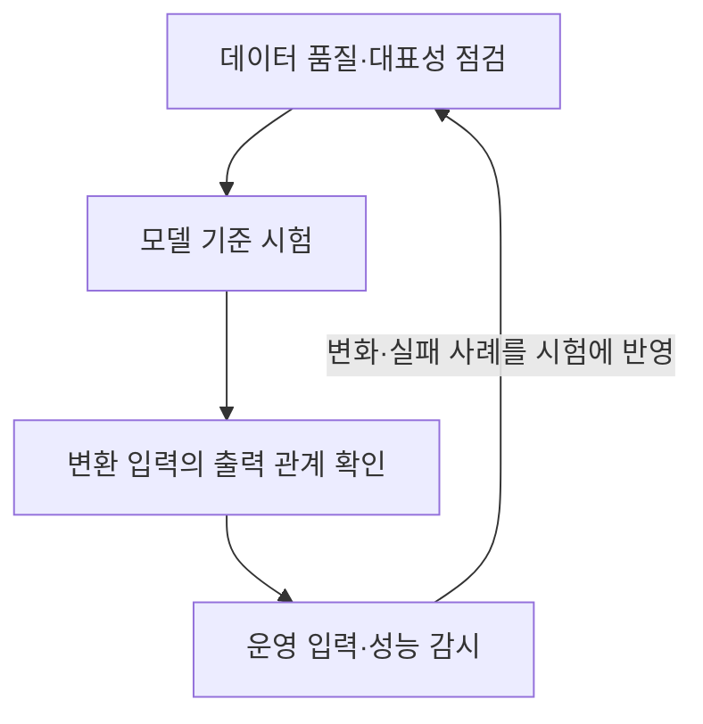

---
title: "AI SW 품질보증 테스트(뉴런 커버리지 포함)"
author: "Codex"
date: "2026-09-24T16:43:00+09:00"
tags:
  - "notes-software-engineering"
sidebar:
  badge:
    text: "서브"
extra:
  model: "GPT-6"
  keyword_grade: "서브"
---

## 지식 로드맵 내 현재 위치

지식 위치: 소프트웨어 공학 → 테스트·검증 → **AI SW 품질보증 테스트(뉴런 커버리지 포함)**

## 30초 인출

- 본질: **AI SW 품질보증 테스트**는 데이터와 학습 모델의 오류·위험을 찾아 배포 전후의 품질을 확인하는 활동
- 메커니즘: 데이터·모델·운영 조건을 시험하고, 정답을 바로 정하기 어려울 때 입력 변형에 따른 출력 관계도 확인

핵심 용어

- **AI SW 품질보증 테스트**: 데이터·모델·운영 조건의 오류와 품질 위험을 확인하는 시험 활동
- **테스트 오라클 문제(Test Oracle Problem)**: 특정 입력의 정답 결과를 미리 알기 어려워 시험 결과를 판정하기 힘든 문제
- **뉴런 커버리지(Neuron Coverage)**: 시험 입력이 신경망 내부 뉴런을 활성화한 범위를 측정하는 지표
- **메타모픽 시험(Metamorphic Testing)**: 입력 변환과 출력 사이에 성립해야 할 관계를 확인해 정답 오라클 부족을 보완하는 기법
- **데이터 드리프트(Data Drift)**: 운영 입력 데이터의 분포가 학습 데이터와 달라지는 현상
- **ISO/IEC 25059**: 인공지능 시스템 품질 모델을 규정한 국제 표준

---

## 1교시 예상문제 (10점)

> AI SW 품질보증 테스트(뉴런 커버리지 포함)의 정의와 목적, 핵심 시험 방법을 설명하시오. (예상)

---

## 1교시 10점 답안

### Ⅰ. 개요

| 구분 | 핵심 |
|---|---|
| 정의 | **AI SW 품질보증 테스트**는 데이터·모델·운영 조건의 오류와 품질 위험을 확인하는 시험 활동 |
| 목적 | 학습·추론 특성에서 비롯되는 오류를 찾아 배포 판단과 운영 개선에 활용 |

### Ⅱ. 시험 관점

| 시험 대상 | 확인 방법 | 확인 내용 |
|---|---|---|
| 데이터 | 대표성·품질 점검 | 누락·편향·라벨 오류 |
| 모델 | 기준 데이터 시험·뉴런 커버리지·메타모픽 시험 | 정확도와 내부 활성화 범위, 변환 전후 출력 관계 |
| 운영 | 입력 분포와 결과 품질 감시 | 데이터 분포 변화와 성능 저하 징후 |

**제언:** 데이터·모델 시험 결과와 운영 품질 변화를 함께 검토한 뒤 배포 여부 판단.

---

## 2~4교시 예상문제 (25점)

> AI SW 품질보증 테스트(뉴런 커버리지 포함)의 개념과 주요 시험 기법을 설명하고, 개발·운영 단계의 적용 방안을 제시하시오. (예상)

---

## 2~4교시 25점 답안

## Ⅰ. 개요

| 구분 | 핵심 |
|---|---|
| 정의 | **AI SW 품질보증 테스트**는 데이터·모델·운영 조건의 오류와 품질 위험을 확인하는 시험 활동 |
| 목적 | 학습·추론 특성에서 비롯되는 오류를 찾아 배포 판단과 운영 개선에 활용 |

## Ⅱ. 품질 위험과 시험 관점

| 구분 | 전통적 소프트웨어 시험 | AI 소프트웨어 시험 |
|---|---|---|
| 동작 근거 | 명시적으로 작성한 규칙·코드 | 학습 데이터와 모델 매개변수 |
| 정답 판정 | 요구사항·기대 결과와 비교 | 정답 오라클 부족 시 관계 기반·통계적 확인 보완 |
| 주요 위험 | 구현 결함·요구 누락 | 데이터 편향·모델 취약성·운영 분포 변화 |

## Ⅲ. 핵심 시험 방법

| 기법 | 확인 대상 | 해석 시 주의 |
|---|---|---|
| 뉴런 커버리지 | 입력에 따른 내부 뉴런 활성화 범위 | 높은 수치만으로 정확성·안전성이 증명되지는 않음 |
| 메타모픽 시험 | 입력 변환에 따른 출력 관계 | 관계가 해당 업무 의미를 보존하는지 먼저 정의 |
| 강건성 시험 | 잡음·경계 사례에 대한 출력 변화 | 실제 위협·사용 조건에 맞는 시험 데이터를 사용 |
| 드리프트 감시 | 학습·운영 데이터 분포와 품질 추세 | 분포 변화만으로 모델 품질 저하를 단정하지 않음 |

## Ⅳ. 적용 절차와 대응

| 단계 | 수행 내용 | 기록 |
|---|---|---|
| 요구·위험 정의 | 사용 목적, 실패 영향, 허용 가능한 결과 범위 설정 | 품질 요구·위험 목록 |
| 데이터·모델 검증 | 데이터 품질, 기준 성능, 경계·변환 사례 시험 | 시험 데이터·결과·모델 버전 |
| 배포 검토 | 요구 충족, 잔존 위험, 감시·복구 방안 검토 | 배포 승인 근거 |
| 운영 감시 | 입력 변화·오류 사례 검토 후 재평가 필요성 판단 | 감시 지표·조치 기록 |

## Ⅴ. 기술사적 제언 — 운영 피드백의 재시험 반영

| 문제 | 해결 방안 |
|---|---|
| 운영 입력 변화나 드문 실패 사례가 다음 모델 시험에 반영되지 않을 가능성 | 실패 사례의 개인정보·품질을 검토한 뒤 회귀 시험 자료에 편입하고, 재학습 모델의 기준 시험과 함께 비교 |

## 출제 이력과 검증 출처

- ISO/IEC 25059, *Software engineering — Systems and software Quality Requirements and Evaluation (SQuaRE) — Quality model for AI systems*.
- Tian et al., “DeepTest: Automated Testing of Deep-Neural-Network-driven Autonomous Cars,” ICSE 2018.
- Ma et al., “DeepGauge: Multi-Granularity Testing Criteria for Deep Learning Systems,” ASE 2018.

## 연결 토픽

- 연관 토픽: [소프트웨어 테스트 종류·레벨](./003_sw_test_types_and_levels.md), [데이터옵스](./109_dataops.md), [테스트 커버리지](./118_test_coverage.md)
