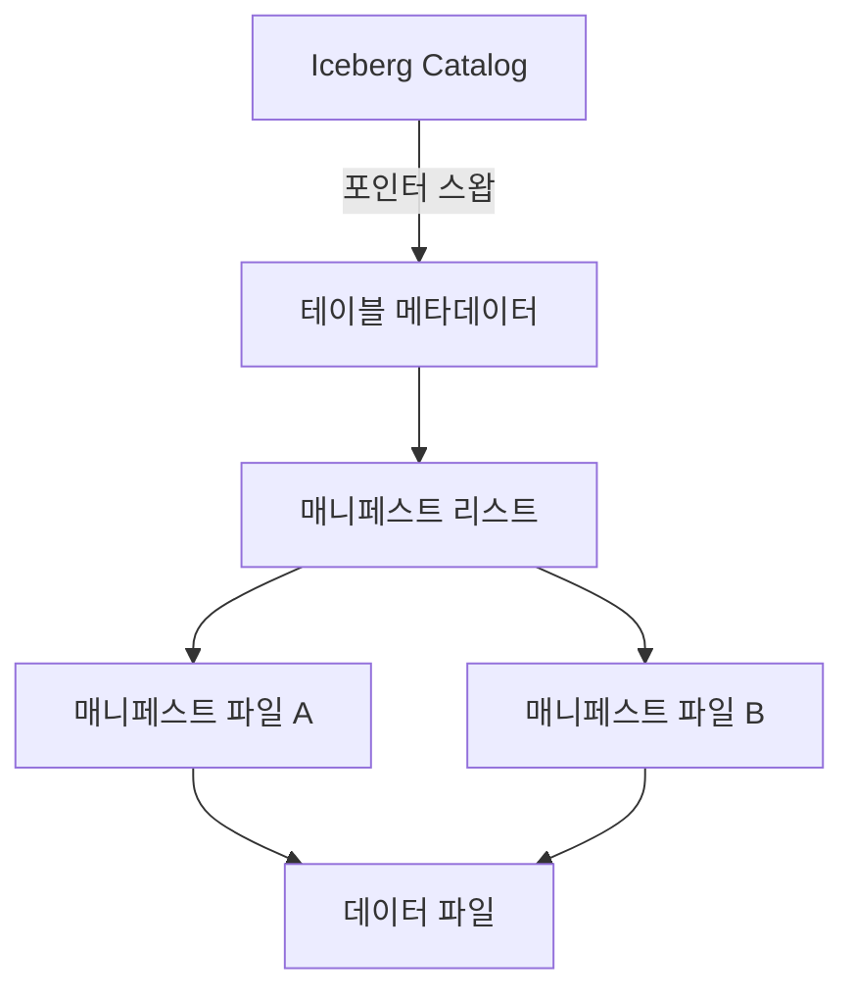

> **소프트웨어공학 > 데이터 아키텍처 및 레이크하우스 > Apache Iceberg 오픈 테이블 포맷**
---

## 1. 30초 인출

> **30초 인출 공식 (키워드 체인)**:  
> **오브젝트 스토리지 RDBMS화** ➔ **3계층 메타데이터 트리 (Catalog-Metadata-Manifest)** ➔ **완전한 ACID (원자적 포인터 스왑)** ➔ **히든 파티셔닝 (Hidden Partitioning)** ➔ **Iceberg vs Delta vs Hudi** ➔ **오픈 카탈로그 (Polaris)**

- **본질**: **Apache Iceberg**는 S3 등 오브젝트 스토리지의 디렉터리 리스팅 성능 병목과 ACID 부재를 타파하기 위해, **파일 단위 3계층 메타데이터 트리로 추상화하여 RDBMS 수준의 완전한 트랜잭션과 고속 파일 프루닝을 지원하는 오픈 테이블 포맷**
- **메커니즘**: 카탈로그 ➔ 메타데이터 파일 ➔ 매니페스트 리스트 ➔ 매니페스트 파일의 계층 트리 유지 ➔ 쓰기 시 신규 스냅샷 생성 후 원자적 포인터 교체(Atomic Swap) ➔ 읽기 시 컬럼 Min/Max 통계로 $O(1)$ 파일 스킵
- **산출물**: 카탈로그 엔트리 · 메타데이터 JSON · 매니페스트 Avro 파일 · Parquet 데이터 파일 · 타임 트래블 스냅샷
---

## 2. 핵심 용어 정리

| 용어 | 핵심 정의 및 설명 |
|---|---|
| **오픈 테이블 포맷** Open Table Format | 오브젝트 스토리지 상의 분산 데이터 파일들을 표준 RDBMS 테이블처럼 다룰 수 있게 해주는 메타데이터 규격 |
| **Apache Iceberg** | 넷플릭스가 개발한 오픈소스 테이블 포맷으로, 높은 엔진 독립성과 확장성을 갖춘 레이크하우스 표준 기술 |
| **Iceberg Catalog** | 테이블의 최신 메타데이터 파일 위치를 원자적으로 추적·교체하는 중앙 저장소(REST, AWS Glue 등) |
| **매니페스트 리스트** Manifest List | 특정 스냅샷을 구성하는 매니페스트 파일 목록과 파티션 범위 요약 통계를 담고 있는 Avro 파일 |
| **매니페스트 파일** Manifest File | 실제 물리적 데이터 파일 경로, 파티션 값, 컬럼별 최소/최대(Min/Max) 통계를 보관하는 Avro 파일 |
| **히든 파티셔닝** Hidden Partitioning | 쿼리 작성자가 파티션 컬럼을 명시하지 않아도 원천 컬럼 조건절을 인식해 자동으로 파티션을 스킵하는 기술 |
| **파티션 진화** Partition Evolution | 테이블 재생성이나 데이터 마이그레이션 없이 운영 중에 파티셔닝 기준(일➔시간 단위 등)을 즉시 변경하는 기능 |
| **원자적 스왑** Atomic Pointer Swap | 쓰기 작업 완료 시 카탈로그의 메타데이터 파일 포인터를 단일 원자적 연산으로 교체하여 완벽한 ACID를 보장하는 기법 |
| **컴팩션** Compaction(Bin-packing) | 스트리밍 적재 등으로 양산된 수천 개의 작은 소형 파일들을 대형 표준 Parquet 파일로 비동기 병합하는 작업 |
| **타임 트래블** Time Travel | 과거 특정 시점의 스냅샷 ID를 지정하여 이전 버전의 테이블 상태를 질의하거나 롤백할 수 있는 기능 |
---

## 1교시 예상문제 (10점)

> Apache Iceberg / 오픈 테이블 포맷(레이크하우스)의 정의와 목적, 핵심 메커니즘을 설명하시오. (예상)
---

## 1교시 10점 답안

```text
- 정의: 오브젝트 스토리지 상의 분산 데이터 파일들을 파일 단위 메타데이터 트리로 관리하는 개방형 오픈 테이블 포맷
- 3계층 구조: Iceberg Catalog ➔ Table Metadata(JSON) ➔ Manifest List(Avro) ➔ Manifest Files(Avro) ➔ Data Files(Parquet)
- 핵심 기능: 원자적 포인터 스왑 기반 완전한 ACID, 히든 파티셔닝(쿼리 실수 방지), 파티션/스키마 무중단 진화, 타임 트래블
- 3대 포맷 비교: Iceberg(엔진 중립적, 트리 분리), Delta Lake(Databricks 최적화), Hudi(스트리밍 CDC 최적화)
```
---

### 핵심 관계



---

## 2~4교시 예상문제 (25점)

> Apache Iceberg / 오픈 테이블 포맷(레이크하우스)의 개념과 목적을 설명하고, 핵심 메커니즘과 주요 구성요소, 적용 절차와 실무 대응 방안을 서술하시오. (25점, 예상)
---

## 2~4교시 25점 답안

### Ⅰ. 오픈 테이블 포맷의 개요 및 등장 배경

#### 1. 전통적 하이브(Hive) 메타스토어의 한계와 Iceberg의 대두
- **등장 배경**:
  - **Hive의 $O(N)$ 디렉터리 리스팅 병목**: S3 등 오브젝트 스토리지에서 수백만 개 파일의 메타데이터 조회를 위해 디렉터리를 재귀 탐색하느라 쿼리 시작 전 수 분이 소요됨.
  - **ACID 트랜잭션 부재**: 분산 쓰기 도중 작업이 실패하면 불완전한 파티션 데이터가 노출되어 쿼리 정합성이 훼손됨.
  - **파티셔닝 락인**: 파티션 전략을 바꾸려면 수십 TB의 전체 데이터를 재적재해야 하는 치명적 경직성.
- **Iceberg의 해결책**: 디렉터리가 아닌 **개별 파일 단위 메타데이터 트리**를 직접 참조함으로써, 디렉터리 리스팅을 전면 제거하고 완전한 스냅샷 격리(Snapshot Isolation)를 달성함.
---

### Ⅱ. Apache Iceberg 3계층 메타데이터 아키텍처

#### 1. Iceberg 계층 구조 및 원자적 커밋 흐름도


#### 2. 오픈 테이블 포맷 3대 기술 비교 (Iceberg vs Delta vs Hudi)
| 비교 항목 | Apache Iceberg | Delta Lake | Apache Hudi |
|---|---|---|---|
| **주도 기업/생태계** | **넷플릭스, 애플 / Apache 재단** | Databricks / 리눅스 재단 | Uber / Apache 재단 |
| **메타데이터 구조** | **3계층 Avro 트리 구조 (독립성 최우수)** | JSON 트랜잭션 로그 + Parquet 체크포인트 | 타임라인(Timeline) + 메타데이터 파일 |
| **엔진 독립성** | **완전 독립 (Spark, Trino, Flink 동등 지원)** | Spark 중심 최적화 (타 엔진 종속적) | Spark 중심 (Flink 점진 지원) |
| **파티셔닝 유연성** | **히든 파티셔닝 & 파티션 무중단 진화** | 디렉터리 기반 파티셔닝 | 디렉터리 기반 파티셔닝 |
| **주요 워크로드** | 대규모 대화형 OLAP 질의, 개방형 레이크하우스 | Databricks 통합 데이터 파이프라인 | 잦은 Upsert/Delete 중심의 스트리밍 CDC |
---

### Ⅲ. Iceberg 실무 운영 3대 핵심 최적화 기법

#### 1. 스몰 파일 컴팩션(Compaction / Bin-Packing)
- 스트리밍 Flink/Spark 적재 시 수천 개로 파편화된 수 MB 단위 소형 파일을 128MB~512MB 표준 Parquet 파일로 비동기 병합(`rewriteDataFiles`)하여 스토리지 읽기 I/O를 70% 이상 절감.

#### 2. 스냅샷 만료(Snapshot Expiration)
- 타임 트래블 이력 보존을 위해 무한정 쌓인 과거 스냅샷을 주기적으로 정리(`expireSnapshots`)하여 메타데이터 파일 팽창과 쿼리 플래닝 지연을 차단.

#### 3. 고아 파일 정화(Orphan File Cleanup)
- 트랜잭션 실패로 메타데이터에 등록되지 못하고 스토리지 용량만 차지하는 무소속 데이터 파일 자동 색출 및 삭제(`remove_orphan_files`).
---

### Ⅳ. Iceberg 실무 적용 시 3대 위험 및 대응 전략

| 위험 | 대책 | 효과 |
|---|---|---|
| **스트리밍 적재로 인한 수천만 개 소형 파일 파편화** | Iceberg 비동기 컴팩션 및 빈 패킹(Bin-packing) 프로시저 상시 가동 | 쿼리 스캔 속도 4배 향상 및 메타데이터 크기 75% 압축 |
| **과거 스냅샷 누적으로 쿼리 플래닝 지연 급증** | 주간 단위 `expireSnapshots` 정책 수립 및 고아 파일 자동 정화 파이프라인 실행 | 쿼리 플래닝 레이턴시 50ms 미만 안정 유지 |
| **개발자의 파티션 함수 오용으로 스토리지 전체 풀스캔 발생** | 원천 타임스탬프 질의 시 내부 변환 함수를 자동 매핑하는 히든 파티셔닝 적용 | 불필요한 전체 스캔 원천 방지 및 I/O 비용 60% 절감 |
---

### Ⅴ. 결론: 멀티 엔진 독립성과 오픈 카탈로그 기반 개방형 레이크하우스

### 학습자 통찰 메모 — 답안 밖

```text
[핵심 통찰]
Apache Iceberg의 진정한 파괴력은 "스토리지 포맷을 특정 데이터베이스 엔진(Snowflake, Databricks)의 사유 규격에서 해방시킨 것"에 있다.
과거에는 데이터를 한 번 특정 DW에 넣으면 엄청난 이관 비용(Egress/Lock-in) 때문에 갇혔지만,
Iceberg를 쓰면 S3의 단일 데이터 사본(Single Source of Truth)을 두고
배치는 Spark, 실시간 스트리밍은 Flink, 초고속 대화형 분석은 Trino, 심지어 Snowflake와 BigQuery까지 원하는 엔진을 플러그인처럼 자유롭게 바꿔 끼울 수 있다.
기술사 답안에서는 3계층 메타데이터 트리와 원자적 포인터 스왑 메커니즘을 명쾌히 도식화하고,
특정 벤더 종속을 탈피하는 'Apache Polaris 기반 오픈 REST 카탈로그' 거버넌스를 결론으로 제시해야 완벽한 만점을 얻는다.

[나라면 이렇게 쓴다]
1단락: 전통적 Hive 메타스토어의 디렉터리 리스팅 한계와 오픈 테이블 포맷 Iceberg의 개념 제시.
2단락: 3계층(Catalog-Metadata-Manifest) 메타데이터 아키텍처 및 원자적 커밋(Atomic Swap), 히든 파티셔닝 도식화.
3단락: Iceberg vs Delta vs Hudi 비교표 및 개방형 레이크하우스를 위한 Apache Polaris 오픈 카탈로그 거버넌스 제언.
```

### 실전 답안용 기술사적 제언

- **판정 기준**: 일일 적재 파일 수가 수십만 건을 초과하거나 분기별 쿼리 플래닝 지연 시간이 1초를 초과하는 경우, 메타데이터 팽창 경보를 발령하고 스냅샷 만료 정책을 가동해야 함.
- **대응 방안**: 데이터 레이크의 스토리지 계층을 **Apache Iceberg 단일 포맷으로 표준화**하고, 컴퓨트 엔진(Spark/Flink/Trino)과의 결합도를 제거하기 위해 **벤더 중립적인 Apache Polaris 오픈 REST 카탈로그**를 도입해야 함.
- **검증 체계**: 데이터 파이프라인 CI/CD 단계에 **일일 비동기 컴팩션(Bin-packing) 프로시저와 고아 파일 삭제 스크립트**를 강제 연동하여 메타데이터 및 스몰 파일 건강 상태를 상시 감시해야 함.
- **기대 효과**: 데이터 중복 복제 비용을 60% 이상 감축하고, 디렉터리 리스팅 없는 고속 프루닝으로 대규모 OLAP 질의 속도를 4배 이상 가속함.
---

## 5. 기출 분석 및 출제 경향

| 회차 및 교시 | 문제 유형 | 핵심 출제 포인트 |
|---|---|---|
| **제125회 1교시** | 단답형 | 데이터 레이크하우스(Lakehouse)의 개념 및 오픈 테이블 포맷의 필요성 |
| **제129회 2교시** | 서술형 | Apache Iceberg의 메타데이터 아키텍처 및 전통적 하이브(Hive) 메타스토어와의 차이점 비교 |
| **제132회 3교시** | 서술형 | 오픈 테이블 포맷 3대 기술(Iceberg, Delta Lake, Hudi)의 아키텍처 및 워크로드별 비교 분석 |
| **제134회 1교시** | 단답형 | Iceberg의 히든 파티셔닝(Hidden Partitioning) 메커니즘 및 파티션 진화(Partition Evolution) |
---

## 6. 실전 시험 팁

- **3계층 메타데이터 트리 도식 필수**: Catalog ➔ Metadata JSON ➔ Manifest List Avro ➔ Manifest File Avro ➔ Parquet Data 흐름을 계층 박스로 깔끔하게 도식화할 것.
- **원자적 포인터 스왑(Atomic Pointer Swap) 강조**: 쓰기 시 데이터 파일을 먼저 쓰고 마지막에 카탈로그 포인터만 단번에 바꾸는 OCC(낙관적 동시성 제어) 메커니즘을 명시할 것.
- **히든 파티셔닝 개념 언급**: 사용자가 `WHERE event_time >= '2026-03-21'`로 질의해도 시스템 내부에서 `date(event_time)` 파티션으로 자동 매핑하여 풀스캔을 막는 차별화 기능을 기술할 것.
---

## 7. 연관 토픽 맵

- **선행 토픽**: 데이터 레이크(Data Lake), HDFS, 오브젝트 스토리지(S3), Parquet/ORC
- **유사/비교 토픽**: Delta Lake, Apache Hudi, Hive Metastore
- **후속/연계 토픽**: 데이터 레이크하우스(Lakehouse), Apache Polaris, Trino, MLOps 데이터 파이프라인
