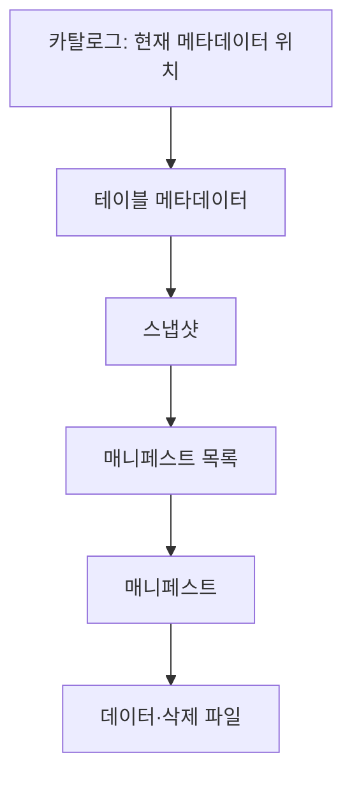

---
title: "Apache Iceberg / 오픈 테이블 포맷(레이크하우스)"
author: "Codex"
date: "2026-09-24T16:43:00+09:00"
tags:
  - "notes-software-engineering"
sidebar:
  badge:
    text: "서브"
extra:
  model: "GPT-6"
  keyword_grade: "서브"
---

## 지식 로드맵 내 현재 위치

지식 위치: 소프트웨어 공학 → 데이터 플랫폼·저장 형식 → **Apache Iceberg / 오픈 테이블 포맷(레이크하우스)**

## 30초 인출

- 본질: **Apache Iceberg**는 데이터 파일을 테이블 스냅샷과 메타데이터로 관리하는 오픈 테이블 포맷
- 메커니즘: 카탈로그가 현재 메타데이터를 가리키고, 스냅샷·매니페스트가 해당 테이블을 구성하는 파일을 기록

핵심 용어

- **Apache Iceberg**: 데이터 파일의 테이블 메타데이터·스냅샷·변경 이력을 관리하는 오픈 테이블 포맷
- **카탈로그(Catalog)**: 테이블 식별자와 현재 메타데이터 위치를 관리하는 서비스
- **스냅샷(Snapshot)**: 특정 시점의 테이블 상태를 가리키는 메타데이터 기록
- **매니페스트(Manifest)**: 스냅샷에 속한 데이터·삭제 파일과 관련 파티션·통계 정보를 기록한 파일
- **히든 파티셔닝(Hidden Partitioning)**: 사용자가 변환된 파티션 열을 직접 지정하지 않아도 원본 열 조건으로 파티션 프루닝을 수행하는 기능
- **파티션 진화(Partition Evolution)**: 테이블을 다시 만들지 않고 새 데이터에 적용할 파티션 규칙을 변경하는 기능

---

## 1교시 예상문제 (10점)

> Apache Iceberg 오픈 테이블 포맷의 정의와 목적, 메타데이터 구조를 설명하시오. (예상)

---

## 1교시 10점 답안

### Ⅰ. 개요

| 구분 | 핵심 |
|---|---|
| 정의 | **Apache Iceberg** 는 데이터 파일의 테이블 메타데이터·스냅샷·변경 이력을 관리하는 오픈 테이블 포맷 |
| 목적 | 여러 처리 엔진에서 일관된 테이블 조회·변경과 파일 단위 메타데이터 관리를 지원 |

### Ⅱ. 메타데이터 구조

### Ⅲ. 주요 기능

| 기능 | 역할 |
|---|---|
| 스냅샷 조회 | 이전 테이블 상태 조회·복구 지점 관리 |
| 히든 파티셔닝 | 원본 열 조건을 파티션 변환 규칙에 연결 |
| 파티션 진화 | 변경 시점 이후 데이터에 새 파티션 규칙 적용 |

**제언:** 카탈로그 커밋 방식과 보존 정책을 처리 엔진·스토리지 조건에 맞춰 검증.

---

## 2~4교시 예상문제 (25점)

> Apache Iceberg의 메타데이터 구조와 테이블 변경 메커니즘을 설명하고, 주요 기능과 운영 시 고려사항을 제시하시오. (예상)

---

## 2~4교시 25점 답안

## Ⅰ. 개요

| 구분 | 핵심 |
|---|---|
| 정의 | **Apache Iceberg** 는 데이터 파일의 테이블 메타데이터·스냅샷·변경 이력을 관리하는 오픈 테이블 포맷 |
| 목적 | 여러 처리 엔진에서 일관된 테이블 조회·변경과 파일 단위 메타데이터 관리를 지원 |

## Ⅱ. 테이블 메타데이터 구조

카탈로그의 갱신 방식은 카탈로그 구현과 설정에 따르며, 카탈로그가 메타데이터 버전을 갱신해 새 테이블 상태를 게시하는 구조.

## Ⅲ. 변경·조회 메커니즘

| 작업 | 테이블 상태 처리 |
|---|---|
| 쓰기 | 새 데이터 파일과 메타데이터를 작성하고 커밋 성공 시 새 스냅샷 게시 |
| 동시 변경 | 현재 메타데이터 상태를 기준으로 커밋 충돌을 확인하고 필요하면 재시도 |
| 조회 | 스냅샷의 매니페스트·파일 통계를 이용해 필요한 파일을 선택 |
| 과거 조회 | 보존된 스냅샷을 지정해 해당 시점의 테이블 상태 조회 |

## Ⅳ. 주요 기능과 운영 고려사항

| 기능·운영 항목 | 핵심 작동 | 점검 사항 |
|---|---|---|
| 히든 파티셔닝 | 원본 열 조건을 파티션 변환 규칙과 연결해 불필요한 파일 탐색 축소 | 쿼리 조건과 파티션 변환의 적합성 |
| 파티션 진화 | 이후 쓰기에 새 파티션 규칙 적용, 기존 파일의 메타데이터 보존 | 과거·신규 데이터가 함께 조회되는지 확인 |
| 파일 재작성 | 여러 작은 파일을 다시 써 파일 수와 조회 계획 부담 완화 | 재작성 범위와 동시 쓰기 영향 |
| 스냅샷 만료·고아 파일 정리 | 보존하지 않을 스냅샷·미참조 파일 정리 | 시간여행·복구 요구와 진행 중 쓰기 보호 |

## Ⅴ. 기술사적 제언 — 보존과 정리의 우선순위

| 문제 | 해결 방안 |
|---|---|
| 스냅샷·파일 정리 시 과거 조회나 복구에 필요한 데이터를 제거할 가능성 | 보존·복구 요구를 먼저 확인하고 만료 범위와 고아 파일 정리를 분리 검증한 뒤 적용 |

## 출제 이력과 검증 출처

- [Apache Iceberg Specification](https://iceberg.apache.org/spec/) — 테이블 메타데이터, 스냅샷, 매니페스트 구조.
- [Apache Iceberg Maintenance](https://iceberg.apache.org/docs/latest/maintenance/) — 스냅샷 만료, 고아 파일 정리, 데이터 파일 재작성 및 주의사항.

## 연결 토픽

- 연관 토픽: [DataOps](./109_dataops.md), [DAG](./143_dag.md)
