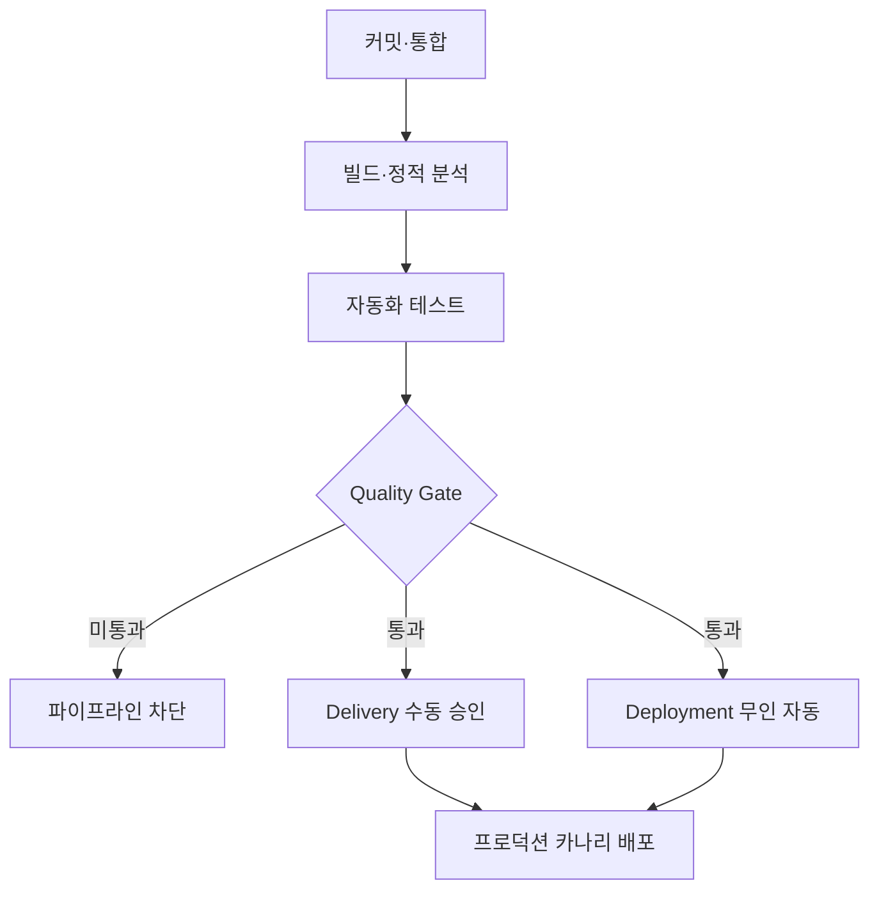

## 큰 그림과 30초 인출

- **본질**: 개발자가 작성한 코드를 중앙 저장소에 수시로 병합(CI)하고 자동화된 검증을 거쳐 운영 환경까지 안전하고 중단 없이 릴리스(CD)하는 지속적 소프트웨어 전달 공학 체계이다.
- **메커니즘**: 소스 커밋 $\rightarrow$ 정적 분석(SAST) 및 자동 빌드 $\rightarrow$ 자동화 테스트(단위/통합) $\rightarrow$ 컨테이너 패키징 및 SCA 검사 $\rightarrow$ 선언적 GitOps 풀(Pull) 배포 및 카나리 점진 전환 순으로 수행된다.
- **산출물**: CI/CD 파이프라인 정의서, 전자 서명된 컨테이너 이미지, DevSecOps 보안 분석 보고서, DORA 지표 대시보드.
---

## 1교시 예상문제 (10점)

> CI/CD(Continuous Integration/Continuous Delivery)의 정의와 목적, 핵심 메커니즘을 설명하시오. (예상)

---

## 1교시 10점 답안

### 1. 정의·목적

- 정의: 개발자가 작성한 코드를 중앙 저장소에 수시로 병합(CI)하고 자동화된 검증을 거쳐 운영 환경까지 안전하고 중단 없이 릴리스(CD)하는 지속적 소프트웨어 전달 공학 체계이다.
- 목적: 사용자에게 변경을 빠르고 안정적으로 전달하고 통합·배포 위험을 줄인다.

### 2. 핵심 관계

- 제언: CI에 자동 시험·보안 검사를 두고, 배포는 점진 전환과 DORA 지표로 관리한다.
---

## 2~4교시 예상문제 (25점)

> CI/CD(Continuous Integration/Continuous Delivery)의 개념과 목적을 설명하고, 핵심 메커니즘과 구성요소·절차, 적용 시 문제점과 대응 방안을 제시하시오. (25점, 예상)

---

## 2~4교시 25점 답안

### 핵심 메커니즘과 파이프라인 아키텍처

### (1) 지속적 제공(Continuous Delivery) vs 지속적 배포(Continuous Deployment)

| 비교 항목 | 지속적 제공 (Continuous Delivery) | 지속적 배포 (Continuous Deployment) |
|---|---|---|
| **프로덕션 릴리스 주체** | **인간(비즈니스 결정자/운영자)의 수동 승인** | **파이프라인 통과 시 100% 무인 자동 배포** |
| **자동화 범위** | 코드 커밋부터 스테이징 배포 및 릴리스 대기까지 | 코드 커밋부터 최종 프로덕션 서빙까지 전 구간 |
| **적합한 시스템 도메인** | 규제 준수(금융, 의료) 및 릴리스 일정 조율 필요 시스템 | 신속한 시장 피드백이 필수적인 클라우드 SaaS, 이커머스 |
| **핵심 선결 조건** | 자동화된 스테이징 검증 및 롤백 매뉴얼 | **카나리/블루그린 배포 및 메트릭 기반 자동 롤백 체계** |

### (2) 푸시(Push) 기반 배포 vs GitOps 풀(Pull) 기반 배포
- **전통적 푸시(Push) 방식**: CI 서버(Jenkins 등)가 프로덕션 K8s 클러스터의 마스터 권한(`kubeconfig`)을 직접 소지하고 배포를 명령함. CI 서버 침해 시 인프라 전체가 장악당하는 보안 위험 존재.
- **현대적 GitOps 풀(Pull) 방식**: 클러스터 내부의 에이전트(ArgoCD 등)가 Git 저장소의 선언적 YAML 명세를 주기적으로 감시(Pull)하여 클러스터 상태와 Git 상태를 일치시킴. 외부로 클러스터 권한을 노출하지 않는 Zero-Trust 배포 아키텍처 구현.

### (3) 파이프라인 DevSecOps 통합 (Shift-Left Security)
1. **Code 단계**: IDE 플러그인 및 사전 커밋 훅(Pre-commit hook)을 통해 소스코드 내 API 키, 패스워드 등 자격증명 노출을 원천 차단 (TruffleHog, Gitleaks).
2. **Build 단계**: 소나큐브(SonarQube) 정적 분석(SAST)으로 코딩 취약점을 조기 진단.
3. **Package 단계**: 소프트웨어 구성 분석(SCA)으로 서드파티 오픈소스 라이브러리의 CVE 취약점 점검 및 Cosign 기반 컨테이너 이미지 무결성 전자서명.
4. **Deploy 단계**: 동적 애플리케이션 보안 테스트(DAST) 및 카나리 롤아웃으로 런타임 보안과 안전성을 동시 확보.
---

### 실무 적용 및 도입 체크리스트

1. **트렁크 기반 개발(Trunk-Based Development)**: 장수명 기능 브랜치로 인한 '통합 지옥(Integration Hell)'을 방지하기 위해 최소 1일 1회 이상 메인 브랜치로 코드를 통합하고 있는가?
2. **빌드 파이프라인 격리 및 캐싱**: 도커 계층 캐싱과 의존성 캐시를 구성하여 CI 빌드 시간이 10분 이내로 유지되는가?
3. **외부 시크릿 관리 연계**: 배포 스크립트에 인증 토큰을 하드코딩하지 않고 HashiCorp Vault나 AWS Secrets Manager와 안전하게 연동하는가?
4. **카나리 자동 롤백 기준 수립**: 신규 버전 배포 시 Prometheus의 HTTP 5xx 에러율이 1%를 초과하면 1분 이내에 이전 버전으로 자동 복구되도록 설정되었는가?
---

### 실패 시나리오 및 트러블슈팅

| 위험 | 대책 | 효과 |
|---|---|---|
| **신규 배포 직후 런타임 장애로 전사 서비스 마비** | Argo Rollouts 기반 카나리 점진 트래픽 전환 및 에러율 기반 자동 롤백 | 장애 영향 범위를 전체의 5% 미만으로 격리 및 1분 내 자동 복구 |
| **CI 배포 로그 및 Git 커밋에 클라우드 API Key 노출** | Git 사전 커밋 훅(Gitleaks) 및 Vault 외부 시크릿 매니저 연동 | 중요 자격증명 및 API 토큰 유출 사고 100% 원천 차단 |
| **취약한 외부 오픈소스 유입으로 공급망 공격 발생** | CI 파이프라인 내 SCA 검사 강제 및 Cosign 전자서명 검증 적용 | 승인되지 않은 변조 이미지 배포 차단 및 공급망 보안 무결성 확보 |
---

### 차세대 확장 및 융합

- **플랫폼 엔지니어링(Platform Engineering)과 내부 개발자 플랫폼(IDP)**: 복잡해진 CI/CD와 클라우드 인프라 설정을 개발자가 직접 만지지 않고, 백스테이지(Backstage) 등의 포털을 통해 셀프서비스 형태로 표준 파이프라인을 프로비저닝하는 체계로 발전하고 있다.
- **AI 기반 CI/CD 최적화(AIOps)**: 배포 후 런타임 로그와 메트릭을 LLM 및 머신러닝 엔진이 실시간 모니터링하여 이상 징후를 감지하고, 빌드 실패 시 오류 로그를 분석하여 수정 코드를 자동 제안하는 자율 파이프라인으로 확장되고 있다.
---

### 실전 합격 전략 및 기술사적 제언

### 학습자 통찰 메모 — 답안 밖
- **[핵심 통찰]**: CI/CD의 핵심은 단순한 도구 체인(Jenkins, GitHub Actions) 설치가 아니라, '작고 빈번한 커밋(Trunk-based Development)'과 '실패 시 즉시 중단(Fail-Fast Quality Gate)'이라는 조직 문화의 정착이다. 자동화 테스트가 신뢰받지 못하면 CD는 불가능하다.
- **나라면**: 답안 2단락에 CI 4단계와 CD의 Delivery/Deployment 분기 메커니즘을 깔끔한 파이프라인 도해로 제시하고, 4단락에서는 GitOps Pull 모델과 DORA 4대 지표(배포 빈도, 변경 리드타임, 변경 실패율, 복구 시간)를 결합한 공급망 거버넌스를 완결성 있게 제시하겠다.

### 실전 답안용 기술사적 제언
- **판정 기준**: 신규 코드 병합 후 빌드 및 단위 테스트 완료 시간이 10분을 초과하거나 코드 커버리지가 80% 미만일 경우 파이프라인 진행을 차단하는 Quality Gate 적용.
- **대응 방안**: ArgoCD 기반의 GitOps Pull 모델을 도입하여 클러스터 접근 권한을 내재화하고, Cosign 이미지 서명과 Trivy SCA 검사를 결합한 DevSecOps 파이프라인 구축.
- **검증 체계**: 프로메테우스 기반 런타임 에러율(HTTP 5xx > 1%) 감지 시 카나리 파이프라인 자동 롤백 및 Slack/Teams 즉시 알림 트리거 연동.
- **기대 효과**: 배포 리드 타임 90% 단축(수일 $\rightarrow$ 수십 분) 및 프로덕션 릴리스 결함률 1% 미만 격리로 서비스 가용성(99.99%) 확보.
---
