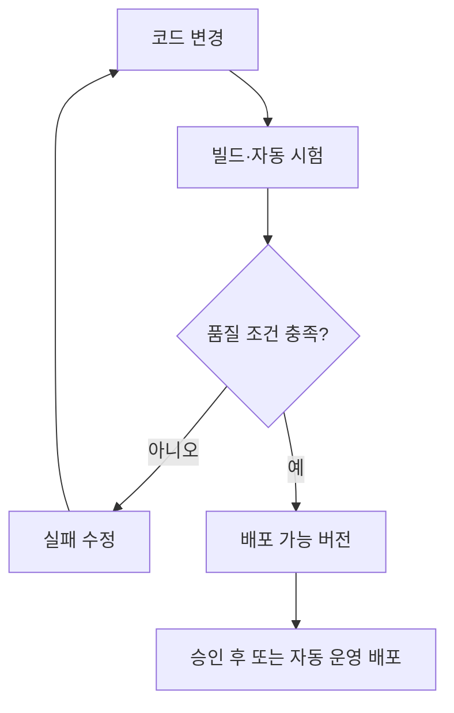

## 지식 로드맵 내 현재 위치

지식 위치: 소프트웨어 공학 → 빌드·배포·운영 → **CI/CD(Continuous Integration/Continuous Delivery)**

## 30초 인출

- 본질: **CI/CD(Continuous Integration/Continuous Delivery)**는 코드 변경을 자주 통합하고 자동 검증해 배포 가능한 소프트웨어를 지속적으로 전달하는 방식
- 메커니즘: 변경 통합 → 빌드·시험 → 배포 가능 상태 확인 → 승인 여부에 따라 릴리스 → 운영 결과 반영

핵심 용어

- **CI/CD(Continuous Integration/Continuous Delivery)**: 코드 변경의 통합·검증과 배포 가능한 버전의 지속적 전달을 자동화하는 개발 방식
- **지속적 제공(Continuous Delivery)**: 검증된 변경을 배포 가능한 상태로 유지하고, 실제 운영 반영은 필요에 따라 승인하는 방식
- **지속적 배포(Continuous Deployment)**: 검증을 통과한 변경을 운영 환경에 자동 배포하는 방식
- **파이프라인(Pipeline)**: 변경에 따라 빌드·시험·패키징·배포 작업을 순서대로 수행하는 자동화 절차
- **품질 게이트(Quality Gate)**: 정한 품질 조건 충족 여부에 따라 다음 파이프라인 단계를 허용하는 기준

---

## 1교시 예상문제 (10점)

> CI/CD의 정의와 목적, 지속적 제공과 지속적 배포의 차이를 설명하시오. (예상)

---

## 1교시 10점 답안

### Ⅰ. 개요

| 구분 | 핵심 |
|---|---|
| 정의 | **CI/CD(Continuous Integration/Continuous Delivery)**는 코드 변경의 통합·검증과 배포 가능한 버전의 지속적 전달을 자동화하는 개발 방식 |
| 목적 | 통합 지연과 수작업 배포 위험을 줄이고 검증된 변경을 짧은 주기로 제공 |

### Ⅱ. 파이프라인

### Ⅲ. 제공과 배포

| 구분 | 지속적 제공 | 지속적 배포 |
|---|---|---|
| 운영 반영 | 배포 가능한 상태까지 자동화, 반영 시점은 승인 가능 | 검증 통과 후 운영 반영까지 자동화 |
| 공통 전제 | 반복 가능한 빌드·자동 시험·배포 절차 | 반복 가능한 빌드·자동 시험·배포 절차 |

**제언:** 자동 시험 실패와 배포 후 이상 징후를 파이프라인의 중단·복구 기준에 연결.

---

## 2~4교시 예상문제 (25점)

> CI/CD의 개념과 파이프라인 작동을 설명하고, 지속적 제공·지속적 배포의 차이와 도입 시 고려사항을 제시하시오. (예상)

---

## 2~4교시 25점 답안

## Ⅰ. 개요

| 구분 | 핵심 |
|---|---|
| 정의 | **CI/CD(Continuous Integration/Continuous Delivery)**는 코드 변경의 통합·검증과 배포 가능한 버전의 지속적 전달을 자동화하는 개발 방식 |
| 목적 | 통합 지연과 수작업 배포 위험을 줄이고 검증된 변경을 짧은 주기로 제공 |

## Ⅱ. 파이프라인 작동

| 단계 | 핵심 활동 |
|---|---|
| 통합 | 작은 변경을 공유 저장소에 반영하고 충돌·빌드 오류 확인 |
| 검증 | 자동화 시험과 정적 검사를 통해 변경의 요구·품질 조건 확인 |
| 전달 | 검증된 버전과 배포 정보를 재현 가능한 형태로 보관 |
| 운영 반영 | 승인 또는 자동화 정책에 따라 배포하고 결과 감시 |

## Ⅲ. 지속적 제공과 지속적 배포

| 구분 | 지속적 제공(Continuous Delivery) | 지속적 배포(Continuous Deployment) |
|---|---|---|
| 자동화 경계 | 배포 가능한 상태까지 | 운영 반영까지 |
| 운영 반영 결정 | 담당자 승인 등 별도 결정 가능 | 품질 조건 통과 시 파이프라인이 자동 결정 |
| 공통 관리 | 시험 신뢰도·버전 이력·복구 가능한 배포 절차 | 시험 신뢰도·버전 이력·복구 가능한 배포 절차 |

## Ⅳ. 도입 위험과 대응

| 위험 | 대응 |
|---|---|
| 신뢰도가 낮은 자동 시험으로 결함 버전 전달 | 핵심 사용자 흐름·회귀 시험을 우선 자동화하고 실패 원인과 시험 범위 검토 |
| 비밀정보가 빌드 로그·배포 설정에 노출 | 비밀정보 저장소와 최소 권한을 적용하고 로그·산출물 노출 확인 |
| 배포 실패 후 복구 경로가 불명확 | 버전 고정·점진 배포·복구 절차를 변경 위험에 맞춰 설계 |
| 수작업 예외가 파이프라인 밖에서 반복 | 예외 승인·기록·사후 파이프라인 편입 기준 설정 |

## Ⅴ. 기술사적 제언 — 릴리스 경계의 단계적 자동화

| 한계 | 해결 방안 |
|---|---|
| 자동화 범위를 넓혀도 시험 신뢰도와 복구 준비가 부족하면 운영 장애의 영향 확대 가능성 | 배포 가능 버전 생성부터 자동화하고, 운영 반영은 승인·점진 배포·복구가 검증된 서비스부터 확대 |

## 출제 이력과 검증 출처

- [DORA, Continuous delivery](https://dora.dev/capabilities/continuous-delivery/) — 지속적 제공 역량과 배포 절차.
- [Martin Fowler, Continuous Integration](https://martinfowler.com/articles/continuousIntegration.html) — 통합 자동화의 기본 개념.

## 연결 토픽

- 연관 토픽: [DevOps](./002_devops.md), [무중단 배포](./007_zero_downtime_deployment.md), [OpenTelemetry](./096_opentelemetry.md)
