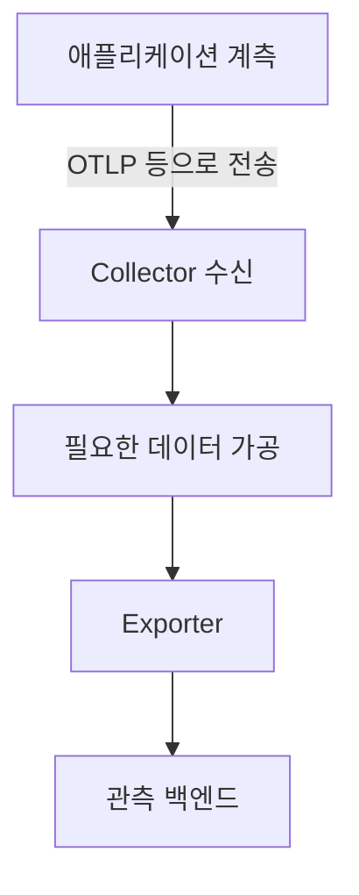
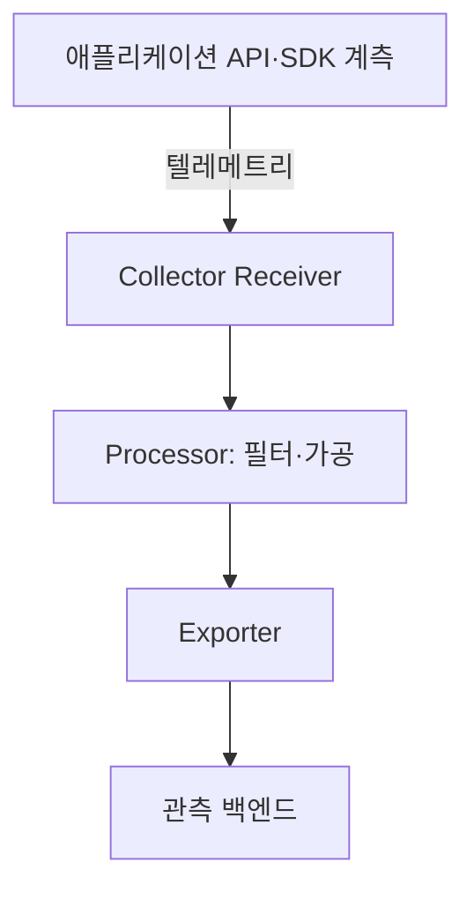
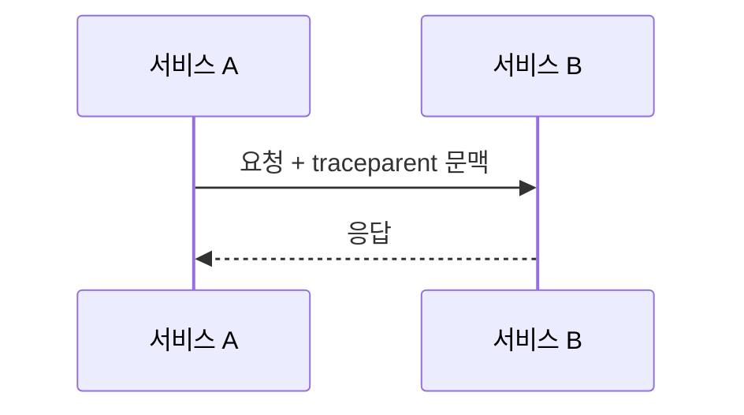

## 지식 로드맵 내 현재 위치

지식 위치: 소프트웨어 공학 → 운영·관측성 → **OpenTelemetry(관측성 표준)**

## 30초 인출

- 본질: **OpenTelemetry(OTel)**는 애플리케이션의 추적·지표·로그 데이터를 계측·수집·내보내는 벤더 중립 관측성 프레임워크
- 메커니즘: 애플리케이션에서 텔레메트리 생성 → 수집기에서 수신·가공·내보내기 → 백엔드에서 조회·분석

핵심 용어

- **OpenTelemetry(OTel)**: 텔레메트리 계측·수집·내보내기를 위한 벤더 중립 오픈소스 프레임워크
- **Trace(분산 추적)**: 요청이 여러 서비스와 작업을 거치는 경로를 연결해 기록한 데이터
- **Metric(지표)**: 시점·시간 구간에 따른 시스템 측정값
- **Log(로그)**: 발생한 사건을 기록한 데이터
- **OTLP(OpenTelemetry Protocol)**: OpenTelemetry 텔레메트리를 전송하는 프로토콜
- **Collector(수집기)**: 텔레메트리를 받아 처리한 뒤 하나 이상의 대상으로 내보내는 프록시
- **W3C Trace Context**: 서비스 간 추적 문맥을 전달하기 위한 웹 표준

---

## 1교시 예상문제 (10점)

> OpenTelemetry의 정의와 목적, 핵심 구성요소를 설명하시오. (예상)

---

## 1교시 10점 답안

### Ⅰ. 개요

| 구분 | 핵심 |
|---|---|
| 정의 | **OpenTelemetry(OTel)**는 텔레메트리 계측·수집·내보내기를 위한 벤더 중립 오픈소스 프레임워크 |
| 목적 | 여러 백엔드에서 공통 방식으로 관측 데이터를 활용하고 계측의 특정 제품 종속을 낮춤 |

### Ⅱ. 수집 구성

### Ⅲ. 텔레메트리 신호

| 신호 | 나타내는 정보 |
|---|---|
| Trace | 요청의 서비스 간 경로와 작업 관계 |
| Metric | 수치로 측정한 시스템·애플리케이션 상태 |
| Log | 사건의 시각·내용·문맥 |

**제언:** 수집 범위와 개인정보 처리 기준을 정한 뒤 필요한 텔레메트리만 백엔드로 전달.

---

## 2~4교시 예상문제 (25점)

> OpenTelemetry의 개념과 목적을 설명하고, 계측·문맥 전파·수집 구성요소의 관계와 도입 시 고려사항을 제시하시오. (예상)

---

## 2~4교시 25점 답안

## Ⅰ. 개요

| 구분 | 핵심 |
|---|---|
| 정의 | **OpenTelemetry(OTel)**는 텔레메트리 계측·수집·내보내기를 위한 벤더 중립 오픈소스 프레임워크 |
| 목적 | 여러 백엔드에서 공통 방식으로 관측 데이터를 활용하고 계측의 특정 제품 종속을 낮춤 |

## Ⅱ. 구성요소와 데이터 흐름

| 구성요소 | 역할 |
|---|---|
| API·SDK | 계측 인터페이스와 언어별 생성·처리 기능 |
| Receiver | 프로토콜·형식에 따라 데이터 수신 |
| Processor | 설정된 정책에 따른 배치·필터·변환 |
| Exporter | 처리 데이터를 설정된 대상에 전송 |

## Ⅲ. 분산 추적 문맥 전파

서비스 A가 추적 식별 문맥을 요청에 담아 전달하고, 서비스 B가 이를 이어받아 같은 요청 경로에 새 작업을 기록하는 관계.

## Ⅳ. 도입 시 고려사항

| 위험 | 대응 |
|---|---|
| 과도한 계측으로 저장·전송 비용 증가 | 업무상 필요한 계측과 보존 기간을 정하고 샘플링 정책 검토 |
| 문맥 단절로 서비스 간 추적이 이어지지 않음 | 지원 프로토콜의 문맥 전파 설정과 외부 경계 처리를 점검 |
| 로그·속성에 민감정보 포함 | 수집 전 데이터 최소화, 필터·마스킹, 접근 통제 적용 |
| Collector 장애·과부하가 데이터 손실로 연결 | 수집기 자체 상태와 버퍼·재시도 동작을 감시하고 용량·복구 방안 검토 |

## Ⅴ. 기술사적 제언 — 계측 정보의 안전한 전파

| 한계 | 해결 방안 |
|---|---|
| 서비스 간 추적 문맥이나 임의 속성에 내부 식별자·민감정보가 포함될 가능성 | 신뢰 경계에서 전달할 문맥·속성을 제한하고, 수집기 필터링과 백엔드 접근 권한을 함께 적용 |

## 출제 이력과 검증 출처

- [OpenTelemetry Documentation: Components](https://opentelemetry.io/docs/concepts/components/) — API·SDK와 Collector 구성.
- [OpenTelemetry Documentation: Signals](https://opentelemetry.io/docs/concepts/signals/) — 추적·지표·로그 등 신호.
- [OpenTelemetry Documentation: Context Propagation](https://opentelemetry.io/docs/concepts/context-propagation/) — W3C Trace Context 기반 문맥 전파.

## 연결 토픽

- 연관 토픽: [CI/CD](./095_ci_cd.md), [DataOps](./109_dataops.md)
