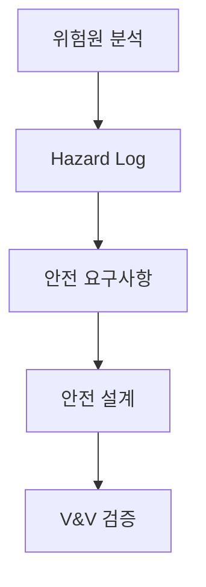

## 큰 그림과 30초 인출

- **본질**: 소프트웨어의 결함이나 오작동이 시스템 물리적 파괴, 인명 사상, 대규모 환경 재해로 이어지는 것을 막기 위해 개발 전 생명주기에 걸쳐 위험원(Hazard)을 선제 식별하고 페일세이프(Fail-Safe) 체계를 구축하는 제도적·공학적 안전 활동이다.
- **메커니즘**: 안전 계획 $\rightarrow$ 위험원 분석(PHA/FMEA/FTA/STPA) $\rightarrow$ 안전 요구사항 도출 $\rightarrow$ 안전 아키텍처 설계(이중화, 격리) $\rightarrow$ 안전 검증(V&V, HIL 결함 주입) $\rightarrow$ 안전 운영 순서로 통제한다.
- **산출물**: SW 안전관리 계획서, 위험원 등록부(Hazard Log), 안전 요구사항 추적표, 안전성 검증 보고서(V&V Report).
---

## 1교시 예상문제 (10점)

> SW 안전 (SW안전 확보 지침)의 정의와 목적, 핵심 메커니즘을 설명하시오. (예상)

---

## 1교시 10점 답안

### 1. 정의·목적

- 정의: 소프트웨어의 결함이나 오작동이 시스템 물리적 파괴, 인명 사상, 대규모 환경 재해로 이어지는 것을 막기 위해 개발 전 생명주기에 걸쳐 위험원(Hazard)을 선제 식별하고 페일세이프(Fail-Safe) 체계를 구축하는 제도적·공학적 안전 활동이다.
- 목적: 개발 생명주기에서 소프트웨어 위험원을 찾아 인명·환경·재산 피해로 이어지지 않게 한다.

### 2. 핵심 관계

- 제언: 위험 분석 결과를 안전 요구사항과 검증 증거에 연결하고 각 단계의 안전성 확인을 통과시킨다.
---

## 2~4교시 예상문제 (25점)

> SW 안전 (SW안전 확보 지침)의 개념과 목적을 설명하고, 핵심 메커니즘과 구성요소·절차, 적용 시 문제점과 대응 방안을 제시하시오. (25점, 예상)

---

## 2~4교시 25점 답안

### 핵심 메커니즘과 SW안전 프레임워크

### (1) SW 품질(Quality) vs SW 보안(Security) vs SW 안전(Safety)

| 구분 | SW 품질 (Quality) | SW 보안 (Security) | SW 안전 (Safety) |
|---|---|---|---|
| **핵심 목적** | 요구사항 명세대로 올바르게 작동하는가(Correctness) | 외부 악의적 공격자로부터 시스템을 보호하는가(Protection) | **오작동 시에도 인명 사상이나 환경 파괴가 없는가(Safety)** |
| **위협 요인** | 기능 미구현, 연산 버그, 사용자 편의성 결여 | 해킹, 악성코드, 데이터 유출, 권한 탈취 | **하드웨어 고장, 센서 오작동, 소프트웨어 데드락, 결함 전파** |
| **주요 활동** | 기능 테스트, 성능 테스트, 사용성 평가 | 취약점 진단, 암호화, 접근 제어, 침입 탐지 | **위험원 분석(Hazard Analysis), 페일세이프, V&V 검증** |
| **대표 표준** | ISO/IEC 25010 | ISO/IEC 27001, ISMS-P | **소프트웨어 진흥법 지침, ISO 26262, IEC 61508** |

### (2) 과학기술정보통신부 'SW안전 확보 지침' 6단계 생명주기
1. **안전 계획**: 대상 시스템의 안전 무결성 등급 평가 및 안전 관리자 지정, 안전 보증 계획 수립.
2. **위험원 분석**: 시스템 가동 중 발생 가능한 모든 위험원(Hazard)을 식별하고 심각도(Severity)와 발생 빈도(Frequency)를 산정하여 위험도 평가.
3. **안전 요구사항 도출**: 식별된 위험원을 허용 가능한 수준(ALARP)으로 제거·완화하기 위한 시스템 및 소프트웨어 기능 요구사항 명세.
4. **안전 아키텍처 설계**: 결함 감내(Fault-Tolerant), 페일세이프(Fail-Safe), 메모리 분리 격리(Memory Protection), 이중화/삼중화(2oo3) 아키텍처 반영.
5. **안전성 검증(V&V)**: MISRA-C/C++ 표준 기반 정적 코드 분석, HIL 환경 기반 결함 주입 시험(FIT), MC/DC 100% 구조적 커버리지 달성.
6. **안전 운영 및 유지보수**: 형상 변경 시 안전성 영향 평가 의무화 및 긴급 이상 징후 발생 시 안전 상태 자동 전이.

### (3) 대표적 위험원 분석 기법 (PHA, FMEA, FTA, STPA)
- **PHA (Preliminary Hazard Analysis)**: 개발 초기 개념 단계에서 잠재 위험 요소를 조기에 식별하는 예비 위험원 분석.
- **FMEA (상향식, Bottom-Up)**: 부품·단위 컴포넌트의 단일 고장 모드가 시스템 전체에 미치는 영향을 순차 추적.
- **FTA (하향식, Top-Down)**: 최상위 참사(Top Event)를 정의하고 불 대수(Boolean Logic)를 통해 근본 원인 조합(Cut Set)을 연역적으로 분석.
- **STPA (System-Theoretic Process Analysis)**: 단순 부품 고장을 넘어 정상 부품들 간의 복잡한 피드백 제어 및 상호작용 오류(Unsafe Control Action, UCA)를 체계적으로 분석하는 시스템 이론 기법.
---

### 실무 적용 및 도입 체크리스트

1. **위험원 등록부(Hazard Log) 운영**: 프로젝트 착수부터 폐기까지 모든 위험원 식별 번호와 완화 조치 상태를 단일 등록부로 추적 관리하는가?
2. **양방향 추적성(Bi-directional Traceability)**: 식별된 위험원 $\rightarrow$ 안전 요구사항 $\rightarrow$ 설계 모듈 $\rightarrow$ V&V 테스트 케이스 간 완벽한 추적 링크가 형성되어 있는가?
3. **하드웨어 와치독(Watchdog) 및 페일세이프 설계**: 프로세서 루프가 멈추거나 응답 지연 발생 시 즉시 시스템을 안전 상태(전원 차단 또는 기계식 브레이크 체결)로 전환하는 기구적 방어선이 구축되어 있는가?
4. **정적 코딩 표준 준수**: 임베디드 소스코드 전반에 걸쳐 포인터 널 참조, 버퍼 오버플로를 유발하는 동적 메모리 할당(malloc)을 금지하고 MISRA-C 룰을 통과하였는가?
---

### 실패 시나리오 및 트러블슈팅

| 위험 | 대책 | 효과 |
|---|---|---|
| **센서 지연으로 로봇 제어기 무한 대기 및 충돌 사고** | 하드웨어 와치독 연동 및 센서 타임아웃 시 즉시 물리 브레이크 체결(Fail-Safe) | 오작동 시 10ms 이내 강제 정지 및 인명 사상 사고 원천 방지 |
| **포인터 널 참조로 인한 제어기 런타임 크래시** | MISRA-C/C++ 표준 정적 분석 의무화 및 동적 메모리 할당 전면 금지 | 런타임 메모리 누수 및 크래시 위험 원천 차단 |
| **신규 패치 배포 후 기존 안전 인터록 기능 무력화** | 형상 변경 시 안전 영향성 평가 의무화 및 회귀 HIL 결함 주입 시험 재수행 | 변경으로 인한 사이드 이펙트 100% 검출 및 안전성 유지 |
---

### 차세대 확장 및 융합

- **복잡계 제어 시스템과 STPA의 표준화**: 도심항공교통(UAM), 자율주행차, 의료용 AI 로봇 등 복합 시스템에서는 개별 부품 고장보다 컴포넌트 간 상호작용 결함이 사고의 주원인이 되므로, ISO 26262/ISO 21448(SOTIF) 규격에서 STPA 적용이 의무화되고 있다.
- **AI 안전(Safety for AI)**: 딥러닝 기반 예측 모델의 확률적 불확실성을 통제하기 위해, 모델 예측값이 신뢰 구간을 벗어날 경우 결정론적 고전 안전 제어기로 즉시 제어권을 넘기는 이중화 안전 가드레일(Safety Wrapper) 기술이 도입되고 있다.
---

### 실전 합격 전략 및 기술사적 제언

### 학습자 통찰 메모 — 답안 밖
- **[핵심 통찰]**: SW 안전은 일반 SW 품질(버그 없음)이나 정보보안(침입 방지)과 명확히 구분되어야 한다. SW 안전의 핵심 척도는 "소프트웨어가 오작동하거나 멈추더라도 사람을 다치게 하거나 물리적 파괴를 일으키지 않는가(Fail-Safe)"이다.
- **나라면**: 답안 1단락에 품질/보안/안전의 3자 비교표를 명확히 제시하고, 2단락에 4대 위험원 분석 기법(PHA, FTA, FMEA, STPA)과 Hazard Log 중심의 양방향 추적성 구조를 도해화하겠다. 4단락에서는 생성형 AI/자율주행 환경에서 복잡계 상호작용 결함을 잡는 STPA 및 Safety Wrapper 가드레일을 기술사적 제언으로 연결하겠다.

### 실전 답안용 기술사적 제언
- **판정 기준**: 식별된 고위험도 위험원(Hazard Severity Class 1~2)의 완화율 100% 및 안전 필수 코드의 MC/DC 커버리지 100% 달성.
- **대응 방안**: 시스템 개발 초기부터 위험원 등록부(Hazard Log)를 가동하고, 2oo3 삼중화 투표 메커니즘과 하드웨어 독립 와치독 타이머를 적용한 Fail-Safe 아키텍처 설계.
- **검증 체계**: HIL(Hardware-in-the-Loop) 시뮬레이터 기반 물리적 단선·단락 및 센서 노이즈 결함 주입 시험(FIT)을 통해 10ms 이내 안전 상태 전이 검증.
- **기대 효과**: 제어 소프트웨어 단일 장애점(SPOF) 원천 배제 및 재난급 물리적 사고 예방을 통한 최고 수준의 기능 안전성(ASIL-D / SIL-4) 보증.
---
