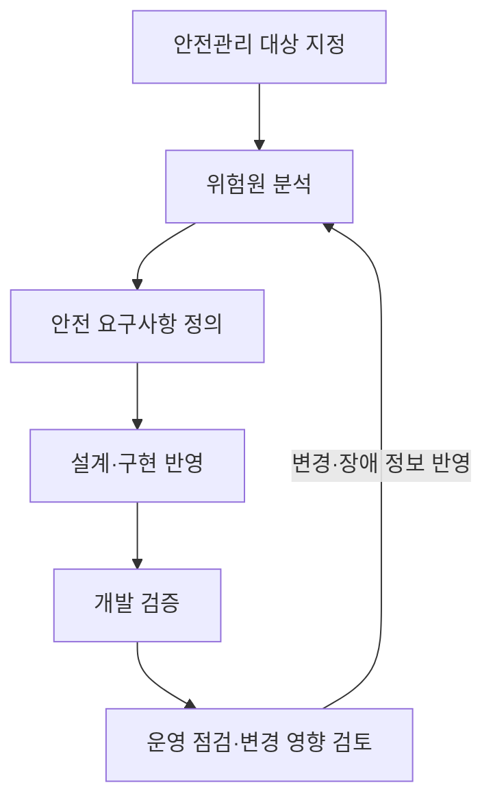
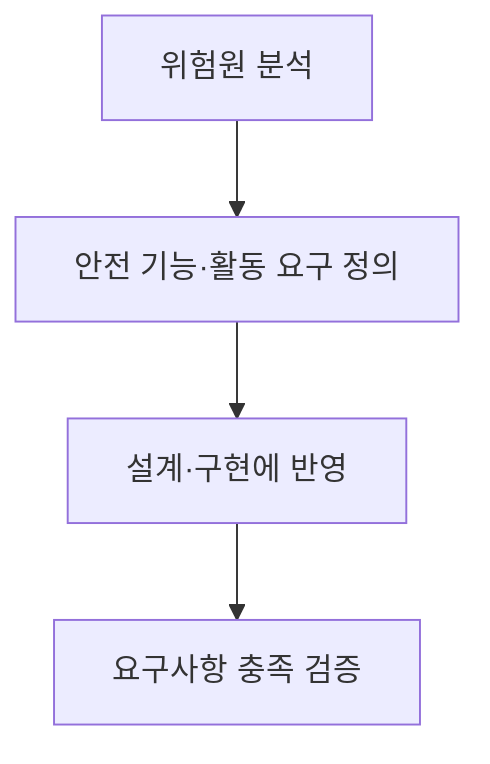

## 지식 로드맵 내 현재 위치

지식 위치: 소프트웨어 공학 → 안전·품질 → **SW 안전 (SW안전 확보 지침)**

## 30초 인출

- 본질: **소프트웨어 안전**은 내부 오작동과 안전기능 미비로 사람에게 생길 수 있는 위험에 대비한 상태
- 메커니즘: 대상 지정 → 위험원 분석·안전 요구 정의 → 설계·시험 → 운영 점검·변경 영향 검토

핵심 용어

- **소프트웨어 안전**: 내부 오작동·안전기능 미비로 생명·신체에 생길 수 있는 위험에 충분히 대비한 상태
- **안전관리 대상 소프트웨어**: 오작동·안전기능 미비가 생명·신체·재산에 위험을 줄 수 있어 공공기관이 지정한 소프트웨어
- **위험원(Hazard)**: 사람이나 시스템에 피해·손실을 일으킬 수 있는 원인
- **안전 요구사항(Safety Requirement)**: 사고 예방을 위해 필요한 안전 기능과 안전 활동에 관한 요구사항
- **안전 영향 분석**: 소프트웨어·운영 환경 변경이 기존 위험과 안전 요구에 미치는 영향을 검토하는 활동

---

## 1교시 예상문제 (10점)

> 소프트웨어 안전과 「소프트웨어안전 확보를 위한 지침」의 핵심 관리 흐름을 설명하시오. (예상)

---

## 1교시 10점 답안

### Ⅰ. 개요

| 구분 | 핵심 |
|---|---|
| 정의 | **소프트웨어 안전**은 내부 오작동·안전기능 미비로 생명·신체에 생길 수 있는 위험에 충분히 대비한 상태 |
| 목적 | 위험을 개발·운영 단계에서 찾아 안전 요구와 점검으로 관리 |

### Ⅱ. 안전 관리 흐름

### Ⅲ. 지침의 적용

| 구분 | 핵심 |
|---|---|
| 적용 | 공공기관이 안전 확보가 필요한 소프트웨어를 개발·운영할 때 적용 가능한 지침 |
| 대상 지정 고려 | 사회적 중요성, 연계성, 예상 피해 규모·범위, 발생 가능성·복구 용이성 |

**제언:** 대상 선정부터 변경 승인까지 위험 분석과 안전 요구사항의 연결 기록 유지.

---

## 2~4교시 예상문제 (25점)

> 소프트웨어 안전의 개념과 「소프트웨어안전 확보를 위한 지침」의 개발·운영 단계별 관리사항을 설명하시오. (예상)

---

## 2~4교시 25점 답안

## Ⅰ. 개요

| 구분 | 핵심 |
|---|---|
| 정의 | **소프트웨어 안전**은 내부 오작동·안전기능 미비로 생명·신체에 생길 수 있는 위험에 충분히 대비한 상태 |
| 목적 | 위험을 개발·운영 단계에서 찾아 안전 요구와 점검으로 관리 |

## Ⅱ. 대상 지정과 위험 분석

| 지정·분석 기준 | 확인 내용 |
|---|---|
| 업무 중요성 | 소프트웨어가 수행·지원하는 업무의 사회적 중요성 |
| 연계성 | 다른 소프트웨어·시스템과의 상호연계 |
| 피해·복구 | 사고 시 피해 범위와 복구 용이성 |
| 운영 이력 | 장애 사례, 운영 환경과 절차 |

## Ⅲ. 개발 단계의 안전 확보

「소프트웨어안전 확보를 위한 지침」 제6~9조에 따른 개발 관리의 요점: 위험 분석 결과를 안전 요구사항으로 구체화하고 설계·구현 및 검증에 반영.

## Ⅳ. 운영 단계의 안전 확보

| 관리 항목 | 주요 내용 |
|---|---|
| 운영관리 계획 | 역할·책임, 안전점검, 변경·장애관리, 교육훈련 |
| 위험 분석·점검 | 장애 이력, 운영환경·연계 시스템 변경, 운영 절차 검토 |
| 변경관리 | 변경의 안전 영향 검토와 책임자 승인, 필요 시 개발·검증 활동 재수행 |
| 장애관리 | 피해 확산 방지, 원인 분석·재발 방지, 백업·이중화 등 복구 대책 |

## Ⅴ. 기술사적 제언 — 변경 영향 검토의 우선 적용

| 한계 | 해결 방안 |
|---|---|
| 운영 환경이나 연계 시스템 변경이 안전 요구사항에 미치는 영향을 놓칠 가능성 | 변경 접수 시 위험·안전 요구·검증 항목의 영향 분석을 먼저 수행하고, 필요한 재시험과 승인 후 반영 |

## 출제 이력과 검증 출처

- [소프트웨어 진흥법 제30조, 국가법령정보센터](https://www.law.go.kr/lsInfoP.do?lsId=000751) — 소프트웨어안전 시책 및 지침의 법률 근거.
- [소프트웨어안전 확보를 위한 지침, 국가법령정보센터](https://www.law.go.kr/LSW/admRulLsInfoP.do?admRulSeq=2100000195703) — 제2020-77호, 대상 지정·위험 분석·개발·운영 안전관리 조항.

## 연결 토픽

- 연관 토픽: [STPA](./108_stpa.md), [소프트웨어 안전성 분석](./028_sw_safety_analysis.md), [요구사항 추적표](./102_requirement_traceability_matrix.md)
