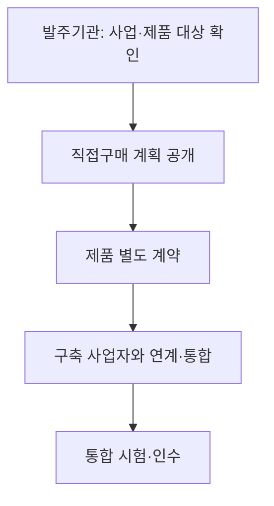
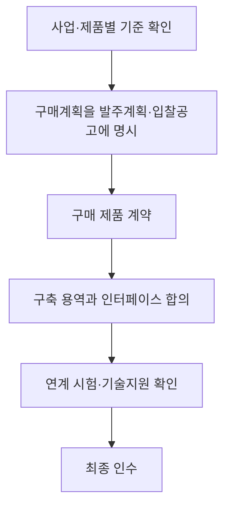

---
title: "상용SW 직접구매 확대"
author: "Codex"
date: "2026-09-24T16:43:00+09:00"
tags:
  - "notes-software-engineering"
sidebar:
  badge:
    text: "서브"
extra:
  model: "GPT-6"
  keyword_grade: "서브"
---

## 지식 로드맵 내 현재 위치

지식 위치: 소프트웨어 공학 → 공공 소프트웨어 조달 → **상용SW 직접구매 확대**

## 30초 인출

- 본질: **상용 소프트웨어 직접구매**는 공공기관이 사업에 쓰이는 상용SW를 정해진 기준에 따라 별도 구매하는 방식
- 메커니즘: 대상 사업·제품 확인 → 예외 사유 검토 → 구매계획 공개·계약 → 시스템 연계·인수

핵심 용어

- **상용SW 직접구매**: 국가기관 등이 상용 소프트웨어가 쓰이는 사업에서 법정 기준에 따라 해당 제품을 직접 구매하는 제도
- **분리발주**: 소프트웨어 제품 구매와 개발·통합 용역을 별도 계약으로 발주하는 방식
- **통합 책임**: 별도 구매 제품과 구축 시스템이 함께 작동하도록 연결·시험·인수 범위를 정하는 책임
- **기술지원 확약서**: 직접구매 제품의 사후 기술지원 범위를 확인하기 위해 사업자가 요청할 수 있는 문서

---

## 1교시 예상문제 (10점)

> 상용SW 직접구매의 정의와 목적, 대상 확인 및 시스템 통합 흐름을 설명하시오. (예상)

---

## 1교시 10점 답안

### Ⅰ. 개요

| 구분 | 핵심 |
|---|---|
| 정의 | **상용SW 직접구매**는 국가기관 등이 상용 소프트웨어가 쓰이는 사업에서 법정 기준에 따라 해당 제품을 직접 구매하는 제도 |
| 목적 | 제품 구매와 구축 용역의 계약 범위를 분명히 하고 상용SW 구매·사용 조건을 명확화 |

### Ⅱ. 구매·통합 흐름

### Ⅲ. 기준과 책임

| 검토 항목 | 핵심 |
|---|---|
| 대상 사업 | 총사업규모 3억 원 이상인 소프트웨어사업 |
| 제품 대상 | 원칙적으로 부가가치세 포함 5천만 원 이상이며 고시상 요건 해당 제품; 종합쇼핑몰·디지털서비스몰 등록 제품은 금액 예외 |
| 통합관리 | 제품 공급자와 구축사업자의 연계 범위·시험·지원 책임을 계약 문서에서 구체화 |

**제언:** 직접구매 대상과 제외 검토 결과를 계획서에 남기고 연계·인수 책임을 계약 전에 합의.

---

## 2~4교시 예상문제 (25점)

> 상용SW 직접구매의 제도와 대상 기준을 설명하고, 예외 검토·계약·시스템 통합 단계의 관리 방안을 제시하시오. (예상)

---

## 2~4교시 25점 답안

## Ⅰ. 개요

| 구분 | 핵심 |
|---|---|
| 정의 | **상용SW 직접구매**는 국가기관 등이 상용 소프트웨어가 쓰이는 사업에서 법정 기준에 따라 해당 제품을 직접 구매하는 제도 |
| 목적 | 제품 구매와 구축 용역의 계약 범위를 분명히 하고 상용SW 구매·사용 조건을 명확화 |

## Ⅱ. 적용 대상 판단

| 기준 | 현행 고시 내용 |
|---|---|
| 사업 규모 | 총사업규모 3억 원 이상 소프트웨어사업; 추정가격에 부가가치세를 포함한 금액 기준 |
| 제품 가격 | 통상 부가가치세 포함 5천만 원 이상이면서 고시상 등록·인증 등 요건에 해당하는 제품 |
| 등록 제품 예외 | 종합쇼핑몰·디지털서비스몰 등록 제품은 5천만 원 미만이어도 대상에 포함 |
| 다량 구매 | 같은 제품의 여러 개 구매로 총액이 기준을 넘는 경우 대상 판단에 반영 |

## Ⅲ. 발주·계약·통합 절차

## Ⅳ. 예외 및 통합 관리

| 위험 | 대응 |
|---|---|
| 예외 사유를 편의상 적용해 직접구매 검토가 누락 | 고시 제8조의 제외 사유에 해당하는지 확인하고 발주 경로별 사전 검토 절차 이행 |
| 제품·용역의 인터페이스와 인수 기준 불명확 | 제안요청서·계약서에 연계 범위, 책임자, 시험·검수 기준 기재 |
| 제품 지원이 구축 일정과 맞지 않음 | 공급자 기술지원 범위와 일정, 장애 대응 창구를 확인하고 통합 시험 계획에 반영 |

## Ⅴ. 기술사적 제언 — 통합 책임의 사전 확정

| 문제 | 해결 방안 |
|---|---|
| 별도 구매한 제품과 구축 시스템의 연결 실패 시 공급자·구축사업자 간 책임 공백 가능성 | 구매계획 단계에서 인터페이스·시험·인수 기준과 주관 책임자를 정하고 양측 참여 통합시험을 계약 범위에 반영 |

## 출제 이력과 검증 출처

- [소프트웨어 진흥법 제54조, 국가법령정보센터](https://www.law.go.kr/lsInfoP.do?lsId=000751) — 국가기관등의 상용소프트웨어 직접구매.
- [소프트웨어사업 계약 및 관리감독에 관한 지침 제7·8조, 국가법령정보센터](https://www.law.go.kr/LSW/admRulLsInfoP.do?admRulSeq=2100000223356) — 대상 사업·제품 기준과 제외 절차.

## 연결 토픽

- 연관 토픽: [소프트웨어 요구사항 추적표](./102_requirement_traceability_matrix.md), [원격지 개발](./103_remote_development.md)
