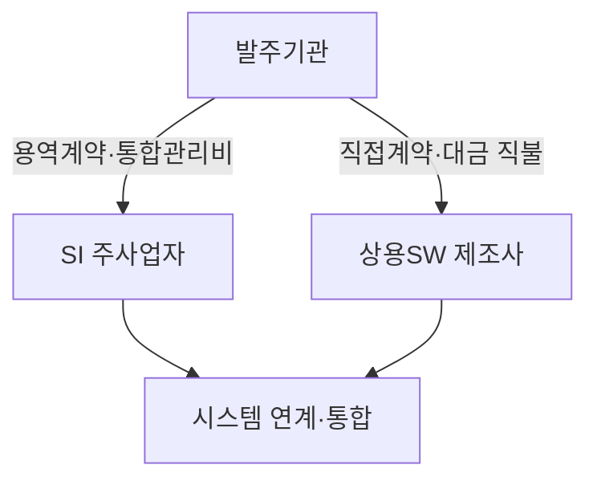

## 큰 그림과 30초 인출

- **본질**: 공공 SI 사업 발주 시 대형 원청 사업자가 상용 소프트웨어 도입 단가를 후려치는 하도급 불공정 관행을 차단하기 위해, 발주 공공기관이 조달청을 통해 상용SW를 별도로 직접 계약·구매하여 제값을 보장하는 법정 제도이다.
- **메커니즘**: 사업 기획 $\rightarrow$ 직접구매 대상 검토(과업심의위원회) $\rightarrow$ 조달청 디지털서비스몰 분리 발주 공고 $\rightarrow$ 직접 계약 및 대금 직불 $\rightarrow$ SI 주사업자 연계 통합(통합관리비 지급) 순으로 진행된다.
- **산출물**: 상용SW 직접구매 타당성 검토서, 과업심의위원회 심의의결서, 조달청 분리발주 계약서, 상용SW-SI 인터페이스 연계 확약서.
---

## 1교시 예상문제 (10점)

> 상용SW 직접구매 확대의 정의와 목적, 핵심 메커니즘을 설명하시오. (예상)
---

## 1교시 10점 답안

### 1. 정의·목적

- 정의: 공공 SI 사업 발주 시 대형 원청 사업자가 상용 소프트웨어 도입 단가를 후려치는 하도급 불공정 관행을 차단하기 위해, 발주 공공기관이 조달청을 통해 상용SW를 별도로 직접 계약·구매하여 제값을 보장하는 법정 제도이다.
- 목적: 해당 토픽의 주요 문제를 해결하고 필요한 기능을 제공한다.

### 2. 핵심 관계

- 제언: 핵심 작동 원리를 적용해 직접 효과를 검증한다.
---

## 2~4교시 예상문제 (25점)

> 상용SW 직접구매 확대의 개념과 목적을 설명하고, 핵심 메커니즘과 구성요소·절차, 적용 시 문제점과 대응 방안을 제시하시오. (25점, 예상)
---

## 2~4교시 25점 답안

### 핵심 메커니즘과 계약·거버넌스 구조

### (1) 상용SW 직접구매(분리발주) vs SI 통합발주 비교

| 비교 항목 | SI 통합발주 (전통적 방식) | 상용SW 직접구매 (분리발주 방식) |
|---|---|---|
| **계약 주체** | 발주기관 $\rightarrow$ SI 주사업자 (일괄 계약) | **발주기관 $\rightarrow$ 상용SW 제조사 (별도 직접 계약)** |
| **대금 지급 경로** | SI 주사업자가 하도급 대금 지급 (후려치기 발생) | **발주기관이 SW 제조사에 대금 100% 직접 지급** |
| **도입 단가 보장** | 원청 SI의 이윤 차감으로 50~70% 헐값 납품 강요 | **조달청 등록 단가 기준 제값 보장** |
| **시스템 통합 책임**| 주사업자가 전적인 연계 및 통합 책임 부담 | **주사업자와 상용SW 제조사 간 책임 분산 (통합관리비 필요)** |
| **산업 생태계 영향**| 저부가가치 용역 파견 중심의 하도급 구조 고착 | **국내 패키지 SW 및 클라우드 SaaS 육성 마중물** |

### (2) 법적 근거 및 의무화 대상 기준
- **법적 근거**: 소프트웨어 진흥법 제54조(상용소프트웨어 직접구매).
- **의무화 대상 기준**:
  - 총 사업금액이 **3억 원 이상**인 공공 소프트웨어 사업.
  - 해당 사업에 포함된 개별 상용소프트웨어 품목의 추정가격이 **5천만 원 이상**인 경우.
- **예외 인정 사유**: 현저한 비용 증가, 호환성 문제, 심각한 일정 지연이 객관적으로 입증되어 **과업심의위원회**의 사전 심의·의결을 거친 경우에만 극히 제한적으로 SI 통합발주를 허용함.

### (3) 시스템 연계 책임 공백 해소 메커니즘: 통합관리비
- 상용SW 제조사와 주사업자가 분리 계약됨에 따라, 런타임 인터페이스 장애 시 상호 책임을 전가하는 "핑퐁 분쟁"이 발생하기 쉬움.
- **공학적 해결책**: 발주기관은 SI 주사업자 사업비 내에 직접구매 대상 상용SW 가격의 일정 비율(통상 3~5%)을 **'소프트웨어 통합관리비'**로 공식 계상하여 지급하고, 주사업자에게 시스템 연계 테스트 및 최종 품질 보증 책임을 계약서상에 명문화함.
---

### 실무 적용 및 도입 체크리스트

1. **과업심의위원회 타당성 심의**: 발주기관 담당자가 조달 행정 편의를 이유로 직접구매를 회피하지 못하도록 심의 절차를 투명하게 공개하였는가?
2. **조달청 디지털서비스몰 우선 구매**: 국가 조달 플랫폼에 등록된 GS인증 1등급 상용SW 및 혁신시제품을 최우선으로 검토하였는가?
3. **RFP 상 인터페이스 규격 명시**: 발주 제안요청서에 직접구매 상용SW의 명칭, 버전, API 연계 규격을 상세히 명시하여 SI 입찰자가 연계 범위를 명확히 파악하도록 하였는가?
4. **유지관리요율 법정 가이드라인 준수**: 라이선스 구매 후 유지관리비 산정 시 법정 권고 요율(15~20%)을 준수하여 예산을 편성하였는가?
---

### 실패 시나리오 및 트러블슈팅

| 위험 | 대책 | 효과 |
|---|---|---|
| **상용SW-SI 애플리케이션 연동 오류 시 상호 책임 전가** | RFP에 연계 규격 명시 및 주사업자 계약 시 통합관리비(3~5%) 공식 계상 | 장애 원인 규명 시간 70% 단축 및 핑퐁 분쟁 근절 |
| **발주자 행정 편의로 상용SW 직접구매 편법 회피** | 과업심의위 예외 심의 절차 강화 및 조달청 MAS 패스트트랙 활성화 | 상용SW 직접구매 법정 준수율 95% 이상 달성 |
| **구매 후 8%대 저가 유지관리비 책정으로 SW사 경영난** | 공공 소프트웨어 유지관리 대가 하한선(15%) 예산 편성 의무화 | 상용SW 생태계 R&D 선순환 기반 마련 및 기술 지원 안정화 |
---

### 차세대 확장 및 융합

- **클라우드 서비스(SaaS) 직접구매로의 패러다임 전환**: 온프레미스 설치형 패키지 중심의 직접구매에서 탈피하여, 공공 조달 디지털서비스몰에 등록된 검증된 민간 클라우드 SaaS(CSAP 인증)를 월간/연간 정기 구독(ARR) 형태로 직접 도입하는 체계로 진화하고 있다.
- **소프트웨어 제값 주기 거버넌스 고도화**: 단순 직접구매를 넘어 요구사항 상세화, 과업 변경 시 적정 대가 지급, 상용SW 유지관리요율 현실화가 종합적으로 결합된 국가 소프트웨어 진흥 생태계로 발전하고 있다.
---

### 실전 합격 전략 및 기술사적 제언

### 학습자 통찰 메모 — 답안 밖
- **[핵심 통찰]**: 상용SW 직접구매의 본질은 중소 소프트웨어 기업의 생존권 보장과 '제값 주기'이다. 하지만 현장에서 발주자가 가장 두려워하는 것은 '연계 장애 시의 책임 핑퐁'이다. 따라서 기술사 답안에서는 법적 의무 규정만 나열할 것이 아니라, '통합관리비(3~5%) 공식 계상'과 'RFP 내 API 사전 규격화'라는 실무 해법을 반드시 제시해야 차별화된다.
- **나라면**: 답안 2단락에 사업비 3억 / 개별 SW 5천만 원 기준과 과업심의위 심의 프로세스를 명시하고, 3단락에서 통합관리비 수령 및 E2E 합동 테스트 체계를 도해화하겠다. 4단락에서는 단순 구축형 패키지 분리발주를 넘어 공공 부문 CSAP 클라우드 SaaS 구독형 직접구매 확대를 제언하겠다.

### 실전 답안용 기술사적 제언
- **판정 기준**: 공공 SW 사업비 3억 원 이상 사업 내 5천만 원 이상 상용SW 직접구매율 100% 달성 및 예외 통합발주 시 과업심의위 사전 의결 필수 준수.
- **대응 방안**: 주사업자 용역 계약 시 상용SW 금액의 3~5%를 '소프트웨어 통합관리비'로 법정 계상하고, 상용SW 제조사의 기술지원 확약서 징구를 의무화.
- **검증 체계**: 발주 단계의 제안요청서(RFP) API 규격 사전 명시 검증 및 통합 단계의 E2E 합동 테스트 시나리오 기반 연계 적합성 판정.
- **기대 효과**: 상용SW 하도급 단가 후려치기 근절로 국내 패키지 SW R&D 선순환 유도 및 연계 장애 시 책임 공백 해소.
---
