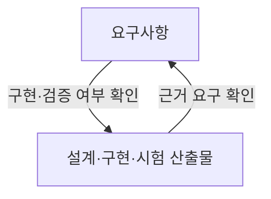
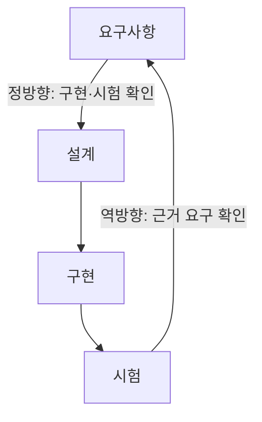

---
title: "요구사항 추적표(Requirement Traceability Matrix)"
author: "Codex"
date: "2026-09-24T16:43:00+09:00"
tags:
  - "notes-software-engineering"
sidebar:
  badge:
    text: "서브"
extra:
  model: "GPT-6"
  keyword_grade: "서브"
---

## 지식 로드맵 내 현재 위치

지식 위치: 소프트웨어 공학 → 요구공학·검증 → **요구사항 추적표(Requirement Traceability Matrix)**

## 30초 인출

- 본질: **요구사항 추적표(RTM)**는 요구사항과 설계·구현·시험 산출물의 연결 정보를 관리하는 표
- 메커니즘: 요구 ID에 관련 산출물을 연결하고 양방향으로 확인해 누락·불필요 항목과 변경 영향을 찾음

핵심 용어

- **요구사항 추적표(RTM, Requirement Traceability Matrix)**: 요구사항과 관련 산출물 사이의 연결 관계를 기록·점검하는 표
- **정방향 추적(Forward Traceability)**: 요구사항에서 설계·구현·시험으로 연결을 따라가 구현·검증 여부를 확인하는 방식
- **역방향 추적(Backward Traceability)**: 산출물에서 근거 요구사항으로 거슬러 올라가 불필요하거나 근거 없는 산출물을 확인하는 방식
- **영향 분석(Impact Analysis)**: 요구사항 변경이 연관 산출물·시험에 미치는 범위를 확인하는 활동

---

## 1교시 예상문제 (10점)

> 요구사항 추적표(RTM)의 정의와 목적, 정·역방향 추적의 차이를 설명하시오. (예상)

---

## 1교시 10점 답안

### Ⅰ. 개요

| 구분 | 핵심 |
|---|---|
| 정의 | **요구사항 추적표(RTM, Requirement Traceability Matrix)**는 요구사항과 관련 산출물 사이의 연결 관계를 기록·점검하는 표 |
| 목적 | 구현·시험 누락과 요구 근거가 없는 산출물을 확인하고 변경 영향 분석 지원 |

### Ⅱ. 양방향 추적

### Ⅲ. 추적 방향별 확인

| 방향 | 확인 질문 |
|---|---|
| 정방향 | 각 요구사항이 설계·구현·시험으로 이어졌는가 |
| 역방향 | 각 산출물에 승인된 요구사항 근거가 있는가 |

**제언:** 요구사항 변경 시 연결 산출물과 회귀 시험 범위를 함께 갱신.

---

## 2~4교시 예상문제 (25점)

> 요구사항 추적표의 개념과 구성, 정·역방향 추적 및 변경 영향 분석 절차를 설명하고 적용 시 고려사항을 제시하시오. (예상)

---

## 2~4교시 25점 답안

## Ⅰ. 개요

| 구분 | 핵심 |
|---|---|
| 정의 | **요구사항 추적표(RTM, Requirement Traceability Matrix)**는 요구사항과 관련 산출물 사이의 연결 관계를 기록·점검하는 표 |
| 목적 | 구현·시험 누락과 요구 근거가 없는 산출물을 확인하고 변경 영향 분석 지원 |

## Ⅱ. 구성 정보

| 필드 | 관리 내용 |
|---|---|
| 요구사항 ID·출처 | 요구사항을 식별하고 근거 문서·이해관계자와 연결 |
| 산출물 식별자 | 설계 요소·코드 변경·시험 케이스 등의 연결 대상 |
| 상태·검증 증거 | 검토·구현·시험 상태와 관련 기록 |

## Ⅲ. 추적 방향과 확인 범위

| 추적 방향 | 확인 내용 |
|---|---|
| 정방향 | 승인된 요구사항이 설계·구현·시험으로 이어지는지 확인 |
| 역방향 | 설계·구현·시험 산출물이 승인된 요구사항에 근거하는지 확인 |

## Ⅳ. 변경 영향 분석과 운영 고려사항

| 작업 | RTM 활용 |
|---|---|
| 요구 변경 접수 | 변경된 요구 ID와 변경 사유 기록 |
| 영향 범위 확인 | 연결된 설계·코드·인터페이스·시험 항목 식별 |
| 변경 반영 | 승인된 산출물과 시험 범위 갱신 |
| 검토·인수 | 미연결 요구·산출물, 변경 후 시험 증거 확인 |

## Ⅴ. 기술사적 제언 — 변경 영향 기준의 일관성

| 문제 | 해결 방안 |
|---|---|
| 요구 변경은 반영됐지만 추적표와 관련 시험이 뒤따르지 않아 검증 공백 발생 가능성 | 변경 승인 시 연관 산출물·시험 항목을 함께 갱신하고, 변경 검토에서 미연결 항목을 확인 |

## 출제 이력과 검증 출처

- ISO/IEC/IEEE 29148:2018, *Systems and software engineering — Life cycle processes — Requirements engineering*.
- [NASA Systems Engineering Handbook](https://www.nasa.gov/reference/systems-engineering-handbook/) — 요구사항 추적과 검증 관리 원칙.

## 연결 토픽

- 연관 토픽: [요구사항 명세](./054_requirements_specification.md), [ALM](./107_alm.md), [테스트 커버리지](./118_test_coverage.md)
