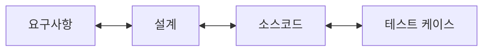

## 큰 그림과 30초 인출

- **본질**: 고객의 초기 요구사항부터 시스템 설계, 소스코드 모듈, 테스트 케이스까지 SDLC 전 단계 산출물을 고유 식별자(ID)로 상호 연결하여, 기능 누락과 불필요한 군더더기 개발(Gold Plating)을 방지하는 추적 공학 매트릭스이다.
- **메커니즘**: 요구사항 고유 ID 부여 $\rightarrow$ 설계/코드/테스트 산출물 1:N 매핑 $\rightarrow$ 정방향 추적(누락 차단) 및 역방향 추적(고아 코드 차단) $\rightarrow$ 요구사항 변경 시 영향 범위(Impact) 산출 순으로 제어한다.
- **산출물**: 요구사항 추적표(RTM), 양방향 추적성 보고서, 변경 영향도 분석서, 프로젝트 감리 적합성 증빙.
---

## 1교시 예상문제 (10점)

> 요구사항 추적표(Requirement Traceability Matrix)의 정의와 목적, 핵심 메커니즘을 설명하시오. (예상)
---

## 1교시 10점 답안

### 1. 정의·목적

- 정의: 고객의 초기 요구사항부터 시스템 설계, 소스코드 모듈, 테스트 케이스까지 SDLC 전 단계 산출물을 고유 식별자(ID)로 상호 연결하여, 기능 누락과 불필요한 군더더기 개발(Gold Plating)을 방지하는 추적 공학 매트릭스이다.
- 목적: 요구사항의 설계·코드·시험 연결을 추적해 누락과 변경 영향 범위를 확인한다.

### 2. 핵심 관계

- 제언: 요구사항 ID를 양방향으로 연결하고 변경 시 영향 분석과 시험 범위 갱신을 함께 수행한다.
---

## 2~4교시 예상문제 (25점)

> 요구사항 추적표(Requirement Traceability Matrix)의 개념과 목적을 설명하고, 핵심 메커니즘과 구성요소·절차, 적용 시 문제점과 대응 방안을 제시하시오. (25점, 예상)
---

## 2~4교시 25점 답안

### 핵심 메커니즘과 양방향 추적 구조

### (1) 정방향 추적성(Forward) vs 역방향 추적성(Backward)

| 구분 | 정방향 추적성 (Forward Traceability) | 역방향 추적성 (Backward Traceability) |
|---|---|---|
| **추적 방향** | **요구사항 $\rightarrow$ 설계 $\rightarrow$ 소스코드 $\rightarrow$ 테스트 케이스** | **테스트 케이스 $\rightarrow$ 소스코드 $\rightarrow$ 설계 $\rightarrow$ 요구사항** |
| **핵심 목적** | **요구사항의 구현 누락 방지 (완전성, Completeness)** | **불필요한 기능(Gold Plating) 및 고아 산출물 방지** |
| **판정 질문** | "발주자가 요청한 기능이 빠짐없이 설계되고 테스트되었는가?" | "현재 작성된 코드와 테스트가 어떤 요구사항을 위해 존재하는가?" |
| **결함 유형** | **미구현 결함(Missing Feature)** | **고아 산출물(Orphan Artifact), 범위 크립(Scope Creep)** |

### (2) 요구사항 추적표(RTM) 표준 구성 체계

| 요구사항 ID | 요구사항 명세 | 설계 ID | 소스코드 ID | 테스트 케이스 ID | 검증 상태 |
|---|---|---|---|---|---|
| **REQ-001** | 사용자 생체 인증 로그인 | DSN-101 (아키텍처) DSN-102 (화면) | `AuthService.java` `LoginView.vue` | TC-001 (단위) TC-002 (통합) | 통과 (Pass) |
| **REQ-002** | 해외 결제 이상 탐지 | DSN-201 (FDS 모델) | `FdsEngine.py` | TC-010 (E2E) | 진행 중 |

### (3) 변경 영향도 분석(Impact Analysis) 나침반
- 프로젝트 진행 도중 고객의 요구사항 변경 요청(CR)이 발생했을 때, RTM을 통해 해당 요구사항과 연결된 **설계 클래스, 수정 대상 소스코드 파일, 재실행해야 할 회귀 테스트 케이스 목록**을 즉시 식별하여 공수와 리스크를 사전에 정량 산출함.
---

### 실무 적용 및 도입 체크리스트

1. **식별자 체계 표준화**: 요구사항(REQ), 아키텍처(ARC), 상세설계(DSN), 프로그램(SRC), 테스트(TC) 간 계층적 ID 명명 규칙이 수립되어 있는가?
2. **미할당 및 고아 산출물 제로화**: 하위 설계로 이어지지 않는 요구사항(누락 결함)이나 상위 요구사항이 없는 임의의 코드(고아 코드)가 0건인지 주기적으로 검증하는가?
3. **ALM 도구 자동 연계**: 엑셀 수작업 대신 Jira, Confluence, Git 저장소(GitLab/GitHub)를 연동하여 커밋 메시지에 요구사항 ID 기재 시 RTM이 실시간 자동 갱신되는가?
4. **단계별 검수 마일스톤 필수 산출물 지정**: 설계 완료, 개발 완료, 시험 완료 시점마다 감리 및 발주자 품질 게이트 통과 기준으로 RTM 최신화를 강제하고 있는가?
---

### 실패 시나리오 및 트러블슈팅

| 위험 | 대책 | 효과 |
|---|---|---|
| **인수 테스트 단계에서 핵심 요구사항 미구현 뒤늦게 발견** | 단계별 RTM 정방향 추적성 전수 점검 및 미매핑 항목 품질 게이트 차단 | 요구사항 구현 누락률 0% 달성 및 납기 지연 방지 |
| **요구사항 1건 변경 시 수정 모듈 파악에 수주일 소요** | ALM 도구(Jira-GitLab) 기반 역방향 RTM 자동화 파이프라인 구축 | 변경 영향도 분석 시간 2주에서 1시간 이내로 단축 |
| **감리 직전 수작업 엑셀 짜맞추기로 RTM 고아화** | Git 커밋 시 REQ 번호 검증(Commitlint) 및 Living RTM 자동 배포 | RTM 현행화 공수 80% 절감 및 실시간 감사 증적 확보 |
---

### 차세대 확장 및 융합

- **Living RTM (살아있는 추적성 파이프라인)**: 정적인 스프레드시트 작성을 탈피하여, 개발자가 Git 커밋 메시지와 PR에 이슈 키를 태깅하면 CI/CD 빌드 시점에 자동으로 요구사항-코드-테스트 매핑 웹 리포트가 생성되는 Living RTM 체계가 확산되고 있다.
- **AI 기반 요구사항 매핑 및 누락 탐지**: 대규모 자연어 SRS 문서와 소스코드를 LLM 임베딩 벡터로 분석하여, 의미론적으로 연결되지 않은 요구사항이나 누락된 테스트 케이스를 자동으로 찾아내어 매핑을 추천하는 AI ALM 기술이 도입되고 있다.
---

### 실전 합격 전략 및 기술사적 제언

### 학습자 통찰 메모 — 답안 밖
- **[핵심 통찰]**: RTM의 실무적 실패 원인 1순위는 '엑셀 문서의 고아화'이다. 프로젝트 초기에 열심히 작성하다가 일정이 촉박해지면 코드는 수정되는데 문서는 멈추고 감리 직전에 가짜로 맞추는 악순환이 발생한다. 따라서 기술사 답안에서는 'ALM 연동 Living RTM'과 'Commitlint 기반의 자동화 추적'을 제시해야 높은 점수를 얻는다.
- **나라면**: 답안 2단락에 정방향(Forward: 완전성)과 역방향(Backward: 순수성)의 대비를 명확히 도해화하고, 3단락에서 변경 영향도 분석(Impact Analysis) 절차를 서술하겠다. 4단락에서는 CI/CD 파이프라인과 결합된 Living RTM 거버넌스를 제언하겠다.

### 실전 답안용 기술사적 제언
- **판정 기준**: 요구사항-설계-코드-테스트 케이스 간 양방향 추적 매핑율 100% 및 고아 코드(Unmapped Code) 0건 달성.
- **대응 방안**: Jira-GitLab-SonarQube 연동 체계를 수립하고, Git 커밋 시 커밋 메시지에 요구사항 ID 입력을 강제하는 Commitlint 정책 적용.
- **검증 체계**: CI/CD 파이프라인 빌드 시 Living RTM 검증 스크립트를 실행하여 미매핑 요구사항 발견 시 빌드를 차단하는 Quality Gate 운영.
- **기대 효과**: 변경 영향도 분석 리드타임 90% 단축, 요구사항 누락으로 인한 재작업 비용 절감 및 프로젝트 감리 통과 신뢰성 극대화.
---
