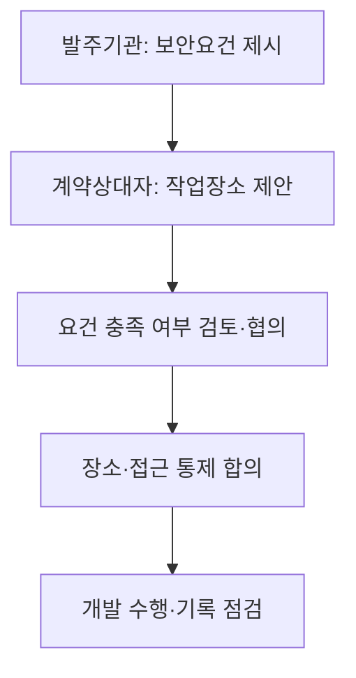
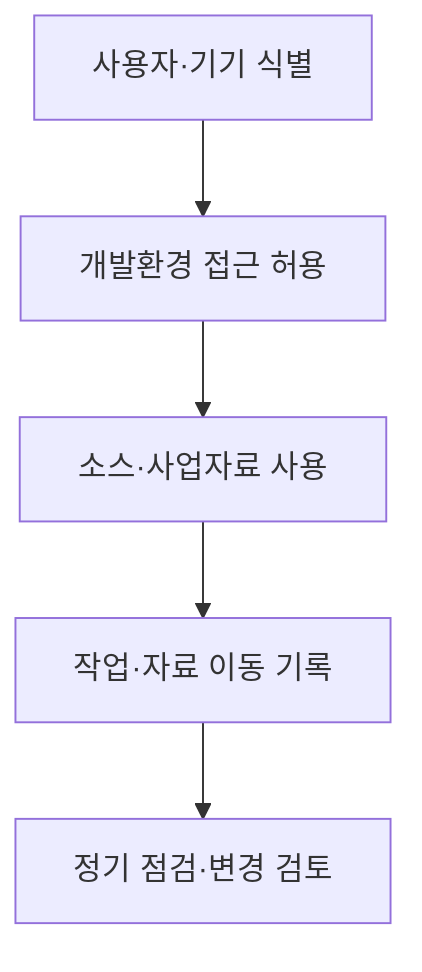

---
title: "원격지 개발"
author: "Codex"
date: "2026-09-24T16:43:00+09:00"
tags:
  - "notes-software-engineering"
sidebar:
  badge:
    text: "서브"
extra:
  model: "GPT-6"
  keyword_grade: "서브"
---

## 지식 로드맵 내 현재 위치

지식 위치: 소프트웨어 공학 → 공공사업 수행·보안 → **원격지 개발**

## 30초 인출

- 본질: **원격지 개발**은 발주기관과 계약상대자가 협의한 장소에서 소프트웨어 사업을 수행하는 방식
- 메커니즘: 작업장소·보안 요건 협의 → 접근·자료 보호 통제 → 개발·협업 → 수행·보안 상태 점검

핵심 용어

- **원격지 개발**: 계약상 정한 발주기관 외 장소에서 소프트웨어를 개발·수행하는 방식
- **작업장소 협의**: 발주기관의 보안 요건과 계약상대자가 제시한 장소를 검토해 사업 장소를 정하는 과정
- **접근 통제**: 승인된 사용자·기기·네트워크만 개발 환경과 자료에 접근하게 하는 조치
- **자료 반출 통제**: 소스코드·개인정보·사업자료의 이동·복사·외부 전달을 승인·기록하는 절차

---

## 1교시 예상문제 (10점)

> 원격지 개발의 정의와 목적, 작업장소·보안 관리 절차를 설명하시오. (예상)

---

## 1교시 10점 답안

### Ⅰ. 개요

| 구분 | 핵심 |
|---|---|
| 정의 | **원격지 개발**은 계약상 정한 발주기관 외 장소에서 소프트웨어를 개발·수행하는 방식 |
| 목적 | 작업장소 선택과 보안 요건을 함께 관리해 적정한 사업 수행 환경 마련 |

### Ⅱ. 장소·보안 관리 흐름

### Ⅲ. 관리 항목

| 영역 | 확인 내용 |
|---|---|
| 작업장소 | 장소 제안·보안 요구·설비와 수행 책임 |
| 개발자료 | 접근 권한·저장·전송·반출 방식 |

**제언:** 작업장소와 보안 요건을 계약 전에 합의하고 자료 접근·반출 기준을 기록.

---

## 2~4교시 예상문제 (25점)

> 원격지 개발의 개념과 공공 소프트웨어사업의 작업장소 관련 기준을 설명하고, 보안·협업·사업관리 방안을 제시하시오. (예상)

---

## 2~4교시 25점 답안

## Ⅰ. 개요

| 구분 | 핵심 |
|---|---|
| 정의 | **원격지 개발**은 계약상 정한 발주기관 외 장소에서 소프트웨어를 개발·수행하는 방식 |
| 목적 | 작업장소 선택과 보안 요건을 함께 관리해 적정한 사업 수행 환경 마련 |

## Ⅱ. 작업장소의 협의 기준

| 당사자 | 역할 |
|---|---|
| 발주기관 | 필요한 보안 요건과 장소 조건을 제안요청서 등에 제시 |
| 계약상대자 | 요건을 충족하는 작업장소 제안 |
| 공동 검토 | 제안 장소의 보안 요건 충족 여부 확인 후 협의 |

「소프트웨어 진흥법」 및 계약관리 지침의 작업장소 규정은 보안 요건을 충족하는 계약상대자 제안 장소를 우선 검토하도록 정하는 구조.

## Ⅲ. 개발·자료 보호 흐름

## Ⅳ. 보안·협업·사업관리

| 관리 영역 | 점검 내용 |
|---|---|
| 접근·계정 | 사용자별 권한, 인증, 퇴직·전보 시 권한 회수 |
| 개발자료 | 저장 위치, 전송 암호화, 반출 승인과 기록 |
| 협업·진척 | 요구사항·코드 변경·시험 결과 등 확인 가능한 산출물 기반 협의 |
| 사고·변경 | 보안 사고 보고, 장소·인력·환경 변경 영향과 승인 절차 |

## Ⅴ. 기술사적 제언 — 보안요건과 수행 방식의 동시 합의

| 문제 | 해결 방안 |
|---|---|
| 장소를 계약 후 정하거나 보호 통제가 불분명하면 자료 접근과 책임 범위가 모호해질 가능성 | 제안요청 단계에서 보안 요건·접근·자료 반출 기준을 제시하고, 계약 전 장소 적합성과 협업·점검 절차를 함께 합의 |

## 출제 이력과 검증 출처

- [소프트웨어 진흥법 제49조, 국가법령정보센터](https://www.law.go.kr/lsInfoP.do?lsId=000751) — 작업장소 협의 관련 법률 조항.
- [소프트웨어사업 계약 및 관리감독에 관한 지침 제14조, 국가법령정보센터](https://www.law.go.kr/LSW/admRulLsInfoP.do?admRulSeq=2100000223356) — 작업장소의 보안요건과 제안 장소 검토.

## 연결 토픽

- 연관 토픽: [CI/CD](./095_ci_cd.md), [ALM](./107_alm.md)
