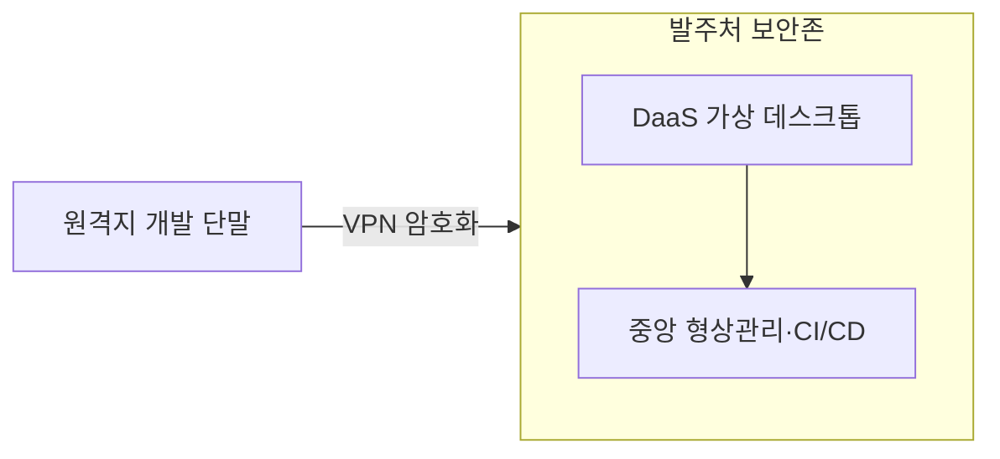

## 큰 그림과 30초 인출

- **본질**: 공공 SI 사업에서 발주기관 청사 인근으로 개발자를 강제 파견·상주시키던 낡은 관행을 타파하고, 소프트웨어 진흥법에 따라 공급자가 제안한 자사 사무실이나 거점 오피스에서 VDI 보안 인프라를 활용하여 원격 개발할 수 있도록 보장하는 제도이다.
- **메커니즘**: 제안요청서(RFP) 원격지 허용 $\rightarrow$ 수주 기업의 작업장소 제안 $\rightarrow$ 발주처 보안 적합성 검토 및 승인 $\rightarrow$ VDI/DaaS 가상화 환경 구축 $\rightarrow$ 비대면 애자일 협업 수행 순으로 전개된다.
- **산출물**: 원격지 개발 계획서, 작업장소 보안 점검 체크리스트, VDI 접근 통제 감사 로그, 비대면 진척도 대시보드.
---

## 1교시 예상문제 (10점)

> 원격지 개발의 정의와 목적, 핵심 메커니즘을 설명하시오. (예상)
---

## 1교시 10점 답안

### 1. 정의·목적

- 정의: 공공 SI 사업에서 발주기관 청사 인근으로 개발자를 강제 파견·상주시키던 낡은 관행을 타파하고, 소프트웨어 진흥법에 따라 공급자가 제안한 자사 사무실이나 거점 오피스에서 VDI 보안 인프라를 활용하여 원격 개발할 수 있도록 보장하는 제도이다.
- 목적: 보안 통제 아래 개발 장소를 분리해도 공공SW 사업의 원격 개발을 가능하게 한다.

### 2. 핵심 관계

- 제언: VDI 접근·자료 반출·작업장 보안 기준을 승인하고 협업 기록과 접근 로그를 점검한다.
---

## 2~4교시 예상문제 (25점)

> 원격지 개발의 개념과 목적을 설명하고, 핵심 메커니즘과 구성요소·절차, 적용 시 문제점과 대응 방안을 제시하시오. (25점, 예상)
---

## 2~4교시 25점 답안

### 핵심 메커니즘과 보안·협업 아키텍처

### (1) 발주처 상주 개발(On-site) vs 원격지 개발(Remote/Off-site)

| 비교 항목 | 발주처 상주 개발 (전통적 방식) | 원격지 개발 (현대적 제도) |
|---|---|---|
| **개발 장소** | 발주기관 청사 내부 또는 인근 임대 사무실 | **수주 기업의 자사 사업장 또는 거점 오피스** |
| **인력 투입** | 지방 출장 및 여관 생활 기피로 고급 인력 확보 난항 | **우수 전문 인력의 유연한 참여 및 재택/거점 결합** |
| **비용 구조** | 원격 파견 체재비, 임대료 등 간접비 낭비 과다 | **체재비 절감 및 자사 표준 개발 인프라 재활용** |
| **보안 통제** | 물리적 출입 통제 중심의 폐쇄적 보안 | **VDI/DaaS, VPN, DRM 기반 논리적 데이터 보안** |
| **진척 관리** | 눈앞의 근태 확인 중심(대면 구두 지시) | **Git/Jira 기반 객관적 산출물 및 DORA 지표 중심** |

### (2) 법적 근거 및 핵심 조항
- **소프트웨어 진흥법 제49조 (소프트웨어사업의 작업장소 등)**:
  - 국가기관등의 장은 소프트웨어사업 추진 시 **공급자가 제안한 작업장소를 우선 검토**하여야 함.
  - 보안 요건 충족 시 발주자가 부당하게 특정 장소에 상주할 것을 강요하거나 불이익을 주어서는 안 됨.
- **국가정보원 및 행정안전부 '원격지 개발 보안 가이드라인'**:
  - 원격 개발 단말의 비인가 USB/외장하드 차단, 화면 캡처 방지, 워터마크 표시.
  - 전송 구간 IPsec VPN 암호화 및 다중 인증(MFA) 강제.
  - 클라우드 가상 데스크톱(DaaS/VDI)을 통해 소스코드의 로컬 다운로드를 원천 차단.

### (3) 원격지 개발 성공을 위한 비대면 협업 아키텍처
- 발주자가 원격지 개발을 꺼리는 본질적 이유는 보안보다 **"개발자가 눈앞에 없으면 놀 것"이라는 불신과 "소통 부재"**임.
- **해결책**: Jira 백로그 시각화, Git 커밋 단위 코드 리뷰, 일일 화상 스크럼(Daily Standup) 등 **'업무 투명성(Visibility)'**을 극대화하는 애자일 프로세스를 필수 가동함.
---

### 실무 적용 및 도입 체크리스트

1. **RFP 상 사업자 제안권 명시**: 제안요청서에 "작업장소는 상호 협의하여 결정하며, 공급자 제안 장소를 우선 검토함"을 명시하고 상주 강요 조건을 배제하였는가?
2. **DaaS/VDI 가상 데스크톱 도입**: 개발자 PC에 소스코드가 직접 다운로드되지 않고 가상 화면만 스트리밍되는 안전한 환경을 구축하였는가?
3. **MFA 기반 접근 통제**: VPN 접속 시 ID/PW 외에 모바일 OTP 등 2단계 인증을 필수로 요구하는가?
4. **일일 비대면 싱크업 체계**: 원격 환경에서도 발주자와 수행사 간 매일 15분 이내의 진척 점검 및 블로커 해소 미팅이 정례화되어 있는가?
---

### 실패 시나리오 및 트러블슈팅

| 위험 | 대책 | 효과 |
|---|---|---|
| **지방 상주 강요로 핵심 아키텍트 이탈 및 사업 유찰** | SW진흥법 제49조 기반 원격지 개발 승인 및 수도권 거점 VDI 개설 | 핵심 전문 인력 100% 확보 및 사업 정상 착수 |
| **원격 개발자의 로컬 PC를 통한 소스코드 외부 유출** | DaaS 클라우드 PC 의무화, 망분리 및 데이터 반출 보안 심의제 적용 | 소스코드 및 개인정보 외부 유출 0건 완벽 격리 |
| **비대면 소통 부재로 요구사항 불일치 및 재작업 발생** | Jira 칸반 보드 실시간 공유 및 일일 화상 스크럼 정례화 | 요구사항 오해로 인한 재작업 80% 감축 |
---

### 차세대 확장 및 융합

- **클라우드 기반 원격 개발 플랫폼(CDE, Cloud Development Environment)**: 개발자 로컬 머신에 개발 환경을 구성하지 않고, GitHub Codespaces, Gitpod 등 클라우드 컨테이너 상에서 브라우저만으로 즉시 코딩·빌드·디버깅하는 클라우드 네이티브 개발 환경으로 고도화되고 있다.
- **공공 DaaS 전면 확산**: 국가정보통신망과 연계된 공공 전용 DaaS 서비스가 상용화됨에 따라, 복잡한 자체 VDI 인프라 구축 없이도 클릭 몇 번으로 보안 인증된 원격 개발 환경을 프로비저닝하는 체계로 발전하고 있다.
---

### 실전 합격 전략 및 기술사적 제언

### 학습자 통찰 메모 — 답안 밖
- **[핵심 통찰]**: 원격지 개발의 승패는 '물리적 통제에서 논리적 신뢰로의 전환'에 있다. 과거처럼 청사 지하실에 몰아넣고 근태를 눈으로 감시하던 SI 패러다임은 지방 이전과 함께 붕괴되었다. 핵심 답안 논리는 "DaaS를 통한 완벽한 데이터 격리(보안 우려 해소)"와 "Jira/Git 애자일 지표를 통한 실시간 업무 가시성(근태 불신 해소)"의 결합이다.
- **나라면**: 답안 2단락에 SW진흥법 제49조와 DaaS-VPN-단말통제 3선 방어 아키텍처를 도해로 구성하고, 3단락에서 상주와 원격의 장단점 비교 및 비대면 협업 거버넌스를 서술하겠다. 4단락에서는 공공 CSAP 인증 DaaS 표준 플랫폼 보급을 제언하겠다.

### 실전 답안용 기술사적 제언
- **판정 기준**: 수주 공급자가 제안한 원격 작업장소의 보안 가이드라인 적합성 판정 100% 및 소스코드 로컬 유출 리스크 0건.
- **대응 방안**: 공공 인증 DaaS(가상 데스크톱) 기반 화면 스트리밍 환경을 구축하여 소스코드의 로컬 저장을 원천 봉쇄하고, IPsec VPN과 단말 매체제어(USB/캡처 방지) 결합.
- **검증 체계**: 주간 단위 정기 보안 감사 로그 점검 및 Jira 백로그-Git 커밋 기반 스프린트 번다운 차트 중심의 투명한 공정률 검증.
- **기대 효과**: 지방 원격 파견 체재비(수억 원) 절감, 핵심 아키텍트 참여율 2배 제고 및 개발 생산성 30% 향상.
---
