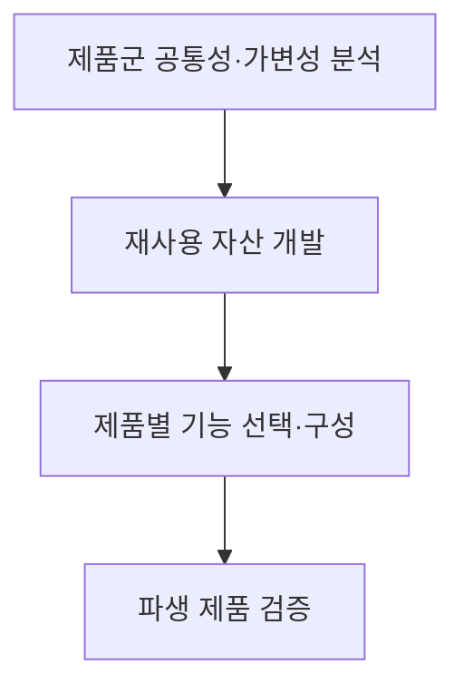
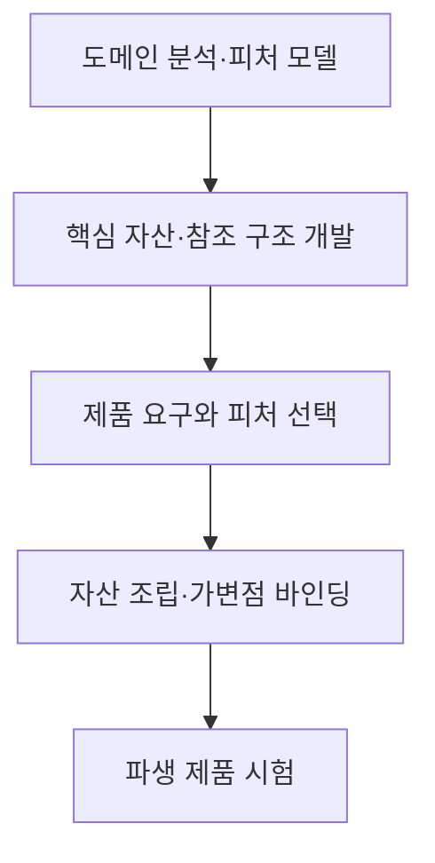

## 지식 로드맵 내 현재 위치

지식 위치: 소프트웨어 공학 → 재사용·제품군 개발 → **소프트웨어 제품라인(SPL)**

## 30초 인출

- 본질: **소프트웨어 제품라인(SPL, Software Product Line)**은 공통 자산과 제품별 차이를 관리해 관련 제품군을 개발하는 접근법
- 메커니즘: 공통성·가변성 분석 → 재사용 자산 개발 → 제품별 기능 선택·구성 → 파생 제품 검증

핵심 용어

- **소프트웨어 제품라인(SPL, Software Product Line)**: 공통 자산과 계획된 가변성을 이용해 관련 제품군을 개발하는 접근법
- **도메인 공학(Domain Engineering)**: 제품군의 공통성·가변성을 분석하고 재사용 자산을 마련하는 활동
- **애플리케이션 공학(Application Engineering)**: 제품 요구에 맞춰 공통 자산과 선택 기능을 조합해 개별 제품을 만드는 활동
- **피처 모델(Feature Model)**: 제품군의 공통·선택 기능과 기능 간 제약을 표현한 모델
- **바인딩 시점(Binding Time)**: 제품별 가변 기능을 선택·결정하는 시점

---

## 1교시 예상문제 (10점)

> 소프트웨어 제품라인(SPL)의 정의와 목적, 핵심 개발 흐름을 설명하시오. (예상)

---

## 1교시 10점 답안

### Ⅰ. 개요

| 구분 | 핵심 |
|---|---|
| 정의 | **소프트웨어 제품라인(SPL, Software Product Line)**은 공통 자산과 계획된 가변성을 이용해 관련 제품군을 개발하는 접근법 |
| 목적 | 공통 자산 재사용과 제품별 차이 관리를 통한 제품군 개발 효율화 |

### Ⅱ. 제품 파생 흐름

### Ⅲ. 핵심 활동

| 활동 | 주요 내용 |
|---|---|
| 도메인 공학 | 제품군 공통·가변 요소와 제약 분석, 핵심 자산 개발 |
| 애플리케이션 공학 | 개별 제품 요구에 맞춰 피처와 자산을 선택·구성 |

**제언:** 제품군 공통 자산과 선택 기능의 경계를 피처 모델에 명시하고 파생 제품별 검증.

---

## 2~4교시 예상문제 (25점)

> 소프트웨어 제품라인의 개념과 목적을 설명하고, 공통성·가변성 분석부터 제품 파생까지의 활동과 적용 시 고려사항을 제시하시오. (예상)

---

## 2~4교시 25점 답안

## Ⅰ. 개요

| 구분 | 핵심 |
|---|---|
| 정의 | **소프트웨어 제품라인(SPL, Software Product Line)**은 공통 자산과 계획된 가변성을 이용해 관련 제품군을 개발하는 접근법 |
| 목적 | 공통 자산 재사용과 제품별 차이 관리를 통한 제품군 개발 효율화 |

## Ⅱ. 공통성·가변성 모델

| 모델 요소 | 의미 |
|---|---|
| 공통 피처 | 제품군의 모든 제품이 공유하는 기능 |
| 선택 피처 | 일부 제품에만 포함할 수 있는 기능 |
| 대안 관계 | 여러 기능 중 제약에 따라 하나 또는 허용된 조합을 선택 |
| 제약 | 함께 선택할 수 없거나 선행 조건이 필요한 피처 관계 |

## Ⅲ. 제품라인 개발 흐름

## Ⅳ. 활동·가변성 관리

| 활동 | 책임·결과 |
|---|---|
| 도메인 공학 | 제품군 요구 분석, 공통 자산·가변점·피처 제약 관리 |
| 애플리케이션 공학 | 개별 제품 요구에 따른 피처 선택, 자산 조합, 제품 검증 |
| 관리 | 자산과 제품의 변경 조정, 품질·버전·조직 역할 관리 |
| 바인딩 시점 | 설계·빌드·실행 중 적절한 시점에 제품별 가변 기능 결정 |

## Ⅴ. 기술사적 제언 — 공통 자산 투자 범위의 단계적 확정

| 한계 | 해결 방안 |
|---|---|
| 제품별 차이를 충분히 파악하기 전에 공통 자산을 크게 만들면 재사용 가치가 낮고 변경 부담이 커질 가능성 | 대상 제품의 실제 공통·가변 요구를 검토한 뒤 자산 범위를 정하고, 파생 제품의 시험 결과로 자산 설계를 조정 |

## 출제 이력과 검증 출처

- [Carnegie Mellon SEI, Software Product Lines](https://www.sei.cmu.edu/our-work/software-product-lines/) — 소프트웨어 제품라인 공학의 공통 자산·제품군 접근.
- Clements & Northrop, *Software Product Lines: Practices and Patterns*, Addison-Wesley.

## 연결 토픽

- 연관 토픽: [객체지향 설계 원칙 SOLID](./082_solid.md), [요구사항 공학](./040_requirements_engineering.md), [ALM](./107_alm.md)
