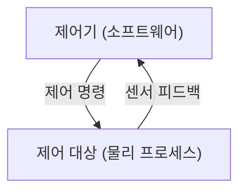

## 큰 그림과 30초 인출

- **본질**: 개별 하드웨어·소프트웨어 부품 고장(Failure)이 없더라도 컴포넌트 간 상호작용 불일치와 제어 실패로 발생하는 복잡계 참사를 막기 위해, 시스템을 '피드백 제어 구조'로 모델링하고 안전 제약조건 위반을 사전에 찾아내는 시스템 이론 기반 안전성 분석 기법이다.
- **메커니즘**: 시스템 손실·위험원 정의 $\rightarrow$ 계층적 제어 구조 모델링 $\rightarrow$ 4대 불안전 제어 행위(UCA) 도출 $\rightarrow$ 손실 인과 시나리오 분석 및 안전 제약조건(Safety Constraint) 소프트웨어 요구사항(SRS) 반영 순으로 진행된다.
- **산출물**: 계층적 제어 구조 다이어그램, UCA 명세서, 손실 인과 시나리오 분석서, 안전 제약조건 요구사항 정의서.
---

## 1교시 예상문제 (10점)

> STPA(System Theoretic Process Analysis)의 정의와 목적, 핵심 메커니즘을 설명하시오. (예상)

---

## 1교시 10점 답안

### 1. 정의·목적

- 정의: 개별 하드웨어·소프트웨어 부품 고장(Failure)이 없더라도 컴포넌트 간 상호작용 불일치와 제어 실패로 발생하는 복잡계 참사를 막기 위해, 시스템을 '피드백 제어 구조'로 모델링하고 안전 제약조건 위반을 사전에 찾아내는 시스템 이론 기반 안전성 분석 기법이다.
- 목적: 부품 고장만으로 설명되지 않는 상호작용 위험을 제어 구조 분석으로 찾아낸다.

### 2. 핵심 관계

- 제언: UCA와 손실 시나리오를 안전 제약·요구사항에 연결하고 구현·운영에서 준수 여부를 확인한다.
---

## 2~4교시 예상문제 (25점)

> STPA(System Theoretic Process Analysis)의 개념과 목적을 설명하고, 핵심 메커니즘과 구성요소·절차, 적용 시 문제점과 대응 방안을 제시하시오. (25점, 예상)

---

## 2~4교시 25점 답안

### 핵심 메커니즘과 피드백 제어 아키텍처

### (1) 전통적 안전 분석(FTA·FMEA) vs STPA 비교

| 구분 | FTA (Fault Tree Analysis) | FMEA (Failure Mode & Effects) | STPA (System-Theoretic Process Analysis) |
|---|---|---|---|
| **기반 이론** | 신뢰성 공학 (사건 연쇄 모델) | 신뢰성 공학 (단일 부품 고장 모델) | **시스템 이론 및 제어 이론 (STAMP)** |
| **분석 관점** | 하향식(Top-down) 연역적 분석 | 상향식(Bottom-up) 귀납적 분석 | **하향식 피드백 제어 루프 상호작용 분석** |
| **분석 대상** | 하드웨어 부품 고장 연쇄 (AND/OR) | 개별 단위 부품의 물리적 고장 모드 | **SW 제어 로직, 센서 피드백, 사람 상호작용** |
| **소프트웨어 분석**| 매우 제한적 (단순 고장 확률 왜곡) | 부품 단위 오류로 치환되어 분석 불가 | **소프트웨어 인지 왜곡 및 프로세스 모델 불일치 규명** |
| **적용 시점** | 상세 설계 완료 후 | 상세 설계 및 제조 단계 | **개념 설계 및 아키텍처 수립 초기 단계부터 적용** |

### (2) STPA 4단계 상세 절차
1. **1단계: 분석 기본 정의**: 시스템 손실(Losses: 인명 사상, 재산 피해) 및 이를 유발하는 시스템 위험원(Hazards) 식별.
2. **2단계: 계층적 제어 구조 모델링**: 인간, 제어기(SW/ECU), 구동기, 센서 간의 명령 및 피드백 루프 다이어그램 작성.
3. **3단계: UCA(불안전 제어 행위) 도출**: 4가지 가이드워드(Not Providing, Providing, Timing, Duration)를 적용하여 위험 상황의 제어 명령 식별.
4. **4단계: 손실 시나리오 분석 및 제약조건 수립**: UCA를 유발하는 인과 요인(센서 노이즈, 통신 지연, 프로세스 모델 왜곡)을 규명하고, 이를 방지하는 안전 제약조건(Safety Constraint)을 소프트웨어 요구사항(SRS)으로 도출.
---

### 실무 적용 및 도입 체크리스트

1. **프로세스 모델(Process Model) 불일치 분석**: 센서 지연이나 패킷 손실로 인해 소프트웨어가 실제 물리적 상태와 다른 가상 상태를 정상으로 오인하는 시나리오를 전수 도출하였는가?
2. **UCA의 안전 제약조건(Safety Constraint) 전환**: 도출된 UCA를 반대(Negation) 조건으로 변환하여 개발자가 구현 가능한 기능 요구사항(SRS)으로 1:1 매핑하였는가?
3. **보잉 737 MAX MCAS 반면교사**: 조종사의 조종간 입력보다 소프트웨어의 센서 판단이 우선하여 항공기 기수를 강제 하향시키는 등의 '권한 역전' 시나리오가 차단되어 있는가?
4. **HIL 음의 테스트 케이스 연계**: STPA를 통해 도출된 손실 시나리오를 HIL(Hardware-In-the-Loop) 시뮬레이터의 결함 주입 시험(FIT) 항목으로 전이하여 자동화 검증하고 있는가?
---

### 실패 시나리오 및 트러블슈팅

| 위험 | 대책 | 효과 |
|---|---|---|
| **복잡계 제어로 도출되는 UCA 조합 기하급수 폭증** | 안전 필수 핵심 기능 중심 계층적 분석 경계 설정 및 위험도 기반 필터링 | 분석 공수 70% 절감 및 고위험 제어 루프 집중 검증 |
| **센서 지연으로 제어기 내부 인지 상태(Process Model) 왜곡** | 칼만 필터(Kalman Filter) 상태 추정 및 피드백 타임아웃 시 Fail-Safe 강제 | 센서 일시 단선 상황에서도 오작동 제어 원천 차단 |
| **도출된 안전 제약조건이 설계에 반영되지 않고 서류로 방치** | ALM(Jira/Git)과 연계하여 SRS 안전 필수 요구사항으로 양방향 추적 강제 | 설계 및 소스코드 레벨 안전 제약조건 구현율 100% 보증 |
---

### 차세대 확장 및 융합

- **ISO 21448(SOTIF, 의도된 기능의 안전성) 핵심 방법론 편입**: 부품 고장이 없더라도 센서의 인지 한계나 AI 알고리즘의 판단 오류로 사고가 발생하는 자율주행 영역에서, STPA는 SOTIF 표준의 필수 위험원 분석 도구로 공식 채택되고 있다.
- **AI/LLM 기반 에이전트 안전 통제**: 다중 AI 에이전트 간의 상호작용 및 오판을 제어하기 위해, STPA 제어 루프를 적용하여 AI가 안전 제약조건을 위반하는 명령을 발행할 때 즉시 차단하는 가드레일(Safety Wrapper) 프레임워크로 확장되고 있다.
---

### 실전 합격 전략 및 기술사적 제언

### 학습자 통찰 메모 — 답안 밖
- **[핵심 통찰]**: STPA의 본질은 "부품은 멀쩡한데 시스템이 참사를 일으키는 이유"를 밝혀내는 것이다. 보잉 737 MAX 사고가 가장 완벽한 예시이다. 받음각 센서의 오작동보다, 그 센서 값을 맹신하고 기수를 계속 찍어누른 MCAS 소프트웨어의 '불안전 제어 행위(UCA)'가 본질적 원인이었다.
- **나라면**: 답안 1단락에 부품 고장 중심(FTA/FMEA)과 상호작용 제어 실패(STPA)의 패러다임 전환을 명확히 대조하고, 2단락에 제어기-프로세스 피드백 루프와 4대 UCA 가이드워드를 도해로 제시하겠다. 4단락에서는 자율주행 SOTIF(ISO 21448)와 HIL 결함 주입 시험 파이프라인으로의 자동 연계를 제언하겠다.

### 실전 답안용 기술사적 제언
- **판정 기준**: 식별된 모든 UCA에 대한 안전 제약조건(Safety Constraint) 수립률 100% 및 SRS 안전 요구사항 1:1 매핑율 100% 준수.
- **대응 방안**: 시스템 개념 설계 초기부터 STPA 4단계 프레임워크를 적용하고, 제어기 내 프로세스 모델 왜곡을 방어하는 다중 센서 퓨전 및 와치독 메커니즘 설계.
- **검증 체계**: STPA 손실 시나리오를 HIL(Hardware-in-the-Loop) 시뮬레이터 결함 주입 시험(FIT) 케이스로 자동 변환하여 음의 테스트(Negative Test) 100% 통과 입증.
- **기대 효과**: 복잡계 상호작용 결함의 사전 예방, 보잉 737 MAX형 소프트웨어 제어 참사 원천 차단 및 ISO 26262 / SOTIF 인증 획득.
---
