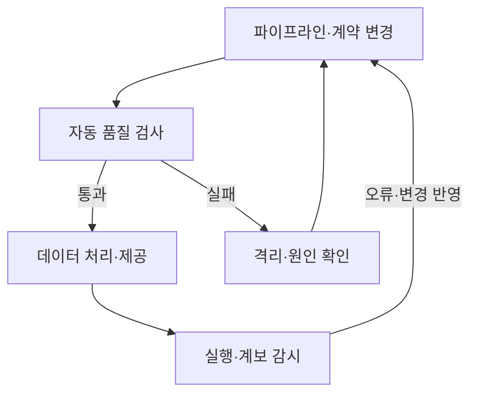
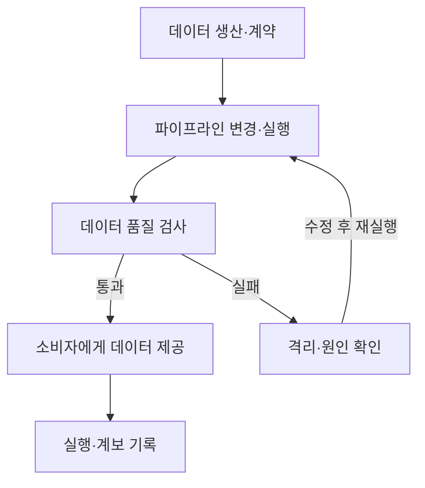

---
title: "데이터옵스(DataOps)"
author: "Codex"
date: "2026-09-24T16:43:00+09:00"
tags:
  - "notes-software-engineering"
sidebar:
  badge:
    text: "서브"
extra:
  model: "GPT-6"
  keyword_grade: "서브"
---

## 지식 로드맵 내 현재 위치

지식 위치: 소프트웨어 공학 → 데이터 파이프라인·운영 → **데이터옵스(DataOps)**

## 30초 인출

- 본질: **데이터옵스(DataOps)**는 데이터 분석·처리 파이프라인의 개발과 운영에 협업·자동화·지속 검증을 적용하는 접근법
- 메커니즘: 파이프라인 변경 검증 → 데이터 품질 확인 → 실행·계보 감시 → 오류와 변경을 개선에 반영

핵심 용어

- **데이터옵스(DataOps)**: 데이터 파이프라인의 개발·배포·운영에 협업과 자동 검증을 적용하는 접근법
- **데이터 계약(Data Contract)**: 데이터 생산자와 소비자가 합의한 스키마·의미·품질·변경 조건
- **데이터 품질 검사(Data Quality Test)**: 데이터 값이 정한 조건·기대 범위를 만족하는지 확인하는 시험
- **데이터 계보(Data Lineage)**: 데이터셋이 어떤 작업과 입력을 거쳐 만들어지고 사용되는지 나타내는 연결 정보
- **OpenLineage**: 작업·실행·데이터셋 계보 메타데이터 수집을 위한 개방형 API·규격

---

## 1교시 예상문제 (10점)

> 데이터옵스(DataOps)의 정의와 목적, 데이터 파이프라인의 핵심 운영 흐름을 설명하시오. (예상)

---

## 1교시 10점 답안

### Ⅰ. 개요

| 구분 | 핵심 |
|---|---|
| 정의 | **데이터옵스(DataOps)**는 데이터 파이프라인의 개발·배포·운영에 협업과 자동 검증을 적용하는 접근법 |
| 목적 | 데이터 변경과 품질 문제를 조기에 발견하고 신뢰 가능한 분석 데이터를 지속 제공 |

### Ⅱ. 파이프라인 운영

### Ⅲ. 주요 통제

| 통제 | 확인 내용 |
|---|---|
| 변경·계약 | 입력 스키마·의미 변경의 영향과 소비자 호환성 |
| 데이터 품질 | 누락·중복·범위·참조 무결성 등 업무별 조건 |
| 운영 계보 | 처리 작업·입력·결과 데이터셋의 연결과 실행 상태 |

**제언:** 품질 검사를 처리 파이프라인에 포함하고 실패 데이터의 처리·재실행 기준을 마련.

---

## 2~4교시 예상문제 (25점)

> 데이터옵스의 개념과 목적을 설명하고, 데이터 계약·품질 검사·계보를 포함한 운영 절차와 도입 시 고려사항을 제시하시오. (예상)

---

## 2~4교시 25점 답안

## Ⅰ. 개요

| 구분 | 핵심 |
|---|---|
| 정의 | **데이터옵스(DataOps)**는 데이터 파이프라인의 개발·배포·운영에 협업과 자동 검증을 적용하는 접근법 |
| 목적 | 데이터 변경과 품질 문제를 조기에 발견하고 신뢰 가능한 분석 데이터를 지속 제공 |

## Ⅱ. 파이프라인 운영 구조

## Ⅲ. 핵심 실천

| 실천 | 작동 방식 |
|---|---|
| 데이터 계약 | 생산자·소비자의 스키마·의미·변경 조건을 합의하고 호환성 확인 |
| 파이프라인 자동화 | 변경을 버전 관리하고 시험·배포·재실행 절차를 반복 가능하게 구성 |
| 품질 검사 | 데이터 처리 전후에 업무상 유효성·완전성·중복 조건 확인 |
| 계보·관측 | 작업 실행·입력·출력 정보를 기록해 오류 위치와 영향 범위 확인 |

## Ⅳ. 운영 위험과 대응

| 위험 | 대응 |
|---|---|
| 원천 스키마 변경이 하류 처리에 전파 | 계약 변경 검토와 소비자 호환성 시험 |
| 데이터 오류가 분석·모델 입력으로 확산 | 검증 실패 데이터 격리와 재처리 기준 적용 |
| 파이프라인 장애의 입력·출력 관계 파악 지연 | 작업 실행·데이터셋 계보 메타데이터 보존 |

## Ⅴ. 기술사적 제언 — 계약 변경의 하류 영향 확인

| 문제 | 해결 방안 |
|---|---|
| 생산자 변경이 소비자에게 전달되지 않아 분석 결과가 누락·왜곡될 가능성 | 데이터 계약 변경 시 계보로 하류 데이터셋·작업을 확인하고 영향받는 품질 시험을 재실행 |

## 출제 이력과 검증 출처

- [DataOps Manifesto](https://datakitchen.io/manifestos/) — 협업·자동화·품질·운영 피드백 원칙.
- [OpenLineage](https://openlineage.io/) — 작업·실행·데이터셋 계보 메타데이터 수집 개방형 프로젝트.

## 연결 토픽

- 연관 토픽: [ALM](./107_alm.md), [Apache Iceberg 오픈 테이블 포맷](./094_apache_iceberg_open_table_format.md), [AI SW 품질보증 테스트](./093_ai_sw_quality_assurance_testing.md)
