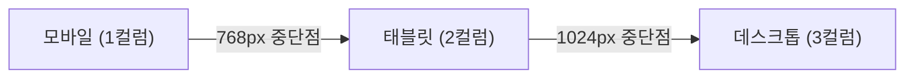

## 큰 그림과 30초 인출

- **본질**: 스마트폰·태블릿·데스크톱 등 다양한 기기 해상도마다 별도의 웹사이트(m.site.com)를 개별 구축·유지하는 비용을 제거하기 위해, 단일 HTML 소스에서 화면 크기에 맞춰 UI 레이아웃과 이미지가 유연하게 재배치(Reflow)되도록 하는 프론트엔드 웹 디자인 기법이다.
- **메커니즘**: 뷰포트(Viewport) 메타태그 설정 $\rightarrow$ 미디어 쿼리(Media Queries) 중단점(Breakpoints) 분기 $\rightarrow$ 가변 그리드(Fluid Grid/Flexbox) 레이아웃 재배치 $\rightarrow$ 반응형 이미지(srcset, picture) 최적 서빙 순으로 동작한다.
- **산출물**: 반응형 CSS 스타일시트, 가변 레이아웃 템플릿, 해상도별 이미지 소스셋, 반응형 디자인 시스템 컴포넌트.

---

## 핵심 메커니즘과 반응형 레이아웃 아키텍처

### (1) 반응형 웹(RWD) vs 적응형 웹(AWD) 비교

| 구분 | 반응형 웹 (Responsive Web) | 적응형 웹 (Adaptive Web) |
|---|---|---|
| **처리 주체** | **클라이언트 브라우저 (CSS 미디어 쿼리)** | 웹 서버 또는 클라이언트 스크립트 |
| **URL 구조** | **단일 URL (동일 주소 제공, OSMU)** | 기기별 URL 분리 가능 (`m.domain.com` 등) |
| **페이지 소스** | **단일 HTML 소스코드** | 기종별 전용 HTML/CSS 템플릿 분리 전달 |
| **레이아웃 변화** | 해상도에 따라 부드러운 연속적 가변(Fluid) | 정의된 특정 해상도에서 정적으로 전환(Fixed) |
| **초기 전송량** | 모든 기기의 CSS 포함으로 상대적 증가 가능 | 모바일 전용 가벼운 리소스만 전송 가능 |
| **SEO 및 관리** | **단일 URL로 백링크 집중 및 SEO 최적, 유지보수 우수** | 중복 URL 캐싱 및 별도 운영 부담 수반 |

### (2) 반응형 웹 핵심 구현 4대 요소
1. **뷰포트 메타태그 설정**: `<meta name="viewport" content="width=device-width, initial-scale=1.0">`를 선언하여 기기 물리 너비와 렌더링 뷰포트를 일치시킴.
2. **CSS3 미디어 쿼리**: `@media screen and (min-width: 768px)` 형태로 모바일 우선(Mobile First) 점진적 확장 설계.
3. **유연한 레이아웃 (Flexbox & Grid)**: 상대 단위(%, rem, fr)를 활용하여 화면 너비 변화 시 자동으로 줄바꿈 및 공간 재배치 수행.
4. **반응형 이미지 최적화**: `<picture>` 태그와 `srcset` 속성을 활용하여 화면 DPR 및 뷰포트에 맞춘 최적 크기의 차세대 이미지(WebP, AVIF) 조건부 서빙.

---

## 실무 적용 및 도입 체크리스트

1. **모바일 우선(Mobile First) 중단점 설계**: 데스크톱 기준 `max-width`로 덮어쓰지 않고, 모바일 기준 `min-width`로 점진적 확장(Progressive Enhancement)을 적용하였는가?
2. **반응형 이미지 대역폭 낭비 방지**: 데스크톱용 고해상도 이미지가 모바일에서 백그라운드 다운로드되지 않도록 `<picture>`와 `srcset`을 적용하였는가?
3. **누적 레이아웃 이동(CLS) 방어**: 동적 이미지 로딩 시 화면 출렁거림을 방지하기 위해 CSS `aspect-ratio` 또는 인라인 `width/height` 속성을 명시하였는가?
4. **터치 타깃 접근성 준수**: 모바일 뷰포트에서 내비게이션 버튼 및 링크의 최소 터치 타깃 크기(48x48px)를 확보하였는가?

---

## 실패 시나리오 및 트러블슈팅

| 위험 | 대책 | 효과 |
|---|---|---|
| **모바일에서 데스크톱용 4K 이미지 다운로드로 속도 저하** | `<picture>` 태그와 `srcset` 기반 해상도별 WebP 조건부 전송 | 모바일 초기 데이터 전송량 70% 절감 및 LCP 1.5초 달성 |
| **이미지 로딩 시 레이아웃 출렁거림(CLS)으로 구글 패널티** | 모든 미디어 요소에 CSS `aspect-ratio` 및 고정 종횡비 사전 예약 | CLS(Cumulative Layout Shift) 지표 0.05 이하 달성 |
| **데스크톱 호버 메뉴가 모바일 터치 환경에서 미동작** | 미디어 쿼리 기반 햄버거 오프캔버스 메뉴 및 터치 이벤트 분기 | 모바일 조작 불능 오류 0건 및 사용자 경험 극대화 |

---

## 차세대 확장 및 융합

- **컨테이너 쿼리(Container Queries, `@container`) 패러다임**: 화면 전체 뷰포트 크기가 아니라, 해당 컴포넌트가 배치된 부모 컨테이너의 가용 너비에 따라 UI가 스스로 반응하는 컴포넌트 주도 반응형 설계(Design System)로 진화하고 있다.
- **다크 모드 및 폴더블 화면 적응**: `@media (prefers-color-scheme: dark)`를 통한 OS 테마 감지와 듀얼 스크린 및 폴더블 힌지 영역을 제어하는 CSS 뷰포트 세그먼트 표준으로 확장되고 있다.

---

## 실전 합격 전략 및 기술사적 제언

### 학습자 통찰 메모 — 답안 밖
- **[핵심 통찰]**: 반응형 웹의 핵심은 'CSS 미디어 쿼리 문법'이 아니라 '웹 성능과 단일 소스 거버넌스(OSMU)'이다. 현장에서 반응형 웹을 도입하고도 실패하는 가장 큰 이유는 모바일에서 불필요한 데스크톱 리소스까지 전부 다운로드받아 속도가 느려지는 것이다. 따라서 기술사 답안에서는 구글의 Core Web Vitals(LCP, CLS) 최적화 기법과 차세대 컨테이너 쿼리(`@container`)를 제시해야 한다.
- **나라면**: 답안 2단락에 3대 요소(가변 그리드, 유연 이미지, 미디어 쿼리)와 해상도별 동적 레이아웃 전환을 도해로 시각화하고, 3단락에서 RWD와 AWD의 장단점을 명쾌하게 비교하겠다. 4단락에서는 구글 코어 웹 바이탈 준수 방안과 컨테이너 쿼리 기반 디자인 시스템 구축을 기술사적 제언으로 완성하겠다.

### 실전 답안용 기술사적 제언
- **판정 기준**: 단일 URL 체계 내 모든 디바이스에서 Core Web Vitals 합격 기준(LCP &lt; 2.5s, CLS &lt; 0.1, INP &lt; 200ms) 100% 충족.
- **대응 방안**: Mobile First 설계 원칙을 준수하고, `<picture>` 태그 기반의 WebP 이미지 포맷 분기 서빙과 CSS `aspect-ratio` 속성을 통한 레이아웃 시프트 방지.
- **검증 체계**: Lighthouse 및 PageSpeed Insights CI 파이프라인 연동을 통해 빌드 시 모바일/데스크톱 성능 점수 90점 이상 검증.
- **기대 효과**: 별도 모바일 사이트 운영 대비 유지보수 TCO 50% 절감, 단일 도메인 SEO 랭크 집중 및 모바일 전환율(CVR) 극대화.
