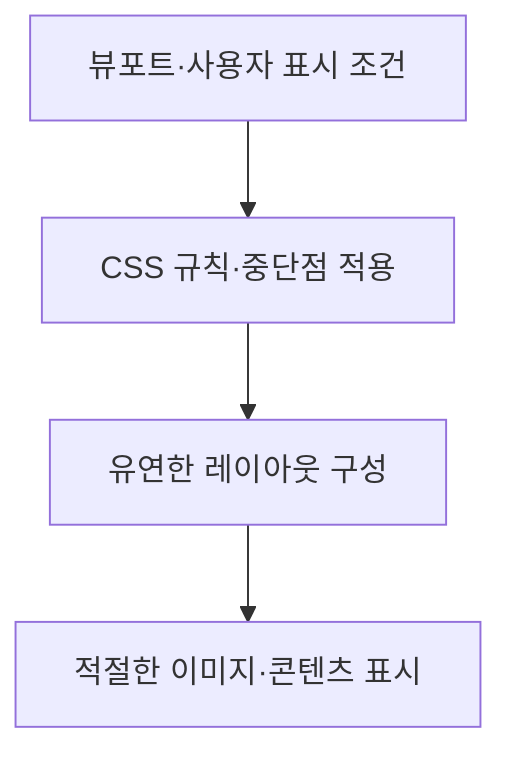

---
title: "반응형 웹(Responsive Web)"
author: "Codex"
date: "2026-09-24T16:43:00+09:00"
tags:
  - "notes-software-engineering"
sidebar:
  badge:
    text: "서브"
extra:
  model: "GPT-6"
  keyword_grade: "서브"
---

## 지식 로드맵 내 현재 위치

지식 위치: 소프트웨어 공학 → 웹 UI·사용성 → **반응형 웹(Responsive Web)**

## 30초 인출

- 본질: **반응형 웹(Responsive Web)**은 화면·뷰포트 조건에 맞춰 콘텐츠 레이아웃을 조정하는 웹 설계 방식
- 메커니즘: 유연한 그리드·미디어·CSS 규칙이 뷰포트 변화에 맞춰 콘텐츠의 배치와 표시를 바꿈

핵심 용어

- **반응형 웹(Responsive Web)**: 다양한 뷰포트에서 콘텐츠 레이아웃과 표시를 조정하는 웹 설계 방식
- **뷰포트(Viewport)**: 브라우저에서 웹 콘텐츠가 표시되는 영역
- **미디어 쿼리(Media Query)**: 화면 조건·사용자 설정 등에 따라 CSS 규칙을 선택하는 기능
- **유연한 그리드(Fluid Grid)**: 고정 픽셀 폭에 의존하지 않고 가용 공간에 따라 배치를 조정하는 레이아웃
- **반응형 이미지(Responsive Image)**: 화면 크기·밀도·레이아웃 조건에 적합한 이미지 소스를 선택하는 방식

---

## 1교시 예상문제 (10점)

> 반응형 웹의 정의와 목적, 핵심 구현요소를 설명하시오. (예상)

---

## 1교시 10점 답안

### Ⅰ. 개요

| 구분 | 핵심 |
|---|---|
| 정의 | **반응형 웹(Responsive Web)**은 다양한 뷰포트에서 콘텐츠 레이아웃과 표시를 조정하는 웹 설계 방식 |
| 목적 | 기기·화면 조건이 달라도 콘텐츠의 가독성과 기능 접근성 유지 |

### Ⅱ. 화면 적응 흐름

### Ⅲ. 핵심 구현요소

| 요소 | 역할 |
|---|---|
| 뷰포트 설정 | CSS 레이아웃 기준을 브라우저 표시 영역과 맞춤 |
| 미디어 쿼리 | 특정 조건에서 스타일 변경 |
| 유연한 그리드 | 사용 가능한 공간에 맞춰 열·간격 조정 |
| 반응형 이미지 | 표시 크기·밀도에 맞는 이미지 선택 |

**제언:** 실제 콘텐츠가 무리 없이 배치되는 지점을 기준으로 중단점을 정하고 여러 화면에서 확인.

---

## 2~4교시 예상문제 (25점)

> 반응형 웹의 개념과 목적을 설명하고, 핵심 구현요소와 반응형·적응형 설계의 차이, 품질 확인 방안을 제시하시오. (예상)

---

## 2~4교시 25점 답안

## Ⅰ. 개요

| 구분 | 핵심 |
|---|---|
| 정의 | **반응형 웹(Responsive Web)**은 다양한 뷰포트에서 콘텐츠 레이아웃과 표시를 조정하는 웹 설계 방식 |
| 목적 | 기기·화면 조건이 달라도 콘텐츠의 가독성과 기능 접근성 유지 |

## Ⅱ. 화면 적응 흐름

## Ⅲ. 핵심 구현요소

| 요소 | 작동 방식 | 설계 시 확인 |
|---|---|---|
| 뷰포트 설정 | 표시 영역에 맞춰 레이아웃 기준 설정 | 확대·축소와 콘텐츠 폭 |
| 미디어 쿼리 | 너비·사용자 설정 조건에 따라 스타일 적용 | 콘텐츠 배치가 필요한 지점에서 중단점 선택 |
| 유연한 그리드 | 상대 단위와 유연한 열로 공간 재배치 | 긴 문자열·좁은 화면에서 넘침 여부 |
| 반응형 이미지 | `srcset`·`sizes` 등으로 적절한 소스 선택 | 해상도·화면 크기와 전송량 |

## Ⅳ. 반응형·적응형 설계와 품질 확인

| 구분 | 반응형 설계 | 적응형 설계 |
|---|---|---|
| 레이아웃 결정 | 가용 공간에 맞춰 유연하게 조정 | 정의된 화면 조건별로 레이아웃·콘텐츠 선택 |
| 구현 예 | 유연한 그리드·CSS 미디어 쿼리 | 화면 구간별 별도 템플릿·리소스 제공 등 |
| 공통 확인 | 콘텐츠 접근성, 기능 동작, 이미지 전송량, 여러 뷰포트에서의 읽기 흐름 |

## Ⅴ. 기술사적 제언 — 콘텐츠 기준의 검증

| 문제 | 해결 방안 |
|---|---|
| 특정 기기 폭만 맞추면 중간 크기 화면이나 실제 콘텐츠에서 넘침·가독성 저하 발생 가능성 | 대표 콘텐츠와 상호작용을 기준으로 중단점을 정하고 넓이·확대·입력 방식이 다른 뷰포트에서 회귀 검증 |

## 출제 이력과 검증 출처

- [MDN Web Docs, Responsive design](https://developer.mozilla.org/en-US/docs/Learn_web_development/Core/CSS_layout/Responsive_Design) — 미디어 쿼리·유연한 레이아웃을 이용한 반응형 설계.
- [MDN Web Docs, Responsive images](https://developer.mozilla.org/en-US/docs/Web/HTML/Guides/Responsive_images) — 이미지 소스·크기 선택.

## 연결 토픽

- 연관 토픽: [웹 성능 최적화](./164_web_performance_optimization.md), [HTML5](./186_html5.md)
