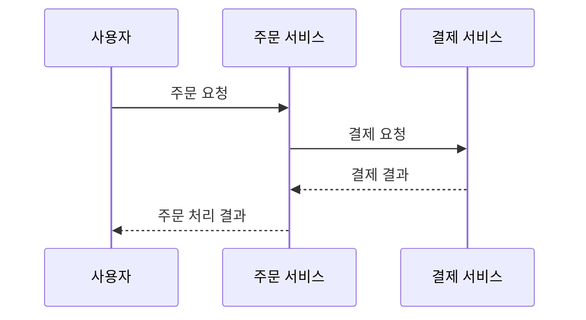

---
title: "순차 다이어그램(Sequence Diagram)"
author: "Codex"
date: "2026-09-24T16:43:00+09:00"
tags:
  - "notes-software-engineering"
sidebar:
  badge:
    text: "서브"
extra:
  model: "GPT-6"
  keyword_grade: "서브"
---

## 지식 로드맵 내 현재 위치

지식 위치: 소프트웨어 공학 → UML·상호작용 모델링 → **순차 다이어그램(Sequence Diagram)**

## 30초 인출

- 본질: **순차 다이어그램(Sequence Diagram)**은 참여자 간 상호작용을 시간 순서에 따라 표현하는 UML 다이어그램
- 메커니즘: 참여자 생명선을 세로로 두고 시간에 따라 메시지·응답·조건 분기를 배치

핵심 용어

- **순차 다이어그램(Sequence Diagram)**: 참여자 사이의 메시지 교환을 시간 순서로 표현하는 UML 상호작용 다이어그램
- **참여자(Participant)**: 상호작용에 메시지를 보내거나 받는 객체·역할·시스템
- **생명선(Lifeline)**: 참여자가 상호작용에 참여하는 존재와 시간 흐름을 나타내는 세로선
- **메시지(Message)**: 참여자 사이의 호출·신호·응답 등 상호작용 단위
- **상호작용 프래그먼트(Interaction Fragment)**: 조건·반복·병렬 등 제어 구조를 상호작용 안에 표현하는 틀

---

## 1교시 예상문제 (10점)

> 순차 다이어그램의 정의와 목적, 주요 구성요소를 설명하시오. (예상)

---

## 1교시 10점 답안

### Ⅰ. 개요

| 구분 | 핵심 |
|---|---|
| 정의 | **순차 다이어그램(Sequence Diagram)**은 참여자 사이의 메시지 교환을 시간 순서로 표현하는 UML 상호작용 다이어그램 |
| 목적 | 객체·서비스 간 상호작용 순서와 조건별 동작을 분석·공유 |

### Ⅱ. 구성요소와 시간 흐름

### Ⅲ. 주요 표기

| 요소 | 표현 내용 |
|---|---|
| 참여자·생명선 | 상호작용 주체와 시간에 따른 참여 |
| 메시지 | 참여자 사이의 호출·응답·신호 |
| 실행 명세·반환 | 처리 중인 구간과 호출 결과 |
| 프래그먼트 | `alt`, `opt`, `loop` 등 조건·반복 구조 |

**제언:** 정상 흐름과 중요한 대안·예외 조건을 구분해 메시지 순서를 검토.

---

## 2~4교시 예상문제 (25점)

> 순차 다이어그램의 개념과 목적을 설명하고, 구성요소·메시지 유형·상호작용 프래그먼트를 이용한 작성 및 검토 방안을 제시하시오. (예상)

---

## 2~4교시 25점 답안

## Ⅰ. 개요

| 구분 | 핵심 |
|---|---|
| 정의 | **순차 다이어그램(Sequence Diagram)**은 참여자 사이의 메시지 교환을 시간 순서로 표현하는 UML 상호작용 다이어그램 |
| 목적 | 객체·서비스 간 상호작용 순서와 조건별 동작을 분석·공유 |

## Ⅱ. 구성요소와 상호작용 흐름

| 요소 | 의미 |
|---|---|
| 참여자·생명선 | 상호작용 주체와 시간에 따른 참여 |
| 메시지 | 참여자 사이의 호출·응답·신호 전달 |
| 실행 명세 | 참여자가 처리를 수행하는 구간 |
| 생성·종료 | 참여자가 상호작용에 들어오거나 끝나는 시점 |

## Ⅲ. 메시지와 제어 구조

| 표기 | 의미 |
|---|---|
| 동기 메시지 | 호출자가 호출 결과를 기다리는 호출 |
| 비동기 메시지 | 호출자가 응답을 기다리지 않고 보내는 신호 |
| 반환 메시지 | 호출 처리 결과의 반환 |
| `alt`·`opt`·`loop` | 조건 분기·선택 실행·반복 실행 |

## Ⅳ. 모델링 및 검토

| 작성 단계 | 점검 내용 |
|---|---|
| 상호작용 범위 정의 | 시작 사건, 참여자, 종료 조건의 식별 |
| 메시지 배열 | 실제 호출·전달·응답 순서와 동기성 반영 |
| 대안 흐름 표현 | 업무 조건·실패 결과에 맞는 분기·반복 작성 |
| 설계 검토 | 인터페이스·오류 처리·시간 초과 등 요구와의 정합성 확인 |

## Ⅴ. 기술사적 제언 — 실패 흐름의 인터페이스 반영

| 문제 | 해결 방안 |
|---|---|
| 정상 흐름만 모델링하면 시간 초과·오류 응답 등 실제 계약이 누락될 가능성 | 서비스 경계의 요청·응답·오류 조건을 먼저 확정하고 해당 대안 흐름을 시험 시나리오와 연결 |

## 출제 이력과 검증 출처

- [Object Management Group, Unified Modeling Language 2.5.1](https://www.omg.org/spec/UML/2.5.1) — UML 상호작용·순차 다이어그램의 규범 명세.

## 연결 토픽

- 연관 토픽: [UML 다이어그램](./020_uml_diagrams.md), [시퀀스도와 연계되는 메시지 큐](./140_message_queue.md)
