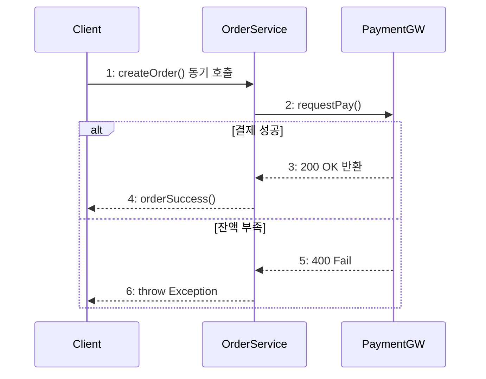

## 큰 그림과 30초 인출

- **본질**: 시스템 컴포넌트나 객체 간의 메서드 호출 순서와 생명주기를 파악하기 위해, 수평축에 참여 객체를 배치하고 수직축(시간 경과)을 따라 동기·비동기 메시지와 조건부 제어 흐름을 가시화하는 UML 동적 모델링 기법이다.
- **메커니즘**: 액터 및 객체 생명선(Lifeline) 정의 $\rightarrow$ 동기/비동기 메시지 전송 및 활성 구간(Activation Box) 실행 $\rightarrow$ 복합 프래그먼트(`alt`, `opt`, `loop`, `par`) 제어 분기 $\rightarrow$ 반환 메시지 회신 순으로 모델링된다.
- **산출물**: UML 순차 다이어그램(또는 PlantUML/Mermaid 코드), API 상호작용 명세서, 서비스 간 분산 트랜잭션 통신 시퀀스 정의서.

---

## 핵심 메커니즘과 상호작용 표기 체계

### (1) 순차 다이어그램 vs 통신 다이어그램 비교

| 구분 | 순차 다이어그램 (Sequence Diagram) | 통신 다이어그램 (Communication Diagram) |
|---|---|---|
| **표현 초점** | 메시지의 **시간적 순서와 생명주기** | 객체들 간의 **공간적 링크 및 네트워크 관계** |
| **시간 흐름 표기** | 수직축(위 $\rightarrow$ 아래)으로 직관적 파악 가능 | 링크 선 위에 순서 번호(1, 1.1, 2)를 붙여 추적 |
| **공간적 연결 관계** | 객체가 가로로 나열되어 복잡한 링크 파악 어려움 | 객체 간 메시지 경로 및 결합 관계 파악 용이 |
| **주요 활용 단계** | API 호출 시퀀스, 마이크로서비스 간 트랜잭션 설계 | 아키텍처 초기 객체 간 협력 관계 및 결합도 분석 |

### (2) 핵심 메시지 유형 및 복합 프래그먼트
1. **동기 메시지 (Synchronous)**: 실선 + 채운 삼각형 화살표. 메서드 호출 후 호출자가 결과를 받을 때까지 대기(블로킹).
2. **비동기 메시지 (Asynchronous)**: 실선 + 열린 화살표. 메시지 송신 후 응답 대기 없이 즉시 다음 로직 수행 (Kafka 메시지 발행 등).
3. **반환 메시지 (Reply/Return)**: 점선 + 열린 화살표. 작업 완료 후 결과값(Return Value) 반환.
4. **복합 프래그먼트 (Combined Fragments)**:
   - `alt`: if-else 상호 배타적 분기 (가드 조건 `[guard]` 명시).
   - `opt`: 단일 조건부 실행 (if).
   - `loop`: 반복문 (for, while).
   - `par`: 병렬 동시 실행.
   - `ref`: 다른 시퀀스 다이어그램을 서브루틴처럼 재사용 참조.

---

## 실무 적용 및 도입 체크리스트

1. **마이크로서비스 분산 데드락 방지**: 서비스 A $\rightarrow$ B $\rightarrow$ C 동기 호출 체인 중 역방향 B $\rightarrow$ A 동기 호출이 발생하여 분산 교착 상태를 유발하지 않는지 검증하였는가?
2. **다이어그램 복잡도 제어 (`ref` 활용)**: 단일 다이어그램에 모든 예외 처리를 구겨넣지 않고, 정상 경로(Happy Path) 위주로 작성하되 복잡한 예외는 `ref` 프래그먼트로 모듈화 분할하였는가?
3. **Diagram as Code (DaC) 표준화**: 마우스 그래픽 툴 대신 PlantUML이나 Mermaid 텍스트 코드로 작성하여 Git 저장소에 소스코드와 함께 버전 관리하고 있는가?
4. **활성 상자(Activation Box) 정합성**: 객체가 실제로 제어권을 갖고 연산 중인 구간만 활성 상자로 표현하고, 대기 상태에서는 생명선만 노출하도록 규격화하였는가?

---

## 실패 시나리오 및 트러블슈팅

| 위험 | 대책 | 효과 |
|---|---|---|
| **서비스 간 순환 동기 호출로 런타임 분산 데드락 발생** | 시퀀스 다이어그램 검토를 통해 순환 동기 호출 식별 및 비동기 이벤트(Kafka) 전환 | 서비스 간 강결합 제거 및 분산 데드락 사고 100% 예방 |
| **다이어그램 복잡도 과다로 개발팀 가독성 및 소통 상실** | 정상 흐름만 메인 다이어그램에 남기고 세부 예외 로직은 `ref` 프래그먼트로 분리 | 다이어그램 가독성 2배 향상 및 리뷰 시간 50% 단축 |
| **코드 수정 후 정적 이미지 다이어그램 미현행화(고아화)** | PlantUML 기반 Diagram as Code(DaC) 도입 및 CI 파이프라인 자동 렌더링 | 설계 문서와 소스코드 일치율 100% 항시 유지 |

---

## 차세대 확장 및 융합

- **MSA Saga 패턴(오케스트레이션 및 코레오그래피) 시각화**: 분산 트랜잭션에서 각 서비스의 로컬 트랜잭션 성공/실패에 따른 보상 트랜잭션(Compensating Transaction) 롤백 시퀀스를 `alt` 프래그먼트와 이벤트 브로커로 정밀 모델링하는 핵심 도구로 활용된다.
- **분산 트레이싱(OpenTelemetry)과의 융합**: OpenTelemetry로 수집된 분산 트레이스(Trace) 데이터를 Jaeger나 Zipkin에서 자동으로 실시간 순차 다이어그램 형태로 역합성하여 런타임 병목 구간을 시각화하는 기술이 보편화되고 있다.

---

## 실전 합격 전략 및 기술사적 제언

### 학습자 통찰 메모 — 답안 밖
- **[핵심 통찰]**: 순차 다이어그램은 단순한 UML 그림 그리기가 아니라 '시간에 따른 동적 제어 흐름과 트랜잭션 경계'를 확정하는 공학 설계이다. 특히 MSA 환경에서 동기 호출(REST)의 연쇄로 인한 결합도 폭증과 분산 데드락을 사전 차단하는 최고의 검증 도구이다.
- **나라면**: 답안 2단락에 Client-Order-PaymentGW 간의 동기/비동기 호출 및 `alt` 분기를 도해로 완벽한 표기법으로 제시하고, 3단락에서 동기 vs 비동기 메시지 및 복합 프래그먼트 5종을 명쾌히 표로 대조하겠다. 4단락에서는 Saga 분산 트랜잭션 보상 시퀀스 모델링과 PlantUML 기반 Diagram as Code(DaC) 거버넌스를 제언하겠다.

### 실전 답안용 기술사적 제언
- **판정 기준**: 마이크로서비스 간 양방향 순환 동기 호출 0건 및 모든 분산 트랜잭션의 보상 트랜잭션 시퀀스 명세 100% 수립.
- **대응 방안**: PlantUML/Mermaid 텍스트 기반 DaC(Diagram as Code)를 도입하여 Git 형상관리와 연계하고, 복잡한 분기는 `ref` 프래그먼트로 모듈화.
- **검증 체계**: CI/CD 파이프라인에서 DaC 문법 검증 및 OpenTelemetry 런타임 분산 트레이스와의 아키텍처 드리프트(Drift) 자동 비교 검증.
- **기대 효과**: 분산 데드락 및 트랜잭션 누락 사고 원천 방지, 개발-설계 간 불일치 비용 80% 절감.
