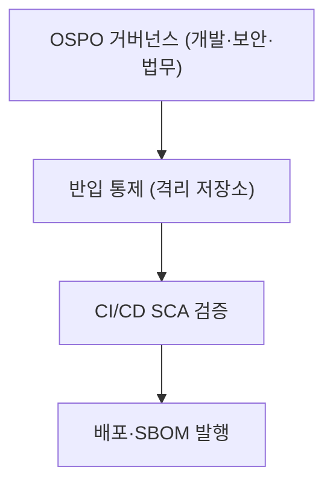

## 큰 그림과 30초 인출

- **본질**: 상용 소프트웨어의 벤더 종속과 높은 라이선스 비용을 극복하기 위해 공개된 소프트웨어를 활용하되, 소스코드 강제 공개(Copyleft 감염) 위험과 공급망 보안 취약점(CVE)을 방어하기 위해 조직·프로세스·자동화 도구를 통합 통제하는 엔터프라이즈 관리 체계이다.
- **메커니즘**: 오픈소스 선정 심의(OSPO) $\rightarrow$ SCA(Software Composition Analysis) 정적 스캔 $\rightarrow$ 프라이빗 저장소 격리 반입 $\rightarrow$ CI/CD 빌드 시 기계 판독형 SBOM(SPDX/CycloneDX) 생성 $\rightarrow$ 라이선스 고지문 발행 순으로 통제된다.
- **산출물**: 오픈소스 라이선스 정책서, SCA 분석 보고서, SBOM 명세서, 오픈소스 고지문(Notices) 및 소스코드 공개 패키지.
---

## 1교시 예상문제 (10점)

> 오픈소스 소프트웨어(OSS) 및 거버넌스의 정의와 목적, 핵심 메커니즘을 설명하시오. (예상)
---

## 1교시 10점 답안

### 1. 정의·목적

- 정의: 상용 소프트웨어의 벤더 종속과 높은 라이선스 비용을 극복하기 위해 공개된 소프트웨어를 활용하되, 소스코드 강제 공개(Copyleft 감염) 위험과 공급망 보안 취약점(CVE)을 방어하기 위해 조직·프로세스·자동화 도구를 통합 통제하는 엔터프라이즈 관리 체계이다.
- 목적: 오픈소스 재사용의 이점은 살리면서 라이선스 의무와 공급망 취약점을 통제한다.

### 2. 핵심 관계

- 제언: SCA와 SBOM을 빌드 절차에 넣고 라이선스 승인·취약점 조치·고지 이행을 배포 전에 확인한다.
---

## 2~4교시 예상문제 (25점)

> 오픈소스 소프트웨어(OSS) 및 거버넌스의 개념과 목적을 설명하고, 핵심 메커니즘과 구성요소·절차, 적용 시 문제점과 대응 방안을 제시하시오. (25점, 예상)
---

## 2~4교시 25점 답안

### 핵심 메커니즘과 거버넌스 아키텍처

### (1) 오픈소스 라이선스 3대 유형 비교

| 구분 | Permissive (관용형) | Weak Copyleft (약한 상호형) | Strong Copyleft (강한 상호형) |
|---|---|---|---|
| **대표 라이선스** | **MIT, Apache 2.0, BSD** | **LGPL 2.1/3.0, MPL** | **GPL 2.0/3.0, AGPL 3.0** |
| **소스코드 공개 의무** | 공개 의무 없음 (상용 비공개 가능) | 해당 라이브러리 수정 부분만 공개 | **결합된 전체 파생 저작물 소스 공개** |
| **링크(Linking) 영향** | 정적/동적 링크 불문 독점 허용 | 동적 링크 시 비공개, 정적 링크 시 공개 | **동적/정적 링크 불문 전체 GPL 감염** |
| **특허권 조항** | Apache 2.0 (특허 라이선스 명시 부여) | 특허 보복 조항 포함 | 특허 소송 제기 시 라이선스 자동 종료 |
| **네트워크 서비스** | 비공개 SaaS 서비스 운영 가능 | 비공개 SaaS 서비스 운영 가능 | **AGPL은 네트워크 서비스 시에도 공개 의무** |

### (2) 엔터프라이즈 오픈소스 거버넌스 3대 축
1. **거버넌스 조직 (OSPO)**: 개발·보안·법무 협의체로서 사내 라이선스 승인 정책 수립, 컴플라이언스 감사, 오픈소스 기여 가이드라인 총괄.
2. **반입 및 배포 프로세스**: 외부 공용 저장소(npm, PyPI) 직접 다운로드를 차단하고 사내 프라이빗 저장소(Harbor/Nexus)를 경유하도록 격리.
3. **자동화 도구 체계 (SCA & SBOM)**: CI/CD 파이프라인에서 SCA 도구(Black Duck, Snyk)로 라이선스 충돌 및 CVE 취약점을 자동 검사하고, SPDX/CycloneDX 표준 SBOM을 발행.
---

### 실무 적용 및 도입 체크리스트

1. **사내 라이선스 화이트리스트 수립**: 상용 비공개 솔루션에 절대 반입 불가한 라이선스(GPL 2.0/3.0, AGPL)와 조건부 허용 라이선스(LGPL) 기준이 명문화되어 있는가?
2. **간접 의존성(Transitive Dependency) 전수 스캔**: 직접 선언된 라이브러리뿐만 아니라 하위 4~5단계에 숨어 있는 오픈소스 패키지의 라이선스까지 SCA로 전수 추적하는가?
3. **CI/CD Quality Gate 자동 차단**: 빌드 타임에 CVSS 9.0 이상의 Critical 보안 취약점이나 미승인 Copyleft 라이선스가 탐지되면 파이프라인이 즉시 실패(Fail-Fast)되는가?
4. **기계 판독형 SBOM 자동 발행**: 제품 패키징 시점에 빌드 도구와 연계하여 SPDX 또는 CycloneDX 표준 형식의 SBOM이 자동으로 생성·보관되는가?
---

### 실패 시나리오 및 트러블슈팅

| 위험 | 대책 | 효과 |
|---|---|---|
| **상용 솔루션 배포 후 GPL 감염으로 소스코드 강제 공개 소송 접수** | 사내 프라이빗 레포지토리 경유 강제 및 CI 단계 SCA 라이선스 화이트리스트 통제 | 지식재산권 분쟁 원천 방지 및 독점 코드 보호 |
| **간접 의존성으로 숨어든 Log4j 사태 등 공급망 제로데이 침해** | 빌드 시 CycloneDX 기반 SBOM 자동 생성 및 전사 CVE 관제 플랫폼 실시간 매핑 | 제로데이 발생 시 영향받는 전사 시스템 역추적 시간 수분 이내 단축 |
| **오픈소스 커뮤니티 중단으로 인한 보안 패치 단절** | OSPO 주관 프로젝트 건전성(커밋 빈도, 컨트리뷰터 수) 심의 의무화 | 의존성 고립 방지 및 안정적 장기 운영성 확보 |
---

### 차세대 확장 및 융합

- **소프트웨어 공급망 보안 표준(EO 14028) 전면화**: 미국 백악관 행정명령 이후 공공·국방·금융 조달 소프트웨어에 대해 기계 판독형 SBOM(SPDX/CycloneDX) 제출이 글로벌 법제화되고 있다.
- **AI 생성 코드 라이선스 컴플라이언스**: GitHub Copilot, ChatGPT 등이 생성한 코드 조각에 GPL 코드가 무단 학습·복제되어 유입되는 위험을 차단하기 위해, AI 코드 전용 SCA 스니펫 탐지 도구가 거버넌스 파이프라인에 통합되고 있다.
---

### 실전 합격 전략 및 기술사적 제언

### 학습자 통찰 메모 — 답안 밖
- **[핵심 통찰]**: 오픈소스 거버넌스의 핵심은 '개발자를 방해하는 검열'이 아니라 '개발 속도를 유지하면서 회사의 지식재산권과 보안을 지켜주는 자동화 안전망'이다. 실무에서 가장 흔한 실패는 릴리스 직전에야 수작업 엑셀로 검사하다 출시가 지연되는 것이다. 따라서 답안의 핵심은 "IDE 린터(Shift-Left)부터 CI/CD 빌드 게이트, 표준 SBOM 자동 생성까지 이어지는 무인 파이프라인"을 강조하는 것이다.
- **나라면**: 답안 2단락에 OSPO-SCA-SBOM 거버넌스 아키텍처를 도해로 시각화하고, 3단락에서 Permissive vs Weak vs Strong Copyleft 3자 비교표를 수록하겠다. 4단락에서는 미국 EO 14028 공급망 보안 행정명령과 AI 생성 코드 라이선스 오염 방지를 결합한 미래형 거버넌스를 제언하겠다.

### 실전 답안용 기술사적 제언
- **판정 기준**: 상용 배포 패키지 내 Strong Copyleft(GPL/AGPL) 라이선스 오염 0건 및 CVSS 9.0 이상 Critical CVE 취약점 0건 달성.
- **대응 방안**: OSPO 전담 조직을 구성하고, 사내 프라이빗 저장소(Nexus/Harbor) 격리 반입 및 CI/CD 파이프라인 내 SCA(Black Duck/Snyk) 게이트웨이 구축.
- **검증 체계**: 빌드 시 기계 판독형 SBOM(CycloneDX)을 자동 산출하고 Cosign 전자서명을 통해 컨테이너 이미지 무결성 및 공급망 이력 검증.
- **기대 효과**: 지식재산권 소송 리스크 100% 원천 차단, 공급망 제로데이 보안 침해 시 영향도 추적 시간 95% 단축.
---
