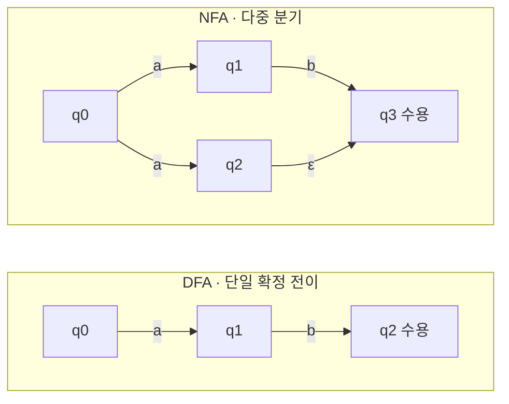
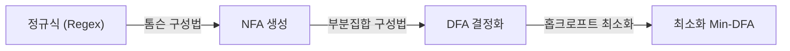

## 지식 로드맵 내 현재 위치

  소프트웨어공학
  정형 기법·컴파일러 이론
  <strong>유한 오토마타(Finite Automata)</strong>

## 큰 그림과 30초 인출

- 본질: 무한한 추가 메모리 없이 유한한 개수의 내부 상태와 전이 규칙만을 활용하여, 입력된 기호열(문자열)이 특정 정규 언어(Regular Language)의 규칙에 부합하는지 수학적으로 판별하는 추상 계산 모델
- 메커니즘: 정규 표현식(Regex) → NFA 변환(톰슨 구성법) → DFA 변환(부분집합 구성법) → 상태 최소화(홉크로프트 알고리즘) → 선형 시간($O(n)$) 고속 어휘 분석 실행
- 산출물: 5-튜플 $(Q, \Sigma, \delta, q_0, F)$ 수학 모델 · 상태 전이 다이어그램 · 상태 전이 테이블 · 컴파일러 어휘 분석기(Lexer) 엔진

핵심 용어

- **5-튜플(5-Tuple)**: 유한 오토마타를 수학적으로 정의하는 5가지 요소 $M = (Q, \Sigma, \delta, q_0, F)$로, $Q$(유한 상태 집합), $\Sigma$(입력 알파벳 집합), $\delta$(상태 전이 함수), $q_0$(시작 상태), $F$(종료/수용 상태 집합)를 의미
- **결정적 유한 오토마타(DFA, Deterministic Finite Automata)**: 현재 상태에서 주어진 입력에 대해 전이할 다음 상태가 오직 하나로 유일하게 결정되는 오토마타 ($\delta: Q \times \Sigma \to Q$)
- **비결정적 유한 오토마타(NFA, Non-deterministic Finite Automata)**: 현재 상태에서 동일 입력에 대해 여러 상태로 전이할 수 있거나, 입력 없이 상태가 바뀌는 $\epsilon$(엡실론) 전이를 허용하는 오토마타 ($\delta: Q \times (\Sigma \cup \{\epsilon\}) \to 2^Q$)
- **ReDoS(Regular Expression Denial of Service)**: NFA 기반 정규식 매칭 엔진이 특정 악의적 입력에 대해 지수 함수적($O(2^n)$) 백트래킹을 수행하여 CPU 자원을 100% 고갈시키는 서비스 거부 공격

---

## 1교시 예상문제 (10점)

> 유한 오토마타(Finite Automata)의 정의와 목적, 핵심 메커니즘을 설명하시오. (예상)

---

## 1교시 10점 답안

### 1. 정의·목적

- 정의: 무한한 추가 메모리 없이 유한한 개수의 내부 상태와 전이 규칙만을 활용하여, 입력된 기호열(문자열)이 특정 정규 언어(Regular Language)의 규칙에 부합하는지 수학적으로 판별하는 추상 계산 모델
- 목적: 유한한 상태와 입력 전이를 이용해 언어 인식과 순차 동작을 모델링한다.

### 2. 핵심 관계

- 제언: 상태·입력별 전이를 표로 정의하고 수용 상태와 누락·도달 불가 상태를 검증한다.
---

## 2~4교시 예상문제 (25점)

> 유한 오토마타(Finite Automata)의 개념과 목적을 설명하고, 핵심 메커니즘과 구성요소·절차, 적용 시 문제점과 대응 방안을 제시하시오. (25점, 예상)

---

## 2~4교시 25점 답안

### 1. 개요 및 필요성

### 상태 머신과 형식 언어 인식의 기반

소프트웨어 시스템에서 텍스트 기반 소스코드의 키워드를 분석(컴파일러 어휘 분석)하거나, 네트워크 패킷의 공격 시그니처를 실시간 탐지(침입탐지시스템 IDS), 또는 임베디드 장치의 전원·동작 모드를 제어할 때 **"현재 상태와 들어온 입력에 따라 다음 동작을 명확히 결정하는 정형 모델"**이 필수적이다.

유한 오토마타는 계산 이론(Automata Theory)의 기초 모델로서, 추가적인 보조 기억장치(스택, 테이프) 없이 오직 **유한한 내부 상태(Finite States)의 변화**만으로 정규 언어의 수용 여부를 판별하는 가장 가볍고 결정론적인 수학적 기계이다.

### DFA vs NFA 핵심 비교

| 구분 | 결정적 유한 오토마타 (DFA) | 비결정적 유한 오토마타 (NFA) |
|---|---|---|
| **전이 함수 형식** | $\delta: Q \times \Sigma \to Q$ (오직 1개 상태로 전이) | $\delta: Q \times (\Sigma \cup \{\epsilon\}) \to 2^Q$ (부분집합 전이) |
| **$\epsilon$(입력 없는 전이)** | 불가능 | 가능 ($\epsilon$-전이 지원) |
| **동일 입력 분기** | 불가능 (단일 경로) | 가능 (동시에 복수 상태로 분기) |
| **인식 시간 복잡도** | **$O(n)$ (입력 길이 비례, 선형 시간 보장)** | 최악의 경우 $O(2^n)$ (백트래킹 발생 시 지수 시간) |
| **상태 수 및 공간** | $O(2^{|Q|})$ (변환 시 상태 수 폭증 가능) | $O(|Q|)$ (상태 수가 작고 정규식 변환 용이) |
| **주요 활용 분야** | 컴파일러 어휘 분석기(Lex), Snort 침입탐지 | 정규 표현식 파싱 초기 모델, 이론적 증명 |

### 2. 아키텍처 및 핵심 메커니즘

### DFA와 NFA 상태 전이 다이어그램 비교

### 정규식에서 실행 코드까지의 변환 4대 단계

  

    

      <strong>① 톰슨 구성법 (Thompson)</strong>
      Regex → NFA
    

    

      <ul>
        <li>정규 표현식의 기본 연산자(연결, 선택 |, 클레이니 스타 *)를 $\epsilon$-전이 NFA 조각으로 귀납적 조합</li>
        <li>정규식 길이 $m$에 대해 상태 수 $O(m)$의 선형 크기 NFA 도출</li>
      </ul>
    

  

  

    

      <strong>② 부분집합 구성법 (Subset)</strong>
      NFA → DFA
    

    

      <ul>
        <li>$\epsilon$-폐쇄($\epsilon$-closure) 연산으로 도달 가능한 NFA 상태들의 부분집합을 하나의 DFA 상태로 매핑</li>
        <li>비결정론적 분기를 제거하여 결정적 단일 전이 구조로 변환</li>
      </ul>
    

  

  

    

      <strong>③ 홉크로프트 최소화 (Hopcroft)</strong>
      DFA 최소화
    

    

      <ul>
        <li>수용 상태 집합과 비수용 상태 집합으로 분할 후, 동등 상태(Equivalent States)를 반복 분할 통합</li>
        <li>동일한 언어를 인식하면서 상태 수가 가장 적은 유일한 Min-DFA 산출</li>
      </ul>
    

  

  

    

      <strong>④ 상태 전이 테이블 구현</strong>
      런타임 실행
    

    

      <ul>
        <li>2차원 배열 <code>Table[State][Input]</code> 형태로 메모리에 로드</li>
        <li>루프 1회당 배열 조회 1회로 $O(n)$ 시간 복잡도의 초고속 매칭 수행</li>
      </ul>
    

  

### 3. 실무 적용 및 고려사항

### 위험 대응 매트릭스

| 위험 | 대책 | 효과 |
|---|---|---|
| 중첩 수량자(`(a+)+$`)가 포함된 정규식에 악의적 비매칭 문자열 유입 시 CPU 100% 고갈(ReDoS 장애) | 백트래킹 NFA 엔진 대신 선형 시간($O(n)$)을 수학적으로 보장하는 DFA 기반 정규식 엔진(Google RE2) 적용 | ReDoS 서비스 거부 공격 원천 차단 및 시스템 가용성 보장 |
| NFA를 DFA로 변환하는 과정에서 상태 수가 $2^{|Q|}$로 폭증하여 메모리 오버플로우 발생 | 홉크로프트 최소화 알고리즘 적용 및 런타임에 필요한 DFA 상태만 동적 캐싱(Lazy DFA) 기법 채택 | 메모리 점유율을 수십 메가바이트 이내로 억제 |
| 임베디드 제어기의 복잡한 상태 전이가 스파게티 if-else 코드로 분산되어 누락 발생 | FSM(유한 상태 머신) 전이 표를 명세화하고 디자인 패턴의 상태 패턴(State Pattern)으로 객체 분리 | 미정의 상태 전이 누락 방지 및 상태 전이 검증 완전성 확보 |

### 4. 점검 및 합격 기준 (Checklist & Exit Criteria)

### 유한 오토마타 모델 검증 체크리스트

| 검증 영역 | 점검 항목 | 기준 |
|---|---|---|
| **수학적 정합성** | 5-튜플 $(Q, \Sigma, \delta, q_0, F)$ 요소 정의 누락 여부 | 전이 함수 $\delta$의 정의역/공역 완전 명세 |
| **결정성 검증** | DFA 상태 전이 테이블 내 미정의 전이(Dead State) 처리 | 미수용 입력에 대한 트랩 상태(Trap State) 처리 |
| **보안 가용성** | 정규식 엔진의 ReDoS 취약 패턴 보유 여부 | 지수 시간 백트래킹 배제 및 DFA 선형 시간 보장 |
| **공간 최적화** | 상태 수 최소화(Minimization) 적용 여부 | 홉크로프트 알고리즘을 통한 최소 상태 집합 수렴 |

### 5. 기대 효과 및 미래 전망

- **기대 효과**:
  - **결정론적 성능 보장**: 입력 길이 $n$에 정비례하는 $O(n)$ 선형 시간 내 정규 패턴 매칭 완료.
  - **보안 가용성 극대화**: NFA 백트래킹을 악용한 ReDoS 공격 원천 방어 및 마이크로서비스 가용성 확보.
- **미래 전망**:
  - eBPF 기반 초고속 커널 패킷 필터링 및 침입탐지(IDS) 서명 검사에 하드웨어 가속 DFA 채택 확대.
  - LLM 정형 출력 생성(Structured Output, JSON Schema) 시 유한 오토마타를 통한 토큰 마스킹 가이드 적용 가속화.

### 6. 결론 및 실전 팁

### 학습자 통찰 메모 — 답안 밖

> **[핵심 통찰]**  
> 유한 오토마타는 단순한 컴파일러 이론 수업의 추상 개념이 아니라, 현대 클라우드 보안과 네트워크 패킷 필터링의 심장이다. 대규모 트래픽 환경에서 정규식 하나 잘못 작성하면 NFA 백트래킹으로 인해 전사 서비스가 마비되는 ReDoS 장애가 발생한다. DFA로의 변환과 상태 최소화는 '수학적 결정론'을 통해 '선형 시간 성능과 보안'을 동시에 획득하는 가장 강력한 컴퓨터 과학의 승리이다.

> **[나라면 이렇게 쓴다]**  
> 1교시형 문제로 유한 오토마타가 출제된다면, 단순히 5-튜플과 DFA/NFA 차이만 나열하지 않고, **촘스키 계층 구조(Type 3 정규 언어)에서의 위계적 위치**를 1단락에 명확히 명시하겠다. 그리고 3단락에서는 **Google RE2 엔진의 순수 DFA 아키텍처를 제시하며 ReDoS 공격을 원천 차단하는 엔지니어링 실무 통찰**을 보여주어 수험서 수준의 답안과 확실히 격차를 벌리겠다.

### 실전 답안용 기술사적 제언

- **판정 기준**: 외부 사용자 입력을 검증하는 모든 정규식 엔진에 대해 NFA 백트래킹 유무를 점검하고, ReDoS 취약 패턴 존재 시 DFA 기반 엔진 적용을 필수 기준으로 판정.
- **대응 방안**: Java/Python 표준 Regex 라이브러리 대신 Google RE2 또는 Rust Regex 엔진을 도입하여 악의적 입력에도 엄격한 $O(n)$ 선형 시간 복잡도 강제.
- **검증 체계**: CI/CD 정적 분석 파이프라인에 `safe-regex`, `vuln-regex-detector` 도구를 연동하여 지수 시간 폭증을 유발하는 중첩 수량자 사전 차단.
- **기대 효과**: ReDoS 공격으로 인한 컨테이너 CPU 100% 고갈 장애를 100% 예방하고 초당 수만 건의 텍스트 패턴 고속 검증 달성.

### 7. 참고 및 연계 학습

- [정형 기법 및 모델 검증](./028_sw_safety_analysis.md)
- [디자인 패턴 (상태 패턴)](./005_design_pattern.md)
- [침입탐지시스템 및 패킷 필터링](../../04-security/041_waf.md)
---
