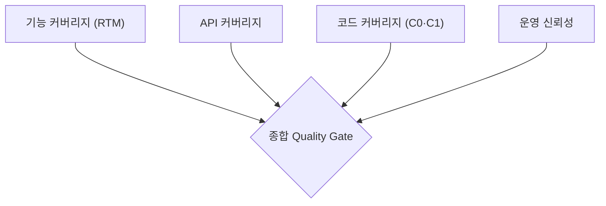
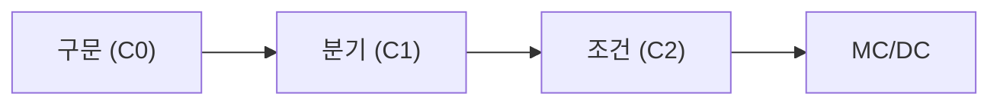

## 지식 로드맵 내 현재 위치

  소프트웨어공학
  테스팅·품질 관리
  <strong>테스트 커버리지(Test Coverage)</strong>

## 큰 그림과 30초 인출

- 본질: "테스트를 충분히 수행했는가"와 "언제 테스트를 종료할 것인가"를 정량적으로 증명하기 위해, 시스템의 요구사항 명세(기능)와 소스코드 내부 구조(구문·분기) 대비 테스트 케이스가 실제로 통과한 검증 비율을 백분율(%)로 계측하는 품질 완료 판정 지표
- 메커니즘: 검증 기준 수립 → 테스트 케이스 실행 및 동적 계측(Instrumentation) → 기능·구조 다차원 커버리지 수집 → 미달 구간 보완 → 테스트 완료 기준(Exit Criteria) 및 Quality Gate 판정
- 산출물: 요구사항 추적 매트릭스(RTM) 커버리지 표 · 코드 커버리지 계측 보고서(JaCoCo, Coverage.py) · 테스트 완료 보고서 · 품질 게이트 승인 기록

핵심 용어

- **테스트 커버리지(Test Coverage)**: 시스템의 전체 검증 대상(요구사항, 소스코드, 인터페이스 등) 중 작성된 테스트 케이스를 통해 실제로 테스트가 수행된 영역의 비율
- **기능 커버리지(Functional Coverage)**: 사용자의 업무 요구사항 명세서 및 유스케이스 대비 테스트 케이스가 누락 없이 매핑되어 실행되었는지를 나타내는 블랙박스 관점의 지표
- **구조적 코드 커버리지(Code Coverage)**: 프로그램 소스코드의 구문(Statement), 분기(Branch), 조건(Condition), MC/DC 중 테스트 실행 시 실제로 거쳐 간 코드 라인의 비율
- **테스트 완료 기준(Exit Criteria)**: 사전에 정의된 품질 및 일정 목표로, 특정 커버리지 임계치와 잔존 결함 기준을 만족해야 테스트 단계를 종료할 수 있도록 규정한 정책

---

## 1교시 예상문제 (10점)

> 테스트 커버리지(Test Coverage)의 정의와 목적, 핵심 메커니즘을 설명하시오. (예상)
---

## 1교시 10점 답안

### 1. 정의·목적

- 정의: "테스트를 충분히 수행했는가"와 "언제 테스트를 종료할 것인가"를 정량적으로 증명하기 위해, 시스템의 요구사항 명세(기능)와 소스코드 내부 구조(구문·분기) 대비 테스트 케이스가 실제로 통과한 검증 비율을 백분율(%)로 계측하는 품질 완료 판정 지표
- 목적: 해당 토픽의 주요 문제를 해결하고 필요한 기능을 제공한다.

### 2. 핵심 관계

- 제언: 핵심 작동 원리를 적용해 직접 효과를 검증한다.
---

## 2~4교시 예상문제 (25점)

> 테스트 커버리지(Test Coverage)의 개념과 목적을 설명하고, 핵심 메커니즘과 구성요소·절차, 적용 시 문제점과 대응 방안을 제시하시오. (25점, 예상)
---

## 2~4교시 25점 답안

### 1. 개요 및 필요성

### 테스트 종료 시점의 불확실성과 커버리지의 역할

소프트웨어 개발 프로젝트에서 가장 빈번하게 발생하는 딜레마는 **"과연 테스트를 어디까지 해야 충분하며, 언제 배포를 승인할 것인가?"**이다. 주관적인 판단이나 단순한 테스트 수행 횟수(건수)에 의존할 경우, 중요 비즈니스 로직이 전혀 검증되지 않은 상태에서 납기 압박으로 인해 결함이 운영 환경으로 유출된다.

테스트 커버리지는 시스템의 명세와 소스코드를 분모로 두고 테스트가 실행된 영역을 분자로 계산하여, **테스트 활동의 충분성을 객관적·정량적 수치로 가시화**한다. 이를 통해 테스트 공백을 방지하고 배포 안정성을 보장하는 Quality Gate 통과 기준으로 활용된다.

### 기능 커버리지 vs 구조적 코드 커버리지 비교

| 구분 | 기능 커버리지 (Functional Coverage) | 구조적 코드 커버리지 (Code Coverage) |
|---|---|---|
| **측정 기준** | 요구사항 명세서, 유스케이스, 화면 정의서 | 소스코드 텍스트, AST, 바이트코드 구조 |
| **테스트 관점** | 블랙박스 테스팅 (명세 기반) | 화이트박스 테스팅 (구현 기반) |
| **측정 대상** | 요구사항 항목, 사용자 시나리오 흐름 | 구문(Statement), 분기(Branch), 조건, MC/DC |
| **누락 탐지력** | 구현 누락(Omission 결함) 탐지 가능 | **요구사항이 미구현된 코드는 계측 불가** |
| **핵심 도구** | Jira, ALM, 요구사항 추적표(RTM) | JaCoCo, Cobertura, Coverage.py, SonarQube |

### 2. 아키텍처 및 핵심 메커니즘

### 다차원 테스트 커버리지 모델

### 구조적 코드 커버리지 4대 단계 상세

  

    

      <strong>① 구문 커버리지 (Statement, C0)</strong>
      기본 수준
    

    

      <ul>
        <li>전체 실행 가능한 소스코드 라인 중 1회 이상 실행된 라인의 비율</li>
        <li>if 조건문의 false 분기나 예외 처리 블록 누락 가능성 존재</li>
      </ul>
    

  

  

    

      <strong>② 분기 커버리지 (Branch, C1)</strong>
      실무 표준
    

    

      <ul>
        <li>전체 조건문의 참(True)과 거짓(False) 결과 분기가 1회 이상 실행된 비율</li>
        <li>결정 커버리지(Decision Coverage)와 동일하며 일반 엔터프라이즈의 표준 기준</li>
      </ul>
    

  

  

    

      <strong>③ 조건 커버리지 (Condition, C2)</strong>
      개별 조건
    

    

      <ul>
        <li>복합 조건문 내부의 개별 개별 조건식(Sub-condition)이 참/거짓을 만족한 비율</li>
        <li>전체 조건문의 결과는 참/거짓을 모두 만족하지 못할 수 있는 한계 보유</li>
      </ul>
    

  

  

    

      <strong>④ MC/DC (수정 조건/결정 커버리지)</strong>
      안전 필수
    

    

      <ul>
        <li>각 개별 조건식이 다른 조건식과 무관하게 전체 결정문의 결과에 독립적 영향 입증</li>
        <li>항공(DO-178C), 자동차(ISO 26262 ASIL-D) 고안전 제어 소프트웨어 필수 적용</li>
      </ul>
    

  

### 3. 실무 적용 및 고려사항

### 위험 대응 매트릭스

| 위험 | 대책 | 효과 |
|---|---|---|
| 단위 테스트 코드 커버리지가 85%를 달성했으나 오픈 첫날 미구현 요구사항 발생 | 소스코드 계측과 별개로 요구사항 추적표(RTM) 기반 기능 커버리지 100% 매핑을 인수 조건으로 강제 | 요구사항 누락(Omission 결함) 및 미개발 기능 조기 탐지 |
| 마감 일정 압박으로 커버리지 100% 달성에 집착하다가 단순 getter/setter 테스트만 양산 | 리스크 기반 테스팅(RBT)을 연계하여 결제·인증 핵심 모듈은 분기 90%, 단순 모듈은 50%로 차등화 | 테스트 자원 낭비 방지 및 고위험 결함 집중 방어 |
| 테스트 커버리지 수치만 높고 실제 비즈니스 예외 상황에 대한 어서션(Assertion) 부재 | SonarQube 커버리지 검증과 함께 돌연변이 테스트(Mutation Testing) 점수 연동 검증 | 무의미한 테스트 코드 제거 및 실질적 결함 검출력 확보 |

### 4. 점검 및 합격 기준 (Checklist & Exit Criteria)

### 테스트 커버리지 판정 체크리스트

| 검증 영역 | 점검 항목 | 기준 |
|---|---|---|
| **기능 검증** | RTM 기반 요구사항 테스트 케이스 매핑률 | 전수 100% 매핑 및 통과 |
| **코드 검증** | SonarQube 신규 코드 분기 커버리지(C1) | 80% 이상 충족 시 Gate Pass |
| **고안전 검증** | 안전 등급(ASIL-D) 제어 모듈 MC/DC 달성률 | $N+1$ 테스트 케이스 100% 증명 |
| **유효성 검증** | Assertion 누락 검증 (Mutation Score) | 돌연변이 사멸률 70% 이상 확보 |

### 5. 기대 효과 및 미래 전망

- **기대 효과**:
  - **정량적 릴리스 판정**: 주관적 감각이 아닌 수치 기반의 테스트 완료 기준(Exit Criteria) 확립.
  - **결함 유출 방지**: 핵심 비즈니스 로직의 미검증 분기를 사전에 식별하여 운영 배포 장애 최소화.
- **미래 전망**:
  - 생성형 AI 기반 테스트 자동화 도구(GitHub Copilot for Tests)가 커버리지 미달 구간을 자동 분석하여 보완 TC 자동 생성.
  - 런타임 프로덕션 트래픽 리플레이(Virtualization)와 연계한 실시간 운영 코드 커버리지 모니터링 보편화.

### 6. 결론 및 실전 팁

### 학습자 통찰 메모 — 답안 밖

> **[핵심 통찰]**  
> "코드 커버리지 100% = 결함 0%"라는 생각은 가장 위험한 환상이다. 소스코드가 아무리 100% 실행되었더라도, 요구사항 자체가 빠진 누락 결함(Omission)은 코드 커버리지 도구로 절대 감지할 수 없다. 또한 어서션(Assertion) 없는 빈 테스트도 커버리지는 100%로 집계된다. 따라서 기술사는 **기능 커버리지(RTM) 100%와 리스크 기반 차등화된 코드 커버리지(C1 80%), 그리고 돌연변이 테스트 점수를 결합한 3중 품질 방어선**을 제시할 수 있어야 한다.

> **[나라면 이렇게 쓴다]**  
> 1교시형 단답형 문제라면 구문/분기/조건/MC-DC의 4단계 위계 포함 관계를 명확한 수식과 포함 다이어그램으로 제시하겠다. 2교시형 서술형 문제라면 CI/CD 파이프라인에서 **SonarQube Quality Gate를 통해 분기 커버리지 80% 미달 시 메인 브랜치 머지를 강제 차단(Block)하는 DevSecOps 거버넌스 아키텍처**를 3단락 실전 제언으로 강력하게 피력하겠다.

### 실전 답안용 기술사적 제언

- **판정 기준**: 신규 생성 코드 기준으로 구문 80%, 분기 75% 미달 시 품질 게이트 Fail로 판정하며, 금융·결제 모듈은 분기 90% 이상을 필수로 적용.
- **대응 방안**: 커버리지 수치 왜곡(단순 호출 후 미검증) 방지를 위해 돌연변이 테스트(Pitest)를 도입하여 뮤테이션 점수 70% 이상을 병행 평가.
- **검증 체계**: GitHub Actions PR 단계에서 JaCoCo 계측 및 SonarQube 분석을 자동 트리거하고, 기준 미달 시 Merge 버튼 자동 비활성화.
- **기대 효과**: 배포 전 잠재 결함의 85% 이상을 빌드 단계에서 조기 격리하고, 테스트 종료에 대한 정량적 감사 증적 100% 확보.

### 7. 참고 및 연계 학습

- [요구사항 추적표(RTM)](./102_requirement_traceability_matrix.md)
- [화이트박스 테스트 기법](./013_white_box_test.md)
- [돌연변이 테스팅(Mutation Test)](./084_mutation_test.md)
- [CI/CD 지속적 통합 및 배포](./095_ci_cd.md)
---
