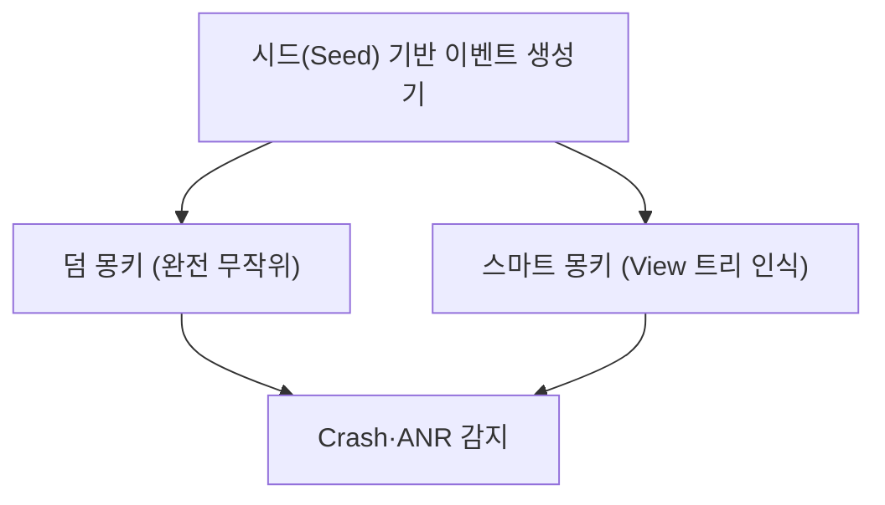
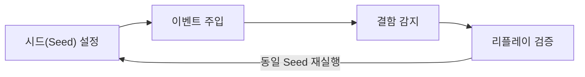

## 지식 로드맵 내 현재 위치

  소프트웨어공학
  동적 테스팅 기법
  <strong>몽키 테스트(Monkey Test)</strong>

## 큰 그림과 30초 인출

- 본질: 테스터가 사전에 정해둔 시나리오 위주의 테스트 케이스로 발견할 수 없는 예측 불가능한 사용자 오작동과 극한의 예외를 찾아내기 위해, 사전 작성된 테스트 케이스 없이 무작위(Random) 입력과 제스처 이벤트를 대량으로 쏟아부어 시스템 비정상 종료(Crash)를 유도하는 블랙박스 테스팅 기법
- 메커니즘: 의사 난수 시드(Seed) 기반 이벤트 스트림 생성 → UI 컴포넌트 및 API 무작위 주입 → 크래시(Crash) 및 무응답(ANR) 감지 → 시드 기반 이벤트 리플레이를 통한 결함 재현 디버깅
- 산출물: 몽키 테스트 실행 로그(Seed 번호 포함) · 크래시/ANR 스택 트레이스 보고서 · 복원력 분석서

핵심 용어

- **덤 몽키(Dumb Monkey)**: 대상 시스템의 내부 상태나 UI 구조에 대한 정보 없이 완전히 무작위로 클릭, 터치, 키 입력을 쏟아붓는 가장 단순한 형태의 무작위 테스팅
- **스마트 몽키(Smart Monkey)**: 시스템의 화면 객체 모델(DOM, View 계층)과 현재 상태를 인식하여, 클릭 가능한 유효 영역 위주로 지능적 이벤트를 주입하는 고도화된 테스팅
- **재현성(Reproducibility)**: 무작위 테스트에서 결함이 터졌을 때 동일한 입력 순서를 재현할 수 있는 능력으로, 난수 발생기의 고정 시드(Seed) 관리가 핵심
- **ANR(Application Not Responding)**: 모바일 앱 메인 스레드가 일정 시간(통상 5초) 이상 멈추어 사용자 입력에 응답하지 못하는 프리징 상태

---

## 1교시 예상문제 (10점)

> 몽키 테스트(Monkey Test)의 정의와 목적, 핵심 메커니즘을 설명하시오. (예상)

---

## 1교시 10점 답안

### 1. 정의·목적

- 정의: 테스터가 사전에 정해둔 시나리오 위주의 테스트 케이스로 발견할 수 없는 예측 불가능한 사용자 오작동과 극한의 예외를 찾아내기 위해, 사전 작성된 테스트 케이스 없이 무작위(Random) 입력과 제스처 이벤트를 대량으로 쏟아부어 시스템 비정상 종료(Crash)를 유도하는 블랙박스 테스팅 기법
- 목적: 무작위 입력과 동작으로 예측하기 어려운 충돌·멈춤·예외를 찾아낸다.

### 2. 핵심 관계

- 제언: 입력 범위와 실행 시간을 제한하고 시드·로그를 보존해 발견한 장애를 재현하고 분류한다.
---

## 2~4교시 예상문제 (25점)

> 몽키 테스트(Monkey Test)의 개념과 목적을 설명하고, 핵심 메커니즘과 구성요소·절차, 적용 시 문제점과 대응 방안을 제시하시오. (25점, 예상)

---

## 2~4교시 25점 답안

### 1. 개요 및 필요성

### 정형 테스트 케이스의 사각지대와 몽키 테스트의 가치

전통적인 소프트웨어 테스팅은 요구사항 명세서를 바탕으로 정상 경로(Happy Path)와 예상 가능한 예외 경로 위주로 테스트 케이스를 설계한다. 그러나 실제 운영 환경에서 일반 사용자는 화면을 빠르게 연타하거나, 화면이 회전하는 도중 홈 버튼을 누르고 복귀하는 등 **개발자가 전혀 상상하지 못한 비정형적이고 극단적인 조작**을 수행한다.

몽키 테스트는 사전 정의된 테스트 케이스 없이, 마치 원숭이가 단말기를 마구 두드리는 것처럼 무작위 이벤트를 쏟아부어 **메모리 누수, 멀티스레드 레이스 컨디션, 예상치 못한 널 포인터 참조로 인한 앱 강제 종료(Crash)를 선제적으로 발굴**한다.

### 몽키 테스트 vs 고릴라 테스트 vs 퍼즈 테스팅 비교

| 구분 | 몽키 테스트 (Monkey Test) | 고릴라 테스트 (Gorilla Test) | 퍼즈 테스팅 (Fuzz Testing) |
|---|---|---|---|
| **테스트 대상** | 애플리케이션 시스템 전체 | **특정 단일 모듈/컴포넌트 집중** | 네트워크 프로토콜, 파일 포맷, API 파서 |
| **주입 데이터** | 무작위 UI 터치, 키 입력, 화면 제스처 | 특정 모듈에 대한 반복적 과부하 입력 | 규격에 맞지 않는 기형적 바이트/패킷 데이터 |
| **핵심 목적** | 비정상 사용자 조작 대비 앱 안정성(Crash) 검증 | 특정 핵심 모듈의 한계 성능 및 파괴 시험 | 보안 취약점(버퍼 오버플로우, 원격 코드 실행) 탐지 |
| **대표 도구** | Android UI/Exerciser Monkey | 커스텀 부하/스트레스 테스트 스크립트 | AFL(American Fuzzy Lop), LibFuzzer |

### 2. 아키텍처 및 핵심 메커니즘

### 덤 몽키 vs 스마트 몽키 아키텍처

### 몽키 테스트 핵심 실행 단계

  

    

      <strong>① 파라미터 및 시드(Seed) 설정</strong>
      재현성 확보
    

    

      <ul>
        <li>의사 난수 생성기에 특정 정수 Seed 부여 (동일 시드 입력 시 동일 이벤트 재현)</li>
        <li>터치, 모션, 트랙볼, 시스템 키 이벤트 비율(%) 설정</li>
      </ul>
    

  

  

    

      <strong>② 연속 이벤트 주입</strong>
      부하 유발
    

    

      <ul>
        <li>초당 수십~수백 건의 이벤트를 쉬지 않고 애플리케이션에 전달</li>
        <li>화면 전환, 네트워크 끊김, 배터리 부족 이벤트 병행 시뮬레이션</li>
      </ul>
    

  

  

    

      <strong>③ 이상 징후 실시간 로깅</strong>
      결함 감지
    

    

      <ul>
        <li>Logcat 등을 통해 Crash, ANR, OutOfMemory 예외 감지</li>
        <li>장애 발생 직전 100개 이벤트 히스토리와 스택 트레이스 보관</li>
      </ul>
    

  

  

    

      <strong>④ 회귀 검증 및 리플레이</strong>
      수정 확인
    

    

      <ul>
        <li>크래시를 유발한 Seed 번호로 몽키 테스트를 재실행하여 버그 재현</li>
        <li>코드 패치 후 동일 Seed 재실행으로 정상 종료 여부 검증</li>
      </ul>
    

  

### 3. 실무 적용 및 고려사항

### 위험 대응 매트릭스

| 위험 | 대책 | 효과 |
|---|---|---|
| 수십만 회 무작위 터치 중 크래시가 터졌으나 입력 순서를 몰라 버그 재현 불가 | 난수 생성기의 시드(Seed) 값을 실행 로그에 필수 기록하고 Replay 기능 지원 도구 채택 | 버그 100% 결정론적 재현 및 디버깅 소요 시간 80% 단축 |
| 덤 몽키가 로그인 화면의 빈 공간만 난타하다가 실제 서비스 핵심 화면에 진입하지 못함 | 화면 UI 계층을 파싱하여 폼 입력과 버튼 클릭을 지능적으로 수행하는 스마트 몽키(Appium 등 연계) 적용 | 화면 깊숙한 결제 및 비즈니스 로직 계층 탐색 커버리지 확보 |
| 몽키 테스트 실행 중 실제 운영 DB 결제 승인 또는 계정 삭제 등 파괴적 이벤트 실행 | 테스트 전용 샌드박스 환경 격리 및 치명적 버튼(회원탈퇴, 초기화) 영역 블랙리스트 설정 | 운영 데이터 훼손 방지 및 안전한 무작위 테스트 수행 |

### 4. 점검 및 합격 기준 (Checklist & Exit Criteria)

### 몽키 테스트 릴리스 판정 체크리스트

| 점검 영역 | 상세 검증 항목 | 합격 기준 |
|---|---|---|
| **안정성 검증** | 100만 회 무작위 이벤트 주입 중 비정상 종료(Crash) 발생 건수 | 0건 (Zero Crash) |
| **응답성 검증** | 메인 스레드 블로킹으로 인한 ANR 발생 여부 | 0건 (Zero ANR) |
| **자원 누수** | 장시간 이벤트 주입 후 프로세스 힙 메모리 및 파일 디스크립터 | 누수율 0% 및 안정적 GC 수렴 |
| **재현성 검증** | 발견된 결함에 대한 시드(Seed) 번호 기록 및 재현 성공 여부 | 100% 재현 및 회귀 통과 |

### 5. 기대 효과 및 미래 전망

- **기대 효과**:
  - **테스트 케이스 사각지대 해소**: 정형화된 시나리오에서 놓치기 쉬운 비정형 엣지 케이스 선제 발굴.
  - **릴리스 직전 안정성 입증**: 수십만 회의 극한 난타 시험을 통과하여 앱 스토어 배포 후 충돌율 0.01% 이하 달성.
- **미래 전망**:
  - 멀티모달 LLM 에이전트와 결합하여 화면 UI를 스스로 이해하고 취약점을 탐색하는 'AI 자율 몽키' 상용화.
  - 클라우드 인프라 카오스 엔지니어링 도구와의 통합을 통한 단말-서버 간 통합 복원력(End-to-End Resilience) 테스트 확산.

### 6. 결론 및 실전 팁

### 학습자 통찰 메모 — 답안 밖

> **[핵심 통찰]**  
> 몽키 테스트는 '무식한 무작위 난타'가 아니다. 그 핵심은 **"무작위성을 통제 가능한 결정론으로 만드는 시드(Seed) 관리"**와 **"화면 객체 트리를 이해하고 파고드는 스마트 몽키의 지능성"**에 있다. 재현할 수 없는 무작위 테스트는 개발자에게 의미 없는 소음(Noise)일 뿐이다. 시드 로깅과 스택 트레이스 리플레이가 결합될 때 비로소 엔지니어링 도구로서의 생명력을 얻는다.

> **[나라면 이렇게 쓴다]**  
> 모바일 단말 UI 레벨의 몽키 테스트에 그치지 않고, 넷플릭스가 제안한 **클라우드 인프라 레벨의 카오스 몽키(Chaos Monkey)**와의 아키텍처적 연속성을 3단락에서 서술하겠다. 단말에서의 무작위 UI 이벤트 주입과 클라우드에서의 무작위 Pod 강제 종료는 모두 '예측 불가능한 실패를 상정하고 시스템의 자가 치유(Self-Healing) 복원력을 검증한다'는 동일한 철학임을 피력하겠다.

### 실전 답안용 기술사적 제언

- **판정 기준**: 릴리스 전 CI 나이트 빌드(Nightly Build)에서 단말당 50만 회 이벤트 주입 시 크래시 및 ANR 0건을 배포 승인 필수로 판정.
- **대응 방안**: 단순 덤 몽키 대신 View 계층 트리를 인식하는 스마트 몽키를 채택하고, 치명적 시스템 버튼(초기화/결제)은 블랙리스트 좌표로 격리.
- **검증 체계**: 크래시 감지 즉시 장애 직전 100개 이벤트 스트림과 시드 번호를 Jira 이슈로 자동 등록하는 리플레이 파이프라인 구축.
- **기대 효과**: 출시 후 사용자 크래시 신고율을 90% 이상 사전 억제하고, 레이스 컨디션 결함 디버깅 시간을 평균 4시간 이내로 단축.

### 7. 참고 및 연계 학습

- [임베디드 소프트웨어 테스트](./089_embedded_sw_test.md)
- [테스트 자동화(Test Automation)](./091_test_automation.md)
- [카오스 테스트(Chaos Engineering)](./176_chaos_test.md)
- [돌연변이 테스팅(Mutation Test)](./084_mutation_test.md)
---
