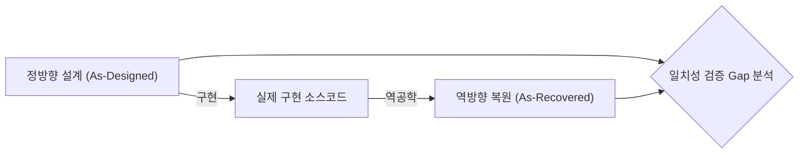
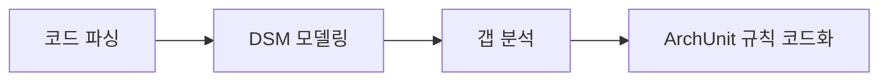

## 지식 로드맵 내 현재 위치

  소프트웨어공학
  아키텍처 설계·평가
  <strong>소프트웨어 아키텍처 분석(정방향/역방향)</strong>

## 큰 그림과 30초 인출

- 본질: 소프트웨어 개발 및 유지보수 과정에서 설계 문서와 실제 구현 코드 간의 간극이 벌어지는 아키텍처 침식(Erosion)을 방지하기 위해, 요구사항으로부터 최적 구조를 도출·평가하는 정방향(Forward) 분석과 소스코드로부터 실제 구조를 역추출하여 설계 일치성을 검증하는 역방향(Reverse) 분석을 통합 적용하는 무결성 보증 기법
- 메커니즘: 정방향(품질 속성 시나리오 도출 → 스타일 선정 → ATAM/CBAM 평가) ↔ 역방향(코드 파싱 → 의존성 행렬 DSM 추출 → 의도된 설계 대비 갭 분석 및 아키텍처 규칙 검증)
- 산출물: 소프트웨어 아키텍처 기술서(SAD) · ATAM 평가 보고서 · 복원된 아키텍처 모델 · 의존성 구조 매트릭스(DSM) 갭 분석서

핵심 용어

- **정방향 아키텍처 분석(Forward Analysis)**: 비즈니스 요구사항과 품질 속성(성능, 가용성, 보안 등)을 바탕으로 상위 아키텍처 스타일을 결정하고 구조적 타당성을 연역적으로 평가하는 기법
- **역방향 아키텍처 분석(Reverse Analysis)**: 실제 구현된 소스코드와 바이너리를 정적 분석하여 시스템의 실제 구조, 패키지 간 의존 관계, 호출 경로를 귀납적으로 복원하는 기법
- **아키텍처 침식(Architectural Erosion)**: 개발자가 편의를 위해 계층 원칙을 어기고 하위 레이어를 건너뛰거나 순환 참조를 만들어 시스템 구조가 점진적으로 붕괴되는 현상
- **DSM(Design Structure Matrix)**: 모듈 간의 결합과 의존성을 N x N 정방형 매트릭스로 표현하여 순환 참조와 비정상 계층 침범을 가시화하는 분석 도구

## 1. 개요 및 필요성

### 의도된 아키텍처와 구현된 아키텍처의 괴리

프로젝트 초기에는 소프트웨어 아키텍트가 정교한 3계층 아키텍처(Presentation - Business - Data)나 헥사고날 아키텍처를 설계한다. 그러나 실제 개발이 진행되고 유지보수가 지속되면서, 개발자들은 빠른 납기를 위해 비즈니스 로직을 건너뛰고 컨트롤러에서 DB를 직접 쿼리하거나, 서비스 간에 양방향 순환 참조를 만드는 등 **설계 원칙을 위반(아키텍처 침식)**하게 된다.

이로 인해 시스템은 점차 스파게티 구조로 전락하여 모듈 분리가 불가능해지고 작은 수정에도 시스템 전체가 마비된다. 따라서 **요구사항으로부터 최적 설계를 도출하는 정방향 분석**과 **구현 코드가 설계를 지키고 있는지 감시하는 역방향 분석**을 상호 연계하는 종합 아키텍처 통제가 필수적이다.

### 정방향 분석 vs 역방향 분석 핵심 비교

| 구분 | 정방향 아키텍처 분석 (Forward) | 역방향 아키텍처 분석 (Reverse) |
|---|---|---|
| **분석 출발점** | 비즈니스 목표, 품질 속성 요구사항 | 실제 소스코드, 설정 파일, 바이너리 |
| **추론 방식** | 연역적 (Top-Down: 요구사항 $\rightarrow$ 설계) | 귀납적 (Bottom-Up: 코드 $\rightarrow$ 아키텍처 복원) |
| **핵심 목적** | 아키텍처 스타일 선정 및 품질 트레이드오프 평가 | 아키텍처 침식 탐지 및 설계-구현 갭(Gap) 검증 |
| **적용 시점** | 아키텍처 수립 및 상세 설계 초기 단계 | 개발 진행 중(CI 연계) 및 레거시 유지보수 단계 |
| **대표 도구** | ATAM, CBAM, ADD(Attribute-Driven Design) | ArchUnit, SonarQube, Structure101, Lattix(DSM) |

## 2. 아키텍처 및 핵심 메커니즘

### 정방향-역방향 통합 아키텍처 거버넌스 프레임워크

### 역방향 분석 4대 핵심 절차

  

    

      <strong>① 소스코드 파싱 (Parsing)</strong>
      데이터 추출
    

    

      <ul>
        <li>구문 분석기를 통해 소스코드를 추상 구문 트리(AST)로 변환</li>
        <li>클래스 간 import, 상속, 호출, 객체 생성 관계 추출</li>
      </ul>
    

  

  

    

      <strong>② 의존성 모델링 (DSM)</strong>
      구조 가시화
    

    

      <ul>
        <li>모듈 간 의존 관계를 N x N 매트릭스(Design Structure Matrix)로 변환</li>
        <li>대각선 상단의 0이 아닌 값을 통해 순환 참조(Circular Dependency) 즉시 식별</li>
      </ul>
    

  

  

    

      <strong>③ 갭 분석 (Gap Analysis)</strong>
      침식 판정
    

    

      <ul>
        <li>설계와 일치하는 수렴(Convergence), 누락된 결여(Absence) 판정</li>
        <li>설계 규칙을 위반하여 발생한 불법 발산(Divergence) 라인 적발</li>
      </ul>
    

  

  

    

      <strong>④ 리팩토링 및 규칙 코드화</strong>
      재발 방지
    

    

      <ul>
        <li>의존관계 역전 원칙(DIP)을 적용하여 불법 순환 결합 해소</li>
        <li>ArchUnit 단위 테스트 코드로 아키텍처 규칙을 작성하여 CI에 등록</li>
      </ul>
    

  

## 3. 실무 적용 및 고려사항

### 위험 대응 매트릭스

| 위험 | 대책 | 효과 |
|---|---|---|
| 컨트롤러 계층에서 리포지토리 계층을 직접 참조하여 비즈니스 규칙이 우회되는 아키텍처 침식 | Java의 ArchUnit 등 아키텍처 검증 라이브러리를 빌드 파이프라인에 탑재하여 계층 위반 시 빌드 자동 실패 처리 | 계층형 아키텍처 원칙 100% 강제 및 유지보수성 보호 |
| 서비스 간 A $\rightarrow$ B $\rightarrow$ C $\rightarrow$ A 순환 참조로 인해 독립 배포 및 단위 테스트 불가 | DSM(Design Structure Matrix) 정적 분석으로 순환 결합점을 탐지하고 인터페이스 분리 및 이벤트(Kafka) 기반 디커플링 | 순환 의존성 원천 제거 및 서비스 독립 배포성 확보 |
| 초기 아키텍처 문서(SAD)가 코드와 동기화되지 않고 사문화되어 설계 지침 무력화 | 아키텍처 규칙을 코드(Architecture as Code)로 저장소에 보관하고 다이어그램을 소스코드로부터 자동 역생성 | 문서와 코드 간의 1:1 일치성 상시 유지 |

## 4. 점검 및 합격 기준 (Checklist & Exit Criteria)

### 아키텍처 무결성 판정 체크리스트

| 점검 영역 | 상세 검증 항목 | 합격 기준 |
|---|---|---|
| **계층 준수** | ArchUnit 기반 레이어드 아키텍처 단방향 의존성 규칙 | 위반 라인 0건 (Zero Divergence) |
| **순환 참조** | DSM 분석을 통한 패키지 및 서비스 간 순환 결합 여부 | 순환 의존성 완전 제거 ($D=0$) |
| **품질 속성** | ATAM 시나리오 기준 핵심 지연 시간 및 처리량 | 목표 SLA 100% 만족 |
| **설계 일치** | As-Designed 대비 As-Recovered 일치율(Conformance) | 일치율 95% 이상 확보 |

## 5. 기대 효과 및 미래 전망

- **기대 효과**:
  - **아키텍처 침식 방지**: 개발 단계에서 설계 원칙 위반을 조기에 차단하여 기술 부채 누적 억제.
  - **레거시 현대화 가속**: 소스코드로부터 정확한 DSM을 복원하여 안전한 MSA 분할 경계 수립.
- **미래 전망**:
  - 생성형 AI 기반의 아키텍처 자동 리팩토링(순환 참조 발견 시 DIP 인터페이스 자동 생성) 보편화.
  - Architecture as Code와 GitOps의 결합으로 아키텍처 변경 이력의 100% 형상 관리 달성.

## 6. 결론 및 실전 팁

### 학습자 통찰 메모 — 답안 밖

> **[핵심 통찰]**  
> 소프트웨어 아키텍처는 그릴 때(Design) 완성되는 것이 아니라, 지켜질 때(Conformance) 비로소 가치를 갖는다. 아무리 아름다운 아키텍처 다이어그램을 작성해 두어도 개발자가 코드 레벨에서 계층을 건너뛰고 순환 참조를 만들면 몇 년 안에 시스템은 썩어버린다(Architectural Erosion). 따라서 진정한 아키텍처 관리는 **정방향 평가(ATAM)와 역방향 코드 검증(ArchUnit, DSM)이 맞물린 지속적 닫힌 루프(Closed-Loop)**로 완성되어야 한다.

> **[나라면 이렇게 쓴다]**  
> 2교시형 문제로 아키텍처 분석이 출제된다면, 개념 설명에 머무르지 않고 **"ArchUnit을 활용한 Architecture as Code 실전 패턴"**을 답안에 직접 작성하겠다. `noClasses().that().resideInAPackage("..controller..").should().dependOnClassesThat().resideInAPackage("..repository..")`와 같은 실제 테스트 코드 스니펫을 제시하여, 아키텍처 규칙이 CI 파이프라인에서 자동 강제되는 엔지니어링 거버넌스를 어필하겠다.

### 실전 답안용 기술사적 제언

- **판정 기준**: CI/CD 파이프라인에서 As-Recovered DSM의 순환 참조 발생 또는 ArchUnit 계층 위반 감지 시 즉시 빌드 차단(Fail) 판정.
- **대응 방안**: 불법 결합 모듈에 대해 의존관계 역전 원칙(DIP)을 적용하여 인터페이스를 분리하고, 서비스 간 통신은 이벤트 브로커로 비동기 디커플링.
- **검증 체계**: SonarQube 및 Structure101을 Git PR 파이프라인에 연계하여 아키텍처 일치성 지수 95% 미달 시 머지 불가 통제.
- **기대 효과**: 아키텍처 침식으로 인한 재개발 비용을 80% 절감하고, 신규 기능 추가 시의 파급 영향도를 국소 모듈 내로 격리.

## 7. 참고 및 연계 학습

- [ATAM(Architecture Tradeoff Analysis Method)](./014_atam.md)
- [CBAM(Cost Benefit Analysis Method)](./076_cbam.md)
- [소프트웨어 아키텍처 스타일](./057_architecture_style.md)
- [리팩토링(Refactoring) 및 코드 냄새](./006_refactoring.md)

