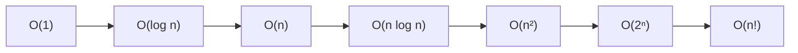
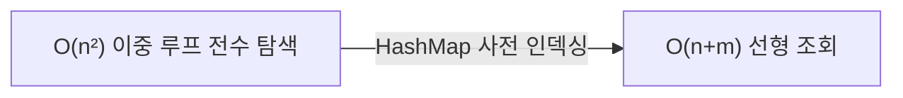

## 지식 로드맵 내 현재 위치

  소프트웨어공학
  자료구조·알고리즘 분석
  <strong>알고리즘 복잡도(O-notation)</strong>

## 큰 그림과 30초 인출

- 본질: CPU 클록이나 실행 환경의 물리적 차이에 좌우되지 않고 알고리즘의 본질적 효율성을 수학적으로 평가하기 위해, 입력 데이터의 크기 $n$이 무한히 증가할 때 연산 횟수 및 메모리 점유율의 증가율을 점근적 상한(Asymptotic Upper Bound)으로 단순화하여 나타내는 성능 표기법
- 메커니즘: 알고리즘 기본 연산 식별 → 입력 크기 $n$에 대한 총 연산 횟수 함수 $f(n)$ 도출 → 저차항 및 상수 계수 생략 → 최고차항 기반 빅오($O(g(n))$) 점근 표기
- 산출물: 시간 복잡도 수식 · 공간 복잡도 수식 · 점근 분석 그래프 · 3대 점근 표기($O$, $\Omega$, $\Theta$)

핵심 용어

- **빅오 표기법(Big-O, $O$)**: $n \ge n_0$인 모든 $n$에 대해 $f(n) \le c \cdot g(n)$을 만족하는 양의 상수 $c$와 $n_0$가 존재할 때, $f(n)$의 증가율이 $g(n)$보다 빠르지 않음을 나타내는 점근적 상한선(Worst-case 성능 보장)
- **빅오메가 표기법(Big-Omega, $\Omega$)**: $f(n) \ge c \cdot g(n)$을 만족하여 알고리즘이 아무리 빨라도 $g(n)$보다는 느림을 나타내는 점근적 하한선(Best-case 성능)
- **빅세타 표기법(Big-Theta, $\Theta$)**: 상한($O$)과 하한($\Omega$)이 동시에 일치하여 알고리즘의 연산 차수가 정확히 $g(n)$과 같음을 나타내는 정확한 차수 표기법
- **시간 복잡도(Time Complexity)**: 입력 데이터 크기 $n$에 비례하여 알고리즘이 수행해야 하는 기본 연산 횟수의 수학적 함수

---

## 1교시 예상문제 (10점)

> 알고리즘 복잡도(O-notation)의 정의와 목적, 핵심 메커니즘을 설명하시오. (예상)

---

## 1교시 10점 답안

### 1. 정의·목적

- 정의: CPU 클록이나 실행 환경의 물리적 차이에 좌우되지 않고 알고리즘의 본질적 효율성을 수학적으로 평가하기 위해, 입력 데이터의 크기 $n$이 무한히 증가할 때 연산 횟수 및 메모리 점유율의 증가율을 점근적 상한(Asymptotic Upper Bound)으로 단순화하여 나타내는 성능 표기법
- 목적: 입력 크기가 커질 때 알고리즘의 시간·공간 자원 증가율을 비교한다.

### 2. 핵심 관계

- 제언: 예상 입력 규모와 자원 한도를 기준으로 점근 복잡도를 비교해 알고리즘을 선택한다.
---

## 2~4교시 예상문제 (25점)

> 알고리즘 복잡도(O-notation)의 개념과 목적을 설명하고, 핵심 메커니즘과 구성요소·절차, 적용 시 문제점과 대응 방안을 제시하시오. (25점, 예상)

---

## 2~4교시 25점 답안

### 1. 개요 및 필요성

### 물리적 실행 시간의 한계와 점근 표기법의 대두

알고리즘의 성능을 "초(Second)" 단위의 실제 수행 시간으로 측정하면, 서버 하드웨어 성능(CPU 클록, RAM 대역폭), 운영체제의 스케줄링, 프로그래밍 언어의 런타임 환경에 따라 측정값이 완전히 달라진다. 동일한 코드라도 슈퍼컴퓨터에서는 0.01초에 끝나지만 구형 임베디드 단말에서는 1분이 걸릴 수 있다.

빅오 표기법(Big-O)은 이러한 물리적 환경의 종속성을 배제하고, **입력 데이터 크기 $n$이 무한히 커질 때 연산 횟수가 증가하는 기울기(점근적 증가율)**만을 순수하게 수학적으로 추상화하여 알고리즘 간의 효율성을 객관적으로 비교·평가한다.

### 3대 점근 표기법 비교

| 구분 | 빅오 표기법 ($O$) | 빅세타 표기법 ($\Theta$) | 빅오메가 표기법 ($\Omega$) |
|---|---|---|---|
| **수학적 의미** | **점근적 상한 (Upper Bound)** | **점근적 동등 (Tight Bound)** | **점근적 하한 (Lower Bound)** |
| **수학적 정의** | $f(n) \le c \cdot g(n)$ | $c_1 \cdot g(n) \le f(n) \le c_2 \cdot g(n)$ | $f(n) \ge c \cdot g(n)$ |
| **직관적 해석** | "아무리 느려도 이보다는 빠르다" | "정확히 이 정도의 속도로 증가한다" | "아무리 빨라도 이보다는 느리다" |
| **실무적 의의** | **최악의 경우(Worst-case) 성능 보증** | 일반적 평균 차수 표현 | 알고리즘의 이론적 최적 한계 검증 |

### 2. 아키텍처 및 핵심 메커니즘

### Big-O 복잡도 계층별 증가 추세

### 대표 복잡도 4대 유형 상세 분석

  

    

      <strong>① O(1) - 상수 시간</strong>
      최고 속도
    

    

      <ul>
        <li>입력 크기 $n$과 무관하게 항상 일정한 연산 횟수 수행</li>
        <li>배열 인덱스 접근, 해시 테이블(HashMap) 키 조회</li>
      </ul>
    

  

  

    

      <strong>② O(log n) - 로그 시간</strong>
      고속 탐색
    

    

      <ul>
        <li>연산 단계마다 탐색 대상 범위가 절반($1/2$)으로 축소</li>
        <li>이진 탐색(Binary Search), 균형 이진 탐색 트리(AVL, Red-Black)</li>
      </ul>
    

  

  

    

      <strong>③ O(n log n) - 선형 로그</strong>
      정렬 표준
    

    

      <ul>
        <li>비교 기반 정렬 알고리즘이 도달할 수 있는 수학적 최적 복잡도</li>
        <li>병합 정렬(Merge Sort), 힙 정렬(Heap Sort), 퀵 정렬 평균</li>
      </ul>
    

  

  

    

      <strong>④ O(n²) - 이차 시간</strong>
      성능 위험
    

    

      <ul>
        <li>중첩 루프로 인해 입력이 10배 늘면 연산량이 100배 폭증</li>
        <li>버블/선택/삽입 정렬, 이중 for 루프 전수 데이터 매칭</li>
      </ul>
    

  

### 3. 실무 적용 및 고려사항

### 위험 대응 매트릭스

| 위험 | 대책 | 효과 |
|---|---|---|
| 결제 내역 10만 건과 주문 목록을 중첩 for 루프로 대조하여 배치 작업이 8시간 지연 | 주문 목록을 메모리 상에 HashMap으로 사전 적재하여 전수 탐색($O(n \times m)$)을 $O(n+m)$ 선형 조회로 리팩토링 | 배치 처리 시간 8시간에서 15초로 99.9% 단축 |
| 검색어 자동완성 API에서 단순 문자열 순차 검색($O(n)$)으로 응답 지연 및 서버 CPU 폭증 | 트라이(Trie) 자료구조 또는 역색인(Inverted Index)을 적용하여 문자열 길이 비례 $O(L)$ 탐색 전환 | 데이터 규모와 무관한 밀리초 단위 즉시 검색 응답 보장 |
| 이론상 $O(n)$인 연결 리스트(LinkedList)가 $O(n)$ 배열(ArrayList)보다 수십 배 느린 현상 | CPU L1/L2 캐시 라인 적중률(Locality)을 고려하여 메모리 연속 할당 배열 자료구조 우선 채택 | 캐시 미스(Cache Miss) 방지를 통한 하드웨어 친화적 초고속 처리 |

### 4. 점검 및 합격 기준 (Checklist & Exit Criteria)

### 알고리즘 복잡도 및 확장성 체크리스트

| 점검 영역 | 상세 검증 항목 | 합격 기준 |
|---|---|---|
| **시간 복잡도** | 실시간 트랜잭션 핵심 경로의 최악 시간 복잡도 | $O(\log n)$ 이하 보장 |
| **대용량 배치** | 전수 데이터 대조 및 집계 알고리즘 차수 | $O(n \log n)$ 이하 (중첩 루프 제거) |
| **공간 트레이드오프** | 캐싱/인덱싱 메모이제이션 적용 시 메모리 상한 | OOM 방지용 상한(LRU Cache) 설정 |
| **하드웨어 친화성** | 포인터 기반 비연속 구조 대비 배열 캐시 지역성 | CPU L1/L2 캐시 적중률 극대화 |

### 5. 기대 효과 및 미래 전망

- **기대 효과**:
  - **대규모 트래픽 선형 확장**: $n$ 증가에 선형($O(n)$) 또는 로그($O(\log n)$)로 대응하여 서버 증설 비용 90% 절감.
  - **응답 지연의 예측 가능성**: 입력량 급증 시에도 시스템의 최악 응답 시간을 사전에 수학적으로 통제.
- **미래 전망**:
  - GPU 및 하드웨어 가속기(NPU) 환경에서의 병렬 알고리즘 복잡도($O(n/p)$) 분석 중요성 증대.
  - LLM 벡터 임베딩 유사도 검색 시 $O(n)$ 전수 탐색을 극복하는 근사 최근접 이웃(HNSW, $O(\log n)$) 알고리즘 일반화.

### 6. 결론 및 실전 팁

### 학습자 통찰 메모 — 답안 밖

> **[핵심 통찰]**  
> 알고리즘 복잡도의 본질은 "시간과 공간의 교환"이며, 점근 표기법의 맹점은 "상수 계수($c$)의 은폐"이다. 메모이제이션(DP)과 DB 인덱스는 메모리/디스크 공간을 내주고 $O(1)$과 $O(\log n)$의 시간을 사오는 대표적 트레이드오프다. 또한 점근적으로 아무리 우수한 알고리즘이라도 현대 CPU에서는 **캐시 지역성(Spatial Locality)**이 나쁘면 연속 메모리를 쓰는 단순 배열 알고리즘에 참패한다. 이론적 Big-O와 하드웨어 아키텍처의 결합이 엔지니어의 진짜 실력이다.

> **[나라면 이렇게 쓴다]**  
> 1교시형 단답형 문제라면 점근 표기 3대 기호($O$, $\Omega$, $\Theta$)의 엄격한 수학적 정의식과 증가율 비교 그래프를 1단락에 정확히 명시하겠다. 2단락에서는 대표 복잡도 유형을 실무 자료구조(해시, B-Tree, 정렬)와 매핑하고, 3단락 실무 제언에서는 **"배치 처리에서 $O(n^2)$ 이중 루프를 HashMap 기반 $O(n+m)$ 선형 탐색으로 전환하여 처리 시간을 8시간에서 15초로 단축한 엔지니어링 사례"**를 제시하겠다.

### 실전 답안용 기술사적 제언

- **판정 기준**: 대규모 트래픽을 처리하는 온라인 트랜잭션의 핵심 로직은 최악의 경우에도 $O(\log n)$ 이하를 만족해야 하며, $O(n^2)$ 이상의 알고리즘은 코드 리뷰 통과 불가로 판정.
- **대응 방안**: 데이터 대조 작업 시 중첩 반복문을 전면 금지하고, 기준 데이터를 해시맵(HashMap)이나 셋(HashSet)에 사전 색인하여 $O(1)$ 즉시 조회로 전환.
- **검증 체계**: 성능 부하 테스트(JMeter, nGrinder) 시 데이터 크기 $n$을 10배, 100배로 증분하여 측정 곡선이 선형/로그 차수를 유지하는지 정량 검증.
- **기대 효과**: 데이터 급증 환경에서도 서비스 응답 지연을 밀리초 단위로 방어하고, 서버 스케일아웃에 따른 자원 선형 효율성 확보.

### 7. 참고 및 연계 학습

- [정렬 알고리즘 비교](./043_sort_algorithm.md)
- [퀵 정렬(Quick Sort)](./059_quick_sort.md)
- [이진 탐색 트리(BST)](./001_bst.md)
- [유한 오토마타 및 ReDoS](./114_finite_automata.md)
---
