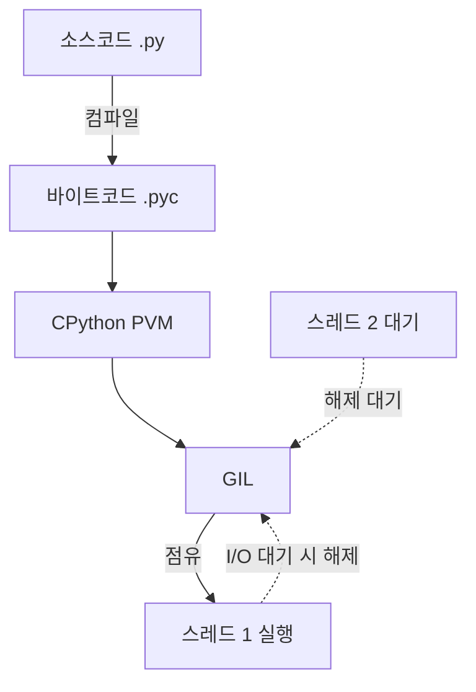

## 지식 로드맵 내 현재 위치

  소프트웨어공학
  프로그래밍 언어·런타임
  <strong>파이썬(Python)</strong>

## 30초 인출

- 본질: 정적 컴파일 언어의 엄격한 문법과 긴 빌드 주기를 극복하고 개발 생산성을 극대화하기 위해, 간결한 문법과 동적 객체 모델, 플랫폼 독립적인 바이트코드 인터프리터(PVM)를 제공하는 고급 객체지향 범용 스크립트 언어
- 메커니즘: 소스코드(.py) 작성 → 바이트코드(.pyc) 컴파일 → PVM(CPython 가상머신) 인터프리팅 → GIL(Global Interpreter Lock) 스레드 동기화 → 참조 카운팅 기반 메모리 관리
- 산출물: 파이썬 바이트코드(.pyc) · 패키지 의존성 명세(pyproject.toml) · 가상환경 격리 스펙 · 정적 타입 분석 리포트(Mypy)

핵심 용어

- **CPython**: C 언어로 구현된 파이썬의 표준 참조 구현체로, 소스코드를 바이트코드로 컴파일한 후 가상머신(PVM)에서 인터프리터 방식으로 실행
- **PVM(Python Virtual Machine)**: 바이트코드를 명령어 단위로 해석 실행하는 스택 기반 가상머신
- **GIL(Global Interpreter Lock)**: CPython의 메모리 관리(참조 카운팅) 스레드 안전성을 보장하기 위해, 한 번에 하나의 스레드만 파이썬 바이트코드를 실행하도록 잠그는 전역 뮤텍스(Mutex)
- **동적 타이핑(Dynamic Typing)**: 변수의 데이터 타입을 코드 작성 시 선언하지 않고, 프로그램 런타임에 변수에 할당되는 객체의 타입에 따라 동적으로 결정되는 방식
- **참조 카운팅(Reference Counting)**: 객체를 가리키는 포인터 수를 실시간 카운트하여 0이 되는 즉시 메모리를 즉시 해제하는 CPython의 기본 가비지 컬렉션 기법

---

## 1교시 예상문제 (10점)

> 파이썬(Python)의 정의와 목적, 핵심 메커니즘을 설명하시오. (예상)
---

## 1교시 10점 답안

### 1. 정의·목적

- 정의: 정적 컴파일 언어의 엄격한 문법과 긴 빌드 주기를 극복하고 개발 생산성을 극대화하기 위해, 간결한 문법과 동적 객체 모델, 플랫폼 독립적인 바이트코드 인터프리터(PVM)를 제공하는 고급 객체지향 범용 스크립트 언어
- 목적: 간결한 문법과 풍부한 라이브러리로 범용 소프트웨어와 자동화 도구를 빠르게 개발한다.

### 2. 핵심 관계

- 제언: 타입·테스트·패키지 경계를 명확히 하고 린트와 자동 시험으로 동적 오류를 조기에 찾는다.
---

## 2~4교시 예상문제 (25점)

> 파이썬(Python)의 개념과 목적을 설명하고, 핵심 메커니즘과 구성요소·절차, 적용 시 문제점과 대응 방안을 제시하시오. (25점, 예상)
---

## 2~4교시 25점 답안

### 1. 개요 및 필요성

### 높은 생산성과 AI/데이터 표준 언어로의 진화

과거 C++이나 Java와 같은 정적 컴파일 언어는 강력한 성능을 제공하지만, 장황한 보일러플레이트 코드와 엄격한 타입 체계로 인해 비즈니스 로직을 빠르게 실험하고 검증하는 데 한계가 있었다.

파이썬은 "인생은 너무 짧으니 파이썬이 필요하다(Life is short, you need Python)"라는 모토처럼, **인간의 사고 흐름과 유사한 간결한 문법과 인터프리터의 즉시성**을 무기로 개발 생산성을 극대화했다. 특히 NumPy, PyTorch, Pandas 등 핵심 수치 연산 라이브러리가 하부 C/C++/CUDA로 최적화되어 바인딩되면서, 현대 인공지능(AI) 및 빅데이터 엔지니어링의 독점적인 표준 언어로 자리 잡았다.

### 파이썬 vs 자바 vs C++ 핵심 비교

| 구분 | 파이썬 (Python) | 자바 (Java) | C++ |
|---|---|---|---|
| **실행 방식** | 인터프리터 (CPython PVM) | 하이브리드 (JVM 바이트코드 + JIT 컴파일) | 완전 정적 컴파일 (기계어 바이너리) |
| **타입 체계** | 동적 타이핑 (Type Hints 지원) | 정적 타이핑 (Strict Static) | 정적 타이핑 (Static) |
| **메모리 관리** | 자동 GC (참조 카운팅 + 순환참조 수집기) | 자동 GC (Tracing Generational GC) | 수동 관리 (RAII, 스마트 포인터) |
| **멀티스레딩** | **GIL로 인해 CPU 바운드 병렬화 불가** | 완벽한 멀티스레드 병렬 실행 지원 | 네이티브 OS 스레드 완전 병렬 제어 |
| **주요 활용 분야** | 인공지능, 데이터 과학, 웹 백엔드(FastAPI) | 엔터프라이즈 백엔드(Spring), 금융 시스템 | 게임 엔진, 임베디드, 고성능 시스템 소프트웨어 |

### 2. 아키텍처 및 핵심 메커니즘

### CPython 실행 구조 및 GIL 병목 메커니즘

### 파이썬 핵심 아키텍처 4대 구성요소

| 구성요소 | 핵심 판단 |
|---|---|
| **일급 객체** First-Class Citizen | 함수·클래스·모듈 모두 객체 — 인자·변수·반환값으로 자유 전달 |
| **PVM** | 스택 기반 가상머신이 바이트코드를 순차 해석, `__pycache__` 캐시로 재실행 파싱 비용 절감 |
| **복합 GC** | 참조 카운팅 0이면 즉시 해제, 세대별 GC가 순환 참조를 추적 수집 |
| **Type Hints** | PEP 484 타입 힌트 — 런타임 비용 없이 Mypy 정적 분석으로 타입 결함 사전 예방 |

### 3. 실무 적용 및 고려사항

### 위험 대응 매트릭스

| 위험 | 대책 | 효과 |
|---|---|---|
| 멀티코어 서버에서 CPU 집약적 연산을 위해 `threading` 적용 시 1개 코어만 사용되어 성능 저하 | `multiprocessing` 모듈 또는 Celery 기반 분산 큐를 적용하여 독립 프로세스로 분기 | 멀티코어(16 Core 이상) 100% 자원 활용 및 대규모 처리량 확장 |
| 동적 타이핑 특성상 배포 후 운영 환경의 사소한 예외 분기에서 `AttributeError` 발생 및 데몬 종료 | 코드 작성 시 타입 힌트(`typing`)를 필수 지정하고 CI 파이프라인에서 Mypy 정적 검사 강제 | 런타임 타입 오류의 99%를 배포 전 사전 차단 |
| 전역 환경에 무분별한 `pip install`로 라이브러리 간 의존성 충돌(`Dependency Hell`) 발생 | Poetry 또는 uv 기반의 잠금 파일(`poetry.lock`) 생성 및 Docker 컨테이너 격리 배포 | 개발-스테이징-운영 환경 간 100% 동일한 패키지 재현성 보장 |

### 4. 점검 및 합격 기준 (Checklist & Exit Criteria)

### 파이썬 애플리케이션 품질 점검 체크리스트

| 점검 영역 | 상세 검증 항목 | 합격 기준 |
|---|---|---|
| **정적 타입** | Mypy 엄격 모드(`--strict`) 타입 분석 통과 여부 | 타입 오류 0건 (Zero Type Errors) |
| **병행 처리** | CPU 집약 작업 시 멀티스레드 오용 여부 검증 | `multiprocessing` 또는 C-익스텐션 분기 |
| **의존성 잠금** | `pyproject.toml` 및 락 파일 기반 재현성 검증 | Docker 빌드 시 동일 해시 100% 일치 |
| **코드 스타일** | Ruff/Black 린트 및 포맷 정합성 통과 여부 | 린트 경고 0건 |

### 5. 기대 효과 및 미래 전망

- **기대 효과**:
  - **개발 생산성 극대화**: 풍부한 생태계와 간결한 문법을 통해 초기 프로토타입 개발 기간 60% 단축.
  - **AI/ML 표준 상호운용성**: HuggingFace, PyTorch 등 최신 인공지능 프레임워크와의 완벽한 즉시 연동.
- **미래 전망**:
  - Python 3.13 프리 스레딩(PEP 703 No-GIL) 안정화로 CPU 바운드 멀티스레드 병렬성 획기적 개선.
  - Rust 기반 고속 파이썬 툴체인(uv, Ruff, Polars)의 확산으로 런타임 성능 및 빌드 속도 10배 가속.

### 6. 결론 및 실전 팁

### 학습자 통찰 메모 — 답안 밖

> **[핵심 통찰]**  
> "파이썬은 인터프리터라서 느리고 GIL 때문에 멀티코어를 못 쓴다"는 것은 초보적인 비판에 불과하다. 파이썬의 진정한 힘은 **"가장 쉬운 파이썬 코드로 가장 빠른 C/C++/CUDA 라이브러리를 오케스트레이션(Glue Language)"**하는 데 있다. 실무 기술사는 I/O 바운드 작업은 `asyncio`로 풀고, CPU 바운드는 `multiprocessing`이나 Rust FFI(PyO3)로 넘기며, PEP 484 Type Hints와 Mypy로 동적 타이핑의 위험을 봉합하는 '아키텍처적 조율 능력'을 입증해야 한다.

> **[나라면 이렇게 쓴다]**  
> 파이썬 관련 서술 문제나 런타임 최적화 질문이 나오면, CPython의 GIL 메커니즘을 2단락에서 명쾌하게 도해하겠다. 그리고 3단락 실전 제언에서는 최신 **Python 3.13의 Free-Threaded CPython(PEP 703 No-GIL) 혁신 동향**과 함께, **uv 패키지 매니저 및 Mypy 정적 검사를 결합한 엔터프라이즈 DevSecOps 파이프라인**을 제안하여 최신 언어 트렌드 통찰을 각인시키겠다.

### 실전 답안용 기술사적 제언

- **판정 기준**: 프로덕션 배포 전 CI 파이프라인에서 Mypy 정적 타입 분석 및 Ruff 린트를 100% 통과하고, 잠금 파일(`poetry.lock` / `uv.lock`) 일치 여부를 판정.
- **대응 방안**: CPU 연산 집약 모듈은 `threading` 대신 `multiprocessing`이나 Rust PyO3 익스텐션으로 분리하고, I/O 대기 구간은 `asyncio` 논블로킹 전환.
- **검증 체계**: 단위 테스트에 pytest와 pytest-asyncio를 연동하여 비동기 분기 커버리지 80% 이상 강제.
- **기대 효과**: 동적 언어의 런타임 장애 위험을 컴파일 언어 수준으로 사전 방어하면서도 개발 납기를 50% 단축.

### 7. 참고 및 연계 학습

- [객체지향 프로그래밍(OOP) 4대 특징](./083_oop.md)
- [SOLID 원칙](./082_solid.md)
- [CI/CD 지속적 통합 및 배포](./095_ci_cd.md)
- [알고리즘 복잡도 Big-O](./125_algorithm_complexity_big_o.md)
---
