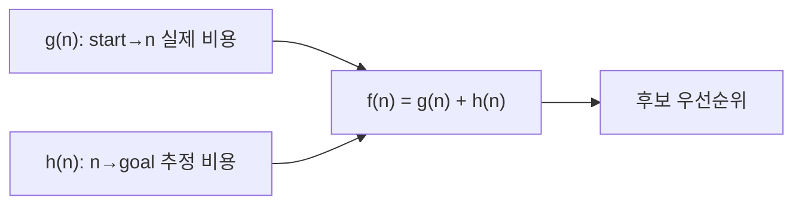
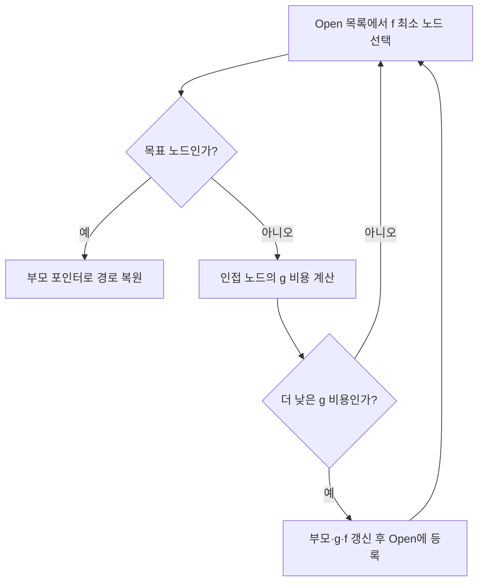

## 지식 위치

소프트웨어공학 > 그래프 알고리즘·최단 경로 > A* 탐색

## 30초 인출

- 본질: **A* (A-star)**는 시작점부터의 실제 비용과 목표까지의 휴리스틱 추정값을 함께 사용해 경로를 탐색하는 알고리즘
- 메커니즘: $f(n)=g(n)+h(n)$이 작은 후보 확장 → 더 낮은 경로 비용으로 도달하면 갱신 → 목표에 도달하면 경로 복원
- 최적성 조건: 허용 가능한 휴리스틱과 그에 맞는 탐색 구현; 그래프 탐색에서 일관성은 닫힌 노드 재확장 방지에 도움

핵심 용어

- **A*(A-star)**: 경로 비용과 목표까지의 휴리스틱 추정값을 합산해 확장할 후보를 고르는 탐색 알고리즘
- **평가 함수 $f(n)=g(n)+h(n)$**: 시작점부터 현재 노드까지의 경로 비용 $g(n)$과 목표까지의 추정 비용 $h(n)$을 합친 후보 우선순위
- **실제 비용 $g(n)$**: 시작점부터 현재 노드까지의 누적 경로 비용
- **휴리스틱 $h(n)$**: 현재 노드에서 목표까지의 남은 비용 추정치
- **허용성(Admissibility)**: 휴리스틱이 실제 잔여 비용을 과대평가하지 않는 성질
- **일관성(Consistency)**: 각 간선 비용에 대해 $h(n)\le c(n,n')+h(n')$을 만족하는 성질; 일반적인 그래프 탐색에서 닫힌 노드 재확장의 필요를 줄임

---

## 1교시 예상문제 (10점)

> A* 알고리즘의 정의와 목적, 핵심 메커니즘을 설명하시오. (예상)

---

## 1교시 10점 답안

### Ⅰ. 개요

| 구분 | 핵심 |
|---|---|
| 정의 | A*는 시작점 누적 비용과 목표까지의 휴리스틱을 합산해 탐색 우선순위를 정하는 그래프 탐색 알고리즘 |
| 목적 | 적절한 휴리스틱으로 최단 경로 탐색의 효율을 높이고 최적성 보장 조건을 유지 |

### Ⅱ. 평가 함수

- 제언: 최적 경로가 필요한 작업에서 허용성·탐색 조건과 메모리 비용을 함께 확인하는 기준
---

## 2~4교시 예상문제 (25점)

> A* 알고리즘의 개념과 목적을 설명하고, 핵심 메커니즘과 구성요소·절차, 적용 시 문제점과 대응 방안을 제시하시오. (25점, 예상)

---

## 2~4교시 25점 답안

### Ⅰ. 개요

| 구분 | 핵심 |
|---|---|
| 정의 | A*는 시작점 누적 비용과 목표까지의 휴리스틱을 합산해 탐색 우선순위를 정하는 그래프 탐색 알고리즘 |
| 목적 | 적절한 휴리스틱으로 최단 경로 탐색의 효율을 높이고 최적성 보장 조건을 유지 |

A*는 실제 비용만 사용하는 다익스트라 탐색에 목표까지의 추정 비용을 더해 다음 확장 후보를 선택하는 방식. 경로 최적성은 간선 비용과 휴리스틱 조건, 그래프 탐색 구현에 따름.

| 알고리즘 | 후보 우선순위 | 최적성 |
|---|---|---|
| 다익스트라 | $g(n)$ | 음수가 아닌 간선 비용에서 최단 경로 보장 |
| A* | $g(n)+h(n)$ | 허용성 및 적합한 탐색 조건에서 최적 경로 보장 |
| 탐욕적 최상 우선 탐색 | $h(n)$ | 최적 경로 보장 없음 |

### Ⅱ. 평가 함수와 탐색 절차

인접 노드에 더 낮은 비용으로 도달하면 부모 포인터와 우선순위 갱신. 닫힌 노드를 다시 확장하지 않는 구현은 일관성 조건을 확인하고, 그렇지 않으면 개선된 경로를 반영할 재개방 처리 필요.

### Ⅲ. 휴리스틱과 구현 요소

| 요소 | 설계 기준 |
|---|---|
| 휴리스틱 $h(n)$ | 실제 이동 규칙·간선 비용을 과대평가하지 않는 추정치 |
| Open 목록 | 확장 후보와 $f(n)$ 우선순위를 관리 |
| Closed 목록 | 확장한 노드를 추적; 더 나은 경로 발견 시 재개방 여부 고려 |
| 부모 포인터 | 목표에서 시작점까지 경로 복원 |

### Ⅳ. 최적성 조건과 한계

| 조건·한계 | 적용상 의미 |
|---|---|
| 허용성 | $h(n)$이 실제 잔여 비용보다 크지 않을 때 최적 경로 보장에 기여 |
| 일관성 | 간선 비용과 휴리스틱 차이가 삼각부등식을 만족하면 확장 후 값의 단조성 유지 |
| 메모리 사용 | 탐색 후보와 방문 정보 저장량이 커질 수 있어 지도 규모·메모리 예산 검토 |
| 이동 모델 불일치 | 대각선·가중치·장애물 규칙과 휴리스틱이 맞지 않으면 과대평가 또는 비효율 발생 |

### Ⅴ. 기술사적 제언

| 한계 | 해결 방안 |
|---|---|
| 지도 이동 규칙과 휴리스틱 조건이 맞지 않아 경로 최적성이 흔들릴 가능성 | 허용성·일관성을 시험하고, 그래프 탐색에서 더 낮은 경로를 발견한 닫힌 노드의 재개방 여부를 구현 조건과 함께 검증 |
### 참고 및 연계 학습

- [다익스트라 알고리즘](./189_dijkstra_algorithm.md)
- [최소 신장 트리(MST)](./194_minimum_spanning_tree.md)
- [탐욕(Greedy) 알고리즘](./196_greedy_algorithm.md)
- [알고리즘 복잡도 Big-O](./125_algorithm_complexity_big_o.md)

### 참고 자료

- [Hart, Nilsson, Raphael, “A Formal Basis for the Heuristic Determination of Minimum Cost Paths” (1968)](https://people.stfx.ca/jdelamer/courses/csci-564/_downloads/b2220c66675ddde471ca1795147b8e86/A_Formal_Basis_for_the_Heuristic_Determination_of_Minimum_Cost_Paths.pdf)
- [Stanford CS221: Search II](https://web.stanford.edu/class/archive/cs/cs221/cs221.1192/lectures/search2.pdf)
---
