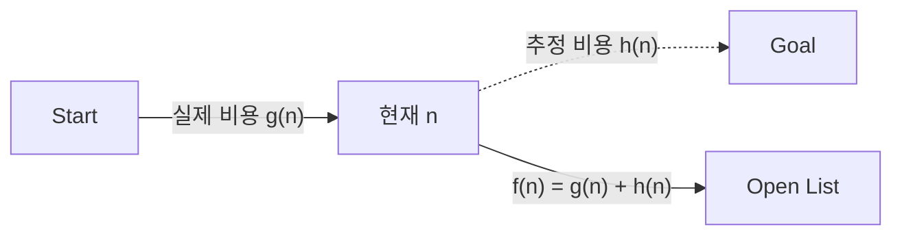

## 지식 로드맵 내 현재 위치

  소프트웨어공학
  그래프 알고리즘·최단 경로
  <strong>A* 알고리즘</strong>

## 30초 인출

- 본질: 다익스트라(Dijkstra) 알고리즘이 목적지 방향을 고려하지 않고 전방위 동심원으로 노드를 탐색하여 발생하는 시간·메모리 낭비를 제거하기 위해, 시작점부터의 누적 비용 $g(n)$에 목적지까지의 예측 거리인 휴리스틱 $h(n)$을 결합한 평가 함수 $f(n) = g(n) + h(n)$으로 목적지 방향을 지향하여 최단 경로를 찾아내는 휴리스틱 그래프 탐색 기법
- 메커니즘: 시작 노드 우선순위 큐(Open List) 삽입 → $f(n)$ 최소 노드 추출 및 방문 완료(Closed List) 등록 → 인접 노드 $g(n), h(n), f(n)$ 계산 및 완화(Relaxation) → 목표 노드 도달 시 부모 포인터 역추적
- 산출물: 최단 경로 노드 리스트 · 평가 함수 $f(n)$ 매트릭스 · 탐색 비용 리포트

핵심 용어

- **평가 함수 $f(n) = g(n) + h(n)$**: 노드 $n$을 거쳐 목표 노드에 도달할 때의 총 예상 최단 비용
- **실제 비용 $g(n)$**: 시작 노드부터 현재 노드 $n$까지 이동하는 데 소요된 실제 최단 누적 비용
- **휴리스틱 함수 $h(n)$**: 현재 노드 $n$에서 목표 노드까지 도달하는 데 필요한 예상 비용(직선 거리 등)
- **허용성(Admissibility)**: $h(n)$이 실제 목표 도달 비용 $h^*(n)$보다 결코 크지 않은($h(n) \le h^*(n)$) 성질로, 최적의 최단 경로를 보장하기 위한 필수 조건
- **일관성(Consistency/Monotonicity)**: 임의의 두 인접 노드 $n, n'$에 대해 $h(n) \le c(n, n') + h(n')$을 만족하여 한 번 Closed List에 들어간 노드는 재방문하지 않음을 보장하는 성질

---

## 1교시 예상문제 (10점)

> A* 알고리즘의 정의와 목적, 핵심 메커니즘을 설명하시오. (예상)
---

## 1교시 10점 답안

### 1. 정의·목적

- 정의: 다익스트라(Dijkstra) 알고리즘이 목적지 방향을 고려하지 않고 전방위 동심원으로 노드를 탐색하여 발생하는 시간·메모리 낭비를 제거하기 위해, 시작점부터의 누적 비용 $g(n)$에 목적지까지의 예측 거리인 휴리스틱 $h(n)$을 결합한 평가 함수 $f(n) = g(n) + h(n)$으로 목적지 방향을 지향하여 최단 경로를 찾아내는 휴리스틱 그래프 탐색 기법
- 목적: 다익스트라(Dijkstra) 알고리즘이 목적지 방향을 고려하지 않고 전방위 동심원으로 노드를 탐색하여 발생하는 시간·메모리 낭비를 제거하기 위해, 시작점부터의 누적 비용 $g(n)$에 목적지까지의 예측 거리인 휴리스틱 $h(n)$을 결합한 평가 함수 $f(n) = g(n) + h(n)$으로 목적지 방향을 지향하여 최단 경로를 찾아내는 휴리스틱 그래프 탐색 기법

### 2. 핵심 관계

- 제언: 핵심 작동 원리를 적용해 직접 효과를 검증한다.
---

## 2~4교시 예상문제 (25점)

> A* 알고리즘의 개념과 목적을 설명하고, 핵심 메커니즘과 구성요소·절차, 적용 시 문제점과 대응 방안을 제시하시오. (25점, 예상)
---

## 2~4교시 25점 답안

### 1. 개요 및 필요성

### 다익스트라 알고리즘의 한계와 지향성 탐색

네트워크 라우팅이나 내비게이션 길찾기에서 다익스트라(Dijkstra) 알고리즘은 최적의 최단 경로를 완벽히 찾아내지만, **목적지가 어디에 있는지 전혀 고려하지 않는다.** 그 결과 목적지와 정반대 방향에 있는 노드까지 포함하여 시작점 주변의 모든 노드를 전방위 동심원 형태로 탐색하므로, 맵 크기가 커질수록 엄청난 시간과 메모리를 낭비한다.

A* 알고리즘은 다익스트라의 실제 누적 비용 $g(n)$에 목적지 방향을 가리키는 **나침반 역할의 휴리스틱 $h(n)$**을 융합하여, 탐색 방향을 목적지 쪽으로 유도(Best-First Search)함으로써 계산량을 수십~수백 배 절감하면서도 수학적으로 최단 경로를 100% 보장한다.

### 최단 경로 알고리즘 비교

| 구분 | 다익스트라 (Dijkstra) | A* 알고리즘 | 탐욕적 최상 우선 탐색 (Greedy Best-First) |
|---|---|---|---|
| **평가 함수** | $f(n) = g(n)$ ($h(n) = 0$) | $f(n) = g(n) + h(n)$ | $f(n) = h(n)$ ($g(n) = 0$) |
| **탐색 형태** | 시작점 중심 전방위 동심원 확장 | **목적지를 향한 지향성 타원형 확장** | 목적지를 향해 직선으로 돌진 |
| **최적성(최단 보장)** | **100% 최단 경로 보장** | **허용성 만족 시 100% 보장** | 최단 경로 보장 불가 (장애물 우회 시 실패) |
| **완결성** | 보장 | 보장 | 루프에 빠질 위험 존재 |
| **주요 활용 분야** | OSPF 라우팅, 전체 노드 최단거리 | 내비게이션, 게임 길찾기, 로봇 공학 | 빠른 초기 근사 경로 탐색 |

### 2. 아키텍처 및 핵심 메커니즘

### A* 알고리즘 평가 함수 구조

### A* 알고리즘 4대 핵심 자료구조 및 연산

| 자료구조·연산 | 핵심 판단 |
|---|---|
| **열린 목록** Open List | 최소 힙(Min-Heap) 우선순위 큐 — $f(n)$ 최소 노드를 $O(\log N)$에 추출 |
| **닫힌 목록** Closed List | 확장 완료 노드를 해시셋으로 격리 — $O(1)$ 중복 방문 차단 |
| **휴리스틱 함수** | 맨해튼 거리(4방향 격자), 유클리드 거리(8방향·자유 회전 평면) |
| **경로 역추적** Backtracking | 부모 포인터(Parent Pointer)를 Goal부터 Start까지 따라 최단 경로 복원 |

### 3. 실무 적용 및 고려사항

### 위험 대응 매트릭스

| 위험 | 대책 | 효과 |
|---|---|---|
| 대각선 이동이 가능한 격자 지도에서 맨해튼 거리를 휴리스틱으로 사용하여 최단 경로 탐색 실패 | 이동 제약에 부합하는 허용적 휴리스틱인 옥타일(Octile) 거리 또는 유클리드 거리 적용 | 허용성($h \le h^*$) 회복 및 수학적 최적 최단 경로 100% 보장 |
| 대규모 맵에서 수백만 개 노드가 Open List에 쌓여 메모리 고갈(OutOfMemory) 발생 | 직선 이동 경로를 건너뛰는 JPS(Jump Point Search) 또는 계층적 맵 분할(HPA*) 도입 | 메모리 점유율 90% 절감 및 탐색 속도 10배 향상 |
| 장애물이 ㄷ자 형태로 깊게 파인 함정 구간에서 수만 번의 불필요한 탐색 루프 발생 | 사전 계산된 가시성 그래프(Visibility Graph) 또는 웨이포인트(Waypoint) 내비게이션 메시 연동 | 함정 구간 내 불필요한 노드 확장 방지 및 실시간 응답성 유지 |

### 4. 점검 및 합격 기준 (Checklist & Exit Criteria)

### A* 경로 탐색 알고리즘 체크리스트

| 점검 영역 | 상세 검증 항목 | 합격 기준 |
|---|---|---|
| **수학적 최적성** | 휴리스틱의 허용성($h(n) \le h^*(n)$) 만족 여부 | 과대평가 0건 (100% 최단 보장) |
| **일관성 검증** | 인접 노드 간 삼각부등식($h(n) \le c + h(n')$) 만족 | Closed List 재방문 0회 달성 |
| **메모리 상한** | 수백만 노드 탐색 시 Open List 메모리 임계치 | 사전 가지치기(JPS)로 OOM 방지 |
| **자료구조 효율** | Open List 및 Closed List 검색 시간 복잡도 | Min-Heap $O(\log N)$, HashSet $O(1)$ |

### 5. 기대 효과 및 미래 전망

- **기대 효과**:
  - **계산 자원 낭비 최소화**: 다익스트라 대비 탐색 노드 수를 80% 이상 절감하여 실시간 경로 응답성 확보.
  - **물류 및 자율주행 최적화**: AGV(무인이송로봇) 군집 주행 시 충돌 방지 및 실시간 재경로 탐색 실현.
- **미래 전망**:
  - 동적 장애물 출현 환경에 대응하는 D* Lite 및 실시간 적응형 경로 탐색 알고리즘 채택 확대.
  - 강화학습(RL) 기반의 환경 맞춤형 신경망 휴리스틱(Learned Heuristics) 결합 가속화.

### 6. 결론 및 실전 팁

### 학습자 통찰 메모 — 답안 밖

> **[핵심 통찰]**  
> A* 알고리즘의 본질은 "다익스트라의 정확성에 목적지를 향한 나침반(휴리스틱)을 달아준 것"이다. 이때 가장 중요한 수학적 약속이 **허용성($h \le h^*$)**이다. 절대 목적지까지의 거리를 실제보다 부풀리지 않아야만 최적의 지름길을 놓치지 않는다. 또한 빈 공간을 멍청하게 한 칸씩 세며 탐색하지 않고 장애물 모서리만 징검다리처럼 점프하는 **JPS(Jump Point Search)**를 결합해야만 실전 프로덕션 레벨의 엔지니어링 성능이 나온다.

> **[나라면 이렇게 쓴다]**  
> 1교시형 문제라면 평가 함수 $f(n) = g(n) + h(n)$의 3대 요소와 다익스트라 대비 차이점, 허용성·일관성의 수학적 수식을 1~2단락에 완벽히 채우겠다. 그리고 3단락에서는 **"게임 길찾기 및 물류 AGV 환경에서 노드 폭증을 억제하기 위해 JPS(Jump Point Search)와 계층적 분할(HPA*)을 적용한 실무 최적화 아키텍처"**를 제시하여 수험서 답안과 차별화하겠다.

### 실전 답안용 기술사적 제언

- **판정 기준**: 맵의 이동 규칙(4방향, 8방향, 연속 평면)에 따라 휴리스틱 함수가 결코 실제 거리보다 과대평가되지 않도록 허용성 검증을 필수로 판정.
- **대응 방안**: 순수 격자 전수 탐색 대신 점프 포인트 서치(JPS)를 탑재하여 대칭적 빈 공간의 중간 노드 확장을 건너뛰는 연산 최적화 적용.
- **검증 체계**: 단위 테스트에 미로, ㄷ자 장애물, 개활지 등 엣지 케이스 맵을 구성하여 다익스트라 탐색 결과와의 일치율(최단 보장) 100% 검증.
- **기대 효과**: 대규모 격자 맵에서 경로 탐색 연산 시간을 90% 단축하고, 모바일/임베디드 단말 CPU 점유율을 5% 미만으로 억제.

### 7. 참고 및 연계 학습

- [다익스트라 알고리즘](./189_dijkstra_algorithm.md)
- [최소 신장 트리(MST)](./194_minimum_spanning_tree.md)
- [탐욕(Greedy) 알고리즘](./196_greedy_algorithm.md)
- [알고리즘 복잡도 Big-O](./125_algorithm_complexity_big_o.md)
---
