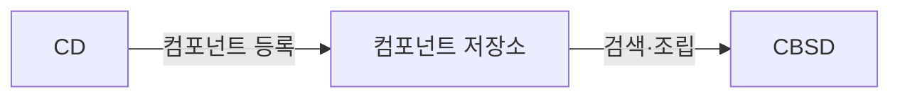

## 지식 위치

소프트웨어공학 > 개발 방법론·소프트웨어 재사용 > 컴포넌트 기반 개발

## 30초 인출

- 본질: 컴포넌트 기반 개발은 정의된 인터페이스를 가진 재사용 단위를 조립해 소프트웨어를 개발하는 방법
- 메커니즘: 도메인 공통성 분석 → 컴포넌트 설계 및 구현(CD, 재사용을 위한 개발) → 컴포넌트 저장소 등록 → 신규 요구사항 매핑 및 적합성 평가 → 컴포넌트 조립 및 어댑터 연결(CBSD, 재사용에 의한 개발)
- 산출물: 컴포넌트 인터페이스 명세서 · 공통 컴포넌트 바이너리 패키지 · 컴포넌트 저장소(Repository) · 조립된 애플리케이션

핵심 용어

- **컴포넌트(Component)**: 명확하게 정의된 인터페이스만을 통해 접근할 수 있고, 독립적으로 배포될 수 있으며, 제3자에 의해 조립(Assembly) 가능한 실행 바이너리 소프트웨어 부품
- **CD(Component Development)**: 향후 여러 프로젝트에서 공통으로 재사용될 수 있는 고품질의 컴포넌트를 설계하고 패키징하는 개발 공정("재사용을 위한 개발")
- **CBSD(Component Based Software Development)**: 저장소에 이미 구축된 기존 컴포넌트들을 검색, 선택, 커스터마이징하여 새로운 소프트웨어를 조립 완성하는 공정("재사용에 의한 개발")
- **블랙박스 재사용(Black-Box Reuse)**: 컴포넌트 내부의 소스코드를 직접 열어보거나 수정하지 않고, 공개된 인터페이스 규격만을 보고 그대로 가져다 쓰는 재사용 형태

---

## 1교시 예상문제 (10점)

> CBD(Component Based Development)의 정의와 목적, 핵심 메커니즘을 설명하시오. (예상)

---

## 1교시 10점 답안

### Ⅰ. 개요

| 구분 | 핵심 |
|---|---|
| 정의 | 컴포넌트 기반 개발은 정의된 인터페이스를 가진 재사용 단위를 조립해 소프트웨어를 개발하는 방법 |
| 목적 | 검증된 재사용 단위로 중복 구현을 줄이고 시스템 구성을 단순화 |

### 2. 핵심 관계

- 제언: 컴포넌트 계약과 의존성을 명확히 하고 통합 시험으로 교환 가능성과 상호작용을 확인
---

## 2~4교시 예상문제 (25점)

> CBD(Component Based Development)의 개념과 목적을 설명하고, 핵심 메커니즘과 구성요소·절차, 적용 시 문제점과 대응 방안을 제시하시오. (25점, 예상)

---

## 2~4교시 25점 답안

### Ⅰ. 개요 및 필요성

| 구분 | 핵심 |
|---|---|
| 정의 | 컴포넌트 기반 개발은 정의된 인터페이스를 가진 재사용 단위를 조립해 소프트웨어를 개발하는 방법 |
| 목적 | 검증된 재사용 단위로 중복 구현을 줄이고 시스템 구성을 단순화 |

### 장인 정신 기반 개발의 한계와 조립식 공학의 필요성

전통적인 소프트웨어 개발은 프로젝트마다 개발자가 처음부터 끝까지 코드를 작성하는 장인 수공업 형태에 가까웠다. 이는 프로젝트마다 동일한 기능(로그인, 결제, 파일 업로드 등)을 중복 개발하게 만들어 납기를 지연시키고, 개발자의 역량에 따라 품질이 들쭉날쭉해지는 한계를 드러냈다.

CBD는 제조업의 표준화된 부품 조립 라인처럼, **독립적으로 검증된 고품질의 소프트웨어 부품(컴포넌트)을 표준 인터페이스를 통해 연결·조립**함으로써 개발 기간을 획기적으로 단축하고, 소프트웨어 재사용성과 유지보수성을 극대화한다.

### 객체지향(OOP) vs CBD vs 서비스 지향(SOA) 비교

| 구분 | 객체지향 (OOP) | 컴포넌트 기반 (CBD) | 서비스 지향 (SOA) |
|---|---|---|---|
| **기본 단위** | 클래스 및 객체 (Class/Object) | **독립 배포 단위 컴포넌트 (Component)** | 네트워크 서비스 (Service) |
| **재사용 수준** | 소스코드 레벨 (화이트박스 재사용) | **바이너리 실행 레벨 (블랙박스 재사용)** | 비즈니스 프로세스 레벨 (서비스 조합) |
| **결합도** | 높음 (언어/플랫폼 종속, 상속 결합) | 중간 (인터페이스 결합, 바이너리 호환) | 매우 낮음 (느슨한 결합, 이기종 연계) |
| **연결 방식** | 메서드 직접 호출, 메모리 내 상호작용 | DLL, JAR, COM 컴포넌트 인터페이스 호출 | SOAP/WSDL, REST, gRPC 네트워크 호출 |
| **핵심 목적** | 캡슐화, 다형성을 통한 코드 모듈화 | 부품의 조립식 생산 및 대규모 재사용 | 전사 시스템 간 이기종 서비스 통합 |

### Ⅱ. 컴포넌트 아키텍처와 개발 메커니즘

### CBD 듀얼 라이프사이클 (CD vs CBSD)

### CBD 핵심 4대 구성요소

| 구성요소 | 핵심 판단 |
|---|---|
| **컴포넌트 명세서** | 제공(Provided)·요구(Required) 인터페이스 정의, 사전·사후 조건·불변식의 계약에 의한 설계(DbC) 준수 |
| **컴포넌트 저장소** Repository | 검증된 바이너리 부품·버전 메타데이터 보관, 키워드·기능 명세 기반 카탈로그 검색 |
| **글루 코드·어댑터** Glue Code | 기존 컴포넌트와 신규 시스템 간 인터페이스 불일치를 어댑터·파사드 패턴으로 완충 |
| **조립 프레임워크** Assembly | 의존성 주입(DI, IoC 컨테이너)으로 런타임 결합, 설정 파일 기반 부품 탈부착 |

### Ⅲ. 실무 적용 및 고려사항

### 위험 대응 매트릭스

| 위험 | 대책 |
|---|---|---|
| 공통 컴포넌트가 요구와 맞지 않아 팀별 복사·변형이 발생 | 인터페이스와 확장 지점을 분리하고 재사용 요건을 검토 | 복사·분기 대신 계약된 인터페이스를 통한 재사용 유도 |
| 공유 라이브러리 버전 불일치로 의존 컴포넌트에 호환성 문제가 발생 | 버전·의존성 정보를 관리하고 호환성 시험 후 배포 | 변경 영향과 호환 여부를 배포 전에 확인 |
| 공통성이 확인되기 전에 범용 컴포넌트를 설계해 불필요한 복잡성이 커짐 | 여러 요구에서 반복되는 기능을 확인한 뒤 공통부를 추출 | 실제 재사용 요구에 맞춘 컴포넌트 설계 |

### Ⅳ. 점검 기준

### 컴포넌트 자산화 및 조립 품질 체크리스트

| 점검 영역 | 상세 검증 항목 | 합격 기준 |
|---|---|---|
| **인터페이스 무결성** | 계약에 의한 설계(DbC) 사전·사후 조건 명세 여부 | 계약 항목과 시험 결과 대조 |
| **블랙박스 검증** | 소스코드 수정 없는 바이너리 독립 배포 가능성 | 외부 의존성 격리 통과 |
| **재사용 경제성** | 부품 적용·수정 비용과 신규 개발 비용 비교 | 사업 맥락에 따라 비용·위험 검토 |
| **버전 호환성** | 시맨틱 버저닝(SemVer) 기반 하위 호환성 유지 | Breaking Change 사전 격리 |

### Ⅴ. 기술사적 제언

| 문제 | 해결 방안 |
|---|---|
| 재사용 후보를 무조건 공통화하면 과도한 범용화가 생기고, 반대로 계약·버전 관리가 없으면 변경 영향이 커짐 | 반복 요구와 사용 맥락을 확인해 컴포넌트를 추출하고, 인터페이스 계약·버전 호환성 시험을 저장소 등록·배포 절차에 포함 |

### 참고 및 연계 학습

- [프로덕트 라인 엔지니어링(PLE)](./104_product_line_engineering.md)
- [마이크로서비스 아키텍처(MSA)](./035_msa.md)
- [디자인 패턴(어댑터, 퍼사드, 전략)](./005_design_pattern.md)
- [의존성 주입(Dependency Injection)](./042_dependency_injection.md)
---
