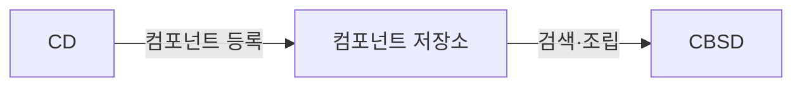

## 지식 로드맵 내 현재 위치

  소프트웨어공학
  개발 방법론·소프트웨어 재사용
  <strong>CBD(Component Based Development)</strong>

## 30초 인출

- 본질: 신규 시스템 개발 시 매번 바닥부터 코딩하는 생산성 저하와 품질 편차를 극복하기 위해, 명확한 인터페이스를 바탕으로 독립적으로 배포 및 실행 가능한 소프트웨어 부품(Component)을 사전에 구축(CD)하고, 이를 검색·조립(CBSD)하여 시스템을 완성하는 재사용 중심 소프트웨어 공학 방법론
- 메커니즘: 도메인 공통성 분석 → 컴포넌트 설계 및 구현(CD, 재사용을 위한 개발) → 컴포넌트 저장소 등록 → 신규 요구사항 매핑 및 적합성 평가 → 컴포넌트 조립 및 어댑터 연결(CBSD, 재사용에 의한 개발)
- 산출물: 컴포넌트 인터페이스 명세서 · 공통 컴포넌트 바이너리 패키지 · 컴포넌트 저장소(Repository) · 조립된 애플리케이션

핵심 용어

- **컴포넌트(Component)**: 명확하게 정의된 인터페이스만을 통해 접근할 수 있고, 독립적으로 배포될 수 있으며, 제3자에 의해 조립(Assembly) 가능한 실행 바이너리 소프트웨어 부품
- **CD(Component Development)**: 향후 여러 프로젝트에서 공통으로 재사용될 수 있는 고품질의 컴포넌트를 설계하고 패키징하는 개발 공정("재사용을 위한 개발")
- **CBSD(Component Based Software Development)**: 저장소에 이미 구축된 기존 컴포넌트들을 검색, 선택, 커스터마이징하여 새로운 소프트웨어를 조립 완성하는 공정("재사용에 의한 개발")
- **블랙박스 재사용(Black-Box Reuse)**: 컴포넌트 내부의 소스코드를 직접 열어보거나 수정하지 않고, 공개된 인터페이스 규격만을 보고 그대로 가져다 쓰는 재사용 형태

---

## 1교시 예상문제 (10점)

> CBD(Component Based Development)의 정의와 목적, 핵심 메커니즘을 설명하시오. (예상)

---

## 1교시 10점 답안

### 1. 정의·목적

- 정의: 신규 시스템 개발 시 매번 바닥부터 코딩하는 생산성 저하와 품질 편차를 극복하기 위해, 명확한 인터페이스를 바탕으로 독립적으로 배포 및 실행 가능한 소프트웨어 부품(Component)을 사전에 구축(CD)하고, 이를 검색·조립(CBSD)하여 시스템을 완성하는 재사용 중심 소프트웨어 공학 방법론
- 목적: 재사용 가능한 독립 컴포넌트를 조립해 시스템을 개발하고 변경 영향을 줄인다.

### 2. 핵심 관계

- 제언: 컴포넌트 계약과 의존성을 명확히 한 뒤 통합 시험으로 교환 가능성과 상호작용을 확인한다.
---

## 2~4교시 예상문제 (25점)

> CBD(Component Based Development)의 개념과 목적을 설명하고, 핵심 메커니즘과 구성요소·절차, 적용 시 문제점과 대응 방안을 제시하시오. (25점, 예상)

---

## 2~4교시 25점 답안

### 1. 개요 및 필요성

### 장인 정신 기반 개발의 한계와 조립식 공학의 필요성

전통적인 소프트웨어 개발은 프로젝트마다 개발자가 처음부터 끝까지 코드를 작성하는 장인 수공업 형태에 가까웠다. 이는 프로젝트마다 동일한 기능(로그인, 결제, 파일 업로드 등)을 중복 개발하게 만들어 납기를 지연시키고, 개발자의 역량에 따라 품질이 들쭉날쭉해지는 한계를 드러냈다.

CBD는 제조업의 표준화된 부품 조립 라인처럼, **독립적으로 검증된 고품질의 소프트웨어 부품(컴포넌트)을 표준 인터페이스를 통해 연결·조립**함으로써 개발 기간을 획기적으로 단축하고, 소프트웨어 재사용성과 유지보수성을 극대화한다.

### 객체지향(OOP) vs CBD vs 서비스 지향(SOA) 비교

| 구분 | 객체지향 (OOP) | 컴포넌트 기반 (CBD) | 서비스 지향 (SOA) |
|---|---|---|---|
| **기본 단위** | 클래스 및 객체 (Class/Object) | **독립 배포 단위 컴포넌트 (Component)** | 네트워크 서비스 (Service) |
| **재사용 수준** | 소스코드 레벨 (화이트박스 재사용) | **바이너리 실행 레벨 (블랙박스 재사용)** | 비즈니스 프로세스 레벨 (서비스 조합) |
| **결합도** | 높음 (언어/플랫폼 종속, 상속 결합) | 중간 (인터페이스 결합, 바이너리 호환) | 매우 낮음 (느슨한 결합, 이기종 연계) |
| **연결 방식** | 메서드 직접 호출, 메모리 내 상호작용 | DLL, JAR, COM 컴포넌트 인터페이스 호출 | SOAP/WSDL, REST, gRPC 네트워크 호출 |
| **핵심 목적** | 캡슐화, 다형성을 통한 코드 모듈화 | 부품의 조립식 생산 및 대규모 재사용 | 전사 시스템 간 이기종 서비스 통합 |

### 2. 아키텍처 및 핵심 메커니즘

### CBD 듀얼 라이프사이클 (CD vs CBSD)

### CBD 핵심 4대 구성요소

| 구성요소 | 핵심 판단 |
|---|---|
| **컴포넌트 명세서** | 제공(Provided)·요구(Required) 인터페이스 정의, 사전·사후 조건·불변식의 계약에 의한 설계(DbC) 준수 |
| **컴포넌트 저장소** Repository | 검증된 바이너리 부품·버전 메타데이터 보관, 키워드·기능 명세 기반 카탈로그 검색 |
| **글루 코드·어댑터** Glue Code | 기존 컴포넌트와 신규 시스템 간 인터페이스 불일치를 어댑터·파사드 패턴으로 완충 |
| **조립 프레임워크** Assembly | 의존성 주입(DI, IoC 컨테이너)으로 런타임 결합, 설정 파일 기반 부품 탈부착 |

### 3. 실무 적용 및 고려사항

### 위험 대응 매트릭스

| 위험 | 대책 | 효과 |
|---|---|---|
| 공통 컴포넌트가 현업 요구사항과 미세하게 맞지 않아 팀들이 코드를 복사·변형하는 안티패턴 발생 | 컴포넌트 입도(Granularity)를 세분화하고 전략 패턴(Strategy)을 적용하여 확장 포인트(Extension Point) 제공 | 코드 중복 제거 및 공통 컴포넌트 재사용률 70% 달성 |
| 공유 라이브러리(DLL/JAR) 버전 불일치로 한 컴포넌트 업데이트 시 다른 컴포넌트가 중단되는 DLL Hell | 도메인별 독립 런타임 환경 격리 및 컨테이너(Docker) 기반 마이크로서비스(MSA) 전환 | 런타임 충돌 원천 제거 및 무중단 독립 배포 달성 |
| 조직의 도메인 성숙도가 낮은 상태에서 무리하게 초기부터 범용 컴포넌트를 설계하다가 납기 파행 | Rule of Three 원칙(최소 3개 이상의 시스템에서 실질적 중복이 확인된 시점)에 따라 사후적 컴포넌트 추출 | 오버엔지니어링 방지 및 실효성 있는 재사용 자산 축적 |

### 4. 점검 및 합격 기준 (Checklist & Exit Criteria)

### 컴포넌트 자산화 및 조립 품질 체크리스트

| 점검 영역 | 상세 검증 항목 | 합격 기준 |
|---|---|---|
| **인터페이스 무결성** | 계약에 의한 설계(DbC) 사전/사후 조건 명세 완전성 | 100% 명세 완료 |
| **블랙박스 검증** | 소스코드 수정 없는 바이너리 독립 배포 가능성 | 외부 의존성 격리 통과 |
| **재사용 경제성** | 부품 커스터마이징 비용 대비 신규 개발 비용 비율 | 수정 비용이 신규 개발의 30% 이하 |
| **버전 호환성** | 시맨틱 버저닝(SemVer) 기반 하위 호환성 유지 | Breaking Change 사전 격리 |

### 5. 기대 효과 및 미래 전망

- **기대 효과**:
  - **소프트웨어 조립 생산성 극대화**: 검증된 공통 부품 재사용으로 납기 50% 단축 및 프로젝트 결함 밀도 60% 억제.
  - **기업 자산의 표준화**: 프로젝트 간 중복 투자를 방지하고 전사 차원의 소프트웨어 자산 저장소 구축.
- **미래 전망**:
  - OCI 표준 컨테이너 이미지 및 Helm 차트 기반의 클라우드 네이티브 부품 조립 체계로 전면 전환.
  - 생성형 AI 코딩 도구와 결합하여 내부 컴포넌트 저장소 API를 스스로 검색하고 조립 코드를 자동 생성하는 에이전틱 CBSD 확산.

### 6. 결론 및 실전 팁

### 학습자 통찰 메모 — 답안 밖

> **[핵심 통찰]**  
> 과거 EJB나 COM 기반의 바이너리 CBD는 무거운 배포와 언어 종속성으로 쇠퇴했지만, **"명확한 인터페이스를 갖춘 독립 배포 가능한 소프트웨어 부품의 조립"이라는 CBD의 핵심 철학은 오늘날 Docker 컨테이너와 MSA(마이크로서비스)로 완전히 부활**했다. 또한 무리한 사전 컴포넌트 설계는 오버엔지니어링의 지름길이다. 최소 3개 이상의 프로젝트에서 실질적 중복이 입증된 시점에 컴포넌트로 추출하는 **'Rule of Three' 거버넌스**가 성공의 열쇠다.

> **[나라면 이렇게 쓴다]**  
> 2교시형 문제로 CBD가 출제된다면, CD(재사용을 위한 개발)와 CBSD(재사용에 의한 개발)의 듀얼 라이프사이클을 2단락에서 명확히 도해하겠다. 그리고 3단락에서는 **"과거 바이너리 컴포넌트(DLL/JAR)가 현대 클라우드 네이티브 환경에서 Docker 컨테이너와 REST/gRPC 기반 MSA 서비스 부품으로 사상적으로 계승·발전한 과정"**을 기술사적 통찰로 제시하여 고득점을 견인하겠다.

### 실전 답안용 기술사적 제언

- **판정 기준**: 신규 기능 개발 전 컴포넌트 저장소 검색을 의무화하고, 재사용 컴포넌트 적용 시 어댑터 수정 비용이 신규 개발 비용의 30% 미만일 때만 재사용 조립으로 판정.
- **대응 방안**: 런타임 DLL Hell 및 버전 충돌을 방지하기 위해 각 컴포넌트를 OCI 표준 Docker 이미지로 패키징하고 Kubernetes 오케스트레이션으로 런타임 조립.
- **검증 체계**: 컴포넌트 배포 전 계약 기반 테스트(Pact 등 Consumer-Driven Contract Testing)를 CI에 연동하여 인터페이스 하위 호환성 100% 보증.
- **기대 효과**: 엔터프라이즈 신규 서비스 개발 기간을 평균 6개월에서 2개월로 단축하고, 공통 모듈 버그 발생 시 패치 파급 시간을 수분 내로 격리.

### 7. 참고 및 연계 학습

- [프로덕트 라인 엔지니어링(PLE)](./104_product_line_engineering.md)
- [마이크로서비스 아키텍처(MSA)](./035_msa.md)
- [디자인 패턴(어댑터, 퍼사드, 전략)](./005_design_pattern.md)
- [의존성 주입(Dependency Injection)](./042_dependency_injection.md)
---
