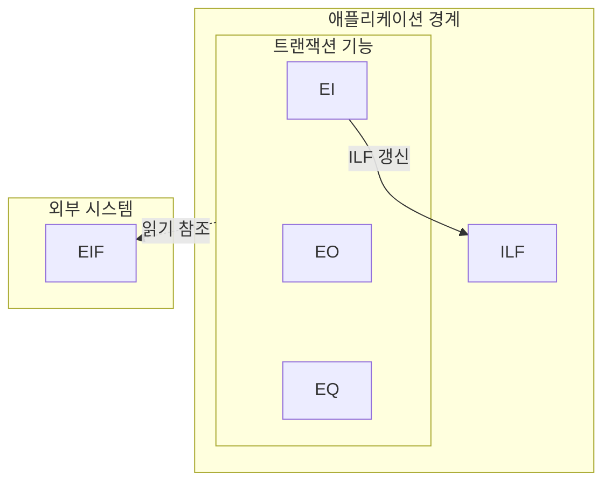

## 지식 위치

소프트웨어공학 > 프로젝트 관리·비용 산정 > 기능 규모 측정

## 30초 인출

- 본질: 기능점수는 사용자가 요구한 기능의 크기를 측정하는 소프트웨어 기능 규모 측정법
- 메커니즘: 측정 경계 설정 → 사용자 기능 식별 → 기능별 복잡도 평가 → 기능점수 산출
- 산출물: 기능점수 산정 명세서 · 기능 식별 목록표(ILF/EIF/EI/EO/EQ) · 소프트웨어 사업 대가 산정서

핵심 용어

- **ILF(Internal Logical File)**: 애플리케이션 내부에서 유지·관리되며 비즈니스 로직에 의해 지속적으로 등록, 수정, 삭제되는 논리적 데이터 그룹
- **EIF(External Interface File)**: 타 시스템에서 유지·관리되지만, 현재 애플리케이션에서 오직 참조(Read-only) 목적으로 사용하는 외부 연계 데이터 그룹
- **EI / EO / EQ**: 외부입력(EI, 내부 파일 갱신), 외부출력(EO, 파생 데이터 계산/통계 출력), 외부조회(EQ, 단순 데이터 검색 및 표시)
- **DET(Data Element Type)**: 사용자가 식별할 수 있는 고유하고 반복되지 않는 필드(컬럼) 단위 데이터 항목
- **RET(Record Element Type)**: ILF나 EIF 내부에서 사용자가 인식 가능한 하위 레코드 데이터 서브그룹(예: 마스터-디테일 테이블)
- **FTR(File Type Referenced)**: 트랜잭션 기능(EI, EO, EQ)을 수행하는 과정에서 읽거나 갱신하는 ILF 또는 EIF의 개수

---

## 1교시 예상문제 (10점)

> 기능점수(Function Point)의 정의와 목적, 핵심 메커니즘을 설명하시오. (예상)

---

## 1교시 10점 답안

### Ⅰ. 개요

| 구분 | 핵심 |
|---|---|
| 정의 | 기능점수는 사용자가 요구한 기능의 크기를 측정하는 소프트웨어 기능 규모 측정법 |
| 목적 | 구현 방식과 분리된 기능 규모를 개발 노력·사업 대가 추정의 입력값으로 활용 |

### 2. 핵심 관계

- 제언: 측정 경계와 기능 유형을 먼저 합의하고 산정 근거를 검토자와 대조
---

## 2~4교시 예상문제 (25점)

> 기능점수(Function Point)의 개념과 목적을 설명하고, 핵심 메커니즘과 구성요소·절차, 적용 시 문제점과 대응 방안을 제시하시오. (25점, 예상)

---

## 2~4교시 25점 답안

### Ⅰ. 개요 및 필요성

| 구분 | 핵심 |
|---|---|
| 정의 | 기능점수는 사용자가 요구한 기능의 크기를 측정하는 소프트웨어 기능 규모 측정법 |
| 목적 | 구현 방식과 분리된 기능 규모를 개발 노력·사업 대가 추정의 입력값으로 활용 |

### LOC(코드 라인 수)의 한계와 사용자 관점 기능 측정

과거의 소프트웨어 비용 산정 방식인 LOC(Lines of Code)는 프로그래밍 언어의 특성에 따라 심각한 모순을 낳았다. 동일한 기능을 구현하더라도 어셈블리어로는 수천 라인이 필요하지만 파이썬으로는 수십 라인으로 끝나므로, 비효율적인 코드를 길게 작성할수록 더 높은 대가를 받는 왜곡이 발생했다.

기능점수(Function Point)는 **구현 기술이나 언어와 독립적으로, 소프트웨어가 사용자에게 제공하는 논리적 기능의 규모**를 측정한다. 발주자와 수행자가 기능 규모와 산정 근거를 협의하는 공통 척도이며, 국내 공공 소프트웨어 사업의 대가 산정에도 활용된다.

### 정규법(상세 산정) vs 간이법(평균 복잡도) 비교

| 구분 | 정규법 (Detailed Function Point) | 간이법 (Average Weight Function Point) |
|---|---|---|
| **적용 시점** | 분석 및 상세설계 완료 후 (사업 구축/정산 단계) | 사업 기획, 예산 편성, 발주 준비 단계 |
| **복잡도 판정** | 기능별 RET, DET, FTR을 전수 계수하여 상/중/하 가중치 적용 | 각 기능 유형별 사전에 정의된 **평균 가중치** 일괄 곱셈 |
| **평균 가중치** | 기능마다 상이 (ILF: 7/10/15, EI: 3/4/6 등) | ILF: 7.5, EIF: 5.4, EI: 4.0, EO: 5.2, EQ: 3.9 |
| **산정 성격** | 기능별 복잡도를 검토해 상세 산정 | 초기 단계에서 평균 가중치를 적용해 개략 산정 |
| **산정 소요 공수** | 데이터 모델 및 상세 화면 분석으로 많은 시간 소요 | 화면/테이블 개수 추정만으로 신속 산정 가능 |

### Ⅱ. 기능 식별과 산정 메커니즘

### 기능점수 5대 기능 분류 체계

### 기능점수 산정 공식 및 보정 체계

1. **미조정 기능점수(UFP) 계산**:
   $$UFP = \sum (\text{기능 유형별 개수} \times \text{복잡도 가중치})$$
2. **산정 지침 반영**: 계약·대가 산정에 사용할 조정 항목과 기준은 적용 중인 공공 SW 대가산정 지침에서 확인
3. **사업 대가 산정**: 기능점수 결과와 지침이 정한 공수·단가·보정 기준을 적용

### Ⅲ. 실무 적용 및 고려사항

### 위험 대응 매트릭스

| 위험 | 대책 | 효과 |
|---|---|---|
| 공통 코드 테이블 및 임시 백업 테이블을 개별 ILF로 과다 산정하여 감사 지적 및 대가 삭감 | 데이터 모델의 제3정규화를 검증하고 단일 비즈니스 엔터티 관점에서 마스터-디테일은 1개 ILF로 통합 | 산정 적법성 확보 및 감사 리스크 완전 제거 |
| 단순 검색 조회를 계산 로직이 있는 EO(외부출력)로 둔갑시켜 기능점수를 부풀리는 행위 | 파생 데이터 계산(집계, 세금 계산 등) 여부를 검증하여 계산이 없는 건은 EQ(외부조회)로 재분류 | 기능 유형 식별의 객관성 및 신뢰성 확보 |
| 기획 단계 간이법 예산이 확정된 후 구축 단계에서 비즈니스 요구사항 폭증으로 사업자 적자 | 설계·구축 분할 발주 또는 과업심의위원회를 통해 상세설계 시점의 정규 FP 기준으로 계약 변경 증액 | 적정 대가 보장 및 사업 유찰/품질 부실 방지 |

### Ⅳ. 점검 기준

### 기능점수 산정 적정성 검증 체크리스트

| 검증 영역 | 상세 점검 항목 | 판정 기준 |
|---|---|---|
| **경계 식별** | 배치/인터페이스/서브시스템 간 경계 중복 정의 여부 | 단일 애플리케이션 경계 원칙 준수 |
| **데이터 기능** | 임시 테이블(Temp, Log), 코드성 테이블의 ILF 포함 여부 | 비즈니스 논리 엔터티만 ILF 계수 |
| **트랜잭션 기능** | 단순 조회(EQ)와 파생 계산 출력(EO)의 명확한 구분 | 집계/통계/파생 로직 부재 시 EQ 분류 |
| **대가 산정 기준** | 측정 결과와 적용 중인 지침·계약 기준의 일치 여부 | 기준 버전과 산정 근거 기록 |

### Ⅴ. 기술사적 제언

| 한계 | 해결 방안 |
|---|---|
| 초기 요구를 바탕으로 한 간이 산정과 상세 요구 분석 이후의 기능 규모 차이를 관리하지 않으면 범위·대가 분쟁이 발생할 수 있음 | 적용 지침에 따라 산정 경계와 가정을 기록하고, 요구사항 변경 시 기능 식별·복잡도 근거를 발주자와 수행자가 함께 재검토 |

### 참고 및 연계 학습

- [ISMP(정보시스템 마스터플랜)](../../01-it-strategy/001_ismp.md)
- [요구사항 추적표(RTM)](./102_requirement_traceability_matrix.md)
- [상용SW 직접구매 제도](./101_commercial_sw_direct_purchase.md)
- [소프트웨어 품질 비용(COQ)](./150_software_quality_cost.md)
- [KOSA 기능점수 계산기](https://www.sw.or.kr/site/sw/biz/cow_write1.do)
- [KOSA 2026 SW사업 대가산정 엑셀 템플릿 안내](https://www.sw.or.kr/site/sw/ex/board/View.do?bcIdx=65004&cbIdx=276)
---
